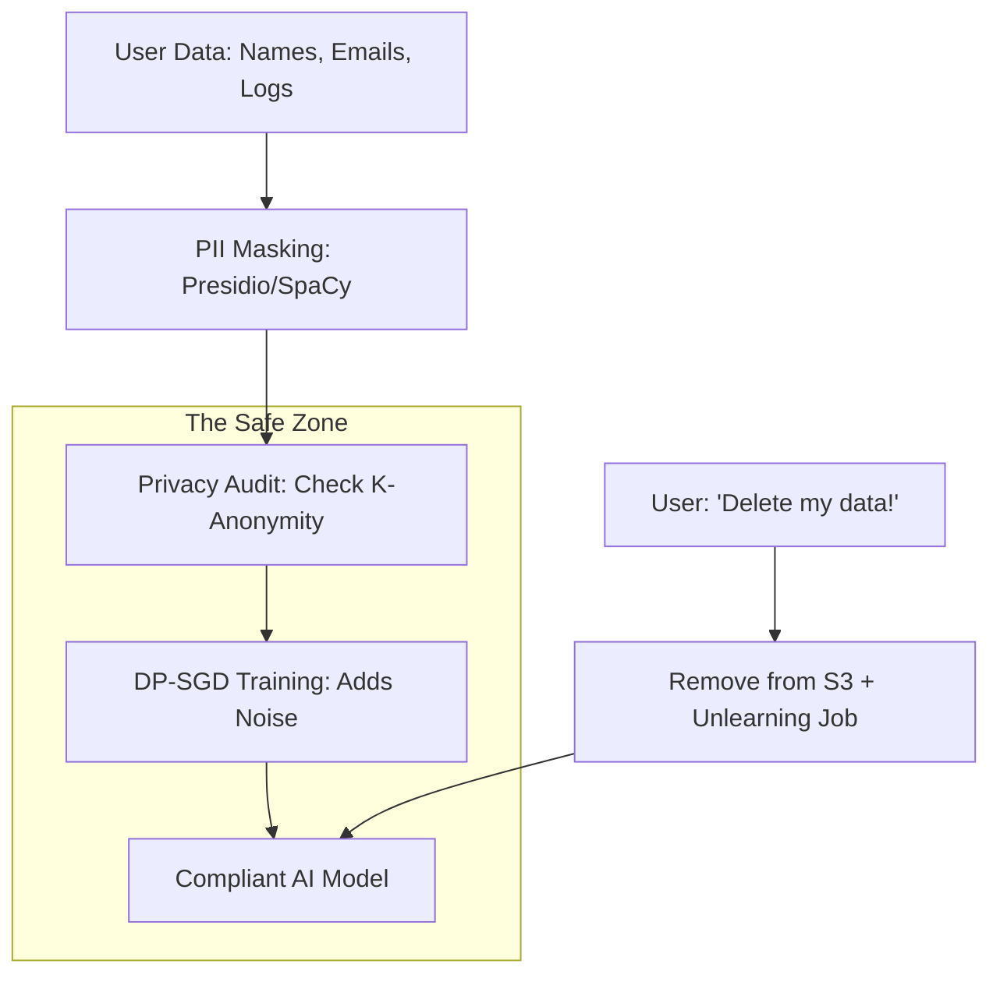

# ⚖️ Privacy & GDPR in AI: The Legal Guardrails
> **Level:** Intermediate | **Language:** Hinglish | **Goal:** AI Engineering aur Global Privacy Laws ke intersection ko master karein, GDPR, AI mein "Right to be Forgotten", PII masking, aur 2026 mein "Legally Compliant" AI systems build karne ki strategies ko explore karte hue.

---

## 🧭 1. Beginner-Friendly Hinglish Explanation
AI banana sirf "Coding" ka khel nahi hai. Agar aapne kisi ka "Personal Data" (jaise Name, Address, Phone) bina permission use kiya, toh aap par karodon ka fine lag sakta hai.

- **GDPR:** Ye ek European kanoon hai jo kehta hai: "Har insaan ka apne data par control hai."
- **The Problem:** Agar kisi user ne kaha: *"Mera data delete karo"* (Right to be Forgotten), toh kya aap apna AI model "Reset" karenge? Kyunki AI ne toh us data se seekh liya hai (Memorize kar liya hai).
- **The Solution:** Humein aisa system banana padta hai jahan training se pehle hi sara "Personal Data" (PII) saaf ho jaye.

2026 mein, ek **"Privacy Engineer"** ki salary ek AI Researcher ke barabar hai. Bina kanoon ko samjhe AI deploy karna "Gadi bina brake ke chalane" jaisa hai.

---

## 🧠 2. Deep Technical Explanation
GDPR (General Data Protection Regulation) aur is tarah ke baaki laws (CCPA, India ka DPDP) AI par strict requirements lagate hain.

### 1. Data Minimization:
- Jiski zaroorat na ho, use collect na karein. Agar aapke AI ko sirf "Sales" predict karni hai, toh user ka "Home Address" store na karein.

### 2. The Right to be Forgotten (Article 17):
- Agar koi user apna account delete karta hai, toh uske data ko training set se remove kiya jana chahiye.
- **The AI Dilemma:** Kya train ho chuke model mein personal data hota hai? Agar ye kisi user ka face ya SSN "Reconstruct" kar sakta hai, toh ye compliant NAHI hai. 
- **Solution:** **Machine Unlearning** (pure model ko retrain kiye bina specific data points ko "Bhoolne" ke liye new techniques).

### 3. Purpose Limitation:
- Aap explicit consent (manjoori) ke bina "Shipping" ke liye collect kiye gaye data ka use "Marketing Chatbot" ko train karne ke liye nahi kar sakte.

### 4. Automated Decision Making (Article 22):
- Users ke paas ek **Explanation** (wajah) pane ka right hai. Agar AI kisi loan ko reject karta hai, toh aapko data ke basis par "WHY" (kyu) explain karna aana chahiye, na ki sirf ye kehna "AI ne aisa bola."

---

## 🏗️ 3. Privacy-Preserving Techniques
| Technique | How it works | Impact on AI |
| :--- | :--- | :--- |
| **Anonymization** | Remove names/IDs | High (Irreversible) |
| **Pseudonymization**| Replace Name with 'ID_99' | Moderate (Reversible) |
| **K-Anonymity** | Group users so no one is unique | High (Loss of detail) |
| **Differential Privacy**| Add math noise to gradients | **Superior (Proven)** |
| **Federated Learning**| Data stays on user device | **Superior (Safe)** |

---

## 📐 4. Mathematical Intuition
- **The Privacy Budget ($\epsilon$):** 
  Differential Privacy mein, $\epsilon$ (Epsilon) ye measure karta hai ki kitni information leak ho rahi hai. 
  - $\epsilon = 0$: Perfect privacy, par model ki accuracy $0\%$ hogi. 
  - $\epsilon \to \infty$: Perfect accuracy, par zero privacy. 
  - **The 2026 Standard:** Zyadatar companies $\epsilon \in [1, 5]$ ke beige aim karti hain.

---

## 📊 5. GDPR-Compliant AI Pipeline (Diagram)

```mermaid
graph TD
    Raw[User Data: Names, Emails, Logs] --> Mask[PII Masking: Presidio/SpaCy]
    Mask --> Audit[Privacy Audit: Check K-Anonymity]
    
    subgraph "The Safe Zone"
    Audit --> Train[DP-SGD Training: Adds Noise]
    Train --> Model[Compliant AI Model]
    end
    
    User[User: 'Delete my data!'] --> Cleanup[Remove from S3 + Unlearning Job]
    Cleanup --> Model
```

---

## 💻 6. Production-Ready Examples (PII Scanning before Logging)
```python
# 2026 Pro-Tip: Use 'Microsoft Presidio' to automate GDPR compliance.

from presidio_analyzer import AnalyzerEngine

analyzer = AnalyzerEngine()

def process_query(user_query):
    # 1. Check for PII
    results = analyzer.analyze(text=user_query, entities=["PHONE_NUMBER", "EMAIL_ADDRESS"], language='en')
    
    if len(results) > 0:
        # 2. Block or Redact
        print("GDPR Warning: PII detected in query! 🛑")
        return "Please do not share personal info."
    
    return "Query is safe."

# This check prevents sensitive data from ever reaching your 'Training Logs'.
```

---

## ❌ 7. Failure Cases
- **The 'Re-identification' Attack:** Names ko remove karke dataset ko anonymize toh kar diya, par ek attacker use public "Voter List" ke sath link karke ye pata lagane mein kamyab ho jata hai ki kaun kaun hai.
- **Memorization:** Ek single training document se LLM ka kisi credit card number ko memorize kar lena. **Fix: 'Deduplication' aur 'DP-SGD' ka use karein.**
- **Implicit PII:** Address store na karna, par "GPS coordinates" store karna jisse ye leak ho sake ki insaan kahan rehta hai.

---

## 🛠️ 8. Debugging Guide
- **Symptom:** "Legal team keh rahi hai ki model 'Right to be Forgotten' test mein fail ho raha hai."
- **Check:** **Model Inversion**. Can you reconstruct any deleted user's info? If yes, you must run a **Machine Unlearning** pass.
- **Symptom:** "Privacy apply karne ke baad model accuracy bahut low ho gayi hai."
- **Check:** **Epsilon ($\epsilon$)**. You might be adding too much noise. Try increasing $\epsilon$ slightly or increasing the batch size.

---

## ⚖️ 9. Tradeoffs
- **User Experience vs. Privacy:** Users ko 10 alag-alag popups par "Accept" click karne ke liye force karna vs app ko use karne mein easy banana.
- **Local vs. Cloud:** Local processing (on-device) $100\%$ private hai par isse "Intelligence" phone ke hardware tak hi limit ho jati hai.

---

## 🛡️ 10. Security Concerns
- **Model Inversion as a Privacy Breach:** Kisi hacker ka model inversion ke through ye prove kar dena ki koi specific person aapke "Medical Research" dataset mein shamil tha, jo uski medical privacy ko violate karta hai.

---

## 📈 11. Scaling Challenges
- **Multi-Jurisdiction Compliance:** Aapki app 100 countries mein chal rahi hai. Aapko GDPR (Europe), CCPA (California), aur DPDP (India) ko ek sath follow karna hoga. **Solution: Apne global base ke roop mein sabse 'Strict' law (aamtaur par GDPR) ko follow karein.**

---

## 💸 12. Cost Considerations
- **Legal Audit Fees:** $\$50,000+$ for a third-party privacy audit. **Strategy: Pehle 'Low hanging fruit' (aasan galtiyon) ko find karne ke liye open-source compliance tools ka use karein.**

---

## ✅ 13. Best Practices
- **Data Retention Policies:** 2 saal ke baad training data ko automatically delete kar dein.
- **Privacy by Design:** Don't "Add" privacy at the end. Build the database architecture with privacy in mind from Day 1.
- **Consent Logs:** Store a timestamp and version of the privacy policy every user agreed to.

---

## ⚠️ 14. Common Mistakes
- **Assuming 'Internal' means 'Private':** Ye sochna ki data aapke servers par hai, isliye GDPR apply nahi hoga. (Kanoon apply hota hai!).
- **Storing 'Raw' Logs:** Debugging ke liye har chat prompt ko plaintext mein S3 par save karna.

---

## 📝 15. Interview Questions
1. **" 'Right to be Forgotten' kya hai aur ye AI models ko kaise affect karta hai?"**
2. **"Anonymization aur Pseudonymization ke beige kya difference hai?"**
3. **"Federated Learning GDPR compliance mein kaise help karta hai?"**

---

## 🚀 15. Latest 2026 Industry Patterns
- **Differential Privacy as a Service:** Cloud providers (jaise AWS/GCP) jo LLMs ke liye "One-click" privacy-preserving training offer karte hain.
- **AI-Privacy Agents:** Chote AI models jo User aur LLM ke beige baithte hain aur real-time mein ek "Privacy Filter" ki tarah kaam karte hain.
- **Machine Unlearning Frameworks:** Standardized libraries (jaise **SISA**) jo aapko minutes ke andar kisi specific user ke data ko "Un-train" (bhoolne) karne ki permission deti hain.
