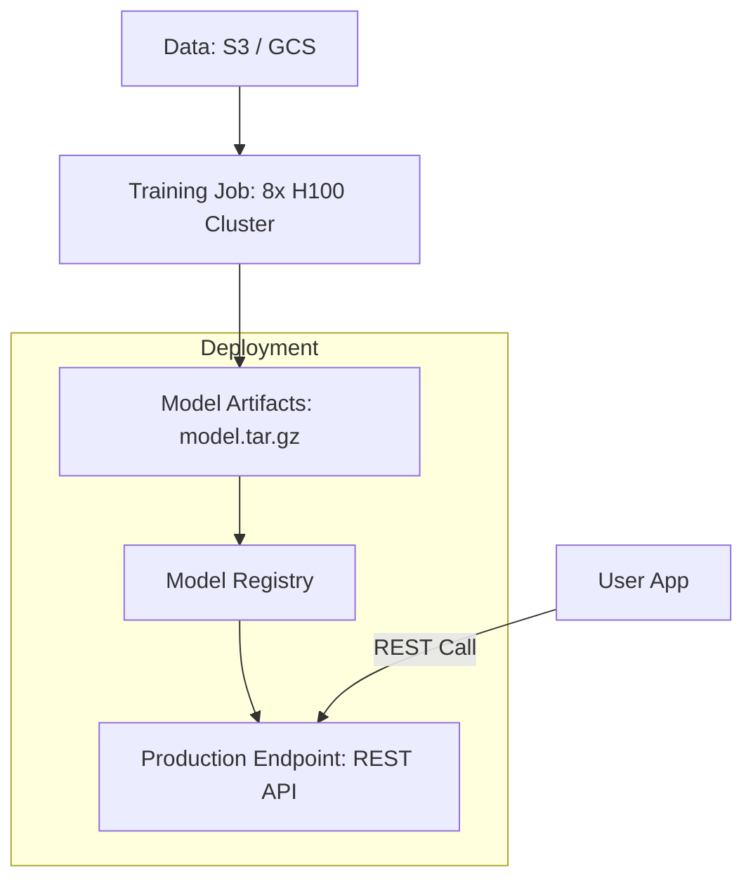

# ☁️ Cloud AI Platforms: The Global AI Backbone
> **Level:** Intermediate | **Language:** Hinglish | **Goal:** Master the major cloud providers for AI development, exploring AWS SageMaker, GCP Vertex AI, Azure AI, and the specialized GPU clouds like Lambda and CoreWeave in 2026.

---

## 🧭 1. Beginner-Friendly Hinglish Explanation
Bade AI models ko train karne ke liye aapko hazaron GPUs chahiye hote hain jo kisi ek room mein fit nahi ho sakte. Iske liye hum **Cloud** use karte hain.

Cloud ka matlab hai kisi aur ka computer (jaise Amazon ya Google) internet ke zariye use karna.
1. **The Giants:** AWS, Google Cloud (GCP), aur Azure. Inke paas sabse zyada "Tools" hain (AutoML, Notebooks, Endpoints).
2. **The Specialists:** Lambda Labs, CoreWeave, aur RunPod. Inke paas sirf "GPUs" hain—saste aur fast. Ye "AI-First" clouds hain.

2026 mein, aapko ye pata hona chahiye ki kaunsa model kahan deploy karna hai. 
- Agar aapko "Security" chahiye, toh Enterprise Cloud (Azure) best hai. 
- Agar aapko "Cost" bachani hai, toh specialized GPU clouds best hain.

---

## 🧠 2. Deep Technical Explanation
Cloud AI platforms provide a managed layer over raw infrastructure (Compute, Storage, Networking).

### 1. AWS SageMaker:
- The "Everything" platform. Features include **SageMaker Studio** (IDE), **Training Jobs** (ephemeral clusters), and **Endpoints** (serverless inference).
- **Key Feature:** **SageMaker JumpStart** (Pre-trained models like Llama-3 ready to deploy).

### 2. Google Vertex AI:
- Deeply integrated with **TPUs** (Tensor Processing Units).
- Best for "End-to-End" pipelines. If your data is in BigQuery, Vertex AI is the natural choice.
- **Gemini Integration:** Vertex is the primary home for Gemini models.

### 3. Azure AI:
- The exclusive home of **OpenAI (GPT-4o, etc.)** via Azure OpenAI Service.
- Focused on "Enterprise Compliance" and "Security."

### 4. GPU-First Clouds (CoreWeave/Lambda):
- They provide **Bare Metal** or **Virtual Machines** with H100s/B200s.
- No high-level AI tools, but $20-40\%$ cheaper per GPU hour than AWS.

---

## 🏗️ 3. Cloud Platforms Comparison
| Feature | AWS SageMaker | GCP Vertex AI | Azure AI | Specialized (Lambda) |
| :--- | :--- | :--- | :--- | :--- |
| **Best For** | Overall Flexibility | Data Science / TPUs | OpenAI / Enterprise | **Cheapest GPUs** |
| **Scaling** | Complex but Powerful | Seamless | Easy (Serverless) | Manual / K8s |
| **Pricing** | High | High | High | **Low** |
| **Key Service** | SageMaker | AutoML / Gemini | Azure OpenAI | H100 Instances |

---

## 📐 4. Mathematical Intuition
- **The TCO (Total Cost of Ownership):** 
  Cloud cost isn't just the GPU hourly rate. It includes:
  - **Egress:** Cost of moving data out ($0.09/GB$).
  - **Storage:** S3/Bucket costs.
  - **Managed Premium:** AWS adds $\sim 20\%$ for the "Managed" service vs. a raw VM.
  - **Formula:** $\text{Total Cost} = (\text{GPU Rate} \times \text{Hours}) + \text{Data Transfer} + \text{Storage}$

---

## 📊 5. Cloud AI Workflow (Diagram)


---

## 💻 6. Production-Ready Examples (Deploying with SageMaker Python SDK)
```python
# 2026 Pro-Tip: Use the SDK to automate deployments.

import sagemaker
from sagemaker.huggingface import HuggingFaceModel

# 1. Define the model (Llama-3-8B)
hf_model = HuggingFaceModel(
    model_data="s3://my-bucket/llama3-weights.tar.gz",
    role="SageMakerExecutionRole",
    transformers_version="4.37.0",
    pytorch_version="2.1.0",
    py_version="py310",
)

# 2. Deploy to a production-grade instance (G5 = A10G)
predictor = hf_model.deploy(
    initial_instance_count=1,
    instance_type="ml.g5.2xlarge",
    endpoint_name="llama3-prod-v1"
)

# 3. Predict
print(predictor.predict({"inputs": "Tell me a joke."}))
```

---

## ❌ 7. Failure Cases
- **Quota Limits:** Trying to start a cluster of 8 H100s but AWS has "Zero" limit for your account. **Fix: Always request a 'Quota Increase' 2 weeks in advance.**
- **ZOMBIE Endpoints:** Forgetting to "Shut down" an endpoint after testing. A large GPU endpoint can cost $\$1000+$ per month if left running.
- **Availability Zone (AZ) Mismatch:** Your data is in `us-east-1a` but the GPUs are only available in `us-east-1b`. You pay "Cross-AZ" data fees.

---

## 🛠️ 8. Debugging Guide
- **Symptom:** "Training job failed with 'Insufficent Resources'."
- **Check:** **Region**. Not all regions have all GPUs. Switch to `us-east-1` or `us-west-2`.
- **Symptom:** "Inference latency is 5 seconds."
- **Check:** **Instance Size**. Is your model swapping weights in/out of CPU? Upgrade to a larger GPU instance with more VRAM.

---

## ⚖️ 9. Tradeoffs
- **Managed vs. Raw VM:** 
  - Managed (SageMaker) is safer and includes logging/monitoring. 
  - Raw VM (EC2) is cheaper but you have to manage NVIDIA drivers and Docker yourself.
- **Spot Instances:** Up to $90\%$ cheaper, but your job can be "Killed" at any time. Best for checkpointed training, NOT for live APIs.

---

## 🛡️ 10. Security Concerns
- **Model Exfiltration:** An attacker gaining access to your S3 bucket and downloading your fine-tuned weights (Your IP!). **Enable 'S3 Encryption' and 'Private Links'.**

---

## 📈 11. Scaling Challenges
- **Multi-region Deployment:** Serving users in Asia and Europe with $< 100ms$ latency. You need model replicas in multiple cloud regions.

---

## 💸 12. Cost Considerations
- **Reserved Instances:** Commit to 1 year of usage to save $\sim 40\%$.
- **Saving Plans:** Flexible discounts across different GPU types.

---

## ✅ 13. Best Practices
- **Auto-stop idle notebooks:** Use scripts to kill SageMaker Studio instances if no code is run for 30 minutes.
- **Use 'Multi-model Endpoints':** Serve 10 small models on 1 GPU instance to save money.
- **Tag everything:** Tag instances with `Project: AI-Chatbot` to track exact costs in the billing dashboard.

---

## ⚠️ 14. Common Mistakes
- **Training on a local disk:** Using the small SSD on the VM instead of attaching a large EFS/EBS volume.
- **Ignoring Egress:** Moving TBs of data between GCP and AWS. (Very expensive!).

---

## 📝 15. Interview Questions
1. **"Difference between SageMaker JumpStart and training from scratch?"**
2. **"How do TPUs on GCP differ from GPUs on AWS for training?"**
3. **"What is a 'Cold Start' in the context of serverless AI endpoints?"**

---

## 🚀 15. Latest 2026 Industry Patterns
- **SkyPilot:** A tool that allows you to run your AI jobs on "Any Cloud" (AWS, GCP, or Lambda) automatically based on where the cheapest GPU is available right now.
- **On-Demand H100 Clusters:** Specialized clouds that let you rent 1024 GPUs for 2 hours and then release them.
- **Hybrid Cloud AI:** Keeping sensitive data on-premise but using the Cloud for the heavy GPU "Math" using encrypted tunnels.
