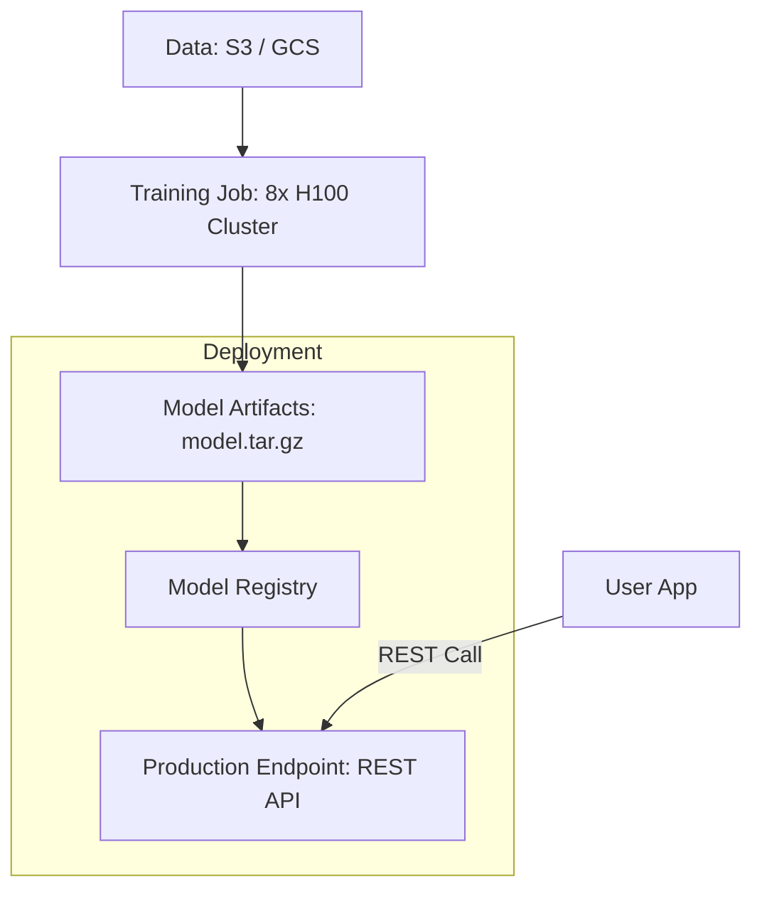

# ☁️ Cloud AI Platforms: The Global AI Backbone
> **Level:** Intermediate | **Language:** Hinglish | **Goal:** AI development ke liye major cloud providers ko master karein, AWS SageMaker, GCP Vertex AI, Azure AI, aur 2026 mein Lambda aur CoreWeave jaise specialized GPU clouds ko explore karte hue.

---

## 🧭 1. Beginner-Friendly Hinglish Explanation
Bade AI models ko train karne ke liye aapko hazaron GPUs chahiye hote hain jo kisi ek room mein fit nahi ho sakte. Iske liye hum **Cloud** use karte hain.

Cloud ka matlab hai kisi aur ka computer (jaise Amazon ya Google) internet ke zariye use karna.
1. **The Giants:** AWS, Google Cloud (GCP), aur Azure. Inke paas sabse zyada "Tools" hain (AutoML, Notebooks, Endpoints).
2. **The Specialists:** Lambda Labs, CoreWeave, aur RunPod. Inke paas sirf "GPUs" hain—saste aur fast. Ye "AI-First" clouds hain.

2026 mein, aapko ye pata hona chahiye ki kaunsa model kahan deploy karna hai. 
- Agar aapko "Security" chahiye, toh Enterprise Cloud (Azure) best hai. 
- Agar aapko "Cost" bachani hai, toh specialized GPU clouds best hain.

---

## 🧠 2. Deep Technical Explanation
Cloud AI platforms raw infrastructure (Compute, Storage, Networking) ke upar ek managed layer provide karte hain.

### 1. AWS SageMaker:
- Ye "Everything" platform hai. Features mein **SageMaker Studio** (IDE), **Training Jobs** (temporary clusters), aur **Endpoints** (serverless inference) shamil hain.
- **Key Feature:** **SageMaker JumpStart** (Llama-3 jaise pre-trained models deploy karne ke liye ready hote hain).

### 2. Google Vertex AI:
- **TPUs** (Tensor Processing Units) ke sath deeply integrated hai.
- "End-to-End" pipelines ke liye best. Agar aapka data BigQuery mein hai, toh Vertex AI natural choice hai.
- **Gemini Integration:** Gemini models ke liye Vertex primary home hai.

### 3. Azure AI:
- Azure OpenAI Service ke zariye **OpenAI (GPT-4o, etc.)** ka exclusive home.
- "Enterprise Compliance" aur "Security" par focused hai.

### 4. GPU-First Clouds (CoreWeave/Lambda):
- Ye H100s/B200s ke sath **Bare Metal** ya **Virtual Machines** provide karte hain.
- Inke paas high-level AI tools nahi hote, par AWS ke mukable per GPU hour $20-40\%$ saste hote hain.

---

## 🏗️ 3. Cloud Platforms Comparison
| Feature | AWS SageMaker | GCP Vertex AI | Azure AI | Specialized (Lambda) |
| :--- | :--- | :--- | :--- | :--- |
| **Best For** | Overall Flexibility | Data Science / TPUs | OpenAI / Enterprise | **Cheapest GPUs** |
| **Scaling** | Complex but Powerful | Seamless | Easy (Serverless) | Manual / K8s |
| **Pricing** | High | High | High | **Low** |
| **Key Service** | SageMaker | AutoML / Gemini | Azure OpenAI | H100 Instances |

---

## 📐 4. Mathematical Intuition
- **The TCO (Total Cost of Ownership):** 
  Cloud cost sirf GPU ka hourly rate nahi hai. Isme shamil hain:
  - **Egress:** Data ko cloud se bahar lane ki cost ($0.09/GB$).
  - **Storage:** S3/Bucket costs.
  - **Managed Premium:** Raw VM ke mukable "Managed" service ke liye AWS $\sim 20\%$ extra charge karta hai.
  - **Formula:** $\text{Total Cost} = (\text{GPU Rate} \times \text{Hours}) + \text{Data Transfer} + \text{Storage}$

---

## 📊 5. Cloud AI Workflow (Diagram)

```mermaid
graph TD
    Data[Data: S3 / GCS] --> Train[Training Job: 8x H100 Cluster]
    Train --> Artifact[Model Artifacts: model.tar.gz]
    
    subgraph "Deployment"
    Artifact --> Registry[Model Registry]
    Registry --> Endpoint[Production Endpoint: REST API]
    end
    
    User[User App] -- "REST Call" --> Endpoint
```

---

## 💻 6. Production-Ready Examples (Deploying with SageMaker Python SDK)
```python
# 2026 Pro-Tip: Use the SDK to automate deployments.

import sagemaker
from sagemaker.huggingface import HuggingFaceModel

# 1. Define the model (Llama-3-8B)
hf_model = HuggingFaceModel(
    model_data="s3://my-bucket/llama3-weights.tar.gz",
    role="SageMakerExecutionRole",
    transformers_version="4.37.0",
    pytorch_version="2.1.0",
    py_version="py310",
)

# 2. Deploy to a production-grade instance (G5 = A10G)
predictor = hf_model.deploy(
    initial_instance_count=1,
    instance_type="ml.g5.2xlarge",
    endpoint_name="llama3-prod-v1"
)

# 3. Predict
print(predictor.predict({"inputs": "Tell me a joke."}))
```

---

## ❌ 7. Failure Cases
- **Quota Limits:** 8 H100s ka cluster start karne ki koshish karna par AWS par aapke account ke liye "Zero" limit hona. **Fix: Hamesha 2 weeks pehle hi 'Quota Increase' ke liye request karein.**
- **ZOMBIE Endpoints:** Testing ke baad endpoint ko "Shut down" karna bhool jana. Agar ek bada GPU endpoint chalta chhod diya jaye, toh har month $\$1000+$ ki cost aa sakti hai.
- **Availability Zone (AZ) Mismatch:** Aapka data `us-east-1a` mein hai par GPUs sirf `us-east-1b` mein available hain. Aapko "Cross-AZ" data fees pay karni padegi.

---

## 🛠️ 8. Debugging Guide
- **Symptom:** "Training job 'Insufficent Resources' error ke sath fail ho gaya."
- **Check:** **Region**. Har region mein sabhi GPUs available nahi hote. Apne region ko `us-east-1` ya `us-west-2` par switch karein.
- **Symptom:** "Inference latency 5 seconds hai."
- **Check:** **Instance Size**. Kya aapka model CPU ke beige weights swap kar raha hai? Zyada VRAM wale larger GPU instance par upgrade karein.

---

## ⚖️ 9. Tradeoffs
- **Managed vs. Raw VM:** 
  - Managed (SageMaker) safe hai aur isme logging/monitoring included hote hain.
  - Raw VM (EC2) sasta hai par aapko NVIDIA drivers aur Docker khud manage karna padega.
- **Spot Instances:** 90% tak saste hote hain, par aapki job kisi bhi time "Kill" (terminate) ki ja sakti hai. Ye checkpointed training ke liye best hai, live APIs ke liye NAHI.

---

## 🛡️ 10. Security Concerns
- **Model Exfiltration:** Ek attacker ka aapke S3 bucket par access pa lena aur aapke fine-tuned weights (Aapki IP!) ko download kar lena. **'S3 Encryption' aur 'Private Links' ko enable karein.**

---

## 📈 11. Scaling Challenges
- **Multi-region Deployment:** Asia aur Europe ke users ko $< 100ms$ latency ke sath serve karna. Iske liye aapko multiple cloud regions mein model replicas ki need hogi.

---

## 💸 12. Cost Considerations
- **Reserved Instances:** $\sim 40\%$ save karne ke liye 1 year ke liye usage commit karein.
- **Saving Plans:** Alag-alag GPU types ke across flexible discounts.

---

## ✅ 13. Best Practices
- **Auto-stop idle notebooks:** Agar 30 minutes tak koi code run na ho, toh SageMaker Studio instances ko automatically kill karne ke liye scripts ka use karein.
- **Use 'Multi-model Endpoints':** Cost save karne ke liye 1 GPU instance par 10 small models serve karein.
- **Tag everything:** Billing dashboard mein exact costs track karne ke liye instances ko `Project: AI-Chatbot` tag karein.

---

## ⚠️ 14. Common Mistakes
- **Training on a local disk:** Large EFS/EBS volume attach karne ke bajaye VM ke small SSD par train karna.
- **Ignoring Egress:** GCP aur AWS ke beige TBs of data move karna. (Bahut expensive!).

---

## 📝 15. Interview Questions
1. **"SageMaker JumpStart aur scratch se training karne mein kya difference hai?"**
2. **"GCP par TPUs AWS par GPUs se training ke liye kaise different hain?"**
3. **"Serverless AI endpoints ke context mein 'Cold Start' kya hota hai?"**

---

## 🚀 15. Latest 2026 Industry Patterns
- **SkyPilot:** Ek aisa tool jo aapko "Kisi bhi Cloud" (AWS, GCP ya Lambda) par automatically aapke AI jobs run karne ki permission deta hai, us basis par jahan abhi sabse sasta GPU available hai.
- **On-Demand H100 Clusters:** Specialized clouds jo aapko 2 hours ke liye 1024 GPUs rent karne aur phir unhe release karne ki permission dete hain.
- **Hybrid Cloud AI:** Keeping sensitive data on-premise but using the Cloud for the heavy GPU "Math" using encrypted tunnels.
