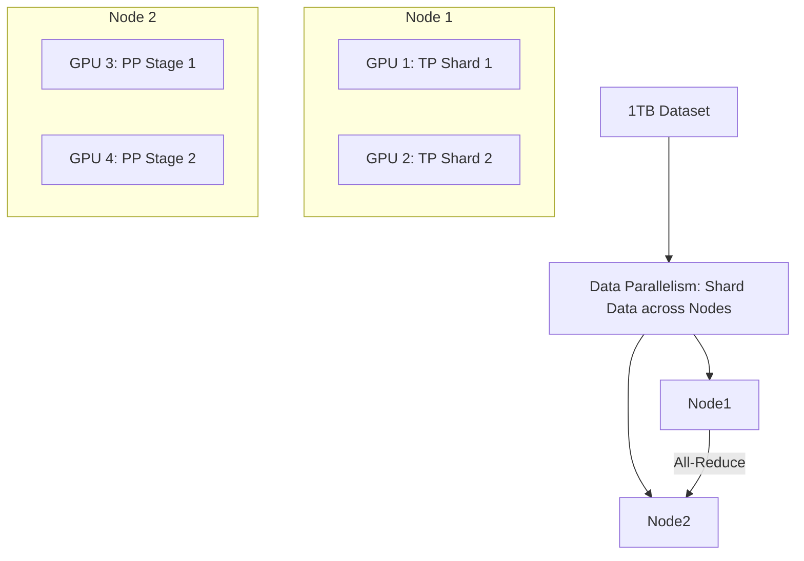

# 🛰️ Distributed Training: Scaling to the Moon
> **Level:** Extreme Advanced | **Language:** Hinglish | **Goal:** Master the deep technical details of training models on hundreds of GPUs, exploring 3D Parallelism, ZeRO optimization, and the 2026 strategies for building world-class LLMs.

---

## 🧭 1. Beginner-Friendly Hinglish Explanation
Maan lo aapko "Duniya ki sabse badi kitab" (The Internet) padhni hai. 
- Agar aap akele padhenge, toh hazaron saal lag jayenge. 
- **Solution:** Aap apne 1000 dosto ko bulate hain. 
- Sabko kitab ke alag-alag pages de dete hain (Data Parallelism). 
- Phir sham ko sab milte hain aur discuss karte hain ki kisne kya seekha (Gradient Sync).

**Distributed Training** ka yahi matlab hai. Hum model ko ek GPU par nahi, balki hazaron GPUs par train karte hain.
- **Data Parallelism:** Data ko todna.
- **Model Parallelism:** Model ko todna (jab model itna bada ho ki ek GPU mein na aaye).
- **Hybrid Parallelism:** Dono ko milana (3D Parallelism).

2026 mein, bina "Distributed Training" ke koi bhi competitive model nahi banta. Isse seekhna matlab AI ke "God Mode" ko unlock karna.

---

## 🧠 2. Deep Technical Explanation
Distributed training maximizes throughput and enables the training of models with trillions of parameters.

### 1. Data Parallelism (DDP):
- Every GPU has a full copy of the model.
- Each GPU gets a different batch of data.
- After the backward pass, gradients are averaged using **All-Reduce.**
- **Problem:** If the model is 100GB, it won't fit on an 80GB H100. DDP fails.

### 2. ZeRO (Zero Redundancy Optimizer):
- Introduced by Microsoft DeepSpeed. 
- **ZeRO-1:** Shards optimizer states.
- **ZeRO-2:** Shards gradients.
- **ZeRO-3:** Shards model parameters.
- This allows training models $10x$ larger on the same hardware.

### 3. 3D Parallelism (The 2026 Gold Standard):
- Combining three types of splitting:
  - **Data Parallelism (DP):** Scaling the batch size.
  - **Tensor Parallelism (TP):** Splitting layers horizontally (inside a server).
  - **Pipeline Parallelism (PP):** Splitting layers vertically (across servers).

### 4. NCCL (NVIDIA Collective Communications Library):
- The software that handles the actual data movement between GPUs. It is optimized for NVLink and InfiniBand.

---

## 🏗️ 3. Parallelism Comparison
| Strategy | What is Shared? | What is Sharded? | Network Requirement |
| :--- | :--- | :--- | :--- |
| **DDP** | Model Weights | Data Batch | Standard |
| **ZeRO-3** | Nothing (Full Shard) | Weights, Grads, Opt | **High (InfiniBand)** |
| **Tensor (TP)** | Data | Layers (Width) | **Extreme (NVLink)** |
| **Pipeline (PP)**| Micro-batches | Layers (Depth) | Moderate |

---

## 📐 4. Mathematical Intuition
- **The Speedup Equation:** 
  In a perfect world, $N$ GPUs should be $N$ times faster. But in reality:
  $$\text{Speedup} = \frac{T_{serial}}{T_{comp}/N + T_{comm}}$$
  - $T_{comp}$: Time spent on math.
  - $T_{comm}$: Time spent "Talking" over the network.
  If your network ($T_{comm}$) is slow, adding more GPUs makes the model SLOWER! This is the "Communication Bottleneck."

---

## 📊 5. 3D Parallelism Architecture (Diagram)


---

## 💻 6. Production-Ready Examples (Configuring DeepSpeed for ZeRO-3)
```json
// 2026 Pro-Tip: Use a JSON config to manage your distributed training.

{
  "train_batch_size": 2048,
  "fp16": { "enabled": true },
  "zero_optimization": {
    "stage": 3,
    "offload_optimizer": {
        "device": "cpu", // Save VRAM by moving optimizer to RAM
        "pin_memory": true
    },
    "overlap_comm": true,
    "contiguous_gradients": true
  },
  "gradient_accumulation_steps": 4,
  "steps_per_print": 10
}

// Run with: deepspeed --num_gpus 8 train.py --deepspeed ds_config.json
```

---

## ❌ 7. Failure Cases
- **Stale Gradients:** In asynchronous training, some GPUs might be faster than others, leading to a "messy" model that never learns. **Fix: Use Synchronous training (DDP).**
- **NCCL Timeouts:** If one GPU is $1\%$ slower (due to heat), all other 1023 GPUs wait for it. This is the **"Straggler" problem.**
- **Network Congestion:** Using standard TCP/IP for distributed training. It will be $50x$ slower than InfiniBand.

---

## 🛠️ 8. Debugging Guide
- **Symptom:** "Training is not speeding up with more GPUs."
- **Check:** **Interconnect Bandwidth**. Run `p2pBandwidthLatencyTest`. If you see $< 50$ GB/s, your NVLink/InfiniBand is not configured correctly.
- **Symptom:** "GPU 0 has 80GB used, but GPU 1 has only 10GB used."
- **Check:** **Model Partitioning**. You probably didn't shard the model correctly in ZeRO-3.

---

## ⚖️ 9. Tradeoffs
- **DP vs. Sharding:** 
  - DP is faster but uses more VRAM. 
  - Sharding (ZeRO) uses $10x$ less VRAM but is slower due to constant re-sharding over the network.
- **Batch Size:** Large batch sizes are better for GPUs but can hurt the "Generalization" of the model.

---

## 🛡️ 10. Security Concerns
- **Gradient Poisoning:** If a malicious node joins your distributed cluster, it can send "Bad Gradients" to destroy the model's intelligence. **Use 'Byzantine-Robust' aggregation.**

---

## 📈 11. Scaling Challenges
- **The 'Wall' at 10,000 GPUs:** At this scale, hardware failures happen every few hours. You need **Fault-tolerant Checkpointing** that can resume in seconds.

---

## 💸 12. Cost Considerations
- **InfiniBand Tax:** Servers with InfiniBand cost $2x$ more than standard servers. But without it, your $\$500,000$ GPUs will sit idle $80\%$ of the time.

---

## ✅ 13. Best Practices
- **Use 'FSDP' (Fully Sharded Data Parallel):** PyTorch's native answer to DeepSpeed ZeRO-3. It's more stable for 2026 workflows.
- **Profile with PyTorch Profiler:** Find the "Gaps" in your timeline where GPUs are doing nothing.
- **Warmup and Decay:** Always use a learning rate scheduler, especially important in distributed training where the global batch size is huge.

---

## ⚠️ 14. Common Mistakes
- **Forgetting to set `rank`:** Running the same script on 8 GPUs without telling them which one is the "Master."
- **Small Batch Sizes:** Training on 8 GPUs with a batch size of 8. The overhead of communication will be $10x$ the computation.

---

## 📝 15. Interview Questions
1. **"What is the difference between ZeRO-2 and ZeRO-3?"**
2. **"Explain how 3D Parallelism combines DP, TP, and PP."**
3. **"Why is the network (Bandwidth/Latency) the most important factor in distributed training?"**

---

## 🚀 15. Latest 2026 Industry Patterns
- **FP8 Training:** Using 8-bit floats for training to reduce communication data size by $2x$ without losing accuracy.
- **Expert Parallelism:** Specifically for **MoE (Mixture of Experts)** models, where different GPUs handle different "Experts."
- **Decentralized Training (Petals):** Training giant models over the public internet (like BitTorrent) using thousands of community-donated GPUs.
