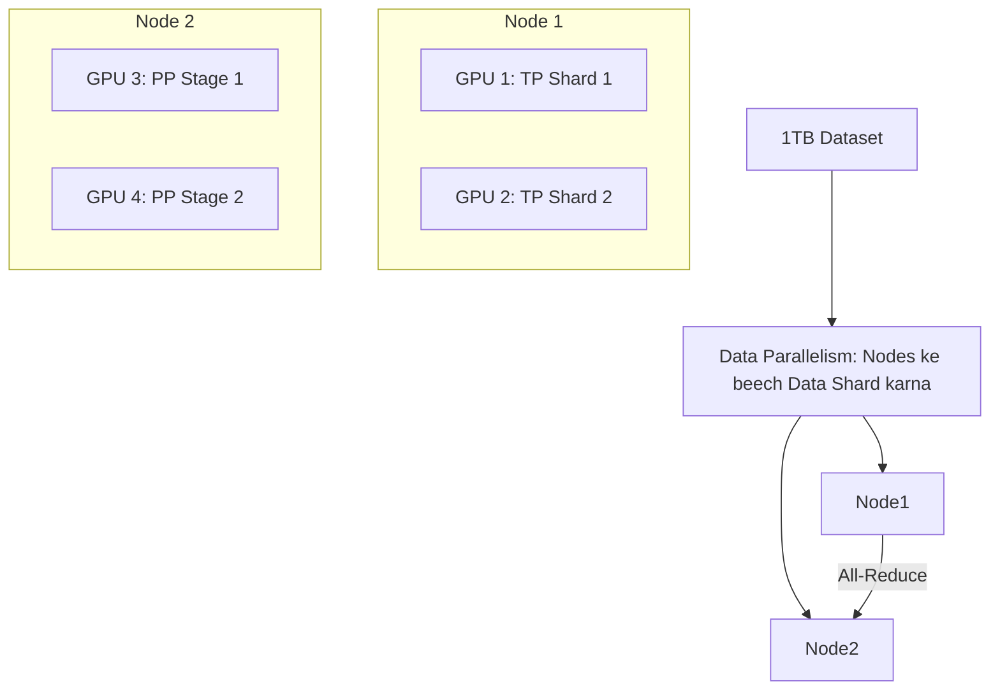

# 🛰️ Distributed Training: Scaling to the Moon
> **Level:** Extreme Advanced | **Language:** Hinglish | **Goal:** Hundreds of GPUs par training models ke deep technical details ko master karein, 3D Parallelism, ZeRO optimization, aur world-class LLMs build karne ki 2026 strategies ko explore karte hue.

---

## 🧭 1. Beginner-Friendly Hinglish Explanation
Maan lo aapko "Duniya ki sabse badi kitab" (The Internet) padhni hai. 
- Agar aap akele padhenge, toh hazaron saal lag jayenge. 
- **Solution:** Aap apne 1000 dosto ko bulate hain. 
- Sabko kitab ke alag-alag pages de dete hain (Data Parallelism). 
- Phir sham ko sab milte hain aur discuss karte hain ki kisne kya seekha (Gradient Sync).

**Distributed Training** ka yahi matlab hai. Hum model ko ek GPU par nahi, balki hazaron GPUs par train karte hain.
- **Data Parallelism:** Data ko todna.
- **Model Parallelism:** Model ko todna (jab model itna bada ho ki ek GPU mein na aaye).
- **Hybrid Parallelism:** Dono ko milana (3D Parallelism).

2026 mein, bina "Distributed Training" ke koi bhi competitive model nahi banta. Isse seekhna matlab AI ke "God Mode" ko unlock karna.

---

## 🧠 2. Deep Technical Explanation
Distributed training throughput ko maximize karta hai aur trillions of parameters waale models ki training ko enable karta hai.

### 1. Data Parallelism (DDP):
- Har GPU ke paas model ki ek full copy hoti hai.
- Har GPU ko data ka ek alag batch milta hai.
- Backward pass ke baad, gradients ko **All-Reduce** ka use karke average kiya jata hai.
- **Problem:** Agar model 100GB ka hai, toh yeh 80GB H100 par fit nahi hoga. DDP fail ho jata hai.

### 2. ZeRO (Zero Redundancy Optimizer):
- Isse Microsoft DeepSpeed ne introduce kiya tha. 
- **ZeRO-1:** Optimizer states ko shard (split) karta hai.
- **ZeRO-2:** Gradients ko shard karta hai.
- **ZeRO-3:** Model parameters ko shard karta hai.
- Yeh same hardware par $10x$ bade models ko train karne ki permission deta hai.

### 3. 3D Parallelism (The 2026 Gold Standard):
- Teen tarah ki splitting ko combine karna:
  - **Data Parallelism (DP):** Batch size ko scale karna.
  - **Tensor Parallelism (TP):** Layers ko horizontally split karna (server ke andar).
  - **Pipeline Parallelism (PP):** Layers ko vertically split karna (servers ke beech mein).

### 4. NCCL (NVIDIA Collective Communications Library):
- Yeh woh software hai jo GPUs ke beech actual data movement ko handle karta hai. Yeh NVLink aur InfiniBand ke liye optimized hai.

---

## 🏗️ 3. Parallelism Comparison
| Strategy | What is Shared? | What is Sharded? | Network Requirement |
| :--- | :--- | :--- | :--- |
| **DDP** | Model Weights | Data Batch | Standard |
| **ZeRO-3** | Nothing (Full Sharding) | Weights, Gradients, Optimizer | **High (InfiniBand)** |
| **Tensor (TP)** | Data | Layers (Width wise) | **Extreme (NVLink)** |
| **Pipeline (PP)**| Micro-batches | Layers (Depth wise) | Moderate |

---

## 📐 4. Mathematical Intuition
- **Speedup Equation:** 
  Ek perfect world mein, $N$ GPUs ko $N$ times faster hona chahiye. Par reality mein:
  $$\text{Speedup} = \frac{T_{serial}}{T_{comp}/N + T_{comm}}$$
  - $T_{comp}$: Math operations (computation) mein lagne wala time.
  - $T_{comm}$: Network par "talk" (communication) karne mein lagne wala time.
  Agar aapka network ($T_{comm}$) slow hai, toh aur GPUs add karne se model SLOWER ho jayega! Isse hum "Communication Bottleneck" kehte hain.

---

## 📊 5. 3D Parallelism Architecture (Diagram)

```mermaid
graph TD
    subgraph "Node 1"
    G1[GPU 1: TP Shard 1]
    G2[GPU 2: TP Shard 2]
    end
    
    subgraph "Node 2"
    G3[GPU 3: PP Stage 1]
    G4[GPU 4: PP Stage 2]
    end
    
    Data[1TB Dataset] --> DP[Data Parallelism: Nodes ke beech Data Shard karna]
    DP --> Node1
    DP --> Node2
    
    Node1 -- "All-Reduce" --> Node2
```

---

## 💻 6. Production-Ready Examples (Configuring DeepSpeed for ZeRO-3)
```json
// 2026 Pro-Tip: Apne distributed training ko manage karne ke liye JSON config ka use karein.

{
  "train_batch_size": 2048,
  "fp16": { "enabled": true },
  "zero_optimization": {
    "stage": 3,
    "offload_optimizer": {
        "device": "cpu", // Optimizer ko RAM par move karke VRAM save karein
        "pin_memory": true
    },
    "overlap_comm": true,
    "contiguous_gradients": true
  },
  "gradient_accumulation_steps": 4,
  "steps_per_print": 10
}

// Run with: deepspeed --num_gpus 8 train.py --deepspeed ds_config.json
```

---

## ❌ 7. Failure Cases
- **Stale Gradients:** Asynchronous training mein, kuch GPUs dusre GPUs se faster ho sakte hain, jisse ek "messy" model banta hai jo kabhi learn nahi kar paata. **Fix: Synchronous training (DDP) ka use karein.**
- **NCCL Timeouts:** Agar ek GPU heat ki wajah se $1\%$ slow ho jaye, toh baaki saare 1023 GPUs uska wait karte hain. Yeh **"Straggler" problem** hai.
- **Network Congestion:** Distributed training ke liye standard TCP/IP use karna. Yeh InfiniBand se $50x$ slow ho jayega.

---

## 🛠️ 8. Debugging Guide
- **Symptom:** "GPUs badhane ke baad bhi training speedup nahi ho rahi hai."
- **Check:** **Interconnect Bandwidth**. `p2pBandwidthLatencyTest` run karein. Agar aapko $< 50$ GB/s dikhta hai, toh aapka NVLink/InfiniBand sahi se configured nahi hai.
- **Symptom:** "GPU 0 par 80GB use ho raha hai, lekin GPU 1 par sirf 10GB use ho raha hai."
- **Check:** **Model Partitioning**. Aapne shayad ZeRO-3 mein model ko properly shard nahi kiya.

---

## ⚖️ 9. Tradeoffs
- **DP vs. Sharding:** 
  - DP faster hota hai par zyada VRAM use karta hai. 
  - Sharding (ZeRO) $10x$ kam VRAM use karta hai par network par constant re-sharding ki wajah se slower hota hai.
- **Batch Size:** Bade batch sizes GPUs ke liye acche hote hain par model ki "Generalization" ko hurt kar sakte hain.

---

## 🛡️ 10. Security Concerns
- **Gradient Poisoning:** Agar koi malicious node aapke distributed cluster ko join kar leta hai, toh woh model ki intelligence ko destroy karne ke liye "Bad Gradients" bhej sakta hai. **'Byzantine-Robust' aggregation ka use karein.**

---

## 📈 11. Scaling Challenges
- **The 'Wall' at 10,000 GPUs:** Is scale par, har kuch ghanto mein hardware failures hote hain. Aapko **Fault-tolerant Checkpointing** ki zaroorat hoti hai jo seconds mein resume ho sake.

---

## 💸 12. Cost Considerations
- **InfiniBand Tax:** InfiniBand waale servers standard servers se $2x$ costly hote hain. Par iske bina, aapke $\$500,000$ ke GPUs $80\%$ time idle (khali) baithe rahenge.

---

## ✅ 13. Best Practices
- **'FSDP' (Fully Sharded Data Parallel) use karein:** DeepSpeed ZeRO-3 ke liye PyTorch ka native answer. Yeh 2026 workflows ke liye zyada stable hai.
- **PyTorch Profiler ke saath profile karein:** Apne timeline mein un "Gaps" ko dhoondhein jahan GPUs kuch nahi kar rahe hain.
- **Warmup and Decay:** Hamesha learning rate scheduler ka use karein, distributed training mein yeh aur bhi important ho jata hai jahan global batch size bahut bada hota hai.

---

## ⚠️ 14. Common Mistakes
- **`rank` set karna bhool jana:** 8 GPUs par same script ko run karna bina unhe bataye ki kaun sa "Master" hai.
- **Small Batch Sizes:** 8 GPUs par 8 ke batch size ke saath training karna. Communication ka overhead computation se $10x$ ho jayega.

---

## 📝 15. Interview Questions
1. **"ZeRO-2 aur ZeRO-3 ke beech kya difference hai?"**
2. **"Explain karein ki 3D Parallelism kaise DP, TP, aur PP ko combine karta hai."**
3. **"Distributed training mein network (Bandwidth/Latency) sabse important factor kyun hai?"**

---

## 🚀 15. Latest 2026 Industry Patterns
- **FP8 Training:** Communication data size ko bina accuracy loss ke $2x$ reduce karne ke liye training mein 8-bit floats ka use karna.
- **Expert Parallelism:** Khaaskar **MoE (Mixture of Experts)** models ke liye, jahan alag-alag GPUs alag-alag "Experts" ko handle karte hain.
- **Decentralized Training (Petals):** Hazaron community-donated GPUs ka use karke public internet (jaise BitTorrent) par giant models ko train karna.
