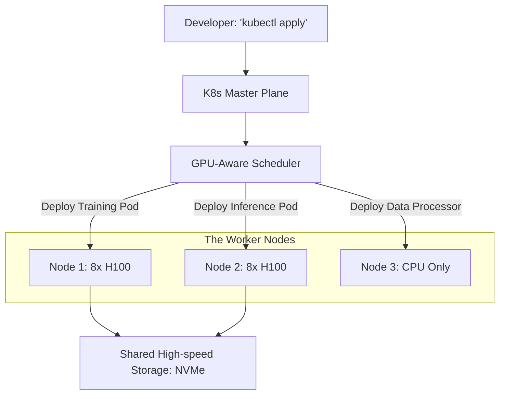

# ☸️ Kubernetes for AI: Orchestrating the GPU Cluster
> **Level:** Advanced | **Language:** Hinglish | **Goal:** Master the use of Kubernetes (K8s) for managing AI workloads, exploring GPU scheduling, Operator patterns, and the 2026 strategies for building scalable, resilient AI platforms.

---

## 🧭 1. Beginner-Friendly Hinglish Explanation
Maan lo aapke paas 50 GPUs hain aur 10 engineers jo unhe use karna chahte hain. 

- **The Problem:** Kaunsa GPU kis engineer ko mile? Agar koi GPU free ho jaye, toh use agle kaam mein kaise lagayein? Agar koi server "Crash" ho jaye, toh training ko doosre server par kaise shift karein? 
- Bina kisi system ke, aapko ye sab "Manually" karna padega, jo impossible hai.

**Kubernetes (K8s)** ek "Manager" ki tarah hai. 
1. Ye saare servers (Nodes) ko ek "Pool" mein badal deta hai.
2. Jab aap kehte hain *"Mujhe 8 GPUs chahiye"*, K8s apne aap dhoondhta hai ki kahan khali jagah hai aur aapka kaam wahan start kar deta hai.
3. Ye AI ke liye **"Infrastructure as Code"** hai.

2026 mein, agar aapko "Production AI" chalana hai, toh Kubernetes seekhna utna hi zaroori hai jitna Python.

---

## 🧠 2. Deep Technical Explanation
Kubernetes is the de-facto standard for managing containerized AI applications.

### 1. GPU Scheduling:
- Kubernetes doesn't see GPUs by default. You need the **NVIDIA Device Plugin** to expose GPUs as "Resources" (e.g., `nvidia.com/gpu: 1`).
- **Fractional GPUs:** In 2026, we use **MIG (Multi-Instance GPU)** or **Time-slicing** to share one big H100 between 7 small AI tasks.

### 2. Operators (The AI Logic):
- Standard K8s doesn't understand "Distributed Training." We use **Kubeflow Training Operator.**
- It handles the complex setup of "Master" and "Worker" pods and ensures they can talk to each other.

### 3. Storage for AI:
- GPUs need data FAST. We use **Persistent Volumes (PV)** backed by high-speed storage like **Amazon FSx for Lustre** or **WEKA**, which can feed TBs of data to GPUs without bottlenecking.

### 4. Auto-scaling (Karpenter / HPA):
- Automatically adding new GPU nodes when the "Queue" is long, and deleting them when they are idle to save money.

---

## 🏗️ 3. K8s vs. Bare Metal for AI
| Feature | Kubernetes | Bare Metal (Raw SSH) |
| :--- | :--- | :--- |
| **Scalability** | **Infinite (Auto)** | Manual |
| **Fault Tolerance** | **Self-healing** | Manual restart |
| **GPU Utilization** | High (Multi-tenancy) | Low (Static allocation) |
| **Setup Complexity** | High | Low |
| **Best For** | Production / Teams | Research / Prototypes |

---

## 📐 4. Mathematical Intuition
- **The Resource Requests vs. Limits:** 
  In K8s, if you set `request: 4 GPUs` but `limit: 8 GPUs`, K8s will guarantee you 4 but "Burst" you to 8 if the cluster is empty. 
  For AI training, always set **Request = Limit** to avoid the model being "Throttled" in the middle of a gradient step.

---

## 📊 5. AI Cluster Architecture (Diagram)


---

## 💻 6. Production-Ready Examples (A GPU Pod Manifest)
```yaml
# 2026 Pro-Tip: Always specify your GPU requirements clearly.

apiVersion: v1
kind: Pod
metadata:
  name: llama3-training-job
spec:
  containers:
  - name: training-container
    image: pytorch/pytorch:2.1.0-cuda12.1-cudnn8-runtime
    command: ["python", "train.py"]
    resources:
      limits:
        nvidia.com/gpu: 1 # Requesting 1 GPU
        memory: "32Gi"
        cpu: "8"
    volumeMounts:
    - name: dataset
      mountPath: /data
  volumes:
  - name: dataset
    persistentVolumeClaim:
      claimName: s3-data-pvc
```

---

## ❌ 7. Failure Cases
- **OOM (Out of Memory):** The Pod is killed because it used more System RAM than allowed. Note: This is different from GPU VRAM OOM.
- **Image Pull Backoff:** Your AI Docker image is 20GB. K8s times out while trying to download it over a slow network. **Fix: Use 'Image Caching' on nodes.**
- **GPU Fragmentation:** You have 2 GPUs free on Node A and 2 on Node B. A user asks for 4 GPUs. K8s can't fulfill it because they aren't on the "Same Node" (Needs NVLink). **Fix: Use 'Topology-aware scheduling'.**

---

## 🛠️ 8. Debugging Guide
- **Symptom:** "Pod is stuck in 'Pending' state."
- **Check:** `kubectl describe pod`. Usually, it's because there are "No nodes with available GPUs."
- **Symptom:** "GPU not found inside the container."
- **Check:** **NVIDIA Runtime**. Is the Docker runtime set to `nvidia` on the host? Run `nvidia-smi` inside the pod to verify.

---

## ⚖️ 9. Tradeoffs
- **Managed K8s (EKS/GKE) vs. Custom:** 
  - Managed is easier but expensive and has "Older" GPU drivers. 
  - Custom (Kubespray) lets you use the latest H100 features but is a "Nightmare" to maintain.

---

## 🛡️ 10. Security Concerns
- **Container Escape:** A malicious AI job breaking out of its container and accessing the host's physical GPU or other users' data. **Use 'Runtime Security' (Falco/Tetragon).**

---

## 📈 11. Scaling Challenges
- **The 'Join' Latency:** Adding a new node to a 1000-node cluster can take 5 minutes. In 2026, we use **'Pre-warmed' nodes** to scale in seconds.

---

## 💸 12. Cost Considerations
- **Inter-node Data Fees:** K8s might put your "Data Pod" in one zone and "GPU Pod" in another. **Use 'Affinity Rules' to keep them together.**

---

## ✅ 13. Best Practices
- **Use 'Taints and Tolerations':** Only allow AI jobs on GPU nodes and keep "Web Apps" on cheap CPU nodes.
- **Implement 'Quotas':** Don't let one engineer "Steal" all 50 GPUs. Set a limit of 4 per person.
- **Use Helm Charts:** For deploying complex AI apps (like Kubeflow) with one command.

---

## ⚠️ 14. Common Mistakes
- **No health checks:** A GPU pod "Hangs" but K8s thinks it's fine. **Use 'Liveness Probes' to check if the AI is still responding.**
- **Storing weights inside the container:** When the pod restarts, your 10-hour training is GONE. **Always use 'Persistent Volumes'.**

---

## 📝 15. Interview Questions
1. **"How does Kubernetes manage GPU resources using the NVIDIA Device Plugin?"**
2. **"What is the difference between a Deployment and a Job in K8s for AI?"**
3. **"Explain 'Topology-aware scheduling' for multi-GPU training."**

---

## 🚀 15. Latest 2026 Industry Patterns
- **Kueue:** A new K8s-native job queueing system that handles "Job Priorities" (e.g., *"Finish the CEO's task before the intern's"*).
- **WebAssembly (Wasm) for AI:** Running small AI models in Wasm containers instead of Docker for $10x$ faster startup.
- **Serverless GPUs on K8s:** Using tools like **KEDA** to scale GPU pods down to ZERO when there are no requests, saving thousands of dollars.
