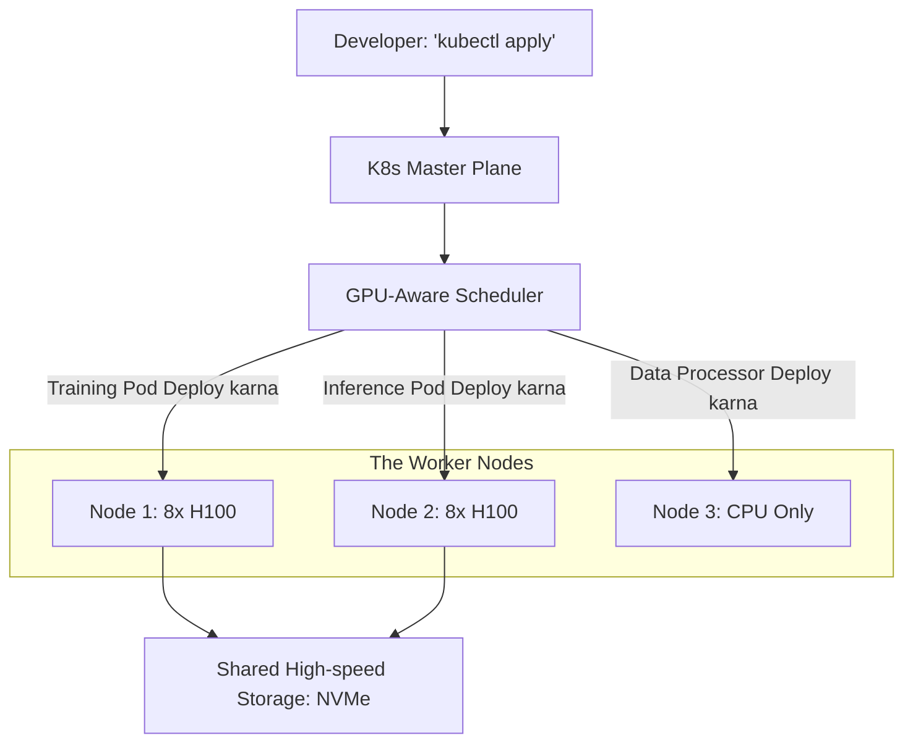

# ☸️ Kubernetes for AI: Orchestrating the GPU Cluster
> **Level:** Advanced | **Language:** Hinglish | **Goal:** AI workloads ko manage karne ke liye Kubernetes (K8s) ke use ko master karein, GPU scheduling, Operator patterns, aur 2026 mein scalable, resilient AI platforms build karne ki strategies ko explore karte hue.

---

## 🧭 1. Beginner-Friendly Hinglish Explanation
Maan lo aapke paas 50 GPUs hain aur 10 engineers jo unhe use karna chahte hain. 

- **The Problem:** Kaunsa GPU kis engineer ko mile? Agar koi GPU free ho jaye, toh use agle kaam mein kaise lagayein? Agar koi server "Crash" ho jaye, toh training ko doosre server par kaise shift karein? 
- Bina kisi system ke, aapko ye sab "Manually" karna padega, jo impossible hai.

**Kubernetes (K8s)** ek "Manager" ki tarah hai. 
1. Ye saare servers (Nodes) ko ek "Pool" mein badal deta hai.
2. Jab aap kehte hain *"Mujhe 8 GPUs chahiye"*, K8s apne aap dhoondhta hai ki kahan khali jagah hai aur aapka kaam wahan start kar deta hai.
3. Ye AI ke liye **"Infrastructure as Code"** hai.

2026 mein, agar aapko "Production AI" chalana hai, toh Kubernetes seekhna utna hi zaroori hai jitna Python.

---

## 🧠 2. Deep Technical Explanation
Kubernetes containerized AI applications ko manage karne ke liye de-facto standard hai.

### 1. GPU Scheduling:
- Kubernetes default roop se GPUs ko nahi dekh pata. GPUs ko "Resources" (jaise `nvidia.com/gpu: 1`) ke tarah expose karne ke liye aapko **NVIDIA Device Plugin** ki zaroorat hoti hai.
- **Fractional GPUs:** 2026 mein, hum ek bade H100 ko 7 small AI tasks ke beech share karne ke liye **MIG (Multi-Instance GPU)** ya **Time-slicing** ka use karte hain.

### 2. Operators (The AI Logic):
- Standard K8s "Distributed Training" ko nahi samajhta. Hum **Kubeflow Training Operator** ka use karte hain.
- Yeh "Master" aur "Worker" pods ke complex setup ko handle karta hai aur ensure karta hai ki woh ek dusre se baat kar sakein.

### 3. Storage for AI:
- GPUs ko data FAST chahiye hota hai. Hum **Persistent Volumes (PV)** ka use karte hain jo **Amazon FSx for Lustre** ya **WEKA** jaise high-speed storage se backed hote hain, jo bina kisi bottleneck ke GPUs ko TBs of data feed kar sakte hain.

### 4. Auto-scaling (Karpenter / HPA):
- Jab "Queue" lambi ho toh automatically naye GPU nodes ko add karna, aur paise bachane ke liye jab woh idle hon toh unhe delete karna.

---

## 🏗️ 3. K8s vs. Bare Metal for AI
| Feature | Kubernetes | Bare Metal (Raw SSH) |
| :--- | :--- | :--- |
| **Scalability** | **Infinite (Auto)** | Manual (Khud se) |
| **Fault Tolerance** | **Self-healing** | Manual restart |
| **GPU Utilization** | High (Multi-tenancy) | Low (Static allocation) |
| **Setup Complexity** | High (Mushkil) | Low (Aasan) |
| **Best For** | Production / Teams | Research / Prototypes |

---

## 📐 4. Mathematical Intuition
- **The Resource Requests vs. Limits:** 
  K8s mein, agar aap `request: 4 GPUs` set karte hain aur `limit: 8 GPUs`, toh K8s aapko 4 ki guarantee dega par cluster khali hone par aapko 8 tak "Burst" karne dega. 
  AI training ke liye, hamesha **Request = Limit** set karein taaki model gradient step ke beech mein "Throttled" (slow/stop) na ho.

---

## 📊 5. AI Cluster Architecture (Diagram)

```mermaid
graph TD
    User[Developer: 'kubectl apply'] --> Master[K8s Master Plane]
    Master --> Scheduler[GPU-Aware Scheduler]
    
    subgraph "The Worker Nodes"
    N1[Node 1: 8x H100]
    N2[Node 2: 8x H100]
    N3[Node 3: CPU Only]
    end
    
    Scheduler -- "Training Pod Deploy karna" --> N1
    Scheduler -- "Inference Pod Deploy karna" --> N2
    Scheduler -- "Data Processor Deploy karna" --> N3
    
    N1 & N2 --> Store[Shared High-speed Storage: NVMe]
```

---

## 💻 6. Production-Ready Examples (A GPU Pod Manifest)
```yaml
# 2026 Pro-Tip: Hamesha apne GPU requirements ko saaf-saaf specify karein.

apiVersion: v1
kind: Pod
metadata:
  name: llama3-training-job
spec:
  containers:
  - name: training-container
    image: pytorch/pytorch:2.1.0-cuda12.1-cudnn8-runtime
    command: ["python", "train.py"]
    resources:
      limits:
        nvidia.com/gpu: 1 # 1 GPU request kar rahe hain
        memory: "32Gi"
        cpu: "8"
    volumeMounts:
    - name: dataset
      mountPath: /data
  volumes:
  - name: dataset
    persistentVolumeClaim:
      claimName: s3-data-pvc
```

---

## ❌ 7. Failure Cases
- **OOM (Out of Memory):** Pod isliye kill ho jata hai kyunki usne allowed limit se zyada System RAM use kar liya. Note: Yeh GPU VRAM OOM se alag hai.
- **Image Pull Backoff:** Aapki AI Docker image 20GB ki hai. Slow network par ise download karne ki koshish mein K8s timeout ho jata hai. **Fix: Nodes par 'Image Caching' ka use karein.**
- **GPU Fragmentation:** Aapke paas Node A par 2 GPUs aur Node B par 2 GPUs free hain. Ek user 4 GPUs maangta hai. K8s ise fulfill nahi kar sakta kyunki woh "Same Node" par nahi hain (jiske liye NVLink chahiye). **Fix: 'Topology-aware scheduling' ka use karein.**

---

## 🛠️ 8. Debugging Guide
- **Symptom:** "Pod 'Pending' state mein stuck (atkaa) hai."
- **Check:** `kubectl describe pod` karein. Aamtaur par aisa isliye hota hai kyunki "No nodes with available GPUs" (koi free GPU node nahi hai).
- **Symptom:** "Container ke andar GPU nahi mil raha."
- **Check:** **NVIDIA Runtime**. Kya host par Docker runtime `nvidia` set hai? Verify karne ke liye pod ke andar `nvidia-smi` run karein.

---

## ⚖️ 9. Tradeoffs
- **Managed K8s (EKS/GKE) vs. Custom:** 
  - Managed aasan hai par expensive hota hai aur isme "Older" GPU drivers hote hain. 
  - Custom (Kubespray) aapko latest H100 features use karne deta hai par isko maintain karna ek "Nightmare" (sapna/musibat) hai.

---

## 🛡️ 10. Security Concerns
- **Container Escape:** Ek malicious AI job ka apne container se bahar nikal kar host ke physical GPU ya dusre users ke data ko access karna. **'Runtime Security' (Falco/Tetragon) ka use karein.**

---

## 📈 11. Scaling Challenges
- **The 'Join' Latency:** Ek 1000-node waale cluster mein naya node add karne mein 5 minutes lag sakte hain. 2026 mein, hum seconds mein scale karne ke liye **'Pre-warmed' nodes** ka use karte hain.

---

## 💸 12. Cost Considerations
- **Inter-node Data Fees:** K8s aapke "Data Pod" ko ek zone mein aur "GPU Pod" ko dusre zone mein rakh sakta hai. **Dono ko saath rakhne ke liye 'Affinity Rules' ka use karein.**

---

## ✅ 13. Best Practices
- **'Taints and Tolerations' use karein:** GPU nodes par sirf AI jobs ko hi allow karein aur "Web Apps" ko cheap CPU nodes par rakhein.
- **'Quotas' implement karein:** Kisi ek engineer ko saare 50 GPUs "Steal" (kabza) mat karne dein. Per person 4 ki limit set karein.
- **Helm Charts use karein:** Ek single command se complex AI apps (jaise Kubeflow) deploy karne ke liye.

---

## ⚠️ 14. Common Mistakes
- **No health checks:** Ek GPU pod "Hang" ho jata hai par K8s ko lagta hai ki sab sahi hai. **AI abhi bhi respond kar raha hai ya nahi, yeh check karne ke liye 'Liveness Probes' ka use karein.**
- **Weights ko container ke andar store karna:** Jab pod restart hota hai, toh aapki 10-hour ki training GONE (gayab) ho jati hai. **Hamesha 'Persistent Volumes' ka use karein.**

---

## 📝 15. Interview Questions
1. **"Kubernetes NVIDIA Device Plugin ka use karke GPU resources ko kaise manage karta hai?"**
2. **"AI ke liye K8s mein Deployment aur Job ke beech kya difference hai?"**
3. **"Multi-GPU training ke liye 'Topology-aware scheduling' ko explain karein."**

---

## 🚀 15. Latest 2026 Industry Patterns
- **Kueue:** Ek naya K8s-native job queueing system jo "Job Priorities" ko handle karta hai (jaise, *"CEO ka task pehle finish karo aur intern ka baad mein"*).
- **WebAssembly (Wasm) for AI:** Docker ki jagah Wasm containers mein small AI models chalana taaki startup speed $10x$ faster ho sake.
- **Serverless GPUs on K8s:** KEDA jaise tools ka use karke GPU pods ko ZERO tak scale down karna jab koi request na ho, jisse hazaron dollars bachte hain.
