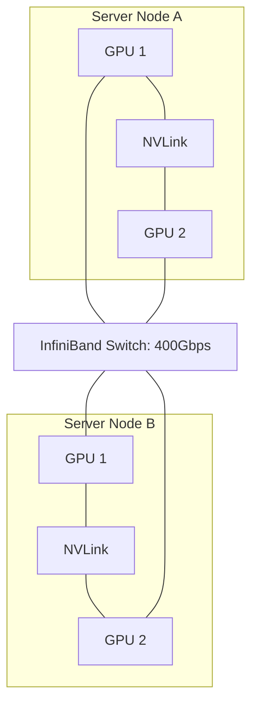

# 🌐 Multi-Node Scaling: Crossing the Server Border
> **Level:** Extreme Advanced | **Language:** Hinglish | **Goal:** Master the art of scaling AI models from one server to hundreds, exploring InfiniBand, RDMA, Master-Worker architectures, and the 2026 patterns for massive-scale cluster synchronization.

---

## 🧭 1. Beginner-Friendly Hinglish Explanation
Ek server mein maximum 8 GPUs aa sakte hain (H100 specs). Agar aapko Llama-3-400B train karna hai, toh aapko **1000+ GPUs** chahiye.

- **The Problem:** Jab aap 100 servers (Nodes) use karte hain, toh sabse badi "Rukawat" (Bottleneck) internet ki wire hoti hai. 
- Maan lo Server-1 ne kuch seekha aur Server-100 ko batana hai. Agar information "Dheere" (Slowly) gayi, toh Server-100 khali baitha rahega.

**Multi-Node Scaling** ka matlab hai servers ko ek-dusre ke itna "Close" lana (Digitaly) ki wo ek hi giant computer ki tarah kaam karein.
- Iske liye hum **InfiniBand** (Ek ultra-fast wire) aur **RDMA** (Direct memory access) use karte hain. 

2026 mein, multi-node scaling sirf "Hardware" ka nahi, balki "Mathematics" aur "Networking" ka perfect combination hai.

---

## 🧠 2. Deep Technical Explanation
Scaling beyond a single node introduces massive **Network Latency** and **Synchronization** challenges.

### 1. InfiniBand & RoCE:
- Standard Ethernet (TCP/IP) is too slow for AI. 
- **InfiniBand (IB):** A high-throughput, low-latency interconnect ($400-800$ Gbps). 
- **RoCE (RDMA over Converged Ethernet):** Doing fast data transfer over cheaper Ethernet hardware.

### 2. RDMA (Remote Direct Memory Access):
- This allows GPU-1 on Node-A to write directly into the memory of GPU-1 on Node-B WITHOUT involving the CPU. This reduces latency by $90\%$.

### 3. NCCL (NVIDIA Collective Communications Library):
- NCCL is "Multi-node aware." It uses algorithms like **Rings** or **Trees** to sync gradients across hundreds of nodes efficiently.

### 4. Job Orchestration (Slurm vs. K8s):
- **Slurm:** The traditional HPC (High Performance Computing) king. Best for "Fixed" clusters.
- **Kubernetes:** The modern cloud king. Best for "Dynamic" scaling.

---

## 🏗️ 3. Single-Node vs. Multi-Node
| Feature | Single-Node (1-8 GPUs) | Multi-Node (8-1000+ GPUs) |
| :--- | :--- | :--- |
| **Interconnect** | **NVLink (900 GB/s)** | **InfiniBand (50-100 GB/s)** |
| **Complexity** | Low | **Extreme** |
| **Communication**| Instant | Network-bound |
| **Failures** | Rare | **Common (Hardware failure every day)**|
| **Power Needs** | High | Massive (Megawatts) |

---

## 📐 4. Mathematical Intuition
- **Amdahl's Law in Scaling:** 
  $$\text{Speedup} = \frac{1}{(1 - P) + \frac{P}{N}}$$
  - $P$: Parallelizable part of the code.
  - $N$: Number of nodes.
  If only $90\%$ of your AI training is parallel (and $10\%$ is overhead like network syncing), even with INFINITE nodes, your speedup will never exceed $10x$. **Multi-node scaling is a battle to make $P$ as close to $1.0$ as possible.**

---

## 📊 5. Multi-Node Cluster Topography (Diagram)


---

## 💻 6. Production-Ready Examples (Launching Multi-Node with PyTorch Distributed)
```bash
# 2026 Pro-Tip: Use 'torchrun' to handle multi-node env variables automatically.

# On Node 0 (Master)
torchrun --nproc_per_node=8 \
         --nnodes=2 \
         --node_rank=0 \
         --master_addr="10.0.0.1" \
         --master_port=1234 \
         train.py

# On Node 1 (Worker)
torchrun --nproc_per_node=8 \
         --nnodes=2 \
         --node_rank=1 \
         --master_addr="10.0.0.1" \
         --master_port=1234 \
         train.py

# The nodes will find each other and start the All-Reduce sync across the network.
```

---

## ❌ 7. Failure Cases
- **The 'Zombie Node' Problem:** One node in a 100-node cluster stops working. The other 99 nodes sit idle waiting for its gradients. **Fix: Use 'Fault-tolerant' libraries like TorchX.**
- **Network Collision:** Too much data on one switch causes "Packet Loss," making the training $10x$ slower. **Fix: Use 'Rail-optimized' cabling.**
- **Clock Drift:** If the clocks on Node A and Node B are not perfectly synced, the time-stamped logs will be a mess, making debugging impossible.

---

## 🛠️ 8. Debugging Guide
- **Symptom:** "Inference works on 1 node but crashes on 2 nodes."
- **Check:** **Master Address**. Can Node B "Ping" Node A on the specified port? Firewalls (iptables) often block AI communication ports.
- **Symptom:** "Accuracy is not improving."
- **Check:** **Effective Batch Size**. If you have 2 nodes, your batch size is now $2x$. You must increase the **Learning Rate** (Linear Scaling Rule) or the model won't converge.

---

## ⚖️ 9. Tradeoffs
- **Bandwidth vs. Cost:** InfiniBand is $5x$ more expensive than Ethernet. Is the $2x$ faster training worth the $\$1M$ extra? For Llama-3 training, YES.
- **Flat vs. Hierarchical Sync:** Syncing all 1000 GPUs at once vs. syncing inside a node first, then between nodes. Hierarchical is slower but more stable.

---

## 🛡️ 10. Security Concerns
- **Eavesdropping on Gradients:** An attacker with access to the network switch can "Record" the gradients and use **Model Inversion** to steal the training data. **Enable 'Encryption in transit' if using public clouds.**

---

## 📈 11. Scaling Challenges
- **The 'Collective' Bottleneck:** As you add more nodes, the "All-Reduce" operation takes longer because more GPUs need to talk. **Solution: Use 'Pipeline Parallelism' to reduce the number of sync points.**

---

## 💸 12. Cost Considerations
- **Data Transfer Costs:** Moving checkpoints (100GB each) between nodes every 10 minutes can add up in cloud costs. **Use 'Local Checkpointing' on NVMe drives.**

---

## ✅ 13. Best Practices
- **Use 'NCCL_DEBUG=INFO'**: This will show exactly how the GPUs are talking. If you see "TCP" instead of "IB," your high-speed network is NOT being used.
- **Keep Nodes in the same 'Placement Group':** Ensure the physical distance between servers is minimum.
- **Implement 'Automated Health Checks':** Before starting a 2-week training, run a 5-minute "Stress Test" on all nodes to find any weak GPUs.

---

## ⚠️ 14. Common Mistakes
- **Mixing GPU types:** Trying to do multi-node scaling between an A100 node and an H100 node. It will only work at the speed of the slowest GPU.
- **Ignoring GPU IDs:** Not setting `CUDA_VISIBLE_DEVICES` correctly, leading to multiple pods trying to use the same physical GPU.

---

## 📝 15. Interview Questions
1. **"What is RDMA and why is it crucial for multi-node AI?"**
2. **"How does the 'Linear Scaling Rule' affect the Learning Rate?"**
3. **"Explain why Ethernet is often the bottleneck in LLM training."**

---

## 🚀 15. Latest 2026 Industry Patterns
- **Optical Interconnects:** Using "Light" instead of "Electricity" to move data between servers at Terabit speeds.
- **Dynamic Cluster Resizing:** A cluster that "Kicks out" a failing node and adds a new one without stopping the training job.
- **Network-Attached Accelerators:** GPUs that connect directly to the network without needing a Host CPU/Server, allowing for ultra-dense clusters.
