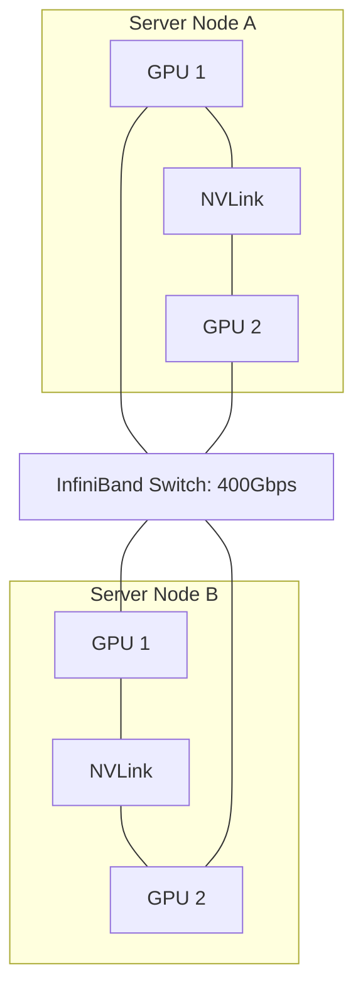

# 🌐 Multi-Node Scaling: Crossing the Server Border
> **Level:** Extreme Advanced | **Language:** Hinglish | **Goal:** AI models ko ek server se hundreds par scale karne ki art ko master karein, InfiniBand, RDMA, Master-Worker architectures, aur massive-scale cluster synchronization ke 2026 patterns ko explore karte hue.

---

## 🧭 1. Beginner-Friendly Hinglish Explanation
Ek server mein maximum 8 GPUs aa sakte hain (H100 specs). Agar aapko Llama-3-400B train karna hai, toh aapko **1000+ GPUs** chahiye.

- **The Problem:** Jab aap 100 servers (Nodes) use karte hain, toh sabse badi "Rukawat" (Bottleneck) internet ki wire hoti hai. 
- Maan lo Server-1 ne kuch seekha aur Server-100 ko batana hai. Agar information "Dheere" (Slowly) gayi, toh Server-100 khali baitha rahega.

**Multi-Node Scaling** ka matlab hai servers ko ek-dusre ke itna "Close" lana (Digitaly) ki wo ek hi giant computer ki tarah kaam karein.
- Iske liye hum **InfiniBand** (Ek ultra-fast wire) aur **RDMA** (Direct memory access) use karte hain. 

2026 mein, multi-node scaling sirf "Hardware" ka nahi, balki "Mathematics" aur "Networking" ka perfect combination hai.

---

## 🧠 2. Deep Technical Explanation
Single node se aage scale karne par massive **Network Latency** aur **Synchronization** ke challenges aate hain.

### 1. InfiniBand & RoCE:
- Standard Ethernet (TCP/IP) AI ke liye bahut slow hai. 
- **InfiniBand (IB):** Ek high-throughput, low-latency interconnect ($400-800$ Gbps). 
- **RoCE (RDMA over Converged Ethernet):** Cheaper Ethernet hardware par fast data transfer karna.

### 2. RDMA (Remote Direct Memory Access):
- Yeh Node-A ke GPU-1 ko Node-B ke GPU-1 ki memory mein CPU ko involve kiye BINA directly write karne ki permission deta hai. Isse latency $90\%$ tak reduce ho jati hai.

### 3. NCCL (NVIDIA Collective Communications Library):
- NCCL "Multi-node aware" hota hai. Yeh gradients ko hundreds of nodes ke beech efficiently sync karne ke liye **Rings** ya **Trees** jaise algorithms ka use karta hai.

### 4. Job Orchestration (Slurm vs. K8s):
- **Slurm:** Traditional HPC (High Performance Computing) ka king. Yeh "Fixed" clusters ke liye best hai.
- **Kubernetes:** Modern cloud ka king. Yeh "Dynamic" scaling ke liye best hai.

---

## 🏗️ 3. Single-Node vs. Multi-Node
| Feature | Single-Node (1-8 GPUs) | Multi-Node (8-1000+ GPUs) |
| :--- | :--- | :--- |
| **Interconnect** | **NVLink (900 GB/s)** | **InfiniBand (50-100 GB/s)** |
| **Complexity** | Low (Kam) | **Extreme (Bahut zyada)** |
| **Communication**| Instant | Network-bound |
| **Failures** | Rare (Kabhi-kabhi) | **Common (Har din hardware failure)**|
| **Power Needs** | High (Zyada) | Massive (Megawatts) |

---

## 📐 4. Mathematical Intuition
- **Amdahl's Law in Scaling:** 
  $$\text{Speedup} = \frac{1}{(1 - P) + \frac{P}{N}}$$
  - $P$: Parallelizable part of the code.
  - $N$: Number of nodes.
  Agar aapki AI training ka sirf $90\%$ part parallelizable hai (aur $10\%$ part network syncing jaise overheads ka hai), toh INFINITE nodes ke baad bhi aapka speedup kabhi $10x$ se exceed nahi karega. **Multi-node scaling ek aisi jung hai jismein hume $P$ ko jitna ho sake $1.0$ ke close lana hota hai.**

---

## 📊 5. Multi-Node Cluster Topography (Diagram)

```mermaid
graph TD
    subgraph "Server Node A"
    GA1[GPU 1] --- NV[NVLink] --- GA2[GPU 2]
    end
    
    subgraph "Server Node B"
    GB1[GPU 1] --- NV2[NVLink] --- GB2[GPU 2]
    end
    
    GA1 --- IB[InfiniBand Switch: 400Gbps] --- GB1
    GA2 --- IB --- GB2
```

---

## 💻 6. Production-Ready Examples (Launching Multi-Node with PyTorch Distributed)
```bash
# 2026 Pro-Tip: Use 'torchrun' to handle multi-node env variables automatically.

# On Node 0 (Master)
torchrun --nproc_per_node=8 \
         --nnodes=2 \
         --node_rank=0 \
         --master_addr="10.0.0.1" \
         --master_port=1234 \
         train.py

# On Node 1 (Worker)
torchrun --nproc_per_node=8 \
         --nnodes=2 \
         --node_rank=1 \
         --master_addr="10.0.0.1" \
         --master_port=1234 \
         train.py

# Nodes ek dusre ko find kar lenge aur network par All-Reduce sync start kar denge.
```

---

## ❌ 7. Failure Cases
- **The 'Zombie Node' Problem:** 100-node cluster mein ek node kaam karna band kar deta hai. Baaki 99 nodes uske gradients ka wait karte hue idle baithe rehte hain. **Fix: TorchX jaise 'Fault-tolerant' libraries ka use karein.**
- **Network Collision:** Ek hi switch par bahut zyada data hone ki wajah se "Packet Loss" hota hai, jo training ko $10x$ slow bana deta hai. **Fix: 'Rail-optimized' cabling ka use karein.**
- **Clock Drift:** Agar Node A aur Node B par clocks perfectly synced nahi hain, toh time-stamped logs messy ho jayenge, jisse debugging impossible ho jayegi.

---

## 🛠️ 8. Debugging Guide
- **Symptom:** "Inference 1 node par chal raha hai par 2 nodes par crash ho jata hai."
- **Check:** **Master Address**. Kya Node B specified port par Node A ko "Ping" kar sakta hai? Firewalls (iptables) aksar AI communication ports ko block kar dete hain.
- **Symptom:** "Accuracy improve nahi ho rahi hai."
- **Check:** **Effective Batch Size**. Agar aapke paas 2 nodes hain, toh aapka batch size ab $2x$ ho chuka hai. Aapko **Learning Rate** ko increase karna hoga (Linear Scaling Rule) varna model converge nahi hoga.

---

## ⚖️ 9. Tradeoffs
- **Bandwidth vs. Cost:** InfiniBand Ethernet se $5x$ costly hota hai. Kya $2x$ faster training ke liye extra $\$1M$ kharch karna worth hai? Llama-3 training ke liye, haan bilkul.
- **Flat vs. Hierarchical Sync:** Ek sath saare 1000 GPUs ko sync karna vs pehle node ke andar sync karna aur fir nodes ke beech mein. Hierarchical slow hota hai par zyada stable hota hai.

---

## 🛡️ 10. Security Concerns
- **Eavesdropping on Gradients:** Agar kisi attacker ke paas network switch ka access hai, toh woh gradients ko "Record" kar sakta hai aur training data ko steal karne ke liye **Model Inversion** ka use kar sakta hai. **Agar public clouds use kar rahe hain toh 'Encryption in transit' enable karein.**

---

## 📈 11. Scaling Challenges
- **The 'Collective' Bottleneck:** Jaise-jaise aap nodes add karte hain, "All-Reduce" operation aur zyada time leta hai kyunki ab zyada GPUs ko baat karni hoti hai. **Solution: Sync points ko reduce karne ke liye 'Pipeline Parallelism' ka use karein.**

---

## 💸 12. Cost Considerations
- **Data Transfer Costs:** Har 10 minutes mein nodes ke beech checkpoints (har ek 100GB) transfer karne se cloud costs bahut zyada badh sakti hain. **NVMe drives par 'Local Checkpointing' ka use karein.**

---

## ✅ 13. Best Practices
- **'NCCL_DEBUG=INFO' use karein**: Yeh dikhayega ki GPUs aakhir kaise baat kar rahe hain. Agar aapko "IB" ke bajaye "TCP" dikhta hai, toh aapka high-speed network use nahi ho raha hai.
- **Nodes ko same 'Placement Group' mein rakhein:** Ensure karein ki servers ke beech physical distance minimum ho.
- **'Automated Health Checks' implement karein:** 2-week ki training start karne se pehle, weak GPUs ko dhoondhne ke liye sabhi nodes par ek 5-minute ka "Stress Test" run karein.

---

## ⚠️ 14. Common Mistakes
- **GPU types ko mix karna:** Ek A100 node aur ek H100 node ke beech multi-node scaling ki koshish karna. Yeh sirf sabse slow GPU ki speed par hi chalega.
- **GPU IDs ko ignore karna:** `CUDA_VISIBLE_DEVICES` ko correctly set na karna, jisse multiple pods same physical GPU use karne ki koshish karte hain.

---

## 📝 15. Interview Questions
1. **"RDMA kya hai aur multi-node AI ke liye yeh kyun crucial hai?"**
2. **"Linear Scaling Rule, Learning Rate ko kaise affect karta hai?"**
3. **"Explain karein ki Ethernet aksar LLM training mein bottleneck kyun hota hai."**

---

## 🚀 15. Latest 2026 Industry Patterns
- **Optical Interconnects:** Servers ke beech Terabit speeds par data move karne ke liye "Electricity" ke bajaye "Light" ka use karna.
- **Dynamic Cluster Resizing:** Ek aisa cluster jo training job ko roke bina ek failing node ko "Kick out" (bahar) kar deta hai aur naya node add kar leta hai.
- **Network-Attached Accelerators:** Woh GPUs jo bina kisi Host CPU/Server ke directly network se connect hote hain, jisse ultra-dense clusters banana possible hota hai.
