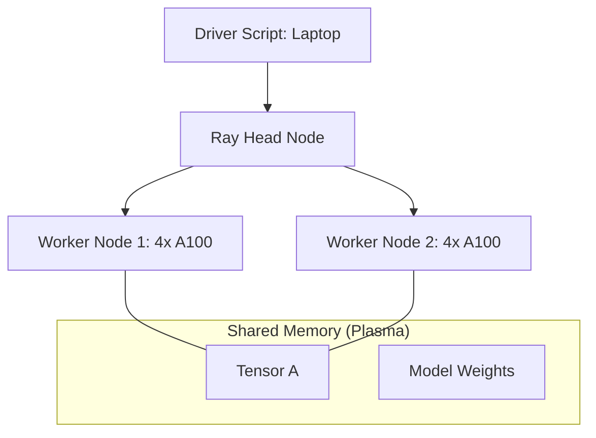

# 💠 Ray & Dask: The Engines of Distributed Python
> **Level:** Advanced | **Language:** Hinglish | **Goal:** Master the two leading frameworks for scaling Python and AI workloads, exploring Task Scheduling, Actors, Distributed Dataframes, and the 2026 strategies for building scalable AI backends.

---

## 🧭 1. Beginner-Friendly Hinglish Explanation
Python akele "Single-core" language hai. Wo ek waqt mein ek hi kaam ache se kar sakta hai. 

- **The Problem:** Maan lo aapko 1 Lakh images ko resize karna hai aur unka embedding nikalna hai. Agar aap normal Python script likhenge, toh ye pura din lega. 
- Aapke paas 4 Servers hain jinme 32 cores hain. Aap chahte hain ki Python in sabhi cores ko ek saath use kare.

**Ray** aur **Dask** iska solution hain. 
1. **Ray:** Ye "AI-First" hai. Ye GPUs ko manage karne, Models ko serve karne (Ray Serve), aur complex AI pipelines banane ke liye best hai.
2. **Dask:** Ye "Data-First" hai. Ye **Pandas** aur **NumPy** ko hazaron servers par "Stretch" kar deta hai. 

2026 mein, agar aapko "Large Scale Data Processing" ya "Massive AI Inference" karni hai, toh Ray aapka sabse bada dost hai.

---

## 🧠 2. Deep Technical Explanation
Ray and Dask provide a unified interface to scale Python code from a laptop to a thousand nodes.

### 1. Ray (The OS for AI):
- **Core Concept:** **Tasks** (Stateless functions) and **Actors** (Stateful classes).
- **Ray Data:** Specialized for high-performance ML data loading (shuffling, preprocessing).
- **Ray Train:** A wrapper around PyTorch/TensorFlow for easy distributed training.
- **Ray Serve:** A scalable model serving library that handles replicas and autoscaling.

### 2. Dask (Distributed NumPy/Pandas):
- **Core Concept:** **Graphs.** Dask creates a DAG of your operations and only executes them when you call `.compute()`.
- **Dask Dataframe:** Looks exactly like Pandas but splits the data into "Chunks" across different workers.
- **Dynamic Scheduling:** Dask is great for "Task Parallelism" where each task might take a different amount of time.

### 3. The Global Control Store (GCS):
- Ray uses a GCS to keep track of where every "Object" (Tensor, Variable) is located in the cluster. This allows for "Zero-copy" data sharing between tasks on the same node.

---

## 🏗️ 3. Ray vs. Dask
| Feature | Ray | Dask |
| :--- | :--- | :--- |
| **Philosophy** | **Task & Actor based (General Purpose)**| **Dataframe & Array based (Data Science)** |
| **GPU Support** | **First-class / Superior** | Moderate |
| **Model Serving**| **Excellent (Ray Serve)** | Basic |
| **Data Processing**| Ray Data (Fast for ML) | **Dask Dataframe (Standard for Big Data)** |
| **Community** | **AI Engineering / OpenAI** | Data Science / Scientific Python |

---

## 📐 4. Mathematical Intuition
- **Object Serialization (Pickle vs. Plasma):** 
  When you send a 1GB tensor from Worker A to Worker B, Python's `pickle` is slow. 
  Ray uses **Apache Arrow / Plasma** to store objects in "Shared Memory." 
  **The Math:** If $T_{serialize} + T_{network} > T_{compute}$, distributed processing is a waste. Ray minimizes $T_{serialize}$ to $O(1)$ on the same node.

---

## 📊 5. Ray Cluster Architecture (Diagram)


---

## 💻 6. Production-Ready Examples (Scaling a Function with Ray)
```python
# 2026 Pro-Tip: Use @ray.remote to make any function distributed.

import ray

# 1. Initialize Ray (Automatic cluster detection)
ray.init()

@ray.remote(num_gpus=1) # Reserve 1 GPU for this task
def generate_embedding(text):
    # Imagine calling a model here
    return f"Vector for {text}"

# 2. Launch 1000 tasks in parallel
# Notice: This returns 'Object Refs' immediately (Non-blocking)
futures = [generate_embedding.remote(f"Doc {i}") for i in range(1000)]

# 3. Get the results
results = ray.get(futures)
print(f"Processed {len(results)} docs! 🚀")
```

---

## ❌ 7. Failure Cases
- **Over-scheduling:** Trying to run 10,000 tasks that each take only $0.001$s. The "Overhead" of Ray managing these tasks will be more than the actual work. **Fix: Use 'Batching'.**
- **Object Store Full:** Putting too many giant tensors in memory without deleting them. Ray will start "Spilling" to disk, which is $100x$ slower.
- **Serialization Error:** Trying to send a "Non-picklable" object (like a Database connection) across the network.

---

## 🛠️ 8. Debugging Guide
- **Symptom:** "One worker is at 100% CPU, others are at 0%."
- **Check:** **Data Partitioning**. Are you sending all the work to one ID? Use `ray.wait()` to handle results as they finish.
- **Symptom:** "Inference is slow."
- **Check:** **Ray Dashboard**. Look at the "Node View." Are your GPUs being used, or is the CPU bottlenecked on "Preprocessing"?

---

## ⚖️ 9. Tradeoffs
- **Dask's Familiarity vs. Ray's Power:** Dask is easier if you already know Pandas. Ray is better if you are building a custom AI application.
- **Centralized vs. De-centralized Scheduler:** Ray's scheduler is faster for millions of small tasks.

---

## 🛡️ 10. Security Concerns
- **Remote Code Execution:** If your Ray cluster is open to the internet, anyone can run `ray.remote` commands and take over your servers. **Always use a VPN or internal network.**

---

## 📈 11. Scaling Challenges
- **The 'Large Object' bottleneck:** Sending a 10GB model weights file to 100 nodes simultaneously. **Solution: Use 'P2P Object Transfer' (Ray 2.x feature).**

---

## 💸 12. Cost Considerations
- **Autoscaling:** Ray can automatically add "Spot Instances" to your cluster when the queue is long. This can save **$70\%+$** on training costs.

---

## ✅ 13. Best Practices
- **Use Actors for Model Serving:** Actors keep the model in VRAM, so you don't reload it for every request.
- **Prefer `ray.wait` over `ray.get`:** Process results as they come in instead of waiting for the "Slowest" task to finish.
- **Profile with Ray Dashboard:** It provides a beautiful visual timeline of your tasks.

---

## ⚠️ 14. Common Mistakes
- **Nested `ray.get`:** Calling `ray.get()` inside a `ray.remote` function. This causes "Deadlocks" where workers wait for each other forever.
- **Too many small tasks:** Group them into batches of 100-500.

---

## 📝 15. Interview Questions
1. **"What is the difference between a Task and an Actor in Ray?"**
2. **"How does Ray handle 'Zero-copy' object sharing?"**
3. **"When would you choose Dask over Ray for a data science project?"**

---

## 🚀 15. Latest 2026 Industry Patterns
- **KubeRay:** The official way to run Ray on Kubernetes, now the standard for 2026 AI infrastructure.
- **Ray LLM:** Specialized libraries for serving Llama-3 and Mistral with "Continuous Batching" built directly into Ray Serve.
- **Anyscale:** The managed cloud version of Ray, which handles the "Hard parts" of cluster management automatically.
