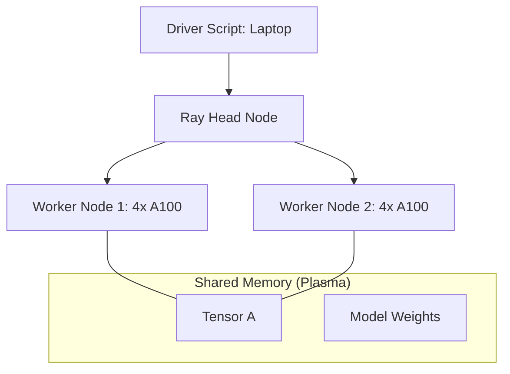

# 💠 Ray & Dask: The Engines of Distributed Python
> **Level:** Advanced | **Language:** Hinglish | **Goal:** Python aur AI workloads ko scale karne ke do leading frameworks ko master karein, Task Scheduling, Actors, Distributed Dataframes, aur 2026 mein scalable AI backends build karne ki strategies ko explore karte hue.

---

## 🧭 1. Beginner-Friendly Hinglish Explanation
Python akele "Single-core" language hai. Wo ek waqt mein ek hi kaam ache se kar sakta hai. 

- **The Problem:** Maan lo aapko 1 Lakh images ko resize karna hai aur unka embedding nikalna hai. Agar aap normal Python script likhenge, toh ye pura din lega. 
- Aapke paas 4 Servers hain jinme 32 cores hain. Aap chahte hain ki Python in sabhi cores ko ek saath use kare.

**Ray** aur **Dask** iska solution hain. 
1. **Ray:** Ye "AI-First" hai. Ye GPUs ko manage karne, Models ko serve karne (Ray Serve), aur complex AI pipelines banane ke liye best hai.
2. **Dask:** Ye "Data-First" hai. Ye **Pandas** aur **NumPy** ko hazaron servers par "Stretch" kar deta hai. 

2026 mein, agar aapko "Large Scale Data Processing" ya "Massive AI Inference" karni hai, toh Ray aapka sabse bada dost hai.

---

## 🧠 2. Deep Technical Explanation
Ray aur Dask Python code ko ek laptop se lekar ek hazaar nodes tak scale karne ke liye ek unified interface provide karte hain.

### 1. Ray (The OS for AI):
- **Core Concept:** **Tasks** (Stateless functions) aur **Actors** (Stateful classes).
- **Ray Data:** High-performance ML data loading (shuffling, preprocessing) ke liye specialized hai.
- **Ray Train:** Aasan distributed training ke liye PyTorch/TensorFlow ke upar ek wrapper hai.
- **Ray Serve:** Ek scalable model serving library jo replicas aur autoscaling ko handle karti hai.

### 2. Dask (Distributed NumPy/Pandas):
- **Core Concept:** **Graphs.** Dask aapke operations ka ek DAG create karta hai aur unhe tabhi execute karta hai jab aap `.compute()` call karte hain.
- **Dask Dataframe:** Yeh bilkul Pandas jaisa dikhta hai par data ko different workers ke beech "Chunks" mein split kar deta hai.
- **Dynamic Scheduling:** Dask "Task Parallelism" ke liye bahut accha hai jahan har task alag-alag time le sakta hai.

### 3. The Global Control Store (GCS):
- Ray cluster mein har "Object" (Tensor, Variable) ki location ko track karne ke liye GCS ka use karta hai. Yeh same node par tasks ke beech "Zero-copy" data sharing ko allow karta hai.

---

## 🏗️ 3. Ray vs. Dask
| Feature | Ray | Dask |
| :--- | :--- | :--- |
| **Philosophy** | **Task & Actor based (General Purpose)**| **Dataframe & Array based (Data Science)** |
| **GPU Support** | **First-class / Superior** | Moderate (Theek-thaak) |
| **Model Serving**| **Excellent (Ray Serve)** | Basic |
| **Data Processing**| Ray Data (ML ke liye fast) | **Dask Dataframe (Big Data ke liye standard)** |
| **Community** | **AI Engineering / OpenAI** | Data Science / Scientific Python |

---

## 📐 4. Mathematical Intuition
- **Object Serialization (Pickle vs. Plasma):** 
  Jab aap Worker A se Worker B ko 1GB ka tensor send karte hain, toh Python ka `pickle` slow hota hai. 
  Ray objects ko "Shared Memory" mein store karne ke liye **Apache Arrow / Plasma** ka use karta hai. 
  **The Math:** Agar $T_{serialize} + T_{network} > T_{compute}$ hai, toh distributed processing waste hai. Ray same node par $T_{serialize}$ ko $O(1)$ tak minimize kar deta hai.

---

## 📊 5. Ray Cluster Architecture (Diagram)

```mermaid
graph TD
    Driver[Driver Script: Laptop] --> Head[Ray Head Node]
    Head --> Worker1[Worker Node 1: 4x A100]
    Head --> Worker2[Worker Node 2: 4x A100]
    
    subgraph "Shared Memory (Plasma)"
    Obj1[Tensor A]
    Obj2[Model Weights]
    end
    
    Worker1 --- Obj1
    Worker2 --- Obj1
```

---

## 💻 6. Production-Ready Examples (Scaling a Function with Ray)
```python
# 2026 Pro-Tip: Kisi bhi function ko distributed banane ke liye @ray.remote ka use karein.

import ray

# 1. Ray ko initialize karein (Automatic cluster detection)
ray.init()

@ray.remote(num_gpus=1) # Is task ke liye 1 GPU reserve karein
def generate_embedding(text):
    # Socho ki yahan ek model call ho raha hai
    return f"Vector for {text}"

# 2. Parallel mein 1000 tasks launch karein
# Note: Yeh turant 'Object Refs' return karta hai (Non-blocking)
futures = [generate_embedding.remote(f"Doc {i}") for i in range(1000)]

# 3. Results get karein
results = ray.get(futures)
print(f"Processed {len(results)} docs! 🚀")
```

---

## ❌ 7. Failure Cases
- **Over-scheduling:** Aise 10,000 tasks run karne ki koshish karna jo sirf $0.001$s lete hain. In tasks ko manage karne ka Ray ka "Overhead" actual kaam se zyada ho jayega. **Fix: 'Batching' ka use karein.**
- **Object Store Full:** Memory mein bina delete kiye bahut saare giant tensors daal dena. Ray disk par "Spilling" start kar dega, jo $100x$ slow hota hai.
- **Serialization Error:** Network par kisi "Non-picklable" object (jaise Database connection) ko send karne ki koshish karna.

---

## 🛠️ 8. Debugging Guide
- **Symptom:** "Ek worker 100% CPU par hai, baaki saare 0% par hain."
- **Check:** **Data Partitioning**. Kya aap sara kaam ek hi ID ko bhej rahe hain? Jaise-jaise results finish ho rahe hain, unhe handle karne ke liye `ray.wait()` ka use karein.
- **Symptom:** "Inference slow hai."
- **Check:** **Ray Dashboard**. "Node View" ko dekhein. Kya aapke GPUs use ho rahe hain, ya fir CPU "Preprocessing" par bottlenecked hai?

---

## ⚖️ 9. Tradeoffs
- **Dask's Familiarity vs. Ray's Power:** Agar aap pehle se Pandas jaante hain toh Dask aasan hai. Agar aap custom AI application bana rahe hain toh Ray zyada behtar hai.
- **Centralized vs. De-centralized Scheduler:** Millions of small tasks ke liye Ray ka scheduler fast hota hai.

---

## 🛡️ 10. Security Concerns
- **Remote Code Execution:** Agar aapka Ray cluster internet ke liye open hai, toh koi bhi `ray.remote` commands run karke aapke servers ka control le sakta hai. **Hamesha VPN ya internal network ka use karein.**

---

## 📈 11. Scaling Challenges
- **The 'Large Object' bottleneck:** Ek sath 100 nodes ko 10GB ki model weights file send karna. **Solution: 'P2P Object Transfer' (Ray 2.x feature) ka use karein.**

---

## 💸 12. Cost Considerations
- **Autoscaling:** Queue lambi hone par Ray automatically aapke cluster mein "Spot Instances" add kar sakta hai. Yeh training costs par **$70\%+$** tak save kar sakta hai.

---

## ✅ 13. Best Practices
- **Model Serving ke liye Actors use karein:** Actors model ko VRAM mein rakhte hain, isliye aapko har request ke liye use dobara load nahi karna padta.
- **`ray.get` ke bajaye `ray.wait` ko prefer karein:** "Slowest" task ke finish hone ka wait karne ke bajaye, results ke aate hi unhe process karein.
- **Ray Dashboard ke saath profile karein:** Yeh aapke tasks ka ek sundar aur clear visual timeline provide karta hai.

---

## ⚠️ 14. Common Mistakes
- **Nested `ray.get`:** Kisi `ray.remote` function ke andar `ray.get()` call karna. Isse "Deadlocks" hote hain jahan workers ek dusre ka forever wait karte hain.
- **Too many small tasks:** Unhe 100-500 ke batches mein group karein.

---

## 📝 15. Interview Questions
1. **"Ray mein Task aur Actor ke beech kya difference hai?"**
2. **"Ray 'Zero-copy' object sharing ko kaise handle karta hai?"**
3. **"Aap data science project ke liye Ray ke upar Dask ko kab choose karenge?"**

---

## 🚀 15. Latest 2026 Industry Patterns
- **KubeRay:** Kubernetes par Ray run karne ka official tareeqa, jo ab 2026 AI infrastructure ke liye standard ban chuka hai.
- **Ray LLM:** Llama-3 aur Mistral ko serve karne ke liye specialized libraries jo directly Ray Serve mein "Continuous Batching" ke sath aati hain.
- **Anyscale:** Ray ka managed cloud version, jo cluster management ke "Hard parts" ko automatically handle karta hai.
