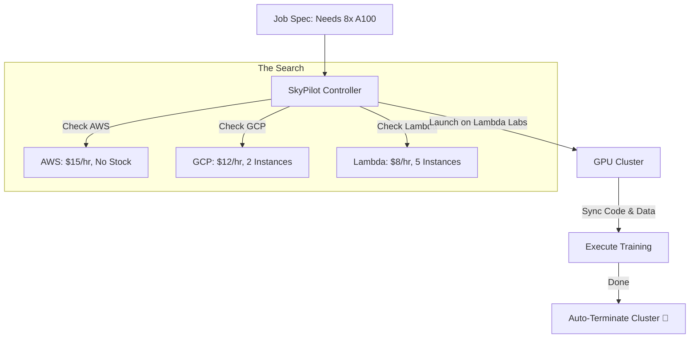

# 🚁 SkyPilot: The Inter-Cloud Navigator
> **Level:** Advanced | **Language:** Hinglish | **Goal:** Master the art of running AI jobs on the cheapest and most available GPUs across all cloud providers, exploring Cost Optimization, Auto-failover, and the 2026 strategies for "Cloud-Agnostic" AI infrastructure.

---

## 🧭 1. Beginner-Friendly Hinglish Explanation
Aaj ke waqt mein GPUs ki bahut "Kallat" (Scarcity) hai. Kabhi AWS par H100s nahi milte, toh kabhi Google Cloud bahut mahanga hota hai.

- **The Problem:** Ek engineer ko har cloud ka "Console" seekhna padta hai, har jagah SSH keys set karni padti hain, aur check karna padta hai ki kahan sasta mil raha hai.
- **SkyPilot** ek aisa tool hai jo in sab cloud providers ke upar ek "Layer" banata hai.
- Aap bas ek file likhte hain: *"Mujhe 8x H100 GPUs chahiye Llama-3 train karne ke liye."*
- SkyPilot apne aap AWS, GCP, Azure, aur Lambda Labs ko check karega.
  1. Jahan sasta hoga, wahan cluster start karega.
  2. Aapka code wahan bhejega.
  3. Training khatam hote hi cluster ko "Kill" kar dega (Stop).

2026 mein, professional AI engineers "Cloud Loyal" nahi hote, wo **"GPU Loyal"** hote hain. SkyPilot aapko wahi azadi deta hai.

---

## 🧠 2. Deep Technical Explanation
SkyPilot is an open-source framework for running ML and data science workloads on any cloud.

### 1. The Resource Optimizer:
- SkyPilot maintains a real-time "Price and Availability Catalog" for 10+ cloud providers. 
- When you submit a task, it calculates the **Minimal Cost** considering GPU price, region, and data transfer costs.

### 2. Managed Spot (The Money Saver):
- It can run jobs on **Spot Instances** (which are $70-90\%$ cheaper).
- If your spot instance is "Preempted" (taken back by the cloud), SkyPilot automatically:
  1. Finds another cloud/region.
  2. Resumes your training from the last checkpoint.
  3. All this with ZERO human intervention.

### 3. Unified CLI/API:
- You use the same commands (`sky launch`, `sky status`, `sky stop`) regardless of which cloud you are using.

---

## 🏗️ 3. SkyPilot vs. Kubernetes
| Feature | SkyPilot | Kubernetes (K8s) |
| :--- | :--- | :--- |
| **Philosophy** | **Job-centric (Run & Stop)** | Service-centric (Always on) |
| **Cloud** | **Multi-Cloud (AWS+GCP+Azure)** | Usually Single Cluster |
| **Complexity** | **Very Low (Simple YAML)** | High |
| **Autoscaling** | Based on Job requirements | Based on CPU/RAM metrics |
| **Best For** | Training / Batch Inference | Live Web APIs / Microservices |

---

## 📐 4. Mathematical Intuition
- **The Global Cost Minimization:** 
  $$\text{Minimize } C = \sum (Rate_{provider, gpu} \times Time) + \text{Data}_{egress} + \text{Setup}_{time}$$
  SkyPilot solves this optimization problem every time you run `sky launch`. It often finds that a "Cheaper GPU" in a "Different Region" is better even after considering the data transfer cost.

---

## 📊 5. SkyPilot Workflow (Diagram)


---

## 💻 6. Production-Ready Examples (A SkyPilot YAML for Llama-3)
```yaml
# 2026 Pro-Tip: Use 'Managed Spot' to train models at 1/10th the cost.

name: llama3-finetune

resources:
  accelerators: A100:8  # Need 8x A100s
  cloud: lambda         # Prefer Lambda Labs (Cheaper)
  use_spot: true        # Use Spot to save 80%

setup: |
  conda create -n llama python=3.10 -y
  conda activate llama
  pip install torch transformers datasets

run: |
  conda activate llama
  python train.py --model llama-3-8b --dataset /data/my_data.jsonl

# Run with: sky launch -c my-cluster llama.yaml
```

---

## ❌ 7. Failure Cases
- **Data Locality:** Your 10TB dataset is in an AWS S3 bucket in 'Mumbai', but SkyPilot finds a cheap GPU in 'Europe'. Downloading the data will take 2 days and cost thousands in "Egress fees." **Fix: Use `sky storage` to manage data efficiently.**
- **Interconnect Performance:** A multi-node job on Lambda Labs might be slower than on AWS because Lambda's inter-node network is not as fast as AWS InfiniBand.
- **Quota Failures:** SkyPilot tries to launch on GCP, but your GCP account has 0 GPU quota.

---

## 🛠️ 8. Debugging Guide
- **Symptom:** "Job is stuck in 'Finding Resources'."
- **Check:** `sky show-gpus`. It will show which clouds have the GPUs you want. You might need to be less specific (e.g., instead of `A100-80GB`, just ask for `A100`).
- **Symptom:** "Connection Timeout."
- **Check:** **Cloud Credentials**. Ensure you have run `aws configure` or `gcloud auth` on your machine.

---

## ⚖️ 9. Tradeoffs
- **Cost vs. Stability:** Spot instances are cheap but can crash. If your training doesn't have "Auto-checkpointing," you will lose all progress.
- **Abstraction vs. Control:** SkyPilot hides the cloud-specific details. If you need a very specific VPC or Network config, you might need to "Dive deep" into the cloud-specific flags.

---

## 🛡️ 10. Security Concerns
- **Key Management:** SkyPilot stores SSH keys on your local machine to talk to the clouds. **Ensure your `~/.sky` folder is protected.**

---

## 📈 11. Scaling Challenges
- **Massive Clusters:** Launching 1000 GPUs across multiple clouds to train a "Sovereign AI." This is the peak of 2026 AI engineering.

---

## 💸 12. Cost Considerations
- **Egress costs:** The "Invisible Killer." SkyPilot now has a feature to warn you if moving your data to a cheap cloud will cost more than the GPU savings.

---

## ✅ 13. Best Practices
- **Enable 'Auto-down':** Always use the `--down` flag (`sky launch --down`) so the cluster is deleted the moment the job finishes. No more "Surprise" $\$2000$ bills!
- **Use `sky storage`:** It automatically creates buckets and syncs data to whichever cloud your job ends up on.
- **Keep a 'Sky Control Plane':** Run a small server that monitors all your SkyPilot jobs across all clouds.

---

## ⚠️ 14. Common Mistakes
- **Forgetting to Checkpoint:** Running a 24-hour job on a spot instance without saving weights every hour.
- **Ignoring Quotas:** Assuming you have H100 access just because you have an AWS account.

---

## 📝 15. Interview Questions
1. **"What is the 'GPU Scarcity' problem and how does SkyPilot solve it?"**
2. **"Explain how Managed Spot instances handle preemption."**
3. **"What are the three main components of a SkyPilot YAML?"** (Resources, Setup, Run).

---

## 🚀 15. Latest 2026 Industry Patterns
- **SkyServe:** A new feature to serve models across multiple clouds for "High Availability." If AWS goes down, your AI stays up on GCP.
- **Green AI Routing:** SkyPilot choosing the datacenter that is currently running on "Solar" or "Wind" energy to reduce your AI's carbon footprint.
- **Local + Cloud Hybrid:** SkyPilot using your local RTX 4090 for "Testing" and then automatically moving to an H100 in the cloud for "Full Training."
