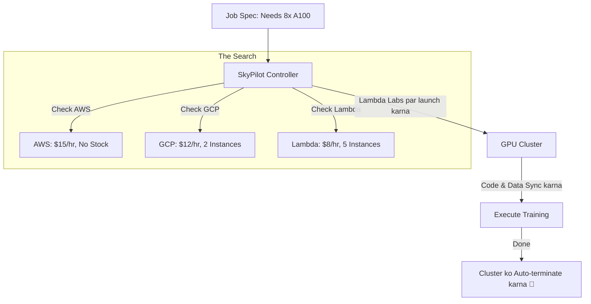

# 🚁 SkyPilot: The Inter-Cloud Navigator
> **Level:** Advanced | **Language:** Hinglish | **Goal:** Sabse cheap aur easily available GPUs par alag-alag cloud providers par AI jobs run karne ki art ko master karein, Cost Optimization, Auto-failover, aur 2026 mein "Cloud-Agnostic" AI infrastructure ki strategies ko explore karte hue.

---

## 🧭 1. Beginner-Friendly Hinglish Explanation
Aaj ke waqt mein GPUs ki bahut "Kallat" (Scarcity) hai. Kabhi AWS par H100s nahi milte, toh kabhi Google Cloud bahut mahanga hota hai.

- **The Problem:** Ek engineer ko har cloud ka "Console" seekhna padta hai, har jagah SSH keys set karni padti hain, aur check karna padta hai ki kahan sasta mil raha hai.
- **SkyPilot** ek aisa tool hai jo in sab cloud providers ke upar ek "Layer" banata hai.
- Aap bas ek file likhte hain: *"Mujhe 8x H100 GPUs chahiye Llama-3 train karne ke liye."*
- SkyPilot apne aap AWS, GCP, Azure, aur Lambda Labs ko check karega.
  1. Jahan sasta hoga, wahan cluster start karega.
  2. Aapka code wahan bhejega.
  3. Training khatam hote hi cluster ko "Kill" kar dega (Stop).

2026 mein, professional AI engineers "Cloud Loyal" nahi hote, wo **"GPU Loyal"** hote hain. SkyPilot aapko wahi azadi deta hai.

---

## 🧠 2. Deep Technical Explanation
SkyPilot kisi bhi cloud par ML aur data science workloads ko run karne ke liye ek open-source framework hai.

### 1. The Resource Optimizer:
- SkyPilot 10+ cloud providers ke liye ek real-time "Price and Availability Catalog" maintain karta hai. 
- Jab aap koi task submit karte hain, toh yeh GPU price, region, aur data transfer costs ko consider karke **Minimal Cost** calculate karta hai.

### 2. Managed Spot (The Money Saver):
- Yeh **Spot Instances** (jo ki $70-90\%$ sasti hoti hain) par jobs ko run kar sakta hai.
- Agar aapka spot instance "Preempted" (cloud dwara wapas le liya) ho jata hai, toh SkyPilot automatically:
  1. Ek dusra cloud/region dhoondhta hai.
  2. Last checkpoint se aapki training ko resume karta hai.
  3. Yeh sab bina kisi human intervention (ZERO human intervention) ke hota hai.

### 3. Unified CLI/API:
- Aap same commands (`sky launch`, `sky status`, `sky stop`) ka use karte hain, chahe aap kisi bhi cloud ka use kar rahe hon.

---

## 🏗️ 3. SkyPilot vs. Kubernetes
| Feature | SkyPilot | Kubernetes (K8s) |
| :--- | :--- | :--- |
| **Philosophy** | **Job-centric (Run & Stop)** | Service-centric (Always on) |
| **Cloud** | **Multi-Cloud (AWS+GCP+Azure)** | Usually Single Cluster |
| **Complexity** | **Very Low (Bahut aasan YAML)** | High |
| **Autoscaling** | Job requirements ke basis par | CPU/RAM metrics ke basis par |
| **Best For** | Training / Batch Inference | Live Web APIs / Microservices |

---

## 📐 4. Mathematical Intuition
- **The Global Cost Minimization:** 
  $$\text{Minimize } C = \sum (Rate_{provider, gpu} \times Time) + \text{Data}_{egress} + \text{Setup}_{time}$$
  SkyPilot jab bhi aap `sky launch` run karte hain, tab is optimization problem ko solve karta hai. Yeh aksar pata lagata hai ki ek "Cheaper GPU" jo kisi "Different Region" mein hai, data transfer cost ko consider karne ke baad bhi better deal hai.

---

## 📊 5. SkyPilot Workflow (Diagram)

```mermaid
graph TD
    YAML[Job Spec: Needs 8x A100] --> Sky[SkyPilot Controller]
    
    subgraph "The Search"
    Sky -- "Check AWS" --> A[AWS: $15/hr, No Stock]
    Sky -- "Check GCP" --> B[GCP: $12/hr, 2 Instances]
    Sky -- "Check Lambda" --> C[Lambda: $8/hr, 5 Instances]
    end
    
    Sky -- "Lambda Labs par launch karna" --> Cluster[GPU Cluster]
    Cluster -- "Code & Data Sync karna" --> Run[Execute Training]
    Run -- "Done" --> Terminate[Cluster ko Auto-terminate karna 💸]
```

---

## 💻 6. Production-Ready Examples (A SkyPilot YAML for Llama-3)
```yaml
# 2026 Pro-Tip: 1/10th cost par models ko train karne ke liye 'Managed Spot' ka use karein.

name: llama3-finetune

resources:
  accelerators: A100:8  # 8x A100s chahiye
  cloud: lambda         # Lambda Labs ko prefer karein (Sasta)
  use_spot: true        # 80% save karne ke liye Spot use karein

setup: |
  conda create -n llama python=3.10 -y
  conda activate llama
  pip install torch transformers datasets

run: |
  conda activate llama
  python train.py --model llama-3-8b --dataset /data/my_data.jsonl

# Run with: sky launch -c my-cluster llama.yaml
```

---

## ❌ 7. Failure Cases
- **Data Locality:** Aapka 10TB ka dataset 'Mumbai' ke AWS S3 bucket mein hai, par SkyPilot ko 'Europe' mein ek cheap GPU milta hai. Data download karne mein 2 din lagenge aur hazaron dollars ki "Egress fees" lagegi. **Fix: Data ko efficiently manage karne ke liye `sky storage` ka use karein.**
- **Interconnect Performance:** Lambda Labs par ek multi-node job AWS ke mukable slow ho sakta hai kyunki Lambda ka inter-node network AWS InfiniBand jitna fast nahi hai.
- **Quota Failures:** SkyPilot GCP par launch karne ki koshish karta hai, par aapke GCP account ka GPU quota 0 hai.

---

## 🛠️ 8. Debugging Guide
- **Symptom:** "Job 'Finding Resources' mein stuck (atkaa) hai."
- **Check:** `sky show-gpus` run karein. Yeh dikhayega ki kis cloud ke paas aapke chahite GPUs hain. Aapko thoda kam specific hona pad sakta hai (jaise, `A100-80GB` ke bajaye sirf `A100` maangein).
- **Symptom:** "Connection Timeout."
- **Check:** **Cloud Credentials**. Ensure karein ki aapne apni machine par `aws configure` ya `gcloud auth` run kiya hai.

---

## ⚖️ 9. Tradeoffs
- **Cost vs. Stability:** Spot instances sasti hoti hain par crash ho sakti hain. Agar aapki training mein "Auto-checkpointing" nahi hai, toh aap apni saari progress kho denge.
- **Abstraction vs. Control:** SkyPilot cloud-specific details ko hide karta hai. Agar aapko koi specific VPC ya Network config chahiye, toh aapko cloud-specific flags mein "Dive deep" (gehrai mein jana) karna hoga.

---

## 🛡️ 10. Security Concerns
- **Key Management:** Clouds se baat karne ke liye SkyPilot aapki local machine par SSH keys store karta hai. **Ensure karein ki aapka `~/.sky` folder protected ho.**

---

## 📈 11. Scaling Challenges
- **Massive Clusters:** Ek "Sovereign AI" ko train karne ke liye multiple clouds par 1000 GPUs launch karna. Yeh 2026 AI engineering ka peak hai.

---

## 💸 12. Cost Considerations
- **Egress costs:** Yeh ek "Invisible Killer" hai. SkyPilot mein ab ek aisa feature hai jo aapko warn karega agar data ko cheap cloud par move karne ki cost GPU savings se zyada ho jati hai.

---

## ✅ 13. Best Practices
- **'Auto-down' enable karein:** Hamesha `--down` flag (`sky launch --down`) ka use karein taaki job khatam hote hi cluster delete ho jaye. Koi extra "Surprise" $\$2000$ bills nahi aayenge!
- **`sky storage` ka use karein:** Yeh automatically buckets create karta hai aur data ko us cloud par sync karta hai jahan aapka job end up (run) hota hai.
- **Ek 'Sky Control Plane' rakhein:** Ek chota server run karein jo sabhi clouds par aapke saare SkyPilot jobs ko monitor kare.

---

## ⚠️ 14. Common Mistakes
- **Checkpoint save karna bhool jana:** Bina har ghante weights save kiye kisi spot instance par 24-hour ka job run karna.
- **Quotas ko ignore karna:** Sirf isliye assume kar lena ki aapke paas H100 access hai kyunki aapke paas AWS account hai.

---

## 📝 15. Interview Questions
1. **"'GPU Scarcity' problem kya hai aur SkyPilot ise kaise solve karta hai?"**
2. **"Explain karein ki Managed Spot instances preemption ko kaise handle karti hain."**
3. **"SkyPilot YAML ke teen main components kya hain?"** (Resources, Setup, Run).

---

## 🚀 15. Latest 2026 Industry Patterns
- **SkyServe:** "High Availability" ke liye multiple clouds par models serve karne ka ek naya feature. Agar AWS down ho jaye, toh aapka AI GCP par active rahega.
- **Green AI Routing:** Apne AI ke carbon footprint ko reduce karne ke liye SkyPilot dwara us datacenter ko choose karna jo currently "Solar" ya "Wind" energy par chal raha ho.
- **Local + Cloud Hybrid:** SkyPilot "Testing" ke liye aapke local RTX 4090 ka use karta hai aur fir "Full Training" ke liye cloud mein H100 par automatically move ho jata hai.
