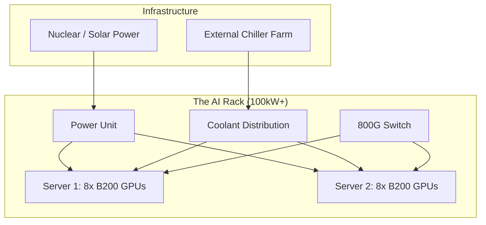

# 🏭 Data Centers & Clusters: The AI Powerhouses
> **Level:** Advanced | **Language:** Hinglish | **Goal:** Master the physical and logical architecture of AI Supercomputers, exploring Liquid Cooling, Power Density, Rack Design, and the 2026 strategies for building multi-megawatt AI clusters.

---

## 🧭 1. Beginner-Friendly Hinglish Explanation
AI model train karna "Software" ka kaam nahi, "Power Plant" ka kaam hai. 

- **The Problem:** Ek NVIDIA H100 chip utni hi bijli (Power) leti hai jitna ek chota "Ghar." Jab aap hazaron aisi chips ek saath lagate hain, toh wo itni "Garmi" (Heat) produce karti hain ki normal Air Conditioning (AC) fail ho jati hai.
- **Data Center** ek aisi jagah hai jahan in "Garam" machines ko thanda rakha jata hai aur unhe unlimited bijli di jati hai.

Ek **Cluster** ka matlab hai hazaron servers ka group jo "Ek saath" kaam karte hain.
1. **The Rack:** Ek almari jisme 8-10 servers hote hain.
2. **Cooling:** Ab AC nahi, balki "Paani" (Liquid Cooling) use hota hai jo direct chips ke upar se guzarta hai.
3. **Power:** In clusters ko chalane ke liye pura "Nuclear Power Plant" ya giant Solar farm chahiye hota hai.

2026 mein, AI engineer ko sirf code nahi, balki ye bhi samajhna padta hai ki unka model "Duniya ki bijli" kaise consume kar raha hai.

---

## 🧠 2. Deep Technical Explanation
AI clusters are high-density compute environments designed for maximum throughput.

### 1. Power Density (The KW/Rack Challenge):
- A standard IT rack uses $10-15$ kW.
- An AI rack with 8x NVIDIA B200 (Blackwell) servers can exceed **$100-120$ kW.**
- This requires special heavy-duty power cables and massive transformers.

### 2. Cooling Systems:
- **Air Cooling:** Uses giant fans. Inefficient for high-density AI.
- **DLC (Direct Liquid Cooling):** Cold plates are attached directly to the GPU. Water (or a special coolant) flows through them.
- **Immersion Cooling:** The entire server is dunked into a tub of "Non-conductive oil." (The future of 2026).

### 3. Cluster Interconnect (The 'East-West' Traffic):
- In AI clusters, $90\%$ of data movement is BETWEEN servers, not from the server to the internet. 
- This requires a "Flat" network architecture using **Spine-Leaf** topology so that any GPU can talk to any other GPU with minimal "Hops."

### 4. The 2026 Sovereign AI Trend:
- Countries (like Saudi Arabia, France, India) building their own "National AI Supercomputers" to avoid dependence on US-based clouds.

---

## 🏗️ 3. Data Center components
| Component | Function | 2026 Standard |
| :--- | :--- | :--- |
| **PDU** | Power Distribution Unit | High-voltage DC (to reduce loss) |
| **CDU** | Coolant Distribution Unit | Manages the liquid flow |
| **GPU Node** | The Compute unit | NVIDIA HGX / AMD Instinct / TPU |
| **InfiniBand Switch**| The Nervous System | 800Gbps NDR |
| **NVMe Storage** | The Memory | PB-scale All-Flash arrays |

---

## 📐 4. Mathematical Intuition
- **PUE (Power Usage Effectiveness):** 
  How much energy is wasted?
  $$\text{PUE} = \frac{\text{Total Facility Power}}{\text{IT Equipment Power}}$$
  - **Ideal PUE:** $1.0$ (Zero waste).
  - **Good AI DC:** $1.1 - 1.2$.
  - If PUE is $2.0$, it means for every 1 Watt the GPU uses, you spend another 1 Watt just to keep it cool. **Expensive!**

---

## 📊 5. AI Rack Architecture (Diagram)


---

## 💻 6. Production-Ready Examples (Monitoring Cluster PUE with Prometheus/Grafana)
```markdown
# 2026 Pro-Tip: Monitor your 'Power Metrics' alongside your 'Accuracy Metrics'.

# Typical PromQL Query for PUE:
(facility_total_power_kw) / (sum(node_gpu_power_usage_kw))

# Goal: If PUE > 1.5, alert the hardware team. 
# High PUE = Cooling failure or inefficient airflow.
```

---

## ❌ 7. Failure Cases
- **Thermal Throttling:** The GPU gets too hot and automatically slows down to $10\%$ speed to prevent melting. Your training time triples.
- **Power Sag:** When 10,000 GPUs start a "Forward Pass" simultaneously, they cause a sudden "Spike" in power demand. If the DC grid is weak, the whole building can go dark. **Fix: Use giant 'Battery Buffers'.**
- **Condensation:** Liquid cooling pipes are too cold, and water starts "Dripping" from the air onto the circuits. **Short circuit!**

---

## 🛠️ 8. Debugging Guide
- **Symptom:** "Random nodes are rebooting during heavy training."
- **Check:** **PDU Load**. Are you pulling too much current from a single circuit?
- **Symptom:** "GPU 4 is consistently 20°C hotter than GPU 0."
- **Check:** **Airflow/Liquid Flow**. Is there a blockage in the cooling tube or a "Dead zone" in the rack's airflow?

---

## ⚖️ 9. Tradeoffs
- **Edge DC vs. Core DC:** 
  - Core DC (Huge) is cheaper but has high latency to users. 
  - Edge DC (Small, in cities) has low latency but is $3x$ more expensive to run.
- **Cloud vs. Build-your-own:** Building a 1000-GPU DC takes 18 months. Renting on Cloud takes 10 minutes.

---

## 🛡️ 10. Security Concerns
- **Physical Access:** Someone putting a "USB Sniffer" on the internal InfiniBand network to steal the model weights as they are being synced. **Use 'Biometric Racks' and 'Encrypted Networking'.**

---

## 📈 11. Scaling Challenges
- **The 'Grid' Limit:** You want to build a 500MW data center, but the city's electricity grid can only provide 50MW. **Solution: Build your own Power Plant (The Microsoft/OpenAI 'Stargate' approach).**

---

## 💸 12. Cost Considerations
- **Electricity Bill:** For a 10,000 H100 cluster, the monthly electricity bill can exceed **$\$5,000,000$**.

---

## ✅ 13. Best Practices
- **Implement 'Hot-Aisle/Cold-Aisle' Containment:** Don't let cold air and hot air mix.
- **Use 'Predictive Maintenance':** Use AI to predict when a fan or a cooling pump is about to fail before it actually does.
- **Design for 'Maintenance':** Ensure a technician can swap a dead GPU without shutting down the entire rack.

---

## ⚠️ 14. Common Mistakes
- **Underestimating Weight:** An AI rack can weigh $2000+$ kg. If your floor isn't "Reinforced," the rack will literally fall through the floor.
- **Using 'Cheap' Switches:** Using a $\$500$ Ethernet switch for a $\$2M$ GPU server.

---

## 📝 15. Interview Questions
1. **"What is PUE and why is it critical for AI sustainability?"**
2. **"Explain the difference between Air Cooling and Direct Liquid Cooling (DLC)."**
3. **"What is 'Rack Density' and how does it affect data center design?"**

---

## 🚀 15. Latest 2026 Industry Patterns
- **Nuclear AI Datacenters:** Tech giants buying nuclear power plants to ensure $100\%$ uptime for their "Artificial Super Intelligence" (ASI) training.
- **Underwater Datacenters:** Dunking clusters into the ocean for "Free" cooling.
- **AI-Native Buildings:** Racks that are built INTO the walls of the building to maximize heat dissipation.
