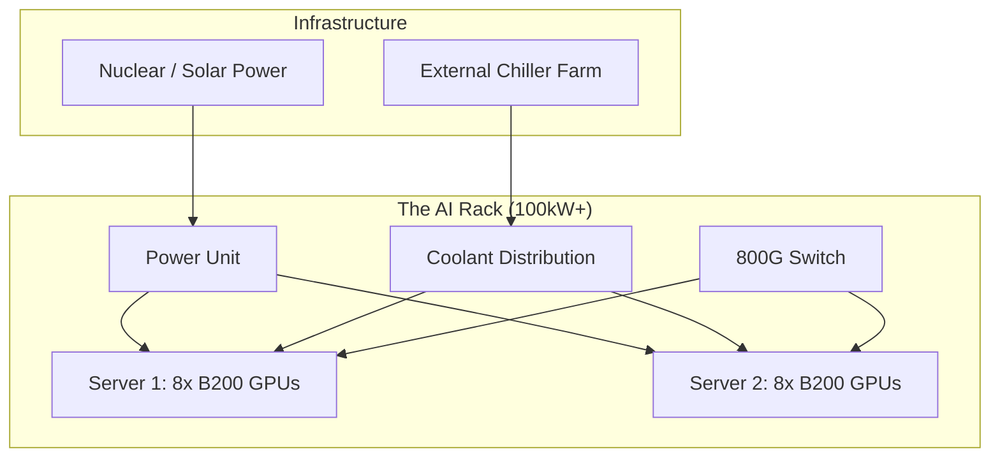

# 🏭 Data Centers & Clusters: The AI Powerhouses
> **Level:** Advanced | **Language:** Hinglish | **Goal:** AI Supercomputers ke physical aur logical architecture ko master karein, Liquid Cooling, Power Density, Rack Design, aur 2026 mein multi-megawatt AI clusters build karne ki strategies ko explore karte hue.

---

## 🧭 1. Beginner-Friendly Hinglish Explanation
AI model train karna "Software" ka kaam nahi, "Power Plant" ka kaam hai. 

- **The Problem:** Ek NVIDIA H100 chip utni hi bijli (Power) leti hai jitna ek chota "Ghar." Jab aap hazaron aisi chips ek saath lagate hain, toh wo itni "Garmi" (Heat) produce karti hain ki normal Air Conditioning (AC) fail ho jati hai.
- **Data Center** ek aisi jagah hai jahan in "Garam" machines ko thanda rakha jata hai aur unhe unlimited bijli di jati hai.

Ek **Cluster** ka matlab hai hazaron servers ka group jo "Ek saath" kaam karte hain.
1. **The Rack:** Ek almari jisme 8-10 servers hote hain.
2. **Cooling:** Ab AC nahi, balki "Paani" (Liquid Cooling) use hota hai jo direct chips ke upar se guzarta hai.
3. **Power:** In clusters ko chalane ke liye pura "Nuclear Power Plant" ya giant Solar farm chahiye hota hai.

2026 mein, AI engineer ko sirf code nahi, balki ye bhi samajhna padta hai ki unka model "Duniya ki bijli" kaise consume kar raha hai.

---

## 🧠 2. Deep Technical Explanation
AI clusters high-density compute environments hote hain jinhe maximum throughput ke liye design kiya jata hai.

### 1. Power Density (The KW/Rack Challenge):
- Ek standard IT rack $10-15$ kW use karta hai.
- 8x NVIDIA B200 (Blackwell) servers waala ek AI rack **$100-120$ kW** ko bhi exceed kar sakta hai.
- Iske liye special heavy-duty power cables aur massive transformers ki zaroorat hoti hai.

### 2. Cooling Systems:
- **Air Cooling:** Giant fans ka use karta hai. High-density AI ke liye inefficient hai.
- **DLC (Direct Liquid Cooling):** Cold plates ko directly GPU ke saath attach kiya jata hai. Water (ya ek special coolant) unke beech se flow karta hai.
- **Immersion Cooling:** Pure server ko "Non-conductive oil" ke tub mein dubo diya jata hai (Immersion). (Yeh 2026 ka future hai).

### 3. Cluster Interconnect (The 'East-West' Traffic):
- AI clusters mein, $90\%$ data movement servers ke BEECH mein hota hai, na ki server se internet ke beech. 
- Iske liye **Spine-Leaf** topology ka use karke ek "Flat" network architecture ki zaroorat hoti hai taaki koi bhi GPU kisi bhi dusre GPU se minimal "Hops" (steps) ke sath baat kar sake.

### 4. The 2026 Sovereign AI Trend:
- US-based clouds par dependence se bachne ke liye countries (jaise Saudi Arabia, France, India) apne khud ke "National AI Supercomputers" bana rahi hain.

---

## 🏗️ 3. Data Center components
| Component | Function | 2026 Standard |
| :--- | :--- | :--- |
| **PDU** | Power Distribution Unit | High-voltage DC (loss reduce karne ke liye) |
| **CDU** | Coolant Distribution Unit | Liquid flow ko manage karta hai |
| **GPU Node** | The Compute unit | NVIDIA HGX / AMD Instinct / TPU |
| **InfiniBand Switch**| The Nervous System | 800Gbps NDR |
| **NVMe Storage** | The Memory | PB-scale All-Flash arrays |

---

## 📐 4. Mathematical Intuition
- **PUE (Power Usage Effectiveness):** 
  Kitni energy waste ho rahi hai?
  $$\text{PUE} = \frac{\text{Total Facility Power}}{\text{IT Equipment Power}}$$
  - **Ideal PUE:** $1.0$ (Zero waste).
  - **Good AI DC:** $1.1 - 1.2$.
  - Agar PUE $2.0$ hai, toh iska matlab hai ki GPU jo bhi 1 Watt use karta hai, aap 1 Watt extra spend karte hain sirf use thanda rakhne ke liye. **Expensive!**

---

## 📊 5. AI Rack Architecture (Diagram)

```mermaid
graph TD
    subgraph "The AI Rack (100kW+)"
    PDU[Power Unit] --> S1[Server 1: 8x B200 GPUs]
    PDU --> S2[Server 2: 8x B200 GPUs]
    CDU[Coolant Distribution] --> S1 & S2
    IB[800G Switch] --> S1 & S2
    end
    
    subgraph "Infrastructure"
    Gen[Nuclear / Solar Power] --> PDU
    Chiller[External Chiller Farm] --> CDU
    end
```

---

## 💻 6. Production-Ready Examples (Monitoring Cluster PUE with Prometheus/Grafana)
```markdown
# 2026 Pro-Tip: Apne 'Power Metrics' ko bhi 'Accuracy Metrics' ke sath monitor karein.

# PUE ke liye typical PromQL Query:
(facility_total_power_kw) / (sum(node_gpu_power_usage_kw))

# Goal: Agar PUE > 1.5 ho, toh hardware team ko alert karein. 
# High PUE = Cooling failure ya inefficient airflow.
```

---

## ❌ 7. Failure Cases
- **Thermal Throttling:** GPU bahut garam ho jata hai aur melt hone se bachne ke liye automatically apni speed ko $10\%$ tak slow kar deta hai. Isse aapka training time triple ho jata hai.
- **Power Sag:** Jab 10,000 GPUs ek sath "Forward Pass" start karte hain, toh woh power demand mein ek sudden "Spike" (uchhal) cause karte hain. Agar DC grid weak hai, toh puri building mein andhera ho sakta hai. **Fix: Giant 'Battery Buffers' ka use karein.**
- **Condensation:** Liquid cooling pipes bahut thande hote hain, aur hawa se paani circuits par "Drip" (tapakna) karne lagta hai. **Short circuit!**

---

## 🛠️ 8. Debugging Guide
- **Symptom:** "Heavy training ke dauran random nodes reboot ho rahe hain."
- **Check:** **PDU Load**. Kya aap ek single circuit se bahut zyada current pull kar rahe hain?
- **Symptom:** "GPU 4 is consistently 20°C hotter than GPU 0."
- **Check:** **Airflow/Liquid Flow**. Kya cooling tube mein koi blockage hai ya rack ke airflow mein koi "Dead zone" hai?

---

## ⚖️ 9. Tradeoffs
- **Edge DC vs. Core DC:** 
  - Core DC (Bade waale) cheap hote hain par users ke liye high latency hoti hai. 
  - Edge DC (Chote waale, cities ke andar) mein low latency hoti hai par unhe run karna $3x$ zyada costly hota hai.
- **Cloud vs. Build-your-own:** Ek 1000-GPU DC banane mein 18 months lagte hain. Cloud par rent karne mein sirf 10 minutes lagte hain.

---

## 🛡️ 10. Security Concerns
- **Physical Access:** Koi internal InfiniBand network par "USB Sniffer" laga de taaki model weights jab sync ho rahe hon toh unhe steal kiya ja sake. **'Biometric Racks' aur 'Encrypted Networking' ka use karein.**

---

## 📈 11. Scaling Challenges
- **The 'Grid' Limit:** Aap ek 500MW ka data center banana chahte hain, par city ka electricity grid sirf 50MW hi de sakta hai. **Solution: Apna khud ka Power Plant banayein (Microsoft/OpenAI ka 'Stargate' approach).**

---

## 💸 12. Cost Considerations
- **Electricity Bill:** 10,000 H100 cluster ke liye, monthly electricity bill **$\$5,000,000$** se bhi exceed kar sakta hai.

---

## ✅ 13. Best Practices
- **'Hot-Aisle/Cold-Aisle' Containment implement karein:** Cold air aur hot air ko mix na hone dein.
- **'Predictive Maintenance' ka use karein:** AI ka use karke pehle hi predict karein ki kab koi fan ya cooling pump fail hone wala hai.
- **'Maintenance' ke liye design karein:** Ensure karein ki ek technician bina pure rack ko shut down kiye dead GPU ko swap kar sake.

---

## ⚠️ 14. Common Mistakes
- **Underestimating Weight:** Ek AI rack ka weight $2000+$ kg ho sakta hai. Agar aapka floor "Reinforced" (mazboot) nahi hai, toh rack floor ko tod kar niche gir jayega.
- **'Cheap' Switches use karna:** Ek $\$2M$ ke GPU server ke liye ek $\$500$ ka Ethernet switch use karna.

---

## 📝 15. Interview Questions
1. **"PUE kya hai aur AI sustainability ke liye yeh kyun critical hai?"**
2. **"Air Cooling aur Direct Liquid Cooling (DLC) ke beech difference explain karein."**
3. **"'Rack Density' kya hai aur yeh data center design ko kaise affect karti hai?"**

---

## 🚀 15. Latest 2026 Industry Patterns
- **Nuclear AI Datacenters:** Tech giants nuclear power plants kharid rahe hain taaki apne "Artificial Super Intelligence" (ASI) training ke liye $100\%$ uptime ensure kar sakein.
- **Underwater Datacenters:** "Free" cooling ke liye clusters ko ocean (samundar) mein daal dena.
- **AI-Native Buildings:** Heat dissipation ko maximize karne ke liye building ki walls ke andar hi racks ko build karna.
