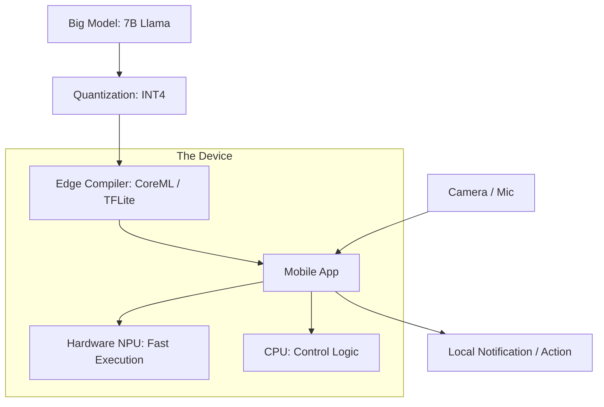

# 📱 Edge Hardware & Inference: AI in Your Pocket
> **Level:** Advanced | **Language:** Hinglish | **Goal:** Master the deployment of AI on resource-constrained devices, exploring NPU (Neural Processing Units), Quantization for Edge, NVIDIA Jetson, Apple Silicon, and the 2026 strategies for "On-Device" AI.

---

## 🧭 1. Beginner-Friendly Hinglish Explanation
Saara AI "Cloud" par nahi chal sakta. 

- **The Problem:** Maan lo aap "Face Lock" use kar rahe hain ya "Autonomous Drone" uda rahe hain. Agar AI cloud par chalega, toh internet slow hone par drone crash ho jayega. 
- Humein AI ko "Device" ke andar hi chalana padta hai. Isse hum **Edge AI** kehte hain.

Edge AI ke challenges alag hain:
1. **Battery:** Phone ki battery jaldi khatam nahi honi chahiye.
2. **Size:** Device garam nahi hona chahiye.
3. **Memory:** Phone mein 80GB VRAM nahi hota, sirf 8GB RAM hota hai.

In 2026, hum **NPU** (Neural Processing Units) use karte hain jo sirf AI ke liye bane hain—ye CPU se 100x kam bijli lete hain aur AI fast chalate hain.

---

## 🧠 2. Deep Technical Explanation
Edge inference requires massive optimization to fit large models into small power and memory budgets.

### 1. The NPU (Neural Processing Unit):
- Unlike a GPU (General Graphics), an NPU is an **ASIC** designed specifically for Matrix Multiplications. 
- **Apple Neural Engine (ANE):** Found in iPhones/Macs.
- **Qualcomm Hexagon:** Found in Android phones.
- **Google TPU (Edge):** Found in Pixel phones.

### 2. Edge-Specific Quantization:
- **INT8 / INT4:** Converting 32-bit weights to 4-bit. This reduces model size by $8x$ and increases speed, but might slightly hurt accuracy.
- **PTQ (Post-Training Quantization):** Quantizing after training.
- **QAT (Quantization-Aware Training):** Training the model *knowing* it will be quantized. (Better accuracy).

### 3. Edge Frameworks:
- **CoreML:** For Apple devices.
- **TensorFlow Lite (TFLite):** For Android/IoT.
- **ONNX Runtime:** For cross-platform edge execution.
- **Mediapipe:** For real-time vision/audio pipelines on mobile.

---

## 🏗️ 4. Edge Hardware Comparison
| Hardware | Best For | Power Efficiency | VRAM / Memory |
| :--- | :--- | :--- | :--- |
| **NVIDIA Jetson** | Robotics / Drones | Moderate | Up to 64GB (Shared) |
| **Apple M3/M4** | Laptops / High-end Mobile | **Excellent** | Up to 128GB (Shared) |
| **Qualcomm Snapdragon**| Mobile Phones | High | 8-16GB |
| **Raspberry Pi 5** | DIY / Simple IoT | Low (No NPU) | 4-8GB |
| **Tesla FSD Chip** | Automotive AI | High | Specialized |

---

## 📐 4. Mathematical Intuition
- **The TOPS (Tera Operations Per Second) vs. Efficiency:** 
  For Edge, we care about **TOPS per Watt**. 
  $$\text{Efficiency} = \frac{\text{Total Operations}}{\text{Energy Consumed (Joules)}}$$
  - A GPU might have 100 TOPS but use 300W. 
  - An NPU might have 20 TOPS but use only 2W. 
  **Winner for Edge:** The NPU. It can run the model all day without the phone getting hot.

---

## 📊 5. Edge AI Deployment Pipeline (Diagram)


---

## 💻 6. Production-Ready Examples (Running Inference on Edge with ONNX)
```python
# 2026 Pro-Tip: Use ONNX for cross-platform edge performance.

import onnxruntime as ort

# 1. Load the quantized model
# 'execution_providers' selects the NPU/GPU if available
session = ort.InferenceSession(
    "model_int4.onnx", 
    providers=['CoreMLExecutionProvider', 'CPUExecutionProvider']
)

# 2. Prepare input (Already preprocessed to float32)
input_name = session.get_inputs()[0].name
output = session.run(None, {input_name: my_image_tensor})

# 3. Fast, low-power result!
print("Prediction:", output)
```

---

## ❌ 7. Failure Cases
- **The 'Memory Pressure' Crash:** Your model needs 3GB, but the phone only has 1GB free. The OS "Kills" your app. **Fix: Use 'Model Sharding' or 'Dynamic Unloading'.**
- **Thermal Throttling:** Running a heavy model for 10 minutes makes the phone hot. The NPU slows down to $50\%$ speed. **Fix: Optimize the 'Compute Graph' to use fewer cycles.**
- **Hardware Fragmentation:** Your code works on Pixel 8 (Google TPU) but fails on Samsung (Qualcomm NPU) because their drivers are different.

---

## 🛠️ 8. Debugging Guide
- **Symptom:** "Model is too slow on Android."
- **Check:** **Delegate**. Are you using the `GPU/NNAPI` delegate in TFLite? If not, it's running on the slow CPU.
- **Symptom:** "Accuracy dropped significantly after quantization."
- **Check:** **Clipping Range**. Ensure your quantization scales are calculated correctly for the distribution of your data.

---

## ⚖️ 9. Tradeoffs
- **On-Device vs. Cloud:** 
  - On-device is **Private** and **Instant** but less intelligent. 
  - Cloud is **Powerful** but has **Latency** and **Privacy** risks.
- **FP16 vs. INT8:** 
  - FP16 is more accurate. 
  - INT8 is $2x$ faster and $2x$ smaller.

---

## 🛡️ 10. Security Concerns
- **Model Theft from Device:** A hacker can "Root" the phone and copy your `.onnx` file. **Use 'Model Encryption' keys stored in the Secure Enclave.**

---

## 📈 11. Scaling Challenges
- **The 'Billion Device' Update:** Deploying a new 200MB model update to 1 Billion phones without crashing the internet. **Use 'Delta Updates' (Only send the changed weights).**

---

## 💸 12. Cost Considerations
- **Zero Inference Cost:** Once the app is downloaded, the user pays for the electricity, not you! This is the #1 reason companies are moving AI to the Edge in 2026.

---

## ✅ 13. Best Practices
- **Use 'Mobile-First' Architectures:** Instead of Llama-3, use **MobileLLM** or **Phi-3-Mini** which are designed for small chips.
- **Pipeline sensors:** Use the ISP (Image Signal Processor) for resizing and normalization instead of the CPU.
- **Test on low-end devices:** Don't just test on the latest iPhone. Test on a $\$150$ Android phone to see real-world performance.

---

## ⚠️ 14. Common Mistakes
- **Loading the whole model into RAM:** Use `mmap` (Memory mapping) to only load the parts of the model being used.
- **Ignoring battery impact:** Running a heavy AI loop in the background that drains the user's battery in 30 minutes.

---

## 📝 15. Interview Questions
1. **"What is an NPU and how does it differ from a GPU?"**
2. **"Explain the difference between Post-Training Quantization (PTQ) and Quantization-Aware Training (QAT)."**
3. **"How do you handle 'Model Drift' on edge devices without internet access?"**

---

## 🚀 15. Latest 2026 Industry Patterns
- **Unified Memory LLMs:** Laptops (MacBook M4) that can run a 70B model entirely in their RAM by sharing it between CPU and GPU.
- **Wearable AI Hardware:** Glasses (Ray-Ban Meta) that have tiny NPs to process "Always-on" video.
- **Federated Edge Learning:** Phones that "Learn" from the user's habits and only send the "Gradients" back to the company, keeping the data private.
