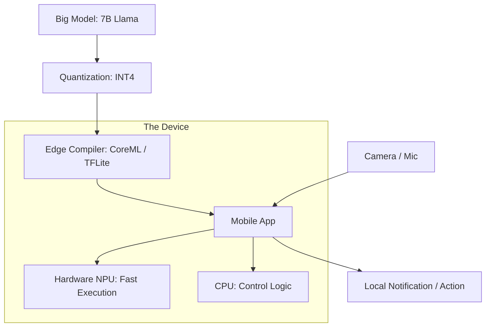

# 📱 Edge Hardware & Inference: AI in Your Pocket
> **Level:** Advanced | **Language:** Hinglish | **Goal:** Resource-constrained devices par AI deploy karne ko master karein, NPU, Edge ke liye Quantization, NVIDIA Jetson, Apple Silicon, aur 2026 mein "On-Device" AI ki strategies ko explore karte hue.

---

## 🧭 1. Beginner-Friendly Hinglish Explanation
Saara AI "Cloud" par nahi chal sakta. 

- **The Problem:** Maan lo aap "Face Lock" use kar rahe hain ya "Autonomous Drone" uda rahe hain. Agar AI cloud par chalega, toh internet slow hone par drone crash ho jayega. 
- Humein AI ko "Device" ke andar hi chalana padta hai. Isse hum **Edge AI** kehte hain.

Edge AI ke challenges alag hain:
1. **Battery:** Phone ki battery jaldi khatam nahi honi chahiye.
2. **Size:** Device garam nahi hona chahiye.
3. **Memory:** Phone mein 80GB VRAM nahi hota, sirf 8GB RAM hota hai.

In 2026, hum **NPU** (Neural Processing Units) use karte hain jo sirf AI ke liye bane hain—ye CPU se 100x kam bijli lete hain aur AI fast chalate hain.

---

## 🧠 2. Deep Technical Explanation
Edge inference ko large models ko chote power aur memory budgets mein fit karne ke liye massive optimization ki zaroorat hoti hai.

### 1. The NPU (Neural Processing Unit):
- Ek GPU (General Graphics) ke mukable, NPU ek **ASIC** hai jise khaaskar Matrix Multiplications ke liye design kiya gaya hai. 
- **Apple Neural Engine (ANE):** iPhones/Macs mein milta hai.
- **Qualcomm Hexagon:** Android phones mein milta hai.
- **Google TPU (Edge):** Pixel phones mein milta hai.

### 2. Edge-Specific Quantization:
- **INT8 / INT4:** 32-bit weights ko 4-bit mein convert karna. Yeh model size ko $8x$ reduce karta hai aur speed badhata hai, par isse accuracy thodi hurt ho sakti hai.
- **PTQ (Post-Training Quantization):** Training ke baad quantize karna.
- **QAT (Quantization-Aware Training):** Model ko yeh *jaante* hue train karna ki ise quantize kiya jayega. (Isse behtar accuracy milti hai).

### 3. Edge Frameworks:
- **CoreML:** Apple devices ke liye.
- **TensorFlow Lite (TFLite):** Android/IoT ke liye.
- **ONNX Runtime:** Cross-platform edge execution ke liye.
- **Mediapipe:** Mobile par real-time vision/audio pipelines ke liye.

---

## 🏗️ 4. Edge Hardware Comparison
| Hardware | Best For | Power Efficiency | VRAM / Memory |
| :--- | :--- | :--- | :--- |
| **NVIDIA Jetson** | Robotics / Drones ke liye | Moderate | Up to 64GB (Shared) |
| **Apple M3/M4** | Laptops / High-end Mobile ke liye | **Excellent** | Up to 128GB (Shared) |
| **Qualcomm Snapdragon**| Mobile Phones ke liye | High | 8-16GB |
| **Raspberry Pi 5** | DIY / Simple IoT ke liye | Low (No NPU) | 4-8GB |
| **Tesla FSD Chip** | Automotive AI ke liye | High | Specialized |

---

## 📐 4. Mathematical Intuition
- **The TOPS (Tera Operations Per Second) vs. Efficiency:** 
  Edge ke liye, hum **TOPS per Watt** ki parwah karte hain. 
  $$\text{Efficiency} = \frac{\text{Total Operations}}{\text{Energy Consumed (Joules)}}$$
  - Ek GPU ke paas 100 TOPS ho sakte hain par woh 300W use karta hai. 
  - Ek NPU ke paas 20 TOPS ho sakte hain par woh sirf 2W use karta hai. 
  **Edge ka Winner:** NPU. Yeh phone ko garam kiye bina pure din model run kar sakta hai.

---

## 📊 5. Edge AI Deployment Pipeline (Diagram)

```mermaid
graph TD
    Model[Big Model: 7B Llama] --> Quant[Quantization: INT4]
    Quant --> Compile[Edge Compiler: CoreML / TFLite]
    
    subgraph "The Device"
    Compile --> App[Mobile App]
    App --> NPU[Hardware NPU: Fast Execution]
    App --> CPU[CPU: Control Logic]
    end
    
    Sensor[Camera / Mic] --> App
    App --> Result[Local Notification / Action]
```

---

## 💻 6. Production-Ready Examples (Running Inference on Edge with ONNX)
```python
# 2026 Pro-Tip: Cross-platform edge performance ke liye ONNX ka use karein.

import onnxruntime as ort

# 1. Quantized model load karein
# 'execution_providers' agar available ho toh NPU/GPU select karta hai
session = ort.InferenceSession(
    "model_int4.onnx", 
    providers=['CoreMLExecutionProvider', 'CPUExecutionProvider']
)

# 2. Input prepare karein (Pehle se float32 mein preprocessed)
input_name = session.get_inputs()[0].name
output = session.run(None, {input_name: my_image_tensor})

# 3. Fast, low-power result!
print("Prediction:", output)
```

---

## ❌ 7. Failure Cases
- **The 'Memory Pressure' Crash:** Aapke model ko 3GB ki zaroorat hai, par phone mein sirf 1GB free hai. OS aapke app ko "Kill" kar deta hai. **Fix: 'Model Sharding' ya 'Dynamic Unloading' ka use karein.**
- **Thermal Throttling:** 10 minutes tak heavy model run karne se phone garam ho jata hai. NPU apni speed ko slow karke $50\%$ kar deta hai. **Fix: Kam cycles use karne ke liye 'Compute Graph' ko optimize karein.**
- **Hardware Fragmentation:** Aapka code Pixel 8 (Google TPU) par chal jata hai par Samsung (Qualcomm NPU) par fail ho jata hai kyunki unke drivers alag hain.

---

## 🛠️ 8. Debugging Guide
- **Symptom:** "Android par model bahut slow hai."
- **Check:** **Delegate**. Kya aap TFLite mein `GPU/NNAPI` delegate ka use kar rahe hain? Agar nahi, toh yeh slow CPU par chal raha hai.
- **Symptom:** "Quantization ke baad accuracy bahut drop ho gayi."
- **Check:** **Clipping Range**. Ensure karein ki aapki quantization scales aapke data ke distribution ke liye sahi se calculated hain.

---

## ⚖️ 9. Tradeoffs
- **On-Device vs. Cloud:** 
  - On-device **Private** aur **Instant** hota hai par kam intelligent hota hai. 
  - Cloud **Powerful** hota hai par isme **Latency** aur **Privacy** risks hote hain.
- **FP16 vs. INT8:** 
  - FP16 zyada accurate hota hai. 
  - INT8 $2x$ faster aur $2x$ smaller hota hai.

---

## 🛡️ 10. Security Concerns
- **Model Theft from Device:** Koi hacker phone ko "Root" kar sakta hai aur aapki `.onnx` file ko copy kar sakta hai. **Secure Enclave mein stored 'Model Encryption' keys ka use karein.**

---

## 📈 11. Scaling Challenges
- **The 'Billion Device' Update:** Internet ko bina crash kiye 1 Billion phones par naya 200MB model update deploy karna. **'Delta Updates' (Sirf changed weights send karein) ka use karein.**

---

## 💸 12. Cost Considerations
- **Zero Inference Cost:** Ek baar app download hone ke baad, user electricity ke liye pay karta hai, aap nahi! Yeh sabse bada (#1) reason hai ki companies 2026 mein AI ko Edge par move kar rahi hain.

---

## ✅ 13. Best Practices
- **'Mobile-First' Architectures ka use karein:** Llama-3 ke bajaye, **MobileLLM** ya **Phi-3-Mini** ka use karein jo chote chips ke liye design kiye gaye hain.
- **Pipeline sensors:** CPU ke bajaye resizing aur normalization ke liye ISP (Image Signal Processor) ka use karein.
- **Low-end devices par test karein:** Sirf latest iPhone par hi test na karein. Real-world performance dekhne ke liye ek $\$150$ ke Android phone par test karein.

---

## ⚠️ 14. Common Mistakes
- **Pure model ko RAM mein load karna:** Model ke sirf unhi parts ko load karne ke liye `mmap` (Memory mapping) ka use karein jo currently use ho rahe hain.
- **Battery impact ko ignore karna:** Background mein ek heavy AI loop chalana jo user ki battery ko 30 minutes mein hi drain (khatam) kar de.

---

## 📝 15. Interview Questions
1. **"NPU kya hai aur yeh GPU se kaise different hai?"**
2. **"Post-Training Quantization (PTQ) aur Quantization-Aware Training (QAT) ke beech difference explain karein."**
3. **"Bina internet access wale edge devices par aap 'Model Drift' ko kaise handle karte hain?"**

---

## 🚀 15. Latest 2026 Industry Patterns
- **Unified Memory LLMs:** Laptops (jaise MacBook M4) jo CPU aur GPU ke beech RAM share karke pure 70B model ko run kar sakte hain.
- **Wearable AI Hardware:** Glasses (jaise Ray-Ban Meta) jinme "Always-on" video ko process karne ke liye tiny NPUs hote hain.
- **Federated Edge Learning:** Phones jo user ki habits se "Learn" karte hain aur data ko private rakhte hue sirf "Gradients" hi company ko wapas bhejte hain.
