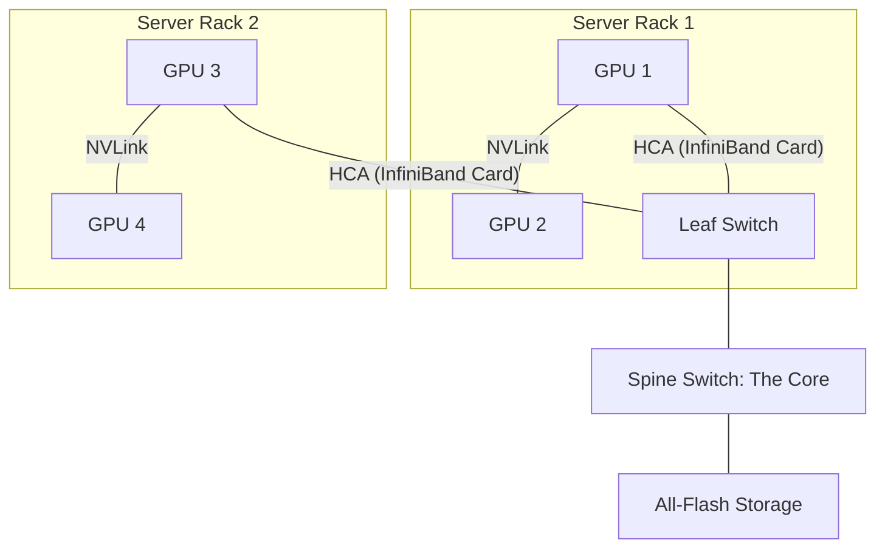

# 🌐 Networking for AI: The Nervous System of Supercomputers
> **Level:** Extreme Advanced | **Language:** Hinglish | **Goal:** Master the networking technologies that connect thousands of GPUs, exploring InfiniBand, NVLink, RDMA, Spectrum-X, and the 2026 strategies for building "Zero-Loss" AI networks.

---

## 🧭 1. Beginner-Friendly Hinglish Explanation
AI model train karte waqt GPUs ko ek doosre se "Baat" karni padti hai. 

- **The Problem:** Agar aap 1000 GPUs ko ek "Normal Office Router" se connect kar denge, toh network "Jam" ho jayega. 
  - AI training mein data transfer ki speed itni honi chahiye ki lage saare GPUs ek hi dimaag (Brain) ka hissa hain.
- **AI Networking** ka matlab hai special "Wires" aur "Switches" use karna jo normal internet se 100x fast hon.

In 2026, hum do tarah ke network use karte hain:
1. **The Internal Network (NVLink):** Ek server ke andar ke GPUs ko connect karne ke liye. (Ultra-Fast).
2. **The External Network (InfiniBand):** Alag-alag servers ko connect karne ke liye. (Super-Fast).

Agar network slow hai, toh aapke mahange GPUs "Intezar" karte rahenge, aur aapka paisa barbaad hoga.

---

## 🧠 2. Deep Technical Explanation
AI networking is focused on **Throughput**, **Latency**, and **Jitter** (Variation in latency).

### 1. NVLink (Intra-Node):
- NVIDIA's proprietary interconnect. 
- **NVLink 5 (Blackwell):** Up to **$1.8$ TB/s** bidirectional bandwidth.
- It allows GPUs to share their VRAM pool, creating a "Unified Memory" space.

### 2. InfiniBand (Inter-Node):
- The gold standard for HPC and AI clusters.
- **Characteristics:** Credit-based flow control (No packet loss), hardware-level offloading, and **RDMA** support.
- **NDR (400G) / XDR (800G):** The speeds used in 2026 clusters.

### 3. RoCE (RDMA over Converged Ethernet):
- Bringing the benefits of InfiniBand to "Standard" Ethernet. 
- It's cheaper but harder to tune. If not configured correctly, "PFC" (Priority Flow Control) can cause "Deadlocks" in the network.

### 4. In-Network Computing (SHARP):
- Instead of the GPU doing the "Math" to average gradients, the **Network Switch** itself does the math while the data is passing through it. This saves GPU cycles.

---

## 🏗️ 3. Networking Stack for AI
| Layer | Technology | Bandwidth | Typical Use |
| :--- | :--- | :--- | :--- |
| **GPU-to-GPU** | NVLink | $900-1800$ GB/s | Tensor Parallelism |
| **Server-to-Server** | InfiniBand | $400-800$ Gbps | Data/Pipeline Parallelism |
| **Storage-to-Server**| RoCE / iWARP | $100-200$ Gbps | Dataset Streaming |
| **Server-to-Internet**| Standard TCP/IP | $10-40$ Gbps | Management / API |

---

## 📐 4. Mathematical Intuition
- **The Bandwidth-to-Compute Ratio:** 
  For a model to train efficiently, the network must be fast enough to move the gradients in less time than it takes to compute them.
  $$\text{Sync Time} = \frac{\text{Model Parameters} \times 4 \text{ bytes}}{\text{Network Bandwidth}}$$
  - If a 70B model needs to sync 280GB of gradients every $100ms$, you need a bandwidth of **$2.8$ TB/s**. 
  - This is why **Model Parallelism** is required—one network wire isn't enough!

---

## 📊 5. AI Cluster Network Topology (Diagram)


---

## 💻 6. Production-Ready Examples (Testing Network Speed with `ib_write_bw`)
```bash
# 2026 Pro-Tip: Always verify your RDMA connection before starting training.

# On Server A (Receiver)
ib_write_bw -d mlx5_0 -i 1

# On Server B (Sender)
ib_write_bw -d mlx5_0 -i 1 <Server_A_IP>

# If you see 390+ Gbps on a 400G line, your InfiniBand is healthy.
# If you see < 100 Gbps, your cables or drivers are faulty. 🚩
```

---

## ❌ 7. Failure Cases
- **Packet Loss (The 'Incast' Problem):** When 100 servers send data to 1 server at the same time, the switch gets overwhelmed and starts "Dropping" packets. This kills AI performance. **Fix: Use 'Adaptive Routing' and 'Congestion Control'.**
- **Bad Cables:** High-speed 400G/800G cables are very delicate. A small "Bend" or "Dust" on the fiber optic connector can cause $90\%$ speed loss.
- **Driver Mismatch:** NVIDIA driver $v550$ might not talk correctly to the InfiniBand driver (MOFED).

---

## 🛠️ 8. Debugging Guide
- **Symptom:** "Training is $5x$ slower than expected."
- **Check:** `nvidia-smi topo -m`. This shows the "Matrix" of how GPUs are connected. If you see `SYS` instead of `NVL`, it means NVLink is broken and GPUs are using the slow CPU bus.
- **Symptom:** "Occasional training crashes with NCCL errors."
- **Check:** **Cable integrity**. Run `ibdiagnet` to find "Error counters" on the network ports.

---

## ⚖️ 9. Tradeoffs
- **InfiniBand vs. Ethernet:** 
  - InfiniBand is "Lossless" by design (Better for AI). 
  - Ethernet is "Lossy" but much cheaper. 
  - **The 2026 Middle Ground:** **NVIDIA Spectrum-X**, an Ethernet platform specifically optimized for AI.

---

## 🛡️ 10. Security Concerns
- **Network Side-Channel:** An attacker measuring the "Timing" of network packets to guess what the AI is thinking (or to steal the model weights). **Use 'MACsec' for link-layer encryption.**

---

## 📈 11. Scaling Challenges
- **The 'Fat Tree' limit:** Connecting 32,000 GPUs requires a massive 3-tier "Fat Tree" network. The cost of "Cables" alone can exceed **$\$10,000,000$**.

---

## 💸 12. Cost Considerations
- **Optical Transceivers:** The small "Plugs" at the end of the cables. For an 800G network, these can cost $\$1000$ EACH. A large cluster needs thousands.

---

## ✅ 13. Best Practices
- **Use 'Rail-Optimized' Networking:** Align your InfiniBand rails with your GPU IDs to minimize "Hops."
- **Enable 'GPUDirect RDMA':** Ensure your NIC (Network Card) can talk directly to the GPU memory.
- **Monitor 'Congestion':** Use tools like **UFM (Unified Fabric Manager)** to see real-time "Traffic Jams" in your cluster.

---

## ⚠️ 14. Common Mistakes
- **Using 'Single-Rail' for Multi-node:** Only connecting one 100G wire to a server that has 8x A100s. (The network will be $8x$ too slow).
- **Ignoring BIOS settings:** Forgetting to enable **'Above 4G Decoding'** or **'SR-IOV'**, which are needed for high-speed networking cards.

---

## 📝 15. Interview Questions
1. **"What is the difference between NVLink and InfiniBand?"**
2. **"Why is RDMA essential for low-latency AI training?"**
3. **"What is 'In-Network Computing' (SHARP) and how does it help?"**

---

## 🚀 15. Latest 2026 Industry Patterns
- **LPO (Linear Drive Pluggable Optics):** New cables that use less power and have lower latency for 800G/1.6T networks.
- **Ultra Ethernet Consortium (UEC):** A global effort (Google, Meta, AMD) to build a new networking standard that is better than InfiniBand but as cheap as Ethernet.
- **Silicon Photonics:** Integrating "Light" (Lasers) directly into the GPU chip for "Optical NVLink," allowing GPUs to be spread across a whole room while still acting like they are on the same board.
