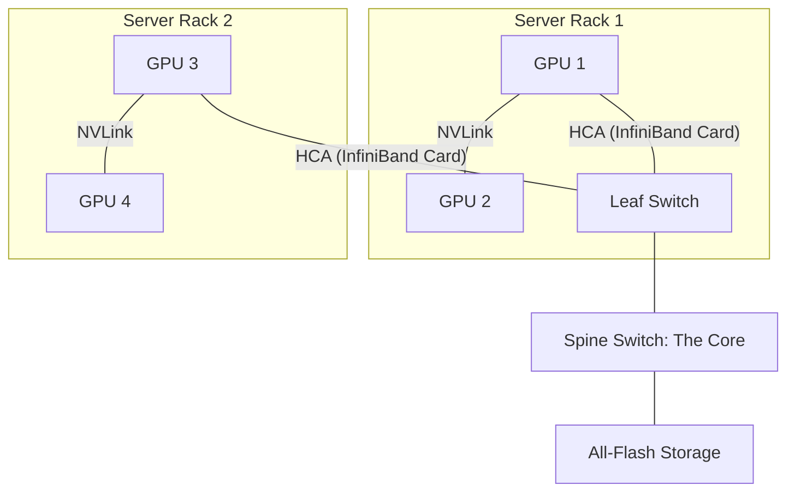

# 🌐 Networking for AI: The Nervous System of Supercomputers
> **Level:** Extreme Advanced | **Language:** Hinglish | **Goal:** Hazaron GPUs ko connect karne wali networking technologies ko master karein, InfiniBand, NVLink, RDMA, Spectrum-X, aur 2026 mein "Zero-Loss" AI networks build karne ki strategies ko explore karte hue.

---

## 🧭 1. Beginner-Friendly Hinglish Explanation
AI model train karte waqt GPUs ko ek doosre se "Baat" karni padti hai. 

- **The Problem:** Agar aap 1000 GPUs ko ek "Normal Office Router" se connect kar denge, toh network "Jam" ho jayega. 
  - AI training mein data transfer ki speed itni honi chahiye ki lage saare GPUs ek hi dimaag (Brain) ka hissa hain.
- **AI Networking** ka matlab hai special "Wires" aur "Switches" use karna jo normal internet se 100x fast hon.

In 2026, hum do tarah ke network use karte hain:
1. **The Internal Network (NVLink):** Ek server ke andar ke GPUs ko connect karne ke liye. (Ultra-Fast).
2. **The External Network (InfiniBand):** Alag-alag servers ko connect karne ke liye. (Super-Fast).

Agar network slow hai, toh aapke mahange GPUs "Intezar" karte rahenge, aur aapka paisa barbaad hoga.

---

## 🧠 2. Deep Technical Explanation
AI networking ka focus **Throughput**, **Latency**, aur **Jitter** (latency ke variation) par hota hai.

### 1. NVLink (Intra-Node):
- NVIDIA ka proprietary interconnect hai. 
- **NVLink 5 (Blackwell):** Isme **$1.8$ TB/s** tak ki bidirectional bandwidth milti hai.
- Yeh GPUs ko apna VRAM pool share karne ki permission deta hai, jisse ek "Unified Memory" space banta hai.

### 2. InfiniBand (Inter-Node):
- HPC aur AI clusters ke liye yeh gold standard hai.
- **Characteristics:** Credit-based flow control (Zero packet loss), hardware-level offloading, aur **RDMA** ka support.
- **NDR (400G) / XDR (800G):** 2026 ke clusters mein yeh speeds use hoti hain.

### 3. RoCE (RDMA over Converged Ethernet):
- InfiniBand ke benefits ko "Standard" Ethernet par lana. 
- Yeh sasta hai par ise tune karna mushkil hai. Agar sahi se configure na kiya jaye, toh "PFC" (Priority Flow Control) network mein "Deadlocks" cause kar sakta hai.

### 4. In-Network Computing (SHARP):
- Gradients ko average karne ke liye GPU dwara "Math" (calculations) karne ke bajaye, **Network Switch** khud math calculations karta hai  jab data uske beech se pass ho raha hota hai. Yeh GPU cycles ko save karta hai.

---

## 🏗️ 3. Networking Stack for AI
| Layer | Technology | Bandwidth | Typical Use |
| :--- | :--- | :--- | :--- |
| **GPU-to-GPU** | NVLink | $900-1800$ GB/s | Tensor Parallelism |
| **Server-to-Server** | InfiniBand | $400-800$ Gbps | Data/Pipeline Parallelism |
| **Storage-to-Server**| RoCE / iWARP | $100-200$ Gbps | Dataset Streaming ke liye |
| **Server-to-Internet**| Standard TCP/IP | $10-40$ Gbps | Management / API |

---

## 📐 4. Mathematical Intuition
- **The Bandwidth-to-Compute Ratio:** 
  Ek model ko efficiently train karne ke liye, network ko gradients ko usse bhi kam time mein move karne ke liye fast hona chahiye jitna time unhe compute karne mein lagta hai.
  $$\text{Sync Time} = \frac{\text{Model Parameters} \times 4 \text{ bytes}}{\text{Network Bandwidth}}$$
  - Agar ek 70B model ko har $100ms$ mein 280GB of gradients sync karne hain, toh aapko **$2.8$ TB/s** ki bandwidth ki zaroorat padegi. 
  - Yahi wajah hai ki **Model Parallelism** ki zaroorat padti hai—ek network wire kaafi nahi hota!

---

## 📊 5. AI Cluster Network Topology (Diagram)

```mermaid
graph TD
    subgraph "Server Rack 1"
    G1[GPU 1] -- "NVLink" --- G2[GPU 2]
    G1 -- "HCA (InfiniBand Card)" --- SW[Leaf Switch]
    end
    
    subgraph "Server Rack 2"
    G3[GPU 3] -- "NVLink" --- G4[GPU 4]
    G3 -- "HCA (InfiniBand Card)" --- SW
    end
    
    SW --- Spine[Spine Switch: The Core]
    Spine --- Storage[All-Flash Storage]
```

---

## 💻 6. Production-Ready Examples (Testing Network Speed with `ib_write_bw`)
```bash
# 2026 Pro-Tip: Training start karne se pehle hamesha apne RDMA connection ko verify karein.

# Server A par (Receiver)
ib_write_bw -d mlx5_0 -i 1

# Server B par (Sender)
ib_write_bw -d mlx5_0 -i 1 <Server_A_IP>

# Agar aapko 400G line par 390+ Gbps dikhta hai, toh aapka InfiniBand healthy hai.
# Agar aapko < 100 Gbps dikhta hai, toh aapke cables ya drivers faulty hain. 🚩
```

---

## ❌ 7. Failure Cases
- **Packet Loss (The 'Incast' Problem):** Jab 100 servers ek sath 1 server ko data bhejte hain, toh switch overwhelm (bhar) jata hai aur packets "Drop" karna start kar deta hai. Yeh AI performance ko destroy karta hai. **Fix: 'Adaptive Routing' aur 'Congestion Control' ka use karein.**
- **Bad Cables:** High-speed 400G/800G cables bahut delicate (nazuk) hote hain. Fiber optic connector par ek chota "Bend" (mod) ya "Dust" (dhool) $90\%$ speed loss cause kar sakta hai.
- **Driver Mismatch:** NVIDIA driver $v550$ shayad InfiniBand driver (MOFED) se properly baat na kar paaye.

---

## 🛠️ 8. Debugging Guide
- **Symptom:** "Training expected se $5x$ slow chal rahi hai."
- **Check:** `nvidia-smi topo -m` ko dekhein. Yeh GPUs kaise connected hain uski "Matrix" dikhata hai. Agar aapko `NVL` ke bajaye `SYS` dikhta hai, toh iska matlab hai ki NVLink broken hai aur GPUs slow CPU bus ka use kar rahe hain.
- **Symptom:** "NCCL errors ke sath kabhi-kabhi training crash ho jati hai."
- **Check:** **Cable integrity**. Network ports par "Error counters" ko find karne ke liye `ibdiagnet` run karein.

---

## ⚖️ 9. Tradeoffs
- **InfiniBand vs. Ethernet:** 
  - InfiniBand design se hi "Lossless" hota hai (AI ke liye better hai). 
  - Ethernet "Lossy" hota hai par kafi sasta hota hai. 
  - **The 2026 Middle Ground:** **NVIDIA Spectrum-X**, jo ki ek Ethernet platform hai aur specially AI ke liye optimized hai.

---

## 🛡️ 10. Security Concerns
- **Network Side-Channel:** Koi attacker network packets ki "Timing" ko measure karke guess kar sakta hai ki AI kya soch raha hai (ya model weights ko steal kar sakta hai). **Link-layer encryption ke liye 'MACsec' ka use karein.**

---

## 📈 11. Scaling Challenges
- **The 'Fat Tree' limit:** 32,000 GPUs ko connect karne ke liye ek massive 3-tier "Fat Tree" network ki zaroorat hoti hai. Sirf "Cables" ki cost hi **$\$10,000,000$** se exceed kar sakti hai.

---

## 💸 12. Cost Considerations
- **Optical Transceivers:** Cables ke end par jo chote "Plugs" hote hain. Ek 800G network ke liye, inki cost $\$1000$ EACH (har ek) ho sakti hai. Ek bade cluster ko hazaron ki zaroorat hoti hai.

---

## ✅ 13. Best Practices
- **'Rail-Optimized' Networking ka use karein:** "Hops" ko minimize karne ke liye apne InfiniBand rails ko GPU IDs ke sath align karein.
- **'GPUDirect RDMA' enable karein:** Ensure karein ki aapka NIC (Network Card) directly GPU memory se baat kar sake.
- **'Congestion' ko monitor karein:** Apne cluster mein real-time "Traffic Jams" dekhne ke liye **UFM (Unified Fabric Manager)** jaise tools ka use karein.

---

## ⚠️ 14. Common Mistakes
- **Multi-node ke liye 'Single-Rail' use karna:** Ek server jisme 8x A100s hain, use sirf ek single 100G wire se connect karna. (Network $8x$ too slow ho jayega).
- **BIOS settings ko ignore karna:** **'Above 4G Decoding'** ya **'SR-IOV'** ko enable karna bhool jana, jo ki high-speed networking cards ke liye zaroorat hote hain.

---

## 📝 15. Interview Questions
1. **"NVLink aur InfiniBand ke beech kya difference hai?"**
2. **"Low-latency AI training ke liye RDMA kyun essential hai?"**
3. **"'In-Network Computing' (SHARP) kya hai aur yeh kaise help karta hai?"**

---

## 🚀 15. Latest 2026 Industry Patterns
- **LPO (Linear Drive Pluggable Optics):** Naye cables jo kam power use karte hain aur 800G/1.6T networks ke liye lower latency rakhte hain.
- **Ultra Ethernet Consortium (UEC):** Ek global effort (Google, Meta, AMD) ek naya networking standard banane ke liye jo InfiniBand se behtar ho par Ethernet jitna hi sasta ho.
- **Silicon Photonics:** "Optical NVLink" ke liye GPU chip ke andar directly "Light" (Lasers) ko integrate karna, jisse GPUs ko pure room mein spread kiya ja sake par woh fir bhi aise act karein jaise same board par hon.
