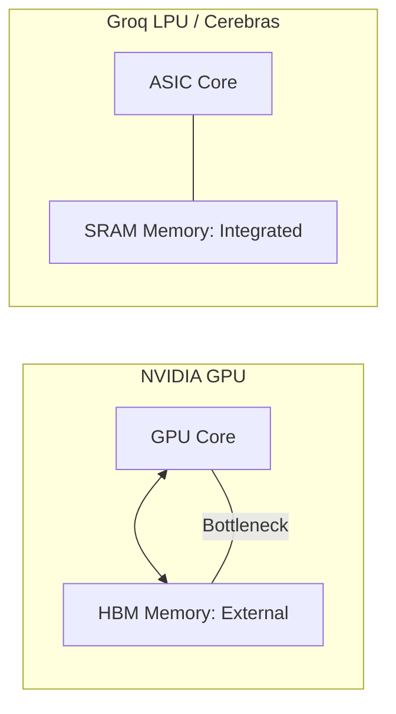

# 💎 Specialized AI Chips (ASICs): Beyond the GPU
> **Level:** Extreme Advanced | **Language:** Hinglish | **Goal:** Master the world of non-NVIDIA AI hardware, exploring TPUs, LPUs, Wafer-Scale Engines, and the 2026 strategies for building "Architecture-Aware" AI software.

---

## 🧭 1. Beginner-Friendly Hinglish Explanation
Aaj kal NVIDIA ke GPUs "Gold" ki tarah mahange hain aur milte bhi nahi. Isliye badi companies ne apne khud ke "Special" chips banana shuru kar diya hai.

- **The Problem:** Ek GPU "General Purpose" hota hai (Video games bhi khel sakta hai, AI bhi chala sakta hai). Isliye wo utna fast nahi hota jitna ek aisi chip ho jo **Sirf** AI ke liye bani ho.
- **ASIC** (Application-Specific Integrated Circuit) ka matlab hai aisi chip jo sirf ek kaam (AI) karne ke liye design ki gayi hai.

Kuch examples:
1. **Google TPU:** Sirf Google ke cloud par milta hai. Giant models train karne ke liye best.
2. **Groq LPU:** "Duniya ki sabse fast" inference chip. Ye 1 second mein 500+ words likh sakti hai.
3. **Cerebras:** Ye ek "Chip" nahi hai, ye pura "Wafer" (Ek bade pizza ke size ka board) hai jo hazaron GPUs ke barabar hai.

2026 mein, agar aapko sasta aur fast AI chalana hai, toh aapko NVIDIA se aage sochna hoga.

---

## 🧠 2. Deep Technical Explanation
Specialized chips move away from the **Von Neumann Architecture** to reduce the "Memory Wall" bottleneck.

### 1. Google TPU (Tensor Processing Unit):
- Uses a **Systolic Array** architecture. Data flows through the chip like blood through a heart, doing multiplications at every step without needing to go back to the RAM.
- **TPU v6 (2026):** Optimized for sparse MoE (Mixture of Experts) models.

### 2. Groq LPU (Language Processing Unit):
- Uses **SRAM** instead of **HBM**. SRAM is $100x$ faster but very expensive. 
- The chip has NO dynamic scheduling. The "Compiler" tells every transistor exactly what to do at every nanosecond. This is why it's so fast.

### 3. Cerebras CS-3 (Wafer-Scale Engine):
- Instead of cutting the silicon wafer into small chips, they use the **Whole Wafer.**
- It has **4 Trillion** transistors and **44GB of on-chip SRAM.** It eliminates the need for "Networking" because everything is on one piece of silicon.

### 4. AWS Inferentia & Trainium:
- Amazon's custom chips. They are optimized for "Cost-per-token." If you want to run Llama-3 for $100$ million users, Inferentia is much cheaper than H100.

---

## 🏗️ 3. Chip Architecture Comparison
| Chip | Technology | Memory Type | Best For |
| :--- | :--- | :--- | :--- |
| **NVIDIA H100** | GPU (General) | HBM3 | Everything (The Baseline) |
| **Google TPU v5p**| Systolic Array | HBM3 | Large-scale Pretraining |
| **Groq LPU** | TSP Architecture | **SRAM** | **Ultra-fast Inference** |
| **Cerebras WSE** | Wafer-Scale | **SRAM** | Single-node Giant Training |
| **AWS Trainium** | Neuron Core | HBM | Cost-effective Training |

---

## 📐 4. Mathematical Intuition
- **Compute Intensity:** 
  $$\text{Intensity} = \frac{\text{Floating Point Operations}}{\text{Memory Bytes Accessed}}$$
  - A GPU is limited by "Memory Access" (The data can't reach the core fast enough). 
  - An ASIC (like Groq) puts the memory **Inside** the core, so it can reach the peak TFLOPS of the chip. This is the secret to 500 tokens/sec.

---

## 📊 5. ASIC Architecture vs GPU (Diagram)


---

## 💻 6. Production-Ready Examples (Running on AWS Inferentia with Neuron SDK)
```python
# 2026 Pro-Tip: You need to 'Compile' your model for the specific chip.

import torch
import torch_neuronx

# 1. Load a standard PyTorch model
model = MyLlamaModel()

# 2. Compile for AWS Inferentia (ASIC)
# This converts the code to the specific instructions the chip understands
model_neuron = torch_neuronx.trace(model, example_inputs)

# 3. Save the compiled model
model_neuron.save("model_neuron.pt")

# Now it will run 3x cheaper than on a standard NVIDIA GPU.
```

---

## ❌ 7. Failure Cases
- **Compiler Complexity:** ASICs are "Stiff." If your AI model uses a "New" layer type that the chip wasn't designed for, the chip might not be able to run it at all.
- **Vendor Lock-in:** If you write your code for TPUs (using JAX), moving it to AWS Trainium is a lot of work.
- **SRAM Limits:** You can't fit a 70B model in a Groq chip because SRAM is too small. You need to connect **Hundreds** of Groq chips to run one big model.

---

## 🛠️ 8. Debugging Guide
- **Symptom:** "Model is slower on TPU than on a laptop."
- **Check:** **XLA Padding**. TPUs like "Round numbers" (multiples of 8 or 128). If your tensor size is 127, the TPU has to "Pad" it, which wastes $50\%$ of the performance.
- **Symptom:** "Compilation failed with 'Unsupported Op'."
- **Check:** **SDK Version**. ASICs update their drivers every week. Ensure your PyTorch version is compatible with the chip's SDK.

---

## ⚖️ 9. Tradeoffs
- **Speed vs. Flexibility:** 
  - GPUs can run any code. 
  - ASICs are $10x$ faster but only for specific models (like Transformers).
- **Ownership vs. Cloud:** 
  - You can buy an H100. 
  - You can only "Rent" a TPU.

---

## 🛡️ 10. Security Concerns
- **Hardware Backdoors:** If a country builds its own ASICs, can they hide a "Kill switch" in the silicon? This is why "Sovereign AI" chips are being built locally in 2026.

---

## 📈 11. Scaling Challenges
- **Inter-ASIC communication:** Connecting 10,000 TPUs is harder than 10,000 GPUs because their networking protocols are often proprietary (like **ICI** - Inter-Core Interconnect).

---

## 💸 12. Cost Considerations
- **Total Token Cost:** While an H100 costs $\$30,000$, an AWS Inferentia instance might cost $\$1/hr$. If you are doing billions of inferences, the ASIC saves millions.

---

## ✅ 13. Best Practices
- **Use 'XLA' or 'TVM':** Use compiler frameworks that can target multiple different ASICs automatically.
- **Benchmark early:** Don't assume an ASIC will be faster. Run a small "Proof of Concept" before committing to a 1-year contract.
- **Optimize for 'Batch Size 1':** If you are using Groq, take advantage of its ultra-low latency for single users.

---

## ⚠️ 14. Common Mistakes
- **Porting code without re-tuning:** Just "Running" PyTorch code on a TPU without using JAX or XLA optimizations.
- **Ignoring the SRAM limit:** Trying to fit too many "K-V Caches" into an ASIC's memory.

---

## 📝 15. Interview Questions
1. **"What is a Systolic Array and how does it benefit TPUs?"**
2. **"Why does Groq use SRAM instead of HBM, and what is the tradeoff?"**
3. **"Explain the role of a 'Compiler' in ASIC-based AI execution."**

---

## 🚀 15. Latest 2026 Industry Patterns
- **Optical ASICs:** Chips that use "Light" instead of electricity for math, promising $1000x$ lower power consumption.
- **In-Memory Computing (IMC):** Chips that do the math **Inside the RAM cells**, eliminating the need to move data at all.
- **Open-Source ASICs (RISC-V):** A global movement to build high-performance AI chips that anyone can manufacture, reducing NVIDIA's monopoly.
