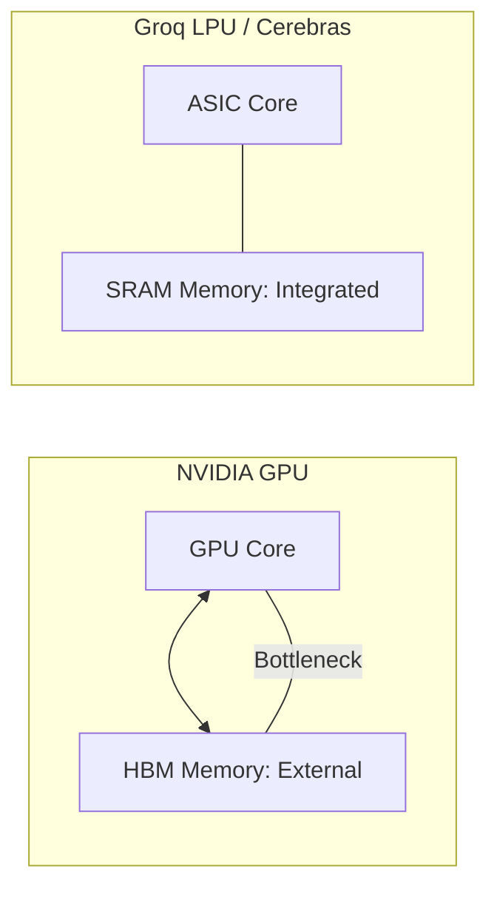

# 💎 Specialized AI Chips (ASICs): Beyond the GPU
> **Level:** Extreme Advanced | **Language:** Hinglish | **Goal:** Non-NVIDIA AI hardware ki duniya ko master karein, TPUs, LPUs, Wafer-Scale Engines, aur 2026 mein "Architecture-Aware" AI software build karne ki strategies ko explore karte hue.

---

## 🧭 1. Beginner-Friendly Hinglish Explanation
Aaj kal NVIDIA ke GPUs "Gold" ki tarah mahange hain aur milte bhi nahi. Isliye badi companies ne apne khud ke "Special" chips banana shuru kar diya hai.

- **The Problem:** Ek GPU "General Purpose" hota hai (Video games bhi khel sakta hai, AI bhi chala sakta hai). Isliye wo utna fast nahi hota jitna ek aisi chip ho jo **Sirf** AI ke liye bani ho.
- **ASIC** (Application-Specific Integrated Circuit) ka matlab hai aisi chip jo sirf ek kaam (AI) karne ke liye design ki gayi hai.

Kuch examples:
1. **Google TPU:** Sirf Google ke cloud par milta hai. Giant models train karne ke liye best.
2. **Groq LPU:** "Duniya ki sabse fast" inference chip. Ye 1 second mein 500+ words likh sakti hai.
3. **Cerebras:** Ye ek "Chip" nahi hai, ye pura "Wafer" (Ek bade pizza ke size ka board) hai jo hazaron GPUs ke barabar hai.

2026 mein, agar aapko sasta aur fast AI chalana hai, toh aapko NVIDIA se aage sochna hoga.

---

## 🧠 2. Deep Technical Explanation
Specialized chips **Von Neumann Architecture** se dur hat kar design kiye jate hain taaki "Memory Wall" ke bottleneck ko reduce kiya ja sake.

### 1. Google TPU (Tensor Processing Unit):
- Uses a **Systolic Array** architecture. Data chip ke andar is tarah flow karta hai jaise heart ke andar blood flow karta hai, bina RAM par wapas jaye har ek step par multiplications perform karta hai.
- **TPU v6 (2026):** Sparse MoE (Mixture of Experts) models ke liye optimized hai.

### 2. Groq LPU (Language Processing Unit):
- Yeh **HBM** ke bajaye **SRAM** ka use karta hai. SRAM $100x$ fast hota hai par bahut expensive hota hai. 
- Chip ke andar koi dynamic scheduling NAHI hoti. "Compiler" har ek transistor ko exact batata hai ki use har ek nanosecond par kya karna hai. Yahi wajah hai ki yeh itna fast hai.

### 3. Cerebras CS-3 (Wafer-Scale Engine):
- Silicon wafer ko choti chips mein cut karne ke bajaye, yeh pure **Whole Wafer** ka use karte hain.
- Isme **4 Trillion** transistors aur **44GB of on-chip SRAM** hote hain. Yeh "Networking" ki zaroorat ko hi khatam kar deta hai kyunki sab kuch ek single silicon piece par hi hota hai.

### 4. AWS Inferentia & Trainium:
- Amazon ke custom chips hain. Yeh "Cost-per-token" ke liye optimized hain. Agar aap $100$ million users ke liye Llama-3 run karna chahte hain, toh Inferentia H100 se kafi sasta padega.

---

## 🏗️ 3. Chip Architecture Comparison
| Chip | Technology | Memory Type | Best For |
| :--- | :--- | :--- | :--- |
| **NVIDIA H100** | GPU (General) | HBM3 | Everything (The Baseline) |
| **Google TPU v5p**| Systolic Array | HBM3 | Large-scale Pretraining ke liye |
| **Groq LPU** | TSP Architecture | **SRAM** | **Ultra-fast Inference** |
| **Cerebras WSE** | Wafer-Scale | **SRAM** | Single-node Giant Training |
| **AWS Trainium** | Neuron Core | HBM | Cost-effective Training ke liye |

---

## 📐 4. Mathematical Intuition
- **Compute Intensity:** 
  $$\text{Intensity} = \frac{\text{Floating Point Operations}}{\text{Memory Bytes Accessed}}$$
  Ek GPU "Memory Access" ke bottleneck se limited hota hai (data core tak fast enough nahi pahunch pata). 
  - Groq jaise ASICs memory ko core ke **Inside** (andar) hi integrate kar dete hain, jisse yeh chip ke peak TFLOPS ko reach kar paata hai. Yahi 500 tokens/sec ka asli secret hai.

---

## 📊 5. ASIC Architecture vs GPU (Diagram)

```mermaid
graph LR
    subgraph "NVIDIA GPU"
    Core[GPU Core] <--> HBM[HBM Memory: External]
    Core -- "Bottleneck" --- HBM
    end
    
    subgraph "Groq LPU / Cerebras"
    ASIC[ASIC Core]
    SRAM[SRAM Memory: Integrated]
    ASIC --- SRAM
    end
```

---

## 💻 6. Production-Ready Examples (Running on AWS Inferentia with Neuron SDK)
```python
# 2026 Pro-Tip: Aapko specific chip ke liye apne model ko 'Compile' karna padta hai.

import torch
import torch_neuronx

# 1. Ek standard PyTorch model load karein
model = MyLlamaModel()

# 2. AWS Inferentia (ASIC) ke liye compile karein
# Yeh code ko un specific instructions mein convert karta hai jo chip samajhti hai
model_neuron = torch_neuronx.trace(model, example_inputs)

# 3. Compiled model ko save karein
model_neuron.save("model_neuron.pt")

# Ab yeh standard NVIDIA GPU ke mukable 3x sasta chalega.
```

---

## ❌ 7. Failure Cases
- **Compiler Complexity:** ASICs kafi "Stiff" (kathor) hote hain. Agar aapka AI model koi aisa "New" layer type use karta hai jiske liye chip design nahi ki gayi thi, toh chip use run hi nahi kar payegi.
- **Vendor Lock-in:** Agar aap TPUs ke liye code likhte hain (JAX ka use karke), toh use AWS Trainium par move karna kafi mehnat ka kaam hai.
- **SRAM Limits:** Aap Groq chip mein 70B model fit nahi kar sakte kyunki SRAM kafi chota hota hai. Ek bada model run karne ke liye aapko **Hazaron/Sainkdon** Groq chips ko connect karna padega.

---

## 🛠️ 8. Debugging Guide
- **Symptom:** "Model laptop ke mukable TPU par slow chal raha hai."
- **Check:** **XLA Padding**. TPUs ko "Round numbers" (jaise 8 ya 128 ke multiples) pasand hote hain. Agar aapka tensor size 127 hai, toh TPU ko use "Pad" karna padega, jisse $50\%$ performance waste ho jayegi.
- **Symptom:** "Compilation 'Unsupported Op' ke sath fail ho gaya."
- **Check:** **SDK Version**. ASICs har hafte apne drivers update karte hain. Ensure karein ki aapka PyTorch version chip ke SDK ke sath compatible ho.

---

## ⚖️ 9. Tradeoffs
- **Speed vs. Flexibility:** 
  - GPUs koi bhi code run kar sakte hain. 
  - ASICs $10x$ faster hote hain par sirf specific models (jaise Transformers) ke liye.
- **Ownership vs. Cloud:** 
  - Aap ek H100 kharid sakte hain. 
  - Aap TPU ko sirf "Rent" par le sakte hain.

---

## 🛡️ 10. Security Concerns
- **Hardware Backdoors:** Agar koi country apne khud ke ASICs banati hai, toh kya woh silicon ke andar ek "Kill switch" chupa sakte hain? Yahi wajah hai ki 2026 mein locally "Sovereign AI" chips banaye ja rahe hain.

---

## 📈 11. Scaling Challenges
- **Inter-ASIC communication:** 10,000 TPUs ko connect karna 10,000 GPUs ko connect karne se zyada mushkil hai kyunki unke networking protocols aksar proprietary hote hain (jaise **ICI** - Inter-Core Interconnect)."

---

## 💸 12. Cost Considerations
- **Total Token Cost:** Jahan ek H100 ki cost $\$30,000$ hoti hai, wahan ek AWS Inferentia instance ki cost $\$1/hr$ ho sakti hai. Agar aap billions of inferences kar rahe hain, toh ASIC millions of dollars save karta hai.

---

## ✅ 13. Best Practices
- **'XLA' ya 'TVM' ka use karein:** Aise compiler frameworks ka use karein jo automatically multiple different ASICs ko target kar sakein.
- **Benchmark jaldi karein:** Yeh assume na karein ki ASIC fast hi hoga. 1-year ka contract sign karne se pehle ek chota "Proof of Concept" run karein.
- **'Batch Size 1' ke liye optimize karein:** Agar aap Groq use kar rahe hain, toh single users ke liye iski ultra-low latency ka advantage uthayein.

---

## ⚠️ 14. Common Mistakes
- **Bina re-tuning ke code port karna:** JAX ya XLA optimizations ke bina TPU par PyTorch code ko bas "Run" kar dena.
- **SRAM limit ko ignore karna:** Kisi ASIC ki memory mein bahut saare "K-V Caches" fit karne ki koshish karna.

---

## 📝 15. Interview Questions
1. **"Systolic Array kya hai aur isse TPUs ko kya benefit milta hai?"**
2. **"Groq HBM ke mukable SRAM kyun use karta hai, aur iska tradeoff kya hai?"**
3. **"ASIC-based AI execution mein 'Compiler' ke role ko explain karein."**

---

## 🚀 15. Latest 2026 Industry Patterns
- **Optical ASICs:** Aise chips jo calculations ke liye electricity ke bajaye "Light" ka use karte hain, jisse $1000x$ lower power consumption ka promise milta hai.
- **In-Memory Computing (IMC):** Aise chips jo calculations ko directly **RAM cells ke andar** hi karte hain, jisse data ko move karne ki zaroorat hi khatam ho jati hai.
- **Open-Source ASICs (RISC-V):** High-performance AI chips banane ke liye ek global movement jise koi bhi manufacture kar sake, taaki NVIDIA ke monopoly ko kam kiya ja sake.
