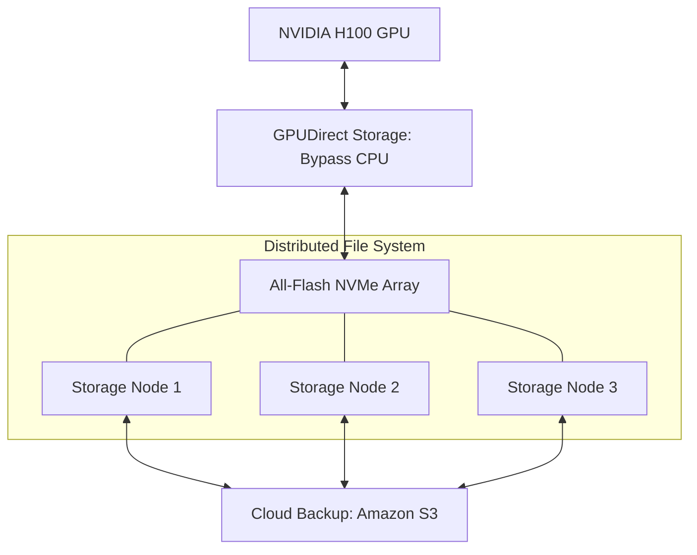

# 💾 Storage Systems for AI: Feeding the Beast
> **Level:** Advanced | **Language:** Hinglish | **Goal:** Master the storage architectures required for high-speed AI training and inference, exploring NVMe, Parallel File Systems (Lustre), S3, and the 2026 strategies for eliminating "I/O Wait" bottlenecks.

---

## 🧭 1. Beginner-Friendly Hinglish Explanation
GPUs bahut fast hote hain. Wo har ek second mein hazaron images ko "Process" kar sakte hain.

- **The Problem:** Agar aapki "Hard Drive" (Storage) slow hai, toh GPU khali baitha rahega aur intezar karega ki kab data aaye. 
  - Ye bilkul aisa hai ki aapke paas ek **Ferrari** (GPU) hai, par rasta (Storage) itna kharab hai ki aap 10 km/h se upar nahi ja sakte.
- **AI Storage** ka matlab hai data ko itni tezi se "Stream" karna ki GPU ko ek millisecond ka bhi gap na mile.

In 2026, hum normal "Hard Drives" use nahi karte. Hum **NVMe SSDs** aur **Parallel File Systems** use karte hain jo TBs of data ek saath read kar sakte hain.

---

## 🧠 2. Deep Technical Explanation
AI storage must handle two types of workloads: **Large Sequential Reads** (Loading weights) and **Random Small Reads** (Loading image/text dataset).

### 1. NVMe over Fabrics (NVMe-oF):
- NVMe is the fastest SSD protocol. NVMe-oF allows the GPU to talk to an SSD over a network as if it were plugged directly into the motherboard.

### 2. Parallel File Systems (Lustre / GPFS / Weka):
- Instead of one server, data is spread across 100 servers. When the GPU asks for a file, all 100 servers send pieces of it simultaneously.
- **Standard:** **Lustre** is the choice for Top-500 Supercomputers.

### 3. Data Tiers:
- **Hot Tier (NVMe):** For the data currently being used for training. (Expensive, Ultra-fast).
- **Warm Tier (HDD Clusters):** For datasets that might be used soon.
- **Cold Tier (S3/Object Storage):** For archiving old models and raw logs. (Cheap, Slow).

### 4. GPUDirect Storage (GDS):
- A technology by NVIDIA that allows data to go directly from the **Storage Card** to the **GPU Memory**, bypassing the **CPU** and **System RAM**. This reduces latency by $50\%$ and CPU load by $90\%$.

---

## 🏗️ 3. Storage Hierarchy for AI
| Tier | Technology | Latency | Bandwidth | Cost |
| :--- | :--- | :--- | :--- | :--- |
| **L1: GPU Memory** | HBM3e | Nanoseconds | 4.8 TB/s | Infinite |
| **L2: Local Cache** | NVMe SSD | Microseconds | 10 GB/s | High |
| **L3: Cluster Storage**| Lustre / Weka | Milliseconds | 100 GB/s | Moderate |
| **L4: Cloud/Object** | S3 / GCS | Seconds | 1-5 GB/s | **Low** |

---

## 📐 4. Mathematical Intuition
- **The I/O Throughput Requirement:** 
  If one GPU processes $B$ images per second, and each image is $S$ MB, the required bandwidth is:
  $$\text{Required Bandwidth} = \text{Num GPUs} \times B \times S$$
  - *Example:* 8 GPUs $\times$ 500 images/sec $\times$ 0.1 MB/image = **400 MB/s.**
  If your storage can only provide 200 MB/s, your $\$300,000$ GPU cluster is running at **$50\%$ efficiency.**

---

## 📊 5. AI Storage Architecture (Diagram)


---

## 💻 6. Production-Ready Examples (Optimizing Data Loading in PyTorch)
```python
# 2026 Pro-Tip: Use 'DALI' or 'WebDataset' to eliminate I/O bottlenecks.

from torch.utils.data import DataLoader
import webdataset as wds

# 1. Instead of 1 million small files, use 'Tar' files (Shards)
# This reduces the number of 'Open' operations on the disk
dataset = wds.WebDataset("s3://my-bucket/shards-{0000..0999}.tar")

# 2. Use multiple workers and 'Prefetch'
loader = DataLoader(
    dataset, 
    batch_size=32, 
    num_workers=8, # Use 8 CPU cores to prepare data
    prefetch_factor=2 # Keep 2 batches ready in RAM
)

# This ensures the GPU never waits for the next batch.
```

---

## ❌ 7. Failure Cases
- **The 'Small File' Problem:** Training on 10 million $10$KB images. Opening $10$ million files causes "Metadata exhaustion" in the file system. The disk spends all its time "Looking for files" instead of "Reading data." **Fix: Use 'Tar' shards or 'TFRecords'.**
- **S3 Throttling:** Requesting data too fast from S3. Amazon will "Throttle" your connection, and your training will stop. **Fix: Use a local NVMe 'Cache' (like FSx for Lustre).**
- **Silent Data Corruption:** One bit on the disk flips. The AI learns from "Wrong" data. **Fix: Use 'Checksumming' at the storage level.**

---

## 🛠️ 8. Debugging Guide
- **Symptom:** "GPU usage is at 30%, but CPU is at 100%."
- **Check:** **Data Augmentation**. Your CPU is struggling to "Resize" images fast enough. Move augmentation to the GPU using **NVIDIA DALI**.
- **Symptom:** "Training starts fast but slows down after 1 hour."
- **Check:** **Thermal Throttling of SSDs**. High-speed NVMe drives get very hot. Ensure they have proper heatsinks.

---

## ⚖️ 9. Tradeoffs
- **Cloud Managed vs. Self-managed:** 
  - Managed (FSx) is easy but adds "Lock-in" and cost. 
  - Self-managed (MinIO / Ceph) is cheaper but needs a dedicated Storage Engineer.
- **Compression:** Compressing data saves space but costs CPU time to decompress.

---

## 🛡️ 10. Security Concerns
- **Data Poisoning in Storage:** If an attacker can modify your "Warm Tier" shards, they can poison your model during the next training run. **Use 'Immutable Snapshots'.**

---

## 📈 11. Scaling Challenges
- **The Exabyte Wall:** Storing training data for Video LLMs. You need thousands of hard drives working in parallel just to store the raw MP4 files.

---

## 💸 12. Cost Considerations
- **Egress Fees:** Moving 1PB from AWS to GCP for training. (It's often cheaper to just buy new GPUs than to pay the transfer fee!).

---

## ✅ 13. Best Practices
- **Use 'Sharded' Formats:** Convert your dataset into 1GB shards.
- **Local NVMe for Checkpoints:** Always save model weights to a local NVMe first, then sync to the cloud in the background.
- **Enable 'Direct I/O':** Skip the OS kernel buffer to get $2x$ faster reads for large files.

---

## ⚠️ 14. Common Mistakes
- **Training directly from S3:** The latency of the internet will kill your GPU performance. Always use a local cache.
- **Ignoring IOPS:** Only looking at "Gigabytes per second" but ignoring "Input/Output Operations per second." For small files, IOPS is more important.

---

## 📝 15. Interview Questions
1. **"What is GPUDirect Storage (GDS) and how does it improve AI training?"**
2. **"Why are 'Small Files' a nightmare for AI storage systems?"**
3. **"Explain the difference between a Parallel File System and Object Storage (S3)."**

---

## 🚀 15. Latest 2026 Industry Patterns
- **Computational Storage:** SSDs that have a small CPU inside them to "Resize" images *before* they are even sent to the GPU.
- **HBM-as-Storage:** Using giant pools of HBM memory as a "Tier 0" storage layer for ultra-fast checkpointing.
- **AI-Driven Tiering:** A system that predicts which data the AI will need next and "Promotes" it from S3 to NVMe automatically.
