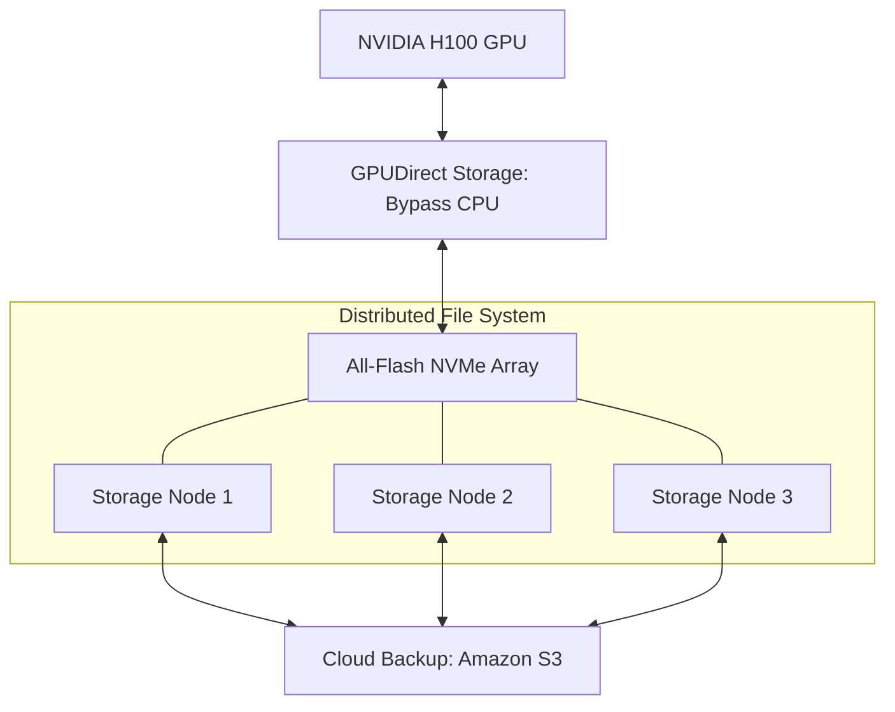

# 💾 Storage Systems for AI: Feeding the Beast
> **Level:** Advanced | **Language:** Hinglish | **Goal:** High-speed AI training aur inference ke liye zaroori storage architectures ko master karein, NVMe, Parallel File Systems (Lustre), S3, aur 2026 mein "I/O Wait" bottlenecks ko khatam karne ki strategies ko explore karte hue.

---

## 🧭 1. Beginner-Friendly Hinglish Explanation
GPUs bahut fast hote hain. Wo har ek second mein hazaron images ko "Process" kar sakte hain.

- **The Problem:** Agar aapki "Hard Drive" (Storage) slow hai, toh GPU khali baitha rahega aur intezar karega ki kab data aaye. 
  - Ye bilkul aisa hai ki aapke paas ek **Ferrari** (GPU) hai, par rasta (Storage) itna kharab hai ki aap 10 km/h se upar nahi ja sakte.
- **AI Storage** ka matlab hai data ko itni tezi se "Stream" karna ki GPU ko ek millisecond ka bhi gap na mile.

In 2026, hum normal "Hard Drives" use nahi karte. Hum **NVMe SSDs** aur **Parallel File Systems** use karte hain jo TBs of data ek saath read kar sakte hain.

---

## 🧠 2. Deep Technical Explanation
AI storage ko do tarah ke workloads handle karne hote hain: **Large Sequential Reads** (Weights load karne ke liye) aur **Random Small Reads** (Image/text dataset load karne ke liye).

### 1. NVMe over Fabrics (NVMe-oF):
- NVMe sabse fast SSD protocol hai. NVMe-oF GPU ko network par kisi SSD se is tarah baat karne ki permission deta hai jaise ki woh directly motherboard mein plugged ho.

### 2. Parallel File Systems (Lustre / GPFS / Weka):
- Ek server ke bajaye, data 100 servers par spread (faila) hota hai. Jab GPU kisi file ki request karta hai, toh saare 100 servers uske pieces ko ek sath (simultaneously) send karte hain.
- **Standard:** Top-500 Supercomputers ke liye **Lustre** hi standard choice hai.

### 3. Data Tiers:
- **Hot Tier (NVMe):** Us data ke liye jo currently training ke liye use ho raha hai. (Expensive, Ultra-fast).
- **Warm Tier (HDD Clusters):** Un datasets ke liye jo jald hi use ho sakte hain.
- **Cold Tier (S3/Object Storage):** Old models aur raw logs ko archive karne ke liye. (Cheap, Slow).

### 4. GPUDirect Storage (GDS):
- NVIDIA ki ek technology jo data ko **CPU** aur **System RAM** ko bypass karte hue directly **Storage Card** se **GPU Memory** mein jaane ki permission deti hai. Yeh latency ko $50\%$ aur CPU load ko $90\%$ tak reduce karti hai.

---

## 🏗️ 3. Storage Hierarchy for AI
| Tier | Technology | Latency | Bandwidth | Cost |
| :--- | :--- | :--- | :--- | :--- |
| **L1: GPU Memory** | HBM3e | Nanoseconds | 4.8 TB/s | Infinite |
| **L2: Local Cache** | NVMe SSD | Microseconds | 10 GB/s | High |
| **L3: Cluster Storage**| Lustre / Weka | Milliseconds | 100 GB/s | Moderate |
| **L4: Cloud/Object** | S3 / GCS | Seconds | 1-5 GB/s | **Low** |

---

## 📐 4. Mathematical Intuition
- **The I/O Throughput Requirement:** 
  Agar ek GPU har second $B$ images process karta hai, aur har image ka size $S$ MB hai, toh required bandwidth hogi:
  $$\text{Required Bandwidth} = \text{Num GPUs} \times B \times S$$
  - *Example:* 8 GPUs $\times$ 500 images/sec $\times$ 0.1 MB/image = **400 MB/s.**
  Agar aapka storage sirf 200 MB/s hi de sakta hai, toh aapka $\$300,000$ ka GPU cluster sirf **$50\%$ efficiency** par chal raha hai.

---

## 📊 5. AI Storage Architecture (Diagram)

```mermaid
graph TD
    GPU[NVIDIA H100 GPU] <--> GDS[GPUDirect Storage: Bypass CPU]
    GDS <--> NVMe[All-Flash NVMe Array]
    
    subgraph "Distributed File System"
    NVMe --- Node1[Storage Node 1]
    NVMe --- Node2[Storage Node 2]
    NVMe --- Node3[Storage Node 3]
    end
    
    Node1 & Node2 & Node3 <--> S3[Cloud Backup: Amazon S3]
```

---

## 💻 6. Production-Ready Examples (Optimizing Data Loading in PyTorch)
```python
# 2026 Pro-Tip: I/O bottlenecks ko eliminate karne ke liye 'DALI' ya 'WebDataset' ka use karein.

from torch.utils.data import DataLoader
import webdataset as wds

# 1. 1 million small files ke bajaye, 'Tar' files (Shards) ka use karein
# Yeh disk par 'Open' operations ke number ko reduce karta hai
dataset = wds.WebDataset("s3://my-bucket/shards-{0000..0999}.tar")

# 2. Use multiple workers and 'Prefetch'
loader = DataLoader(
    dataset, 
    batch_size=32, 
    num_workers=8, # Data prepare karne ke liye 8 CPU cores ka use karein
    prefetch_factor=2 # RAM mein 2 batches ready rakhein
)

# Yeh ensure karta hai ki GPU kabhi next batch ke liye wait na kare.
```

---

## ❌ 7. Failure Cases
- **The 'Small File' Problem:** 10 million $10$KB images par training karna. $10$ million files open karne se file system mein "Metadata exhaustion" ho jata hai. Disk apna saara time "Reading data" ke bajaye "Looking for files" (files dhoondhne) mein spend karti hai. **Fix: 'Tar' shards ya 'TFRecords' ka use karein.**
- **S3 Throttling:** S3 se data bahut fast request karna. Amazon aapke connection ko "Throttle" (slow) kar dega, aur aapki training ruk jayegi. **Fix: Local NVMe 'Cache' (jaise FSx for Lustre) ka use karein.**
- **Silent Data Corruption:** Disk par ek single bit flip ho jata hai. AI "Wrong" (galat) data se seekhta hai. **Fix: Storage level par 'Checksumming' ka use karein.**

---

## 🛠️ 8. Debugging Guide
- **Symptom:** "GPU usage 30% par hai, par CPU 100% par hai."
- **Check:** **Data Augmentation**. Aapka CPU images ko fast enough "Resize" karne ke liye struggle kar raha hai. **NVIDIA DALI** ka use karke augmentation ko GPU par move karein.
- **Symptom:** "Training fast start hoti hai par 1 hour ke baad slow ho jati hai."
- **Check:** **Thermal Throttling of SSDs**. High-speed NVMe drives bahut garam ho jate hain. Ensure karein ki unke paas proper heatsinks hon.

---

## ⚖️ 9. Tradeoffs
- **Cloud Managed vs. Self-managed:** 
  - Managed (FSx) aasan hai par "Lock-in" aur cost ko badhata hai. 
  - Self-managed (MinIO / Ceph) sasta hai par iske liye ek dedicated Storage Engineer ki zaroorat hoti hai.
- **Compression:** Data compress karne se space toh bachta hai par decompress karne ke liye CPU time kharch hota hai.

---

## 🛡️ 10. Security Concerns
- **Data Poisoning in Storage:** Agar koi attacker aapke "Warm Tier" shards ko modify kar sakta hai, toh woh agli training run ke dauran aapke model ko poison kar sakta hai. **'Immutable Snapshots' ka use karein.**

---

## 📈 11. Scaling Challenges
- **The Exabyte Wall:** Video LLMs ke liye training data ko store karna. Sirf raw MP4 files ko store karne ke liye hi aapko parallel mein kaam karne wali hazaron hard drives ki zaroorat hoti hai.

---

## 💸 12. Cost Considerations
- **Egress Fees:** Training ke liye AWS se GCP mein 1PB data move karna. (Aksar transfer fee pay karne se sasta naye GPUs kharidna hota hai!).

---

## ✅ 13. Best Practices
- **'Sharded' Formats ka use karein:** Apne dataset ko 1GB shards mein convert karein.
- **Checkpoints ke liye Local NVMe:** Hamesha model weights ko pehle local NVMe par save karein, fir background mein cloud ke sath sync karein.
- **'Direct I/O' enable karein:** Large files ke liye $2x$ faster reads paane ke liye OS kernel buffer ko skip karein.

---

## ⚠️ 14. Common Mistakes
- **S3 se directly train karna:** Internet ki latency aapke GPU performance ko bilkul destroy kar degi. Hamesha ek local cache ka use karein.
- **IOPS ko ignore karna:** Sirf "Gigabytes per second" ko dekhna par "Input/Output Operations per second" ko ignore karna. Small files ke liye IOPS zyada important hota hai.

---

## 📝 15. Interview Questions
1. **"GPUDirect Storage (GDS) kya hai aur yeh AI training ko kaise improve karta hai?"**
2. **"AI storage systems ke liye 'Small Files' ek nightmare (musibat) kyun hain?"**
3. **"Parallel File System aur Object Storage (S3) ke beech difference explain karein."**

---

## 🚀 15. Latest 2026 Industry Patterns
- **Computational Storage:** Aise SSDs jinme ek chota CPU andar hi hota hai jo images ko GPU par bhejne se *pehle* hi "Resize" kar deta hai.
- **HBM-as-Storage:** Ultra-fast checkpointing ke liye "Tier 0" storage layer ke roop mein HBM memory ke giant pools ka use karna.
- **AI-Driven Tiering:** Ek aisa system jo predict karta hai ki AI ko aage kis data ki zaroorat hogi aur use automatically S3 se NVMe par "Promote" (move) kar deta hai.
