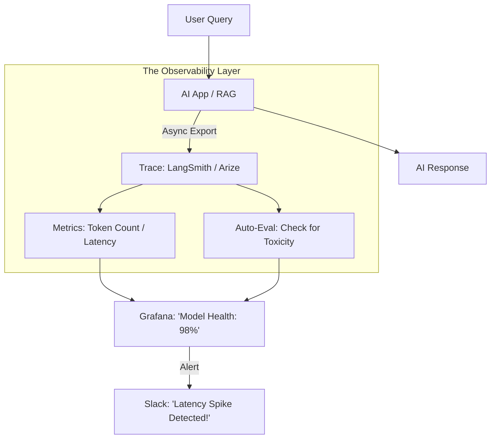

# 🩺 AI Observability Foundations: Peeking Inside the Black Box
> **Level:** Intermediate | **Language:** Hinglish | **Goal:** Master the art of tracking AI performance in production, moving beyond basic "Monitoring" to full "Observability" using traces, logs, and metrics in 2026.

---

## 🧭 1. Beginner-Friendly Hinglish Explanation
Model ko "Deploy" karna toh sirf shuruwat hai. Asli challenge tab aata hai jab real users use use karte hain.

- **The Problem:** Software mein "Error 500" aata hai toh humein pata chal jata hai. Par AI mein "Error" nahi aata, AI "Galti" karta hai.
  - AI ne galat advice di?
  - AI ne toxic language use ki?
  - AI slow ho gaya?
- **Observability** ka matlab hai AI ke "Dimaag" ke andar ki har activity ko record karna taaki hum galti ka "Root Cause" dhoond sakein.

Monitoring se humein pata chalta hai ki *"AI is broken."*
Observability se humein pata chalta hai ki *"AI is broken because it got confused by the user's latest PDF upload."*

2026 mein, bina "Observability" ke AI chalana "Aankh band karke gadi chalane" jaisa hai.

---

## 🧠 2. Deep Technical Explanation
AI Observability is built on three pillars: **Metrics**, **Logs**, and **Traces**.

### 1. The Three Pillars:
- **Metrics (The 'What'):** Quantitative data. GPU usage, Latency, Throughput, Token count.
- **Logs (The 'Details'):** Every prompt, every response, and every system message.
- **Traces (The 'How'):** In a RAG system, a trace shows the path: *Query $\to$ Embedding $\to$ Search $\to$ Top-K Results $\to$ LLM $\to$ Answer.*

### 2. Monitoring vs. Observability:
- **Monitoring:** Pre-defined dashboards. "Is the API up?".
- **Observability:** Ability to answer *unplanned* questions. "Why did users from Germany suddenly start getting 404 errors during image generation?".

### 3. Evaluation-in-Production:
- Automatically running a "Small Evaluation" (like RAGAS) on real-world logs to track "Faithfulness" in real-time.

---

## 🏗️ 3. Observability Components
| Component | Function | Tool Example |
| :--- | :--- | :--- |
| **Collector** | Gathers logs from the AI servers | Arize Phoenix / LangSmith |
| **Storage** | Stores high-volume traces | ClickHouse / ElasticSearch |
| **Visualizer** | Dashboards and Flow charts | Grafana / Honeycomb |
| **Evaluator** | Grades the quality of logs | DeepEval / OpenAI Evals |
| **Alerting** | Notifies on Slack if latency $> 2s$ | PagerDuty |

---

## 📐 4. Mathematical Intuition
- **The P99 Latency:** 
  In AI, "Average Latency" is useless. One user might wait $1s$, while another waits $30s$.
  - **P50:** Median latency ($50\%$ users are faster than this).
  - **P99:** $99\%$ of users are faster than this.
  **Goal:** Keep P99 Latency below a strict threshold. If P99 is high, your "Scaling" logic is failing.

---

## 📊 5. AI Observability Pipeline (Diagram)


---

## 💻 6. Production-Ready Examples (Implementing Tracing with Arize Phoenix)
```python
# 2026 Pro-Tip: Use OpenInference (OTEL) standard for traces.

import phoenix as px
from phoenix.trace.openai import OpenAIInstrumentor

# 1. Start the observability local server
session = px.launch_app()

# 2. Instrument your AI library (OpenAI, LangChain, LlamaIndex)
OpenAIInstrumentor().instrument()

# 3. Now, every LLM call is automatically 'Traced'
# You can see the full 'Thought Process' of the AI in the Phoenix UI
response = openai.chat.completions.create(
    model="gpt-4o",
    messages=[{"role": "user", "content": "How to scale K8s?"}]
)

print(f"Check your trace at: {session.url}")
```

---

## ❌ 7. Failure Cases
- **Metric Overload:** Recording too many metrics (e.g., every single weight change). This creates "Noise" and makes it impossible to find real problems.
- **Privacy Leak:** Accidentally logging the user's credit card number into the "Observability Dashboard" where the whole team can see it. **Fix: Redact PII before logging.**
- **Log Lag:** The traces take 10 minutes to show up. By the time you see the error, the user has already left.

---

## 🛠️ 8. Debugging Guide
- **Symptom:** "Users are reporting hallucinations, but the dashboard says 'API Healthy'."
- **Check:** **Evaluation Metrics**. You are monitoring "Uptime" but not "Quality." Add a **Faithfulness** checker to your pipeline.
- **Symptom:** "Latency is increasing every hour."
- **Check:** **Memory Leak**. Is your AI keeping old "Contexts" in memory? Use a profiler to find where the RAM is going.

---

## ⚖️ 9. Tradeoffs
- **Sampling Rate:** 
  - Log $100\%$ of queries: Perfect detail but high cost and high storage.
  - Log $1\%$ of queries: Cheap but you might miss that ONE critical bug.
- **Real-time vs. Batch:** 
  - Real-time eval is slow. 
  - Batch eval is fast but you find out about the bug tomorrow.

---

## 🛡️ 10. Security Concerns
- **Observability Injection:** A hacker sending 1 million queries with "Fake Feedback" (Thumbs down) to ruin your model's performance metrics and trigger false alerts.

---

## 📈 11. Scaling Challenges
- **High-Volume Tracing:** If your app has 1 million users, your "Observability Data" might be LARGER than your actual database. You need a dedicated **Distributed Tracing** infrastructure (like Jaeger).

---

## 💸 12. Cost Considerations
- **The 'Monitoring Tax':** Managed observability platforms (like Datadog or LangSmith) can cost **$10-20\%$** of your total AI budget. **Strategy: Log only 'Metadata' for $95\%$ of queries and 'Full Content' for $5\%$.**

---

## ✅ 13. Best Practices
- **Define SLIs/SLOs:** Service Level Indicators (e.g., "Latency") and Objectives (e.g., "95% of queries under 2s").
- **Use 'Semantic Search' for Logs:** Instead of searching for keywords, search for "Users who were angry" in your log database.
- **Automated Root Cause Analysis:** Use a small LLM to read your error logs and summarize "Why the system failed."

---

## ⚠️ 14. Common Mistakes
- **No 'Feedback' loop:** Collecting logs but never using them to improve the prompt or the model.
- **Ignoring 'Cost' metrics:** Knowing the AI is fast, but not knowing it's costing you $\$500$ per day in tokens.

---

## 📝 15. Interview Questions
1. **"What is the difference between Monitoring and Observability in AI?"**
2. **"Explain the 'Three Pillars' of observability."**
3. **"How do you handle PII (Personal Info) in an AI logging system?"**

---

## 🚀 15. Latest 2026 Industry Patterns
- **Explainable Observability:** Dashboards that don't just show a "Latency Spike" but highlight the exact code change that caused it.
- **Self-Healing Infrastructure:** If the "Faithfulness" score drops, the system automatically switches to a more reliable (but slower) model like GPT-4o.
- **Log Compression for LLMs:** New algorithms that can store 1TB of text logs in 10GB by removing "Repetitive AI patterns."
