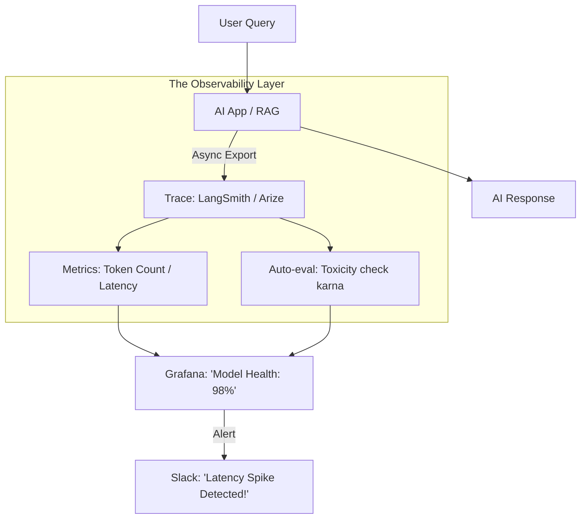

# 🩺 AI Observability Foundations: Peeking Inside the Black Box
> **Level:** Intermediate | **Language:** Hinglish | **Goal:** Production mein AI performance track karne ki art ko master karein, basic "Monitoring" se aage badhkar 2026 mein traces, logs, aur metrics ke through full "Observability" achieve karne ki tarah.

---

## 🧭 1. Beginner-Friendly Hinglish Explanation
Model ko "Deploy" karna toh sirf shuruwat hai. Asli challenge tab aata hai jab real users use use karte hain.

- **The Problem:** Software mein "Error 500" aata hai toh humein pata chal jata hai. Par AI mein "Error" nahi aata, AI "Galti" karta hai.
  - AI ne galat advice di?
  - AI ne toxic language use ki?
  - AI slow ho gaya?
- **Observability** ka matlab hai AI ke "Dimaag" ke andar ki har activity ko record karna taaki hum galti ka "Root Cause" dhoond sakein.

Monitoring se humein pata chalta hai ki *"AI is broken."*
Observability se humein pata chalta hai ki *"AI is broken because it got confused by the user's latest PDF upload."*

2026 mein, bina "Observability" ke AI chalana "Aankh band karke gadi chalane" jaisa hai.

---

## 🧠 2. Deep Technical Explanation
AI Observability teen pillars par built hai: **Metrics**, **Logs**, aur **Traces**.

### 1. The Three Pillars:
- **Metrics (The 'What'):** Quantitative data. GPU usage, Latency, Throughput, Token count.
- **Logs (The 'Details'):** Har prompt, har response, aur har system message.
- **Traces (The 'How'):** Ek RAG system mein, ek trace path ko dikhata hai: *Query $\to$ Embedding $\to$ Search $\to$ Top-K Results $\to$ LLM $\to$ Answer.*

### 2. Monitoring vs. Observability:
- **Monitoring:** Pre-defined dashboards. "Kya API up hai?".
- **Observability:** *Unplanned* questions ke answers dene ki ability. "Germany ke users ko suddenly image generation ke dauran 404 errors kyun milne lage?".

### 3. Evaluation-in-Production:
- Real-time mein "Faithfulness" ko track karne ke liye real-world logs par automatically ek "Small Evaluation" (jaise RAGAS) run karna.

---

## 🏗️ 3. Observability Components
| Component | Function | Tool Example |
| :--- | :--- | :--- |
| **Collector** | AI servers se logs gather karta hai | Arize Phoenix / LangSmith |
| **Storage** | High-volume traces ko store karta hai | ClickHouse / ElasticSearch |
| **Visualizer** | Dashboards aur Flow charts | Grafana / Honeycomb |
| **Evaluator** | Logs ki quality ko grade karta hai | DeepEval / OpenAI Evals |
| **Alerting** | Agar latency $> 2s$ ho toh Slack par notify karta hai | PagerDuty |

---

## 📐 4. Mathematical Intuition
- **The P99 Latency:** 
  AI mein, "Average Latency" useless hai. Ek user $1s$ wait kar sakta hai, jabki dusra $30s$ wait karega.
  - **P50:** Median latency ($50\%$ users isse faster hain).
  - **P99:** $99\%$ users isse faster hain.
  **Goal:** P99 Latency ko ek strict threshold ke neeche rakhein. Agar P99 high hai, toh aapki "Scaling" logic fail ho rahi hai.

---

## 📊 5. AI Observability Pipeline (Diagram)

```mermaid
graph TD
    User[User Query] --> AI[AI App / RAG]
    AI --> Answer[AI Response]
    
    subgraph "The Observability Layer"
    AI -- "Async Export" --> Trace[Trace: LangSmith / Arize]
    Trace --> Stats[Metrics: Token Count / Latency]
    Trace --> Eval[Auto-eval: Toxicity check karna]
    end
    
    Stats & Eval --> Dashboard[Grafana: 'Model Health: 98%']
    Dashboard -- "Alert" --> Engineer[Slack: 'Latency Spike Detected!']
```

---

## 💻 6. Production-Ready Examples (Implementing Tracing with Arize Phoenix)
```python
# 2026 Pro-Tip: Traces ke liye OpenInference (OTEL) standard ka use karein.

import phoenix as px
from phoenix.trace.openai import OpenAIInstrumentor

# 1. Observability local server ko start karein
session = px.launch_app()

# 2. Apni AI library (OpenAI, LangChain, LlamaIndex) ko instrument karein
OpenAIInstrumentor().instrument()

# 3. Ab, har LLM call automatically 'Traced' ho jayegi
# Aap Phoenix UI mein AI ka full 'Thought Process' dekh sakte hain
response = openai.chat.completions.create(
    model="gpt-4o",
    messages=[{"role": "user", "content": "How to scale K8s?"}]
)

print(f"Apna trace check karein: {session.url}")
```

---

## ❌ 7. Failure Cases
- **Metric Overload:** Bahut zyada metrics (e.g., har ek weight change) ko record karna. Yeh "Noise" create karta hai aur real problems ko dhoondhna impossible bana deta hai.
- **Privacy Leak:** Galti se user ke credit card number ko "Observability Dashboard" mein log kar dena jahan puri team use dekh sake. **Fix: Logging se pehle PII ko redact (hide) karein.**
- **Log Lag:** Traces ko dikhne mein 10 minutes lagte hain. Jab tak aap error dekhte hain, user ja chuka hota hai.

---

## 🛠️ 8. Debugging Guide
- **Symptom:** "Users hallucinations report kar rahe hain, par dashboard keh raha hai 'API Healthy'."
- **Check:** **Evaluation Metrics**. Aap "Uptime" toh monitor kar rahe hain par "Quality" nahi. Apne pipeline mein ek **Faithfulness** checker add karein.
- **Symptom:** "Latency har ghante badh rahi hai."
- **Check:** **Memory Leak**. Kya aapka AI old "Contexts" ko memory mein rakh raha hai? RAM kahan use ho rahi hai yeh dhoondhne ke liye profiler ka use karein.

---

## ⚖️ 9. Tradeoffs
- **Sampling Rate:** 
  - $100\%$ queries log karna: Perfect details par high cost aur high storage zaroorat hogi.
  - $1\%$ queries log karna: Cheap hai par aap us ek ONE critical bug ko miss kar sakte hain.
- **Real-time vs. Batch:** 
  - Real-time eval slow hoti hai. 
  - Batch eval fast hoti hai par aapko bug ke baare mein kal pata chalega.

---

## 🛡️ 10. Security Concerns
- **Observability Injection:** Ek hacker model ke performance metrics ko kharab karne aur false alerts trigger karne ke liye "Fake Feedback" (Thumbs down) ke sath 1 million queries bhej raha hai.

---

## 📈 11. Scaling Challenges
- **High-Volume Tracing:** Agar aapke app ke 1 million users hain, toh aapka "Observability Data" aapke actual database se bhi LARGER ho sakta hai. Aapko ek dedicated **Distributed Tracing** infrastructure (jaise Jaeger) ki zaroorat padegi.

---

## 💸 12. Cost Considerations
- **The 'Monitoring Tax':** Managed observability platforms (jaise Datadog ya LangSmith) aapke total AI budget ka **$10-20\%$** cost kar sakte hain. **Strategy: $95\%$ queries ke liye sirf 'Metadata' log karein aur sirf $5\%$ ke liye 'Full Content'.**

---

## ✅ 13. Best Practices
- **SLIs/SLOs define karein:** Service Level Indicators (e.g., "Latency") aur Objectives (e.g., "95% queries under 2s").
- **Logs ke liye 'Semantic Search' ka use karein:** Keywords search karne ke bajaye, apne log database mein "Users jo gusse mein the" search karein.
- **Automated Root Cause Analysis:** Apne error logs ko read karne aur "System kyun fail hua" ko summarize karne ke liye ek chote LLM ka use karein.

---

## ⚠️ 14. Common Mistakes
- **No 'Feedback' loop:** Logs collect karna par prompt ya model ko improve karne ke liye unka kabhi use na karna.
- **'Cost' metrics ko ignore karna:** Yeh toh pata hona ki AI fast hai, par yeh na pata hona ki yeh aapko tokens mein $\$500$ per day cost kar raha hai.

---

## 📝 15. Interview Questions
1. **"AI mein Monitoring aur Observability ke beech kya difference hai?"**
2. **"Observability ke 'Three Pillars' ko explain karein."**
3. **"AI logging system mein aap PII (Personal Info) ko kaise handle karte hain?"**

---

## 🚀 15. Latest 2026 Industry Patterns
- **Explainable Observability:** Aise dashboards jo sirf ek "Latency Spike" hi nahi dikhate balki us exact code change ko highlight karte hain jiski wajah se yeh hua.
- **Self-Healing Infrastructure:** Agar "Faithfulness" score drop ho jata hai, toh system automatically ek zyada reliable (par slow) model jaise GPT-4o par switch kar jata hai.
- **Log Compression for LLMs:** Naye algorithms jo "Repetitive AI patterns" ko remove karke 1TB of text logs ko 10GB mein store kar sakte hain.
