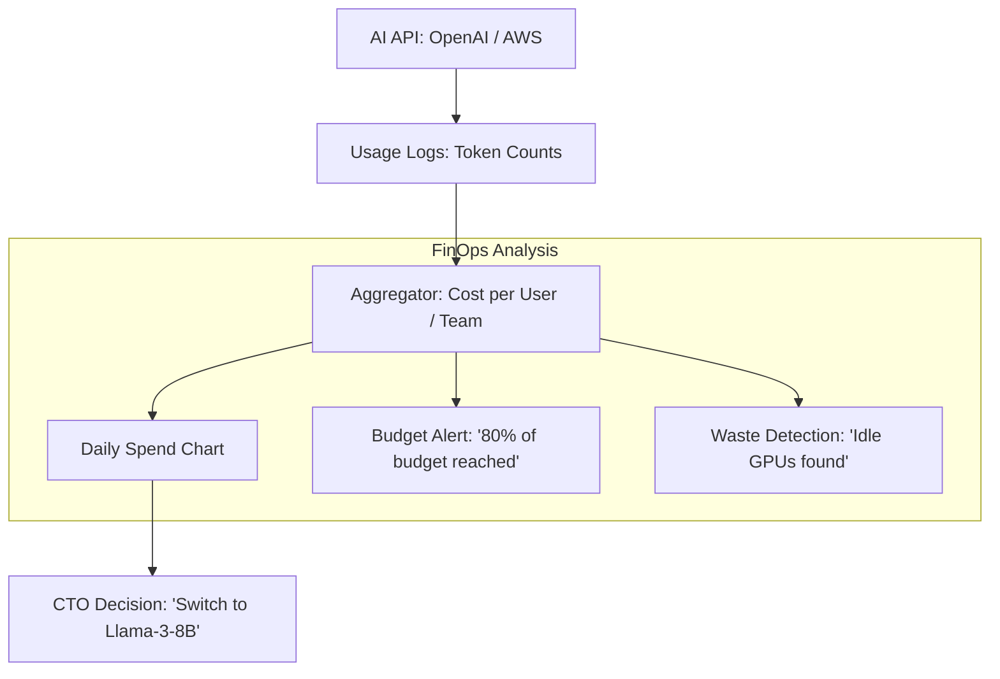

# 💰 Cost Tracking & FinOps: The AI Economy
> **Level:** Intermediate | **Language:** Hinglish | **Goal:** Master the art of managing AI budgets, exploring Token-based pricing, GPU utilization costs, Cloud billing, and the 2026 strategies for building "Profitable" AI businesses.

---

## 🧭 1. Beginner-Friendly Hinglish Explanation
AI banana sasta nahi hai. 

- **The Problem:** Ek engineer ne "GPT-4" se 1 million rows summarize karwa di aur agle din company ka **$\$10,000$** ka bill aa gaya. 
- AI mein cost "Fixed" nahi hoti, wo "Usage" par depend karti hai. 
  - Kitne tokens use huye?
  - Kitne der tak GPU chala?
  - Kitna data transfer hua?

**FinOps** (Finance + Operations) ka matlab hai AI ki "Fizul kharchi" ko rokna. 
- Iska matlab ye nahi ki AI use na karein, balki ye ensure karna ki har kharch huye dollar ki "Value" mil rahi hai.

2026 mein, ek acha AI engineer wahi hai jo model ki accuracy ke saath-saath uske **"Token Bill"** ka bhi dhyan rakhe.

---

## 🧠 2. Deep Technical Explanation
AI costs are divided into **Inference Costs** (Variable) and **Training Costs** (Fixed/Capital).

### 1. Token-based Pricing (API Economy):
- Most APIs (OpenAI, Anthropic) charge per **1 Million Tokens.**
- **Input Tokens** are usually cheaper than **Output Tokens** because input can be processed in parallel.

### 2. GPU Hourly Costs (Self-hosted):
- If you rent an H100 for $\$3/hr$, you pay even if the GPU is $0\%$ utilized.
- **Goal:** Maximize **GPU Utilization.** If your GPU is idle $50\%$ of the time, you are wasting $50\%$ of your money.

### 3. The 'Prompt Tax':
- Long system prompts (e.g., giving 50 examples) increase the cost of EVERY single user query.
- **Optimization:** Use **Prompt Caching** (supported by Anthropic/OpenAI in 2026) to pay for long prompts only once.

### 4. Unit Economics (Cost per Task):
- Calculate: "How much does it cost to summarize one customer support ticket?". If it costs $\$0.10$ but the ticket only saves you $\$0.05$, your AI is a loss-making machine.

---

## 🏗️ 3. Cost Metrics Comparison
| Metric | Definition | Optimization Strategy |
| :--- | :--- | :--- |
| **Cost per 1k Tokens**| Price of text generation | Use smaller models (Llama-3-8B) |
| **Cost per Inference** | Total cost including GPU/Network| Increase Batch Size |
| **GPU Utilization** | How busy is the GPU? | Continuous Batching |
| **Cloud Egress** | Data moving out of Cloud | Keep data and compute in same region|
| **Human-in-loop Cost**| Cost of human review | Better automated Evals |

---

## 📐 4. Mathematical Intuition
- **The Profitability Equation:** 
  $$\text{Monthly Profit} = (\text{Users} \times \text{Subscription Fee}) - (\text{Inference Cost} + \text{Infrastructure Cost})$$
  As users grow, your **Inference Cost** grows linearly. To scale profitably, you MUST reduce the **Cost-per-Query** over time through quantization and prompt engineering.

---

## 📊 5. AI Cost Monitoring Dashboard (Diagram)


---

## 💻 6. Production-Ready Examples (Estimating Token Cost in Python)
```python
# 2026 Pro-Tip: Use 'tiktoken' or 'litellm' to track costs before sending the bill.

import tiktoken

def estimate_cost(text, model="gpt-4o"):
    # 1. Count tokens
    encoding = tiktoken.encoding_for_model(model)
    num_tokens = len(encoding.encode(text))
    
    # 2. Apply 2026 pricing (Example)
    # $5.00 per 1M input tokens
    cost = (num_tokens / 1_000_000) * 5.00
    
    return num_tokens, cost

prompt = "Analyze this 50-page legal document..."
tokens, price = estimate_cost(prompt)
print(f"This prompt will cost: ${price:.4f} ({tokens} tokens)")

# If price > $1, maybe ask for user confirmation first! 💸
```

---

## ❌ 7. Failure Cases
- **The 'Infinite Loop' Bug:** An AI agent gets stuck in a loop and calls a paid API 10,000 times in 10 minutes. **Fix: Set 'Hard Spending Limits' in your API dashboard.**
- **Over-provisioning:** Renting 8x H100s for a project that only has 10 users.
- **Ignoring Output Length:** Letting the model write a 2000-word essay for a simple "Hello" query. **Fix: Set `max_tokens`.**

---

## 🛠️ 8. Debugging Guide
- **Symptom:** "Monthly bill is $3x$ higher than last month."
- **Check:** **Token usage per user**. Did one user find a way to "Spam" the AI? Or did you change the system prompt and forget that it's now $2x$ longer?
- **Symptom:** "High GPU bill but low traffic."
- **Check:** **Idle timeout**. Are your GPU servers staying "ON" even when no one is using them? Implement **Scale-to-Zero**.

---

## ⚖️ 9. Tradeoffs
- **Buy vs. Rent:** 
  - Renting GPUs is flexible but expensive in the long run. 
  - Buying GPUs is cheap in the long run but requires massive upfront "Capital" and a team to manage them.
- **Accuracy vs. Cost:** Using GPT-4o ($100\%$ accurate, $\$30/M$ tokens) vs. Llama-3-8B ($90\%$ accurate, $\$0.10/M$ tokens).

---

## 🛡️ 10. Security Concerns
- **Token Theft:** A hacker stealing your API key and using your budget to train their own models. **Use 'Short-lived' keys and IP-whitelisting.**

---

## 📈 11. Scaling Challenges
- **Multi-tenant Billing:** If you are a B2B company, how do you charge "Company A" for their specific AI usage while "Company B" uses the same cluster? You need a **Cost Allocation** system.

---

## 💸 12. Cost Considerations
- **Reserved Instances:** Committing to 3 years of GPU usage can save you **$60\%$**.
- **Model Distillation:** Training a small model to "Mimic" a big model. The small model is $100x$ cheaper to run.

---

## ✅ 13. Best Practices
- **Implement 'Prompt Caching':** If you have a 5000-token context that doesn't change, cache it!
- **Use 'Semantic Caching':** If a user asks a question that was asked 5 minutes ago, return the cached answer instead of calling the LLM again.
- **Budget Alerts:** Set alerts at $50\%, 75\%,$ and $100\%$ of your monthly budget.

---

## ⚠️ 14. Common Mistakes
- **Assuming 'Open Source' is 'Free':** Running Llama-3-70B on your own GPUs can actually be MORE expensive than using an API if you don't have enough traffic to keep the GPUs busy.
- **Ignoring Data Storage:** Storing 100TB of "Chat History" on expensive NVMe drives.

---

## 📝 15. Interview Questions
1. **"What is FinOps and why is it important for AI teams?"**
2. **"Explain the difference between Input Token and Output Token pricing."**
3. **"How does 'Scale-to-Zero' help in reducing infrastructure costs?"**

---

## 🚀 15. Latest 2026 Industry Patterns
- **Token-Aware Load Balancing:** Routers that send "Short queries" to cheap models and "Complex queries" to expensive models automatically.
- **Carbon-Cost Integration:** Dashboards that show you the "Financial Cost" and the "CO2 Cost" of your AI generation.
- **AI for FinOps:** Using a small AI to monitor the "Cloud Bill" and find ways to save money (The AI is fixing its own cost!).
