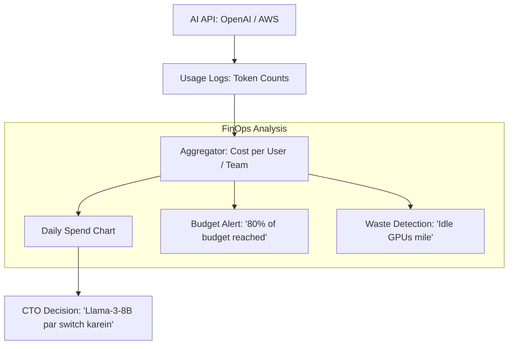

# 💰 Cost Tracking & FinOps: The AI Economy
> **Level:** Intermediate | **Language:** Hinglish | **Goal:** AI budgets manage karne ki art ko master karein, Token-based pricing, GPU utilization costs, Cloud billing, aur 2026 mein "Profitable" AI businesses build karne ki strategies ko explore karte hue.

---

## 🧭 1. Beginner-Friendly Hinglish Explanation
AI banana sasta nahi hai. 

- **The Problem:** Ek engineer ne "GPT-4" se 1 million rows summarize karwa di aur agle din company ka **$\$10,000$** ka bill aa gaya. 
- AI mein cost "Fixed" nahi hoti, wo "Usage" par depend karti hai. 
  - Kitne tokens use huye?
  - Kitne der tak GPU chala?
  - Kitna data transfer hua?

**FinOps** (Finance + Operations) ka matlab hai AI ki "Fizul kharchi" ko rokna. 
- Iska matlab ye nahi ki AI use na karein, balki ye ensure karna ki har kharch huye dollar ki "Value" mil rahi hai.

2026 mein, ek acha AI engineer wahi hai jo model ki accuracy ke saath-saath uske **"Token Bill"** ka bhi dhyan rakhe.

---

## 🧠 2. Deep Technical Explanation
AI costs **Inference Costs** (Variable) aur **Training Costs** (Fixed/Capital) mein divided hoti hain.

### 1. Token-based Pricing (API Economy):
- Kafi saari APIs (OpenAI, Anthropic) **1 Million Tokens** ke basis par charge karti hain.
- **Input Tokens** aamtaur par **Output Tokens** se cheap hote hain kyunki input ko parallel mein process kiya ja sakta hai.

### 2. GPU Hourly Costs (Self-hosted):
- Agar aap $\$3/hr$ par ek H100 rent karte hain, toh aapko tab bhi pay karna padega jab GPU ki utilization $0\%$ ho.
- **Goal:** **GPU Utilization** ko maximize karna. Agar aapka GPU $50\%$ time idle (khali) baitha hai, toh aap apne paise ka $50\%$ waste kar rahe hain.

### 3. The 'Prompt Tax':
- Lambe system prompts (e.g., 50 examples dena) HAR ek user query ki cost ko badha dete hain.
- **Optimization:** Lambe prompts ke liye sirf ek baar pay karne ke liye **Prompt Caching** (jo 2026 mein Anthropic/OpenAI dwara supported hai) ka use karein.

### 4. Unit Economics (Cost per Task):
- Calculate karein: "Ek customer support ticket ko summarize karne mein kitni cost aati hai?". Agar isme $\$0.10$ lagte hain par ticket se sirf $\$0.05$ bachte hain, toh aapka AI ek loss-making machine hai.

---

## 🏗️ 3. Cost Metrics Comparison
| Metric | Definition | Optimization Strategy |
| :--- | :--- | :--- |
| **Cost per 1k Tokens**| Price of text generation | Smaller models (Llama-3-8B) ka use karein |
| **Cost per Inference** | Total cost including GPU/Network| Batch Size badhayein |
| **GPU Utilization** | How busy is the GPU? | Continuous Batching |
| **Cloud Egress** | Data moving out of Cloud | Data aur compute ko same region mein rakhein |
| **Human-in-loop Cost**| Cost of human review | Better automated Evals ka use karein |

---

## 📐 4. Mathematical Intuition
- **The Profitability Equation:** 
  $$\text{Monthly Profit} = (\text{Users} \times \text{Subscription Fee}) - (\text{Inference Cost} + \text{Infrastructure Cost})$$
  Jaise-jaise users badhenge, aapki **Inference Cost** linearly badhegi. Profitably scale karne ke liye, aapko quantization aur prompt engineering ke zariye samay ke sath **Cost-per-Query** ko reduce karna hi hoga.

---

## 📊 5. AI Cost Monitoring Dashboard (Diagram)

```mermaid
graph TD
    API[AI API: OpenAI / AWS] --> Log[Usage Logs: Token Counts]
    Log --> Agg[Aggregator: Cost per User / Team]
    
    subgraph "FinOps Analysis"
    Agg --> Chart[Daily Spend Chart]
    Agg --> Alert[Budget Alert: '80% of budget reached']
    Agg --> Waste[Waste Detection: 'Idle GPUs mile']
    end
    
    Chart --> CTO[CTO Decision: 'Llama-3-8B par switch karein']
```

---

## 💻 6. Production-Ready Examples (Estimating Token Cost in Python)
```python
# 2026 Pro-Tip: Bill aane se pehle costs track karne ke liye 'tiktoken' ya 'litellm' ka use karein.

import tiktoken

def estimate_cost(text, model="gpt-4o"):
    # 1. Tokens count karein
    encoding = tiktoken.encoding_for_model(model)
    num_tokens = len(encoding.encode(text))
    
    # 2. 2026 pricing apply karein (Example)
    # $5.00 per 1M input tokens
    cost = (num_tokens / 1_000_000) * 5.00
    
    return num_tokens, cost

prompt = "Analyze this 50-page legal document..."
tokens, price = estimate_cost(prompt)
print(f"This prompt will cost: ${price:.4f} ({tokens} tokens)")

# Agar price > $1 ho, toh shayad pehle user se confirmation maangein! 💸
```

---

## ❌ 7. Failure Cases
- **The 'Infinite Loop' Bug:** Ek AI agent loop mein stuck ho jata hai aur 10 minutes mein paid API ko 10,000 times call kar deta hai. **Fix: Apne API dashboard mein 'Hard Spending Limits' set karein.**
- **Over-provisioning:** Ek aise project ke liye 8x H100s rent karna jiske paas sirf 10 users hain.
- **Ignoring Output Length:** Model ko ek simple "Hello" query ke liye 2000-word ka essay likhne dena. **Fix: `max_tokens` set karein.**

---

## 🛠️ 8. Debugging Guide
- **Symptom:** "Monthly bill pichle month ke mukable $3x$ high hai."
- **Check:** **Token usage per user**. Kya kisi user ne AI ko "Spam" karne ka tareeqa dhoondh liya? Ya fir aapne system prompt change kiya aur bhool gaye ki yeh ab $2x$ lamba hai?
- **Symptom:** "GPU bill high hai par traffic low hai."
- **Check:** **Idle timeout**. Kya aapke GPU servers tab bhi "ON" rehte hain jab koi unhe use nahi kar raha? **Scale-to-Zero** implement karein.

---

## ⚖️ 9. Tradeoffs
- **Buy vs. Rent:** 
  - GPUs rent karna flexible hai par long run mein expensive hota hai. 
  - GPUs kharidna long run mein sasta hai par iske liye massive upfront "Capital" (paise) aur unhe manage karne ke liye ek team chahiye.
- **Accuracy vs. Cost:** GPT-4o ($100\%$ accurate, $\$30/M$ tokens) use karna vs Llama-3-8B ($90\%$ accurate, $\$0.10/M$ tokens) use karna.

---

## 🛡️ 10. Security Concerns
- **Token Theft:** Ek hacker aapki API key steal karke aapke budget se apne models train kar raha hai. **'Short-lived' keys aur IP-whitelisting ka use karein.**

---

## 📈 11. Scaling Challenges
- **Multi-tenant Billing:** Agar aap ek B2B company hain, toh aap same cluster use karne par "Company A" ko uski specific AI usage ke liye kaise charge karenge jabki "Company B" bhi wahi use kar rahi hai? Aapko ek **Cost Allocation** system ki zaroorat padegi.

---

## 💸 12. Cost Considerations
- **Reserved Instances:** 3 saal ke liye GPU usage commit karne se aap **$60\%$** tak save kar sakte hain.
- **Model Distillation:** Ek bade model ko "Mimic" (nakal) karne ke liye ek chote model ko train karna. Chote model ko run karna $100x$ sasta hota hai.

---

## ✅ 13. Best Practices
- **'Prompt Caching' implement karein:** Agar aapke paas 5000-token ka context hai jo change nahi hota, toh use cache karein!
- **'Semantic Caching' ka use karein:** Agar koi user wahi question poochta hai jo 5 minutes pehle poocha gaya tha, toh LLM ko dobara call karne ke bajaye cached answer return karein.
- **Budget Alerts:** Apne monthly budget ke $50\%, 75\%,$ aur $100\%$ par alerts set karein.

---

## ⚠️ 14. Common Mistakes
- **Yeh assume kar lena ki 'Open Source' matlab 'Free' hai:** Agar aapke paas GPUs ko busy rakhne ke liye enough traffic nahi hai, toh apne GPUs par Llama-3-70B run karna actually paid API use karne se bhi MORE expensive ho sakta hai.
- **Data Storage ko ignore karna:** Expensive NVMe drives par 100TB of "Chat History" store karna.

---

## 📝 15. Interview Questions
1. **"FinOps kya hai aur AI teams ke liye yeh kyun important hai?"**
2. **"Input Token aur Output Token pricing ke beech difference explain karein."**
3. **"'Scale-to-Zero' infrastructure costs ko reduce karne mein kaise help karta hai?"**

---

## 🚀 15. Latest 2026 Industry Patterns
- **Token-Aware Load Balancing:** Aise routers jo "Short queries" ko cheap models par aur "Complex queries" ko automatically expensive models par bhej dete hain.
- **Carbon-Cost Integration:** Aise dashboards jo aapko aapke AI generation ki "Financial Cost" aur "CO2 Cost" dono dikhate hain.
- **AI for FinOps:** "Cloud Bill" ko monitor karne aur paise bachane ke tarike dhoondhne ke liye ek chote AI ka use karna (AI khud apni hi cost ko fix kar raha hai!).
 Pregressing with files...
