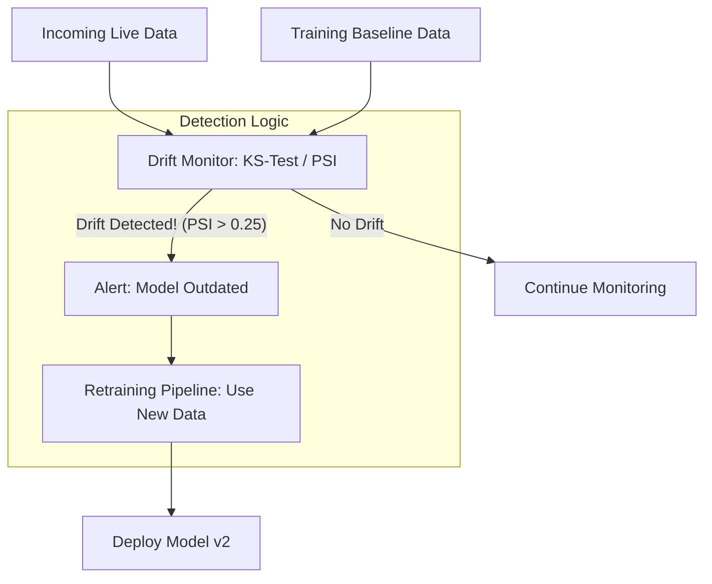

# 🌊 Drift Detection: Handling the Shifting World
> **Level:** Advanced | **Language:** Hinglish | **Goal:** Master the techniques used to detect when an AI model's performance degrades over time, exploring Concept Drift, Data Drift, KS-Tests, and the 2026 strategies for automated "Model Retraining."

---

## 🧭 1. Beginner-Friendly Hinglish Explanation
AI model ek "Snapshot" hota hai. Wo us waqt ki duniya ko jaanta hai jab use train kiya gaya tha.

- **The Problem:** Duniya badalti rehti hai. 
  - Maan lo aapne ek "Real Estate AI" banaya 2023 mein. 
  - 2026 mein inflation aur market prices badal gaye. 
  - Aapka model abhi bhi 2023 ki prices ke hisaab se prediction de raha hai.
- **Drift** ka matlab hai AI model ki accuracy ka dheere-dheere kam hona kyunki "Naya Data" purane data se alag hai.

Ye bilkul **Mobile Phone** ki tarah hai—2 saal baad wo "Slow" lagne lagta hai kyunki naye apps zyada heavy ho jate hain. AI mein bhi humein check karte rehna padta hai ki model "Purana" (Outdated) toh nahi ho gaya.

---

## 🧠 2. Deep Technical Explanation
Drift is broadly categorized into **Data Drift** and **Concept Drift.**

### 1. Data Drift (Feature Drift):
- The distribution of your input features changes. 
- *Example:* Your model was trained on users aged 20-30, but now your app is popular with users aged 50-60. The "Age" feature has drifted ($P(X)$ changed).

### 2. Concept Drift:
- The relationship between input and output changes.
- *Example:* Before COVID, "Home office" wasn't a major factor in house prices. After COVID, it became critical. The "Reasoning" for the price changed ($P(Y|X)$ changed).

### 3. Detection Methods:
- **Statistical Tests:** Comparing the "Baseline" (Training) distribution with the "Current" (Production) distribution using **Kolmogorov-Smirnov (KS) Test** or **Kullback-Leibler (KL) Divergence.**
- **Performance Monitoring:** If your model's accuracy/F1-score starts dropping in production, it's a clear sign of drift.

---

## 🏗️ 3. Types of Drift Comparison
| Type | Math Representation | Real-world Example |
| :--- | :--- | :--- |
| **Data Drift** | $P(X)$ changes | Users are now using 'Slang' which AI doesn't know |
| **Concept Drift** | $P(Y|X)$ changes | A new law changes how 'Tax' is calculated |
| **Prior Drift** | $P(Y)$ changes | Suddenly everyone is buying 'Solar' instead of 'Coal'|
| **Label Drift** | Ground truth changes | A 'Healthy' blood pressure range is redefined |

---

## 📐 4. Mathematical Intuition
- **Population Stability Index (PSI):** 
  A metric used to measure how much a variable has shifted.
  $$PSI = \sum ((\% \text{Actual} - \% \text{Expected}) \times \ln(\frac{\% \text{Actual}}{\% \text{Expected}}))$$
  - $PSI < 0.1$: No change.
  - $0.1 < PSI < 0.25$: Slight drift.
  - **$PSI > 0.25$:** Significant drift! Time to retrain.

---

## 📊 5. Drift Detection Workflow (Diagram)


---

## 💻 6. Production-Ready Examples (Detecting Data Drift with Evidently.ai)
```python
# 2026 Pro-Tip: Use 'Evidently' to generate drift reports automatically.

from evidently.report import Report
from evidently.metric_preset import DataDriftPreset

# 1. Compare 'Reference' (Training) vs 'Current' (Production) data
report = Report(metrics=[
    DataDriftPreset(),
])

# reference_data and current_data are Pandas DataFrames
report.run(reference_data=train_df, current_data=prod_df)

# 2. Get the results
drift_status = report.as_dict()["metrics"][0]["result"]["dataset_drift"]

if drift_status:
    print("Warning: Data Drift Detected! 🚨")
    # Trigger Airflow DAG for retraining
else:
    print("Model is stable. ✅")
```

---

## ❌ 7. Failure Cases
- **Seasonal Drift:** Every December, "Gift" sales go up. This looks like drift to a simple monitor, but it's just "Seasonality." **Fix: Use 'Season-aware' baselines.**
- **False Positives:** A small change in data distribution that doesn't actually hurt model accuracy.
- **Abrupt Drift:** A sudden event (like a War or a Pandemic) makes the model useless overnight. Statistical tests might take a few days to "Confirm" it, while the business loses money.

---

## 🛠️ 8. Debugging Guide
- **Symptom:** "Model accuracy is fine, but users are complaining."
- **Check:** **Sub-population Drift**. Maybe the model is still good for "Men" but has become terrible for "Women." General drift tests might hide this.
- **Symptom:** "PSI is high for the 'ID' column."
- **Check:** **Feature Selection**. You shouldn't be monitoring "ID" columns. Monitor only "Meaningful" features.

---

## ⚖️ 9. Tradeoffs
- **Detection Sensitivity:** 
  - High sensitivity finds drift early but gives many "False Alarms."
  - Low sensitivity is stable but misses the point where the model starts "Lying."
- **Window Size:** Comparing today's data vs. last year vs. last week.

---

## 🛡️ 10. Security Concerns
- **Adversarial Drift:** A competitor purposefully sending "Strange Data" to your AI to trigger a "Retraining" job on their poisoned data.

---

## 📈 11. Scaling Challenges
- **Real-time Drift Detection:** Running KS-tests on 1 million rows every second is computationally expensive. **Solution: Use 'Streaming' statistical algorithms.**

---

## 💸 12. Cost Considerations
- **Retraining Cost:** Retraining a large model every time "Drift" is detected can cost thousands. **Strategy: Try 'Fine-tuning' on the new data instead of a full retrain.**

---

## ✅ 13. Best Practices
- **Monitor both Data and Performance:** Sometimes data drifts but the model is still correct. Sometimes the model fails even if data looks the same.
- **Use 'Champion-Challenger' models:** When drift is detected, train a new model (Challenger) but only replace the old one (Champion) if the Challenger performs better on a "Blind" test set.
- **Log Everything:** You can't detect drift if you don't have the original training distribution saved.

---

## ⚠️ 14. Common Mistakes
- **Ignoring the 'Ground Truth':** Relying only on feature drift. The most important metric is **Performance Drift** (Is the prediction actually wrong?).
- **Static Thresholds:** Using a fixed $PSI=0.25$ for all features. Some features are naturally more "Volatile" than others.

---

## 📝 15. Interview Questions
1. **"What is the difference between Data Drift and Concept Drift?"**
2. **"How does the Kolmogorov-Smirnov (KS) test help in detecting drift?"**
3. **"Explain the concept of 'Champion-Challenger' model deployment."**

---

## 🚀 15. Latest 2026 Industry Patterns
- **LLM Drift Monitoring:** New techniques to detect drift in "Embeddings" (e.g., finding if the 'Semantic Space' of user queries has shifted).
- **Self-Healing AI:** Models that automatically "Update their own weights" in real-time as they see new data (Online Learning).
- **Drift-Aware Routing:** If drift is detected for "European Users," the system routes them to a specialized model while the rest stay on the main model.
