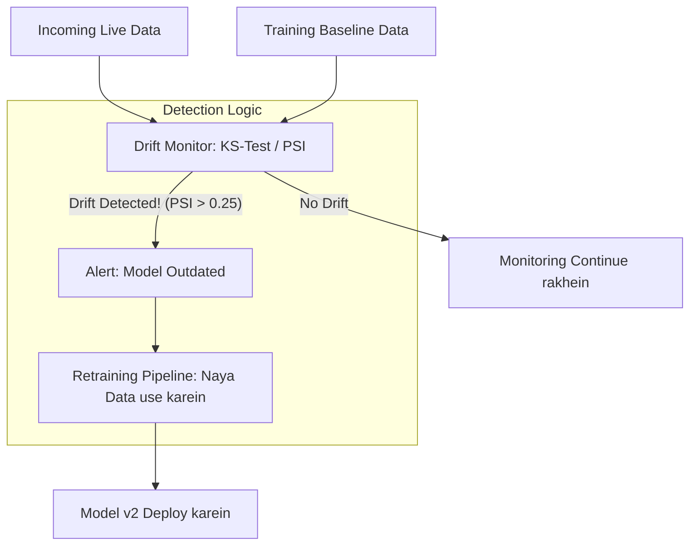

# 🌊 Drift Detection: Handling the Shifting World
> **Level:** Advanced | **Language:** Hinglish | **Goal:** AI model ki performance degrade hone ko detect karne ki techniques ko master karein, Concept Drift, Data Drift, KS-Tests, aur 2026 mein automated "Model Retraining" ki strategies ko explore karte hue.

---

## 🧭 1. Beginner-Friendly Hinglish Explanation
AI model ek "Snapshot" hota hai. Wo us waqt ki duniya ko jaanta hai jab use train kiya gaya tha.

- **The Problem:** Duniya badalti rehti hai. 
  - Maan lo aapne ek "Real Estate AI" banaya 2023 mein. 
  - 2026 mein inflation aur market prices badal gaye. 
  - Aapka model abhi bhi 2023 ki prices ke hisaab se prediction de raha hai.
- **Drift** ka matlab hai AI model ki accuracy ka dheere-dheere kam hona kyunki "Naya Data" purane data se alag hai.

Ye bilkul **Mobile Phone** ki tarah hai—2 saal baad wo "Slow" lagne lagta hai kyunki naye apps zyada heavy ho jate hain. AI mein bhi humein check karte rehna padta hai ki model "Purana" (Outdated) toh nahi ho gaya.

---

## 🧠 2. Deep Technical Explanation
Drift ko broadly **Data Drift** aur **Concept Drift** mein categorize kiya jata hai.

### 1. Data Drift (Feature Drift):
- Aapke input features ka distribution change ho jata hai. 
- *Example:* Aapka model 20-30 saal ke users par train hua tha, par ab aapka app 50-60 saal ke users ke beech popular ho gaya hai. Isse "Age" feature drift ho gaya hai ($P(X)$ change ho gaya).

### 2. Concept Drift:
- Input aur output ke beech ka relationship change ho jata hai. 
- *Example:* COVID se pehle, house prices mein "Home office" koi bada factor nahi tha. COVID ke baad, yeh critical ho gaya. Price ki "Reasoning" change ho gayi ($P(Y|X)$ change ho gaya).

### 3. Detection Methods:
- **Statistical Tests:** **Kolmogorov-Smirnov (KS) Test** ya **Kullback-Leibler (KL) Divergence** ka use karke "Baseline" (Training) distribution aur "Current" (Production) distribution ko compare karna.
- **Performance Monitoring:** Agar production mein aapke model ki accuracy/F1-score drop hone lagti hai, toh yeh drift ka ek saaf sign hai.

---

## 🏗️ 3. Types of Drift Comparison
| Type | Math Representation | Real-world Example |
| :--- | :--- | :--- |
| **Data Drift** | $P(X)$ changes | Users ab aisi 'Slang' (boli) use kar rahe hain jo AI nahi jaanta |
| **Concept Drift** | $P(Y|X)$ changes | Ek naya law change karta hai ki 'Tax' kaise calculate hoga |
| **Prior Drift** | $P(Y)$ changes | Suddenly sabhi log 'Coal' ke bajaye 'Solar' kharid rahe hain |
| **Label Drift** | Ground truth changes | Ek 'Healthy' blood pressure range ko redefine kiya jata hai |

---

## 📐 4. Mathematical Intuition
- **Population Stability Index (PSI):** 
  A metric used to measure how much a variable has shifted.
  $$PSI = \sum ((\% \text{Actual} - \% \text{Expected}) \times \ln(\frac{\% \text{Actual}}{\% \text{Expected}}))$$
  - $PSI < 0.1$: Koi change nahi.
  - $0.1 < PSI < 0.25$: Slight (thoda) drift.
  - **$PSI > 0.25$:** Significant drift! Retrain karne ka time aa gaya hai.

---

## 📊 5. Drift Detection Workflow (Diagram)

```mermaid
graph TD
    Data[Incoming Live Data] --> Monitor[Drift Monitor: KS-Test / PSI]
    Training[Training Baseline Data] --> Monitor
    
    subgraph "Detection Logic"
    Monitor -- "Drift Detected! (PSI > 0.25)" --> Alert[Alert: Model Outdated]
    Alert --> Retrain[Retraining Pipeline: Naya Data use karein]
    end
    
    Retrain --> NewModel[Model v2 Deploy karein]
    Monitor -- "No Drift" --> Continue[Monitoring Continue rakhein]
```

---

## 💻 6. Production-Ready Examples (Detecting Data Drift with Evidently.ai)
```python
# 2026 Pro-Tip: Drift reports automatically generate karne ke liye 'Evidently' ka use karein.

from evidently.report import Report
from evidently.metric_preset import DataDriftPreset

# 1. 'Reference' (Training) vs 'Current' (Production) data ko compare karein
report = Report(metrics=[
    DataDriftPreset(),
])

# reference_data aur current_data Pandas DataFrames hain
report.run(reference_data=train_df, current_data=prod_df)

# 2. Results get karein
drift_status = report.as_dict()["metrics"][0]["result"]["dataset_drift"]

if drift_status:
    print("Warning: Data Drift Detected! 🚨")
    # Retraining ke liye Airflow DAG trigger karein
else:
    print("Model is stable. ✅")
```

---

## ❌ 7. Failure Cases
- **Seasonal Drift:** Har December mein "Gift" ki sales badh jati hain. Ek simple monitor ko yeh drift lag sakta hai, par yeh sirf "Seasonality" hai. **Fix: 'Season-aware' baselines ka use karein.**
- **False Positives:** Data distribution mein ek chota change jo actually model accuracy ko hurt nahi karta.
- **Abrupt Drift:** Ek sudden event (jaise War ya Pandemic) model ko overnight useless bana deta hai. Jabki business paise lose kar raha hota hai, statistical tests ko ise "Confirm" karne mein kuch din lag sakte hain.

---

## 🛠️ 8. Debugging Guide
- **Symptom:** "Model accuracy sahi hai, par users complain kar rahe hain."
- **Check:** **Sub-population Drift**. Ho sakta hai model "Men" ke liye abhi bhi sahi ho par "Women" ke liye terrible (kharab) ho chuka ho. General drift tests isko chupa sakte hain.
- **Symptom:** "'ID' column ke liye PSI high hai."
- **Check:** **Feature Selection**. Aapko "ID" columns ko monitor nahi karna chahiye. Sirf "Meaningful" (zaruri) features ko hi monitor karein.

---

## ⚖️ 9. Tradeoffs
- **Detection Sensitivity:** 
  - High sensitivity drift ko jaldi find kar leti hai par kafi saare "False Alarms" deti hai.
  - Low sensitivity stable hoti hai par us point ko miss kar deti hai jahan model "Lying" (galat predictions) start karta hai.
- **Window Size:** Aaj ke data ko pichle saal vs pichle hafte se compare karna.

---

## 🛡️ 10. Security Concerns
- **Adversarial Drift:** Ek competitor jaanबूझkar aapke AI ko "Strange Data" bhej raha hai taaki unke poisoned data par ek "Retraining" job trigger ho sake.

---

## 📈 11. Scaling Challenges
- **Real-time Drift Detection:** Har second 1 million rows par KS-tests run karna computationally expensive hai. **Solution: 'Streaming' statistical algorithms ka use karein.**

---

## 💸 12. Cost Considerations
- **Retraining Cost:** Jab bhi "Drift" detect ho tab bade model ko retrain karna hazaron dollars cost kar sakta hai. **Strategy: Full retrain ke bajaye naye data par 'Fine-tuning' try karein.**

---

## ✅ 13. Best Practices
- **Data aur Performance dono monitor karein:** Kabhi-kabhi data drift hota hai par model abhi bhi sahi hota hai. Kabhi-kabhi model fail ho jata hai jabki data bilkul same dikhta hai.
- **'Champion-Challenger' models ka use karein:** Jab drift detect ho, toh ek naya model (Challenger) train karein par purane wale (Champion) ko tabhi replace karein jab Challenger ek "Blind" test set par behtar perform kare.
- **Log Everything:** Agar aapke paas original training distribution saved nahi hai, toh aap drift detect nahi kar sakte.

---

## ⚠️ 14. Common Mistakes
- **'Ground Truth' ko ignore karna:** Sirf feature drift par rely karna. Sabse important metric **Performance Drift** hai (Kya prediction actually galat hai?).
- **Static Thresholds:** Sabhi features ke liye ek fixed $PSI=0.25$ use karna. Kuch features naturally dusro se zyada "Volatile" (chachal/badalne wale) hote hain.

---

## 📝 15. Interview Questions
1. **"Data Drift aur Concept Drift ke beech kya difference hai?"**
2. **"Kolmogorov-Smirnov (KS) test drift detect karne mein kaise help karta hai?"**
3. **"'Champion-Challenger' model deployment ke concept ko explain karein."**

---

## 🚀 15. Latest 2026 Industry Patterns
- **LLM Drift Monitoring:** "Embeddings" mein drift detect karne ki nayi techniques (e.g., yeh pata lagana ki kya user queries ka 'Semantic Space' shift ho gaya hai).
- **Self-Healing AI:** Aise models jo naya data dekhte hi real-time mein automatically "apne weights ko update" kar lete hain (Online Learning).
- **Drift-Aware Routing:** Agar "European Users" ke liye drift detect hota hai, toh system unhe ek specialized model par route kar deta hai jabki baaki main model par rehte hain.
