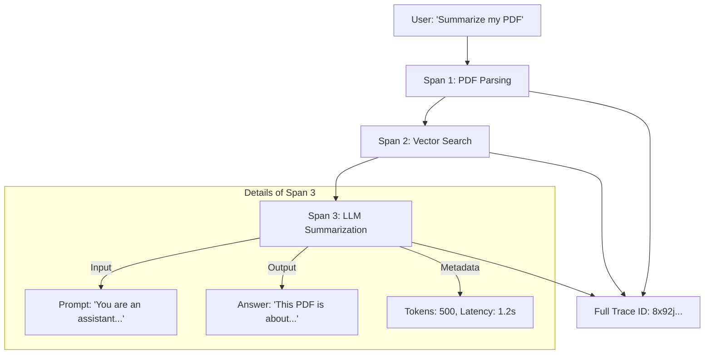

# 📜 Logging & Tracing for LLMs: The Audit Trail
> **Level:** Intermediate | **Language:** Hinglish | **Goal:** Master the art of recording and analyzing LLM interactions, exploring OpenInference, LangSmith, Tracing RAG pipelines, and the 2026 strategies for debugging complex AI workflows.

---

## 🧭 1. Beginner-Friendly Hinglish Explanation
AI model se baat karna "One-way" nahi hota, wo ek "Bada Process" hota hai.

- **The Problem:** Maan lo aapne AI se pucha: *"What is my bank balance?"*
  1. AI ne aapka "Query" samjha.
  2. Usne "Database" se info nikalne ki koshish ki.
  3. Usne "Search" kiya.
  4. Phir usne "Answer" likha.
- Agar answer galat aaya, toh galti kahan hui? Query samajhne mein? Ya Database se info nikalne mein? 
- Bina **Tracing** ke aap kabhi pata nahi laga payenge.

**Logging** ka matlab hai: "Kya hua?" (Events ko likhna).
**Tracing** ka matlab hai: "Kaise hua?" (Pura rasta/path dikhana).

2026 mein, professional AI projects mein "LangSmith" ya "Arize Phoenix" jaise tools use hote hain jo har AI step ko ek "Visual Map" mein dikhate hain.

---

## 🧠 2. Deep Technical Explanation
LLM Tracing is built on top of **OpenTelemetry (OTEL)** and the **OpenInference** standard.

### 1. The Trace Structure:
- **Trace:** The entire journey of a single user request.
- **Span:** A single unit of work (e.g., An LLM call, a Vector DB search, a Tool execution).
- **Attributes:** Metadata attached to spans (e.g., Token count, Model name, Latency).

### 2. Tracing RAG Pipelines:
- In RAG, a trace must capture:
  - **Query Embedding:** Which model was used?
  - **Retrieved Documents:** Which chunks were found? What were their relevance scores?
  - **Prompt Template:** What was the final prompt sent to the LLM?
  - **Generation:** The final answer and its logprobs.

### 3. Asynchronous Logging:
- Never log "Synchronously" in a production API. If your logging database is slow, your user will wait. **Always use an 'Async Logger' or a 'Sidecar' pattern.**

---

## 🏗️ 3. Logging vs. Tracing
| Feature | Logging | Tracing |
| :--- | :--- | :--- |
| **View** | Individual lines of text | **End-to-end journey (Graph)** |
| **Focus** | Errors and Events | **Latency and Logic flow** |
| **Example** | `Error: API Timeout` | `Query -> Search(2s) -> LLM(1s)` |
| **Tool** | ELK Stack / CloudWatch | **LangSmith / Arize Phoenix** |
| **Complexity** | Low | High |

---

## 📐 4. Mathematical Intuition
- **The Sampling Ratio:** 
  Logging 100% of LLM text is expensive ($1$ token generated = $1$ token logged). 
  $$\text{Storage Cost} = \text{Requests} \times \text{Avg. Tokens} \times \text{Cost per GB}$$
  **The 2026 Strategy:** Log **$100\%$ of Metadata** (Latency, Success/Fail) but only **$5\%$ of Content** (The actual text) for manual review.

---

## 📊 5. LLM Trace Visualization (Diagram)


---

## 💻 6. Production-Ready Examples (Manual Tracing with OpenInference)
```python
# 2026 Pro-Tip: Use 'OpenInference' for vendor-agnostic tracing.

from openinference.instrumentation.openai import OpenAIInstrumentor
from opentelemetry import trace
from opentelemetry.sdk.trace import TracerProvider

# 1. Setup the Tracer
trace.set_tracer_provider(TracerProvider())
OpenAIInstrumentor().instrument()

# 2. This LLM call is now automatically 'Wrapped' in a trace
# It will capture the prompt, the response, and the token usage
import openai
response = openai.chat.completions.create(
    model="gpt-4o",
    messages=[{"role": "user", "content": "Explain Quantum Physics."}]
)

# You can now see this in Jaeger, Honeycomb, or Arize Phoenix.
```

---

## ❌ 7. Failure Cases
- **Circular Tracing:** Accidentally logging the "Log" itself, creating an infinite loop that crashes the server.
- **Sensitive Data Leak:** Logging the user's password because it was part of the "Query." **Fix: Use 'PII Redactors' in the logging middleware.**
- **High Latency:** Your tracing library is taking $500ms$ to send the trace to the server, making the app feel slow.

---

## 🛠️ 8. Debugging Guide
- **Symptom:** "AI answer is 'I don't know', even though info is in the DB."
- **Check:** **Retriever Span**. Look at the trace. Did the search actually find the right chunks? If the retrieved docs are irrelevant, the LLM isn't at fault—the Search is.
- **Symptom:** "Suddenly all LLM calls are failing."
- **Check:** **Trace Metadata**. Look for `Error: RateLimitExceeded`. Your API key is probably over its limit.

---

## ⚖️ 9. Tradeoffs
- **Self-hosted vs. SaaS:** 
  - SaaS (LangSmith) is beautiful and zero-setup but expensive. 
  - Self-hosted (Arize Phoenix / Jaeger) is free but you have to manage the database and servers.

---

## 🛡️ 10. Security Concerns
- **Prompt Leakage via Logs:** If your internal logging dashboard is hacked, all your "Secret" system prompts and user conversations are exposed. **Enable 'Encryption at rest' for your logs.**

---

## 📈 11. Scaling Challenges
- **The 'Thundering Herd' Problem:** When your app has 1 million users, sending 1 million traces per second will crash your logging server. **Solution: Use 'Head-based Sampling' (Decide to log before starting the request).**

---

## 💸 12. Cost Considerations
- **Log Retention:** Storing 1 year of chat logs can cost thousands. **Strategy: Keep detailed traces for 7 days, and aggregated metrics (Stats) forever.**

---

## ✅ 13. Best Practices
- **Assign a 'Correlation ID':** Pass the same ID from the Frontend to the Backend to the LLM to the Database. This allows you to see the "Whole Story" across all servers.
- **Use 'Semantic Search' on Traces:** Find all traces where the AI said "I'm sorry" to find where your model is failing.
- **Link Traces to Feedback:** When a user clicks "Thumbs down," attach that feedback directly to the Trace ID.

---

## ⚠️ 14. Common Mistakes
- **Logging only 'Success':** Forgetting to log the "Error messages" when the API fails.
- **No versioning:** Not logging which version of the "Prompt Template" was used for a specific query.

---

## 📝 15. Interview Questions
1. **"What is the difference between a Trace and a Span?"**
2. **"How do you trace a multi-step RAG pipeline?"**
3. **"Explain the 'OpenInference' standard and why it matters."**

---

## 🚀 15. Latest 2026 Industry Patterns
- **Trace-to-Dataset:** Automatically taking "High-quality" traces and converting them into a "Fine-tuning Dataset" for the next model version.
- **Visual Debugging:** Using "Flow charts" where you can click on an AI step and see exactly what the "Embedding vector" looked like at that moment.
- **LLM-Powered Root Cause Analysis:** An AI that watches your traces and alerts you: *"Hey, it looks like your PDF parser is failing for scanned images."*
