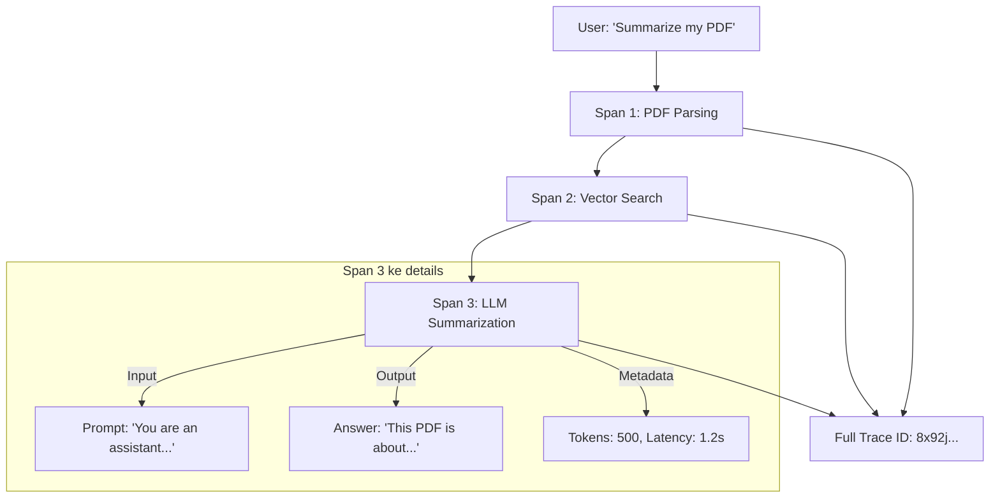

# 📜 Logging & Tracing for LLMs: The Audit Trail
> **Level:** Intermediate | **Language:** Hinglish | **Goal:** LLM interactions ko record aur analyze karne ki art ko master karein, OpenInference, LangSmith, RAG pipelines ko trace karna, aur 2026 mein complex AI workflows ko debug karne ki strategies ko explore karte hue.

---

## 🧭 1. Beginner-Friendly Hinglish Explanation
AI model se baat karna "One-way" nahi hota, wo ek "Bada Process" hota hai.

- **The Problem:** Maan lo aapne AI se pucha: *"What is my bank balance?"*
  1. AI ne aapka "Query" samjha.
  2. Usne "Database" se info nikalne ki koshish ki.
  3. Usne "Search" kiya.
  4. Phir usne "Answer" likha.
- Agar answer galat aaya, toh galti kahan hui? Query samajhne mein? Ya Database se info nikalne mein? 
- Bina **Tracing** ke aap kabhi pata nahi laga payenge.

**Logging** ka matlab hai: "Kya hua?" (Events ko likhna).
**Tracing** ka matlab hai: "Kaise hua?" (Pura rasta/path dikhana).

2026 mein, professional AI projects mein "LangSmith" ya "Arize Phoenix" jaise tools use hote hain jo har AI step ko ek "Visual Map" mein dikhate hain.

---

## 🧠 2. Deep Technical Explanation
LLM Tracing **OpenTelemetry (OTEL)** aur **OpenInference** standard ke upar built hai.

### 1. The Trace Structure:
- **Trace:** Ek single user request ki puri journey.
- **Span:** Kaam ki ek single unit (e.g., Ek LLM call, ek Vector DB search, ek Tool execution).
- **Attributes:** Spans ke sath attached metadata (e.g., Token count, Model name, Latency).

### 2. Tracing RAG Pipelines:
- RAG mein, ek trace ko yeh capture karna chahiye:
  - **Query Embedding:** Kaunsa model use kiya gaya tha?
  - **Retrieved Documents:** Kaunse chunks mile? Unke relevance scores kya the?
  - **Prompt Template:** LLM ko bheja gaya final prompt kya tha?
  - **Generation:** Final answer aur uske logprobs.

### 3. Asynchronous Logging:
- Production API mein kabhi bhi "Synchronously" log na karein. Agar aapka logging database is slow, toh aapka user wait karega. **Hamesha ek 'Async Logger' ya 'Sidecar' pattern ka use karein.**

---

## 🏗️ 3. Logging vs. Tracing
| Feature | Logging | Tracing |
| :--- | :--- | :--- |
| **View** | Individual lines of text | **End-to-end journey (Graph)** |
| **Focus** | Errors and Events | **Latency and Logic flow** |
| **Example** | `Error: API Timeout` | `Query -> Search(2s) -> LLM(1s)` |
| **Tool** | ELK Stack / CloudWatch | **LangSmith / Arize Phoenix** |
| **Complexity** | Low | High (Zyada) |

---

## 📐 4. Mathematical Intuition
- **The Sampling Ratio:** 
  LLM text ko 100% log karna expensive hai ($1$ token generated = $1$ token logged). 
  $$\text{Storage Cost} = \text{Requests} \times \text{Avg. Tokens} \times \text{Cost per GB}$$
  **2026 Strategy:** **$100\%$ Metadata** (Latency, Success/Fail) log karein, par manual review ke liye sirf **$5\%$ Content** (actual text) log karein.

---

## 📊 5. LLM Trace Visualization (Diagram)

```mermaid
graph TD
    User[User: 'Summarize my PDF'] --> S1[Span 1: PDF Parsing]
    S1 --> S2[Span 2: Vector Search]
    S2 --> S3[Span 3: LLM Summarization]
    
    subgraph "Span 3 ke details"
    S3 -- "Input" --> P[Prompt: 'You are an assistant...']
    S3 -- "Output" --> A[Answer: 'This PDF is about...']
    S3 -- "Metadata" --> M[Tokens: 500, Latency: 1.2s]
    end
    
    S1 & S2 & S3 --> Trace[Full Trace ID: 8x92j...]
```

---

## 💻 6. Production-Ready Examples (Manual Tracing with OpenInference)
```python
# 2026 Pro-Tip: Vendor-agnostic tracing ke liye 'OpenInference' ka use karein.

from openinference.instrumentation.openai import OpenAIInstrumentor
from opentelemetry import trace
from opentelemetry.sdk.trace import TracerProvider

# 1. Tracer setup karein
trace.set_tracer_provider(TracerProvider())
OpenAIInstrumentor().instrument()

# 2. Yeh LLM call ab automatically ek trace mein 'Wrapped' (lapta hua) ho jayegi
# Yeh prompt, response, aur token usage ko capture karegi
import openai
response = openai.chat.completions.create(
    model="gpt-4o",
    messages=[{"role": "user", "content": "Explain Quantum Physics."}]
)

# Ab aap ise Jaeger, Honeycomb, ya Arize Phoenix mein dekh sakte hain.
```

---

## ❌ 7. Failure Cases
- **Circular Tracing:** Galti se "Log" ko hi log kar dena, jisse ek infinite loop ban jata hai aur server crash ho jata hai.
- **Sensitive Data Leak:** User ke password ko log kar dena kyunki woh "Query" ka part tha. **Fix: Logging middleware mein 'PII Redactors' ka use karein.**
- **High Latency:** Aapki tracing library trace ko server par bhejne mein $500ms$ le rahi hai, jisse app slow feel ho raha hai.

---

## 🛠️ 8. Debugging Guide
- **Symptom:** "AI ka answer 'I don't know' hai, jabki info DB mein hai."
- **Check:** **Retriever Span**. Trace ko dekhein. Kya search ne actually sahi chunks find kiye? Agar retrieved docs irrelevant hain, toh LLM ki galti nahi hai—galti Search ki hai.
- **Symptom:** "Suddenly saari LLM calls fail ho rahi hain."
- **Check:** **Trace Metadata**. `Error: RateLimitExceeded` ko check karein. Aapki API key shayad limit se upar ho chuki hai.

---

## ⚖️ 9. Tradeoffs
- **Self-hosted vs. SaaS:** 
  - SaaS (LangSmith) beautiful aur zero-setup hota hai par expensive hota hai. 
  - Self-hosted (Arize Phoenix / Jaeger) free hota hai par aapko database aur servers khud manage karne padte hain.

---

## 🛡️ 10. Security Concerns
- **Prompt Leakage via Logs:** Agar aapka internal logging dashboard hack ho jata hai, toh aapke saare "Secret" system prompts aur user conversations expose ho jayenge. **Apne logs ke liye 'Encryption at rest' enable karein.**

---

## 📈 11. Scaling Challenges
- **The 'Thundering Herd' Problem:** Jab aapke app ke 1 million users hon, toh 1 million traces per second bhejne se aapka logging server crash ho jayega. **Solution: 'Head-based Sampling' (request start karne se pehle log karne ka decision lena) ka use karein.**

---

## 💸 12. Cost Considerations
- **Log Retention:** 1 saal ke chat logs ko store karna hazaron dollars cost kar sakta hai. **Strategy: Detailed traces ko 7 din ke liye rakhein, aur aggregated metrics (Stats) ko forever (hamesha) ke liye.**

---

## ✅ 13. Best Practices
- **'Correlation ID' assign karein:** Same ID ko Frontend se Backend se LLM se Database tak pass karein. Yeh aapko sabhi servers par "Whole Story" dekhne ki permission deta hai.
- **Traces par 'Semantic Search' ka use karein:** Un sabhi traces ko find karein jahan AI ne "I'm sorry" kaha hai taaki pata chale ki aapka model kahan fail ho raha hai.
- **Traces ko Feedback se link karein:** Jab koi user "Thumbs down" par click kare, toh us feedback ko directly Trace ID ke sath attach karein.

---

## ⚠️ 14. Common Mistakes
- **Sirf 'Success' log karna:** API fail hone par "Error messages" ko log karna bhool jana.
- **No versioning:** Ek specific query ke liye "Prompt Template" ke kaunse version ka use kiya gaya tha, use log na karna.

---

## 📝 15. Interview Questions
1. **"Trace aur Span ke beech kya difference hai?"**
2. **"Ek multi-step RAG pipeline ko aap kaise trace karte hain?"**
3. **"'OpenInference' standard ko explain karein aur yeh kyun matters (important) hai."**

---

## 🚀 15. Latest 2026 Industry Patterns
- **Trace-to-Dataset:** Automatically "High-quality" traces ko lekar unhe agle model version ke liye ek "Fine-tuning Dataset" mein convert karna.
- **Visual Debugging:** "Flow charts" ka use karna jahan aap kisi AI step par click kar sakte hain aur dekh sakte hain ki us moment par "Embedding vector" kaisa dikhta tha.
- **LLM-Powered Root Cause Analysis:** Ek AI jo aapke traces ko watch karta hai aur aapko alert karta hai: *"Hey, aisa lagta hai ki aapka PDF parser scanned images ke liye fail ho raha hai."*
