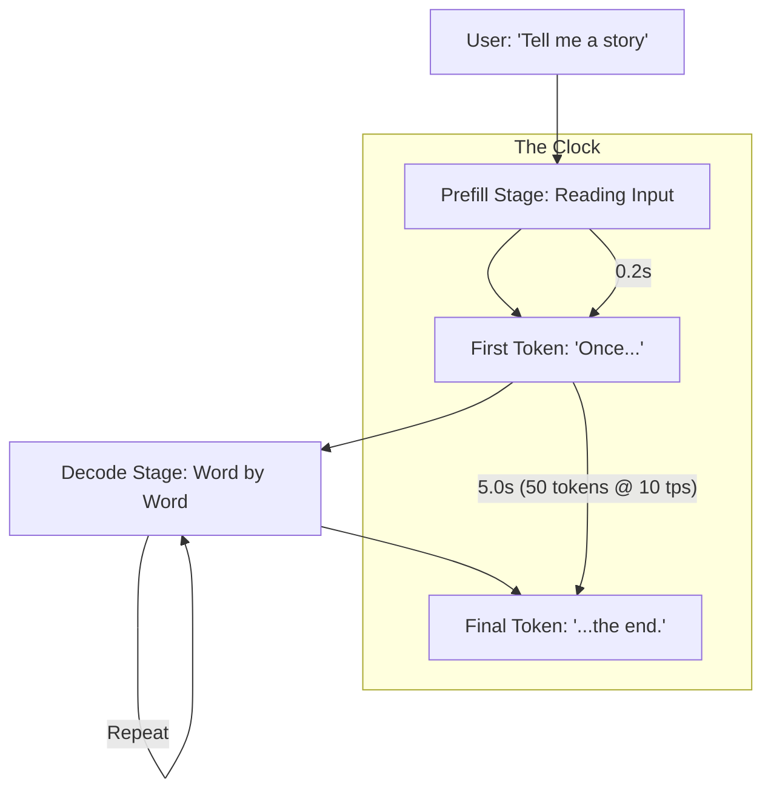

# ⏱️ Monitoring Latency & Throughput: The Speed of AI
> **Level:** Advanced | **Language:** Hinglish | **Goal:** Master the performance metrics of AI systems, exploring TTFT (Time to First Token), TPOT (Time Per Output Token), Queries Per Second (QPS), and the 2026 strategies for building "Ultra-Responsive" AI.

---

## 🧭 1. Beginner-Friendly Hinglish Explanation
AI model ka "Smart" hona kaafi nahi hai, use "Fast" bhi hona chahiye. 

- **The Problem:** Maan lo aap "ChatGPT" se baat kar rahe hain. 
  - Agar aapne sawaal pucha aur AI ne 10 seconds tak kuch nahi bola, toh aapko lagega ki internet chal raha hai ya nahi. (Poor Latency).
  - Agar AI ne turant bolna shuru kiya, par bahut dheere-dheere likh raha hai (1 word per sec), toh bhi aap bor ho jayenge. (Poor Throughput).

**Latency** ka matlab hai: "Response kab shuru hua?"
**Throughput** ka matlab hai: "Ek saath kitne logo ko AI handle kar sakta hai?"

In 2026, hum sirf "Total Time" nahi dekhte, hum **TTFT** (Pehla word kab aaya?) aur **TPS** (Tokens per second) dekhte hain.

---

## 🧠 2. Deep Technical Explanation
Performance in LLMs is measured using specific metrics that reflect the **Autoregressive** nature of the model.

### 1. TTFT (Time to First Token):
- The time from when the user hits 'Enter' to when the FIRST word appears on the screen.
- Crucial for "Perceived Speed." Even if the whole answer takes 10s, a low TTFT makes the user happy.

### 2. TPOT (Time Per Output Token):
- The average time taken to generate each subsequent token. 
- **TPS (Tokens Per Second)** is $1 / TPOT$. 
- Standard: $30-50$ TPS is human-reading speed. $>100$ TPS is ultra-fast.

### 3. Throughput (QPS / RPS):
- How many **Queries Per Second** can the server handle before slowing down?
- Higher throughput means you can serve more users with fewer GPUs.

### 4. KV-Cache Impact:
- Large contexts increase the "Prefill" time (TTFT) because the model has to process all the history before generating the first new word.

---

## 🏗️ 3. Performance Metrics Comparison
| Metric | Meaning | Optimization Goal | User Impact |
| :--- | :--- | :--- | :--- |
| **TTFT** | Delay before start | **Minimize** | Perceived Speed |
| **TPS** | Writing speed | **Maximize** | Reading Experience |
| **Throughput** | Capacity | **Maximize** | Cost / Scalability |
| **Queue Time** | Waiting for a GPU | **Minimize** | Reliability |

---

## 📐 4. Mathematical Intuition
- **The Throughput Equation:** 
  $$\text{Throughput} = \frac{\text{Batch Size} \times \text{Avg. Generation Length}}{\text{Total Latency}}$$
  To increase throughput, we use **Continuous Batching.** Instead of waiting for one user to finish, we "Inject" new users into the GPU batch as soon as any previous user finishes a sentence.

---

## 📊 5. Latency Breakdown (Diagram)


---

## 💻 6. Production-Ready Examples (Measuring TPS in Python)
```python
# 2026 Pro-Tip: Use high-precision timers to measure performance.

import time

def measure_llm_speed(model, prompt):
    start_time = time.perf_counter()
    
    # 1. Start generation
    tokens = []
    first_token_time = None
    
    for token in model.generate(prompt):
        if first_token_time is None:
            first_token_time = time.perf_counter() - start_time
        tokens.append(token)
    
    total_time = time.perf_counter() - start_time
    tps = len(tokens) / (total_time - first_token_time)
    
    print(f"TTFT: {first_token_time:.2f}s")
    print(f"TPS: {tps:.2f} tokens/sec")
    print(f"Total Tokens: {len(tokens)}")

# This helps you find if your 'Bottleneck' is in the beginning or during generation.
```

---

## ❌ 7. Failure Cases
- **The 'Long Input' Slowdown:** A user pastes a $10,000$-word document. The TTFT jumps from $0.1s$ to $5s$ because the GPU is busy "Reading" the input. **Fix: Use 'Prompt Caching'.**
- **Batching Jitter:** When you increase the batch size to save money, the latency for individual users might become "Inconsistent" (sometimes fast, sometimes slow).
- **Cold Starts:** The first user of the day has to wait 2 minutes while the model loads from disk to VRAM. **Fix: Use 'Pre-warmed' instances.**

---

## 🛠️ 8. Debugging Guide
- **Symptom:** "TTFT is low, but TPS is very slow (e.g. 2 tokens/sec)."
- **Check:** **VRAM Overload**. The model might be swapping to System RAM. Reduce your batch size or use a smaller model.
- **Symptom:** "Latency is fine for 10 users, but crashes for 11."
- **Check:** **Max Connections**. Your server (vLLM/Triton) has a limit on how many requests it can queue. Increase the queue size or add more replicas.

---

## ⚖️ 9. Tradeoffs
- **Latency vs. Throughput:** 
  - For a **Chatbot**, we want Low Latency (TTFT). 
  - For **Batch Processing** (e.g., summarizing 1000 PDFs), we want High Throughput.
- **Precision vs. Speed:** 
  - FP16 is slow. 
  - INT4 is $2-3x$ faster.

---

## 🛡️ 10. Security Concerns
- **Denial of Wallet (DoW):** An attacker sending thousands of "Very long" prompts to make your latency spike and your GPU bill explode. **Use 'Rate Limiting' and 'Max Token Limits'.**

---

## 📈 11. Scaling Challenges
- **Dynamic Autoscaling:** Adding a new GPU server takes 2-5 minutes. If your traffic spikes in 10 seconds, your latency will go to "Infinite" before the new server is ready. **Solution: Keep 'Buffer' capacity of $20\%$.**

---

## 💸 12. Cost Considerations
- **TPS-per-Dollar:** In 2026, we don't just measure speed, we measure how many tokens we get per dollar. **Optimization: Move 'Cold' models to cheaper GPUs like L4.**

---

## ✅ 13. Best Practices
- **Use 'Continuous Batching' (vLLM/TGI):** This is the #1 way to improve throughput by $10x$.
- **Implement 'Streaming':** Always stream tokens to the UI. Don't wait for the full answer.
- **Monitor the 'Tail Latency' (P99):** Don't be fooled by a good "Average." The users with the worst experience are the ones who will complain.

---

## ⚠️ 14. Common Mistakes
- **Measuring only 'End-to-End' time:** If total time is 10s, you don't know if the problem was the "Input" or the "Generation."
- **Ignoring Network Latency:** Your AI is fast, but your "Database" or "Internet Connection" is slow.

---

## 📝 15. Interview Questions
1. **"What is TTFT and why is it more important for chat than total latency?"**
2. **"Explain the concept of 'Continuous Batching' in vLLM."**
3. **"How does the KV-Cache affect inference performance?"**

---

## 🚀 15. Latest 2026 Industry Patterns
- **Speculative Decoding:** Running a "Small" model to predict tokens and a "Large" model to verify them, increasing speed by $2-3x$ without losing quality.
- **Prefill-Decode Disaggregation:** Running the "Reading" (Prefill) on one GPU and the "Writing" (Decode) on another to eliminate latency jitter.
- **FlashAttention-3:** The latest algorithm that makes LLM math $2x$ faster on H100 GPUs.
