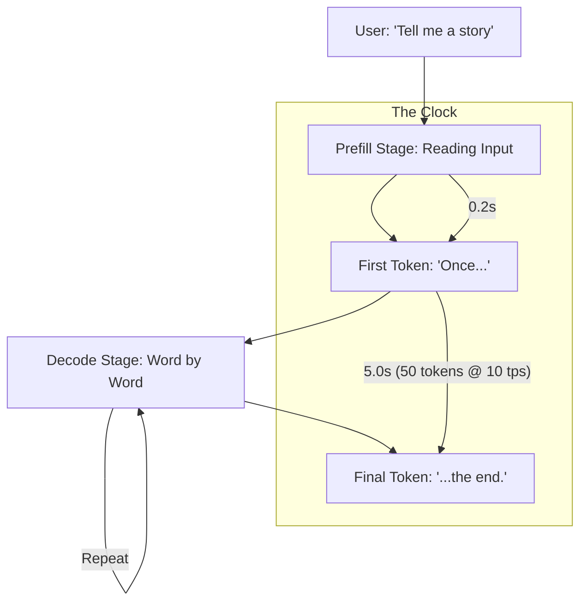

# ⏱️ Monitoring Latency & Throughput: The Speed of AI
> **Level:** Advanced | **Language:** Hinglish | **Goal:** AI systems ke performance metrics ko master karein, TTFT, TPOT, QPS, aur 2026 mein "Ultra-Responsive" AI build karne ki strategies ko explore karte hue.

---

## 🧭 1. Beginner-Friendly Hinglish Explanation
AI model ka "Smart" hona kaafi nahi hai, use "Fast" bhi hona chahiye. 

- **The Problem:** Maan lo aap "ChatGPT" se baat kar rahe hain. 
  - Agar aapne sawaal pucha aur AI ne 10 seconds tak kuch nahi bola, toh aapko lagega ki internet chal raha hai ya nahi. (Poor Latency).
  - Agar AI ne turant bolna shuru kiya, par bahut dheere-dheere likh raha hai (1 word per sec), toh bhi aap bor ho jayenge. (Poor Throughput).

**Latency** ka matlab hai: "Response kab shuru hua?"
**Throughput** ka matlab hai: "Ek saath kitne logo ko AI handle kar sakta hai?"

In 2026, hum sirf "Total Time" nahi dekhte, hum **TTFT** (Pehla word kab aaya?) aur **TPS** (Tokens per second) dekhte hain.

---

## 🧠 2. Deep Technical Explanation
LLMs mein performance ko specific metrics ka use karke measure kiya jata hai jo model ke **Autoregressive** nature ko reflect karte hain.

### 1. TTFT (Time to First Token):
- User ke 'Enter' hit karne se lekar screen par FIRST word (token) dikhne tak ka time.
- Yeh "Perceived Speed" (mehsus hone wali speed) ke liye crucial hai. Bhale hi pure answer mein 10s lag jayein, par low TTFT user ko happy rakhta hai.

### 2. TPOT (Time Per Output Token):
- Har ek subsequent (agle) token ko generate karne mein lagne wala average time. 
- **TPS (Tokens Per Second)** $1 / TPOT$ hota hai. 
- Standard: $30-50$ TPS human-reading speed hoti hai. $>100$ TPS ultra-fast hai.

### 3. Throughput (QPS / RPS):
- Slow down hone se pehle server kitni **Queries Per Second** (QPS) handle kar sakta hai?
- Higher throughput ka matlab hai ki aap kam GPUs ke sath zyada users ko serve kar sakte hain.

### 4. KV-Cache Impact:
- Large contexts "Prefill" time (TTFT) ko badha dete hain kyunki model ko pehla naya word generate karne se pehle pure history ko process karna padta hai.

---

## 🏗️ 3. Performance Metrics Comparison
| Metric | Meaning | Optimization Goal | User Impact |
| :--- | :--- | :--- | :--- |
| **TTFT** | Delay before start | **Minimize** | Perceived Speed |
| **TPS** | Writing speed | **Maximize** | Reading Experience |
| **Throughput** | Capacity | **Maximize** | Cost / Scalability |
| **Queue Time** | Waiting for a GPU | **Minimize** | Reliability |

---

## 📐 4. Mathematical Intuition
- **The Throughput Equation:** 
  $$\text{Throughput} = \frac{\text{Batch Size} \times \text{Avg. Generation Length}}{\text{Total Latency}}$$
  Throughput badhane ke liye, hum **Continuous Batching** ka use karte hain. Ek user ke finish hone ka wait karne ke bajaye, hum naye users ko GPU batch mein "Inject" (daalna) kar dete hain jaise hi koi purana user sentence finish karta hai.

---

## 📊 5. Latency Breakdown (Diagram)

```mermaid
graph TD
    User[User: 'Tell me a story'] --> Prefill[Prefill Stage: Reading Input]
    Prefill --> TTFT[First Token: 'Once...']
    TTFT --> Decode[Decode Stage: Word by Word]
    Decode -- "Repeat" --> Decode
    Decode --> End[Final Token: '...the end.']
    
    subgraph "The Clock"
    Prefill -- "0.2s" --> TTFT
    TTFT -- "5.0s (50 tokens @ 10 tps)" --> End
    end
```

---

## 💻 6. Production-Ready Examples (Measuring TPS in Python)
```python
# 2026 Pro-Tip: Performance ko measure karne ke liye high-precision timers ka use karein.

import time

def measure_llm_speed(model, prompt):
    start_time = time.perf_counter()
    
    # 1. Generation start karein
    tokens = []
    first_token_time = None
    
    for token in model.generate(prompt):
        if first_token_time is None:
            first_token_time = time.perf_counter() - start_time
        tokens.append(token)
    
    total_time = time.perf_counter() - start_time
    tps = len(tokens) / (total_time - first_token_time)
    
    print(f"TTFT: {first_token_time:.2f}s")
    print(f"TPS: {tps:.2f} tokens/sec")
    print(f"Total Tokens: {len(tokens)}")

# Yeh aapko yeh find karne mein help karta hai ki aapka 'Bottleneck' beginning (shuruwat) mein hai ya generation ke dauran.
```

---

## ❌ 7. Failure Cases
- **The 'Long Input' Slowdown:** Ek user $10,000$-word ka document paste karta hai. TTFT $0.1s$ se jump karke $5s$ ho jata hai kyunki GPU input ko "Read" karne mein busy hai. **Fix: 'Prompt Caching' ka use karein.**
- **Batching Jitter:** Jab aap paise bachane ke liye batch size badhate hain, toh individual users ke liye latency "Inconsistent" (kabhi fast, kabhi slow) ho sakti hai.
- **Cold Starts:** Din ke pehle user ko 2 minutes tak wait karna padta hai jab model disk se VRAM mein load ho raha hota hai. **Fix: 'Pre-warmed' instances ka use karein.**

---

## 🛠️ 8. Debugging Guide
- **Symptom:** "TTFT low hai, par TPS bahut slow hai (e.g. 2 tokens/sec)."
- **Check:** **VRAM Overload**. Model shayad System RAM par swap ho raha hai. Apne batch size ko reduce karein ya ek smaller model ka use karein.
- **Symptom:** "Latency 10 users ke liye sahi hai, par 11 ke liye crash ho jati hai."
- **Check:** **Max Connections**. Aapke server (vLLM/Triton) par requests ko queue karne ki ek limit hoti hai. Queue size ko badhayein ya aur replicas add karein.

---

## ⚖️ 9. Tradeoffs
- **Latency vs. Throughput:** 
  - Ek **Chatbot** ke liye, hume Low Latency (TTFT) chahiye. 
  - **Batch Processing** ke liye (e.g., 1000 PDFs ko summarize karna), hume High Throughput chahiye.
- **Precision vs. Speed:** 
  - FP16 slow hota hai. 
  - INT4 $2-3x$ faster hota hai.

---

## 🛡️ 10. Security Concerns
- **Denial of Wallet (DoW):** Ek attacker aapke latency spike aur GPU bill ko badhane ke liye thousands of "Very long" prompts bhej raha hai. **'Rate Limiting' aur 'Max Token Limits' ka use karein.**

---

## 📈 11. Scaling Challenges
- **Dynamic Autoscaling:** Ek naya GPU server add karne mein 2-5 minutes lagte hain. Agar aapka traffic 10 seconds mein spike ho jata hai, toh naya server ready hone se pehle aapki latency "Infinite" ho jayegi. **Solution: $20\%$ ki 'Buffer' capacity rakhein.**

---

## 💸 12. Cost Considerations
- **TPS-per-Dollar:** 2026 mein, hum sirf speed ko measure nahi karte, balki yeh measure karte hain ki per dollar hume kitne tokens mil rahe hain. **Optimization: 'Cold' models ko L4 jaise cheaper GPUs par move karein.**

---

## ✅ 13. Best Practices
- **'Continuous Batching' (vLLM/TGI) ka use karein:** Throughput ko $10x$ improve karne ka yeh #1 tareeqa hai.
- **'Streaming' implement karein:** Hamesha UI par tokens ko stream karein. Full answer ka wait na karein.
- **'Tail Latency' (P99) ko monitor karein:** Ek acche "Average" ke behkawe mein na aayein. Jin users ka experience sabse kharab hota hai, complain wahi karenge.

---

## ⚠️ 14. Common Mistakes
- **Sirf 'End-to-End' time ko measure karna:** Agar total time 10s hai, toh aapko pata nahi chalega ki problem "Input" mein thi ya "Generation" mein.
- **Network Latency ko ignore karna:** Aapka AI toh fast hai, par aapka "Database" ya "Internet Connection" slow hai.

---

## 📝 15. Interview Questions
1. **"TTFT kya hai aur yeh chat ke liye total latency se zyada important kyun hai?"**
2. **"vLLM mein 'Continuous Batching' ke concept ko explain karein."**
3. **"KV-Cache inference performance ko kaise affect karta hai?"**

---

## 🚀 15. Latest 2026 Industry Patterns
- **Speculative Decoding:** Tokens predict karne ke liye ek "Small" model aur unhe verify karne ke liye ek "Large" model run karna, jisse bina quality loss ke speed $2-3x$ badh jati hai.
- **Prefill-Decode Disaggregation:** Latency jitter ko eliminate karne ke liye ek GPU par "Reading" (Prefill) aur dusre par "Writing" (Decode) run karna.
- **FlashAttention-3:** Latest algorithm jo H100 GPUs par LLM math calculations ko $2x$ faster banata hai.
