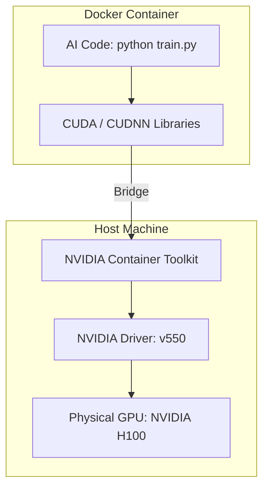

# 🐳 Docker & Containers for AI: Packaging Intelligence
> **Level:** Intermediate | **Language:** Hinglish | **Goal:** Master the use of Docker for AI development, exploring NVIDIA Container Runtime, Dockerfile optimization for GPUs, and the 2026 strategies for building portable, repeatable AI environments.

---

## 🧭 1. Beginner-Friendly Hinglish Explanation
AI development mein sabse bada dard hai **"Dependency Hell."**

- **The Problem:** Ek engineer ke laptop par code chal raha hai, par server par nahi. Kyun?
  - Server par NVIDIA driver purana hai.
  - CUDA version alag hai.
  - Python ka `torch` library version match nahi kar raha.
- **Docker** iska solution hai. Ye ek "Box" (Container) ki tarah hai jiske andar aap apna Code, Libraries, aur yahan tak ki OS ka version bhi "Pack" kar dete hain.

Jab aap kisi ko apna Docker image dete hain, toh unhe sirf `docker run` karna hota hai. Unhe kuch bhi install karne ki zaroori nahi hai. 

In 2026, **"Containerization"** ke bina AI deploy karna unprofessional mana jata hai. 

---

## 🧠 2. Deep Technical Explanation
Docker for AI is specialized because it needs to access the **Physical Hardware (GPU)** from inside the "Virtual" container.

### 1. NVIDIA Container Toolkit (nvidia-docker):
- Standard Docker cannot see the GPU. 
- You must install the `nvidia-container-toolkit` which acts as a "Bridge."
- It allows the container to use the **GPU Drivers** installed on the host machine.

### 2. The Base Image Strategy:
- Never start from a "Raw" Ubuntu image.
- **Always use:** `nvidia/cuda:12.1.0-base-ubuntu22.04` or `pytorch/pytorch:2.2.0-cuda12.1-cudnn8-runtime`.
- These images already have the complex CUDA and CUDNN libraries pre-installed.

### 3. Layer Caching (The 'Fast Build' Trick):
- Docker builds images in "Layers."
- **Pro-Tip:** Copy your `requirements.txt` and run `pip install` BEFORE copying your source code. 
- This way, if you change 1 line of code, Docker doesn't re-install all the libraries (saving you 10 minutes).

### 4. Multi-Stage Builds:
- Using a "Heavy" image with compilers to build the code, and then copying the final "Binary" to a "Lightweight" image for production. This reduces image size from 10GB to 2GB.

---

## 🏗️ 3. Container vs. Virtual Machine (VM) for AI
| Feature | Docker Container | Virtual Machine (VM) |
| :--- | :--- | :--- |
| **Speed** | **Instant Startup** | Slow Boot (Minutes) |
| **Size** | Small (MBs/GBs) | Large (10s of GBs) |
| **GPU Access** | **Direct (via Driver)** | Complex Passthrough |
| **Isolation** | Process-level | Full OS-level |
| **Portability** | **Extreme** | Moderate |

---

## 📐 4. Mathematical Intuition
- **Storage Footprint:** 
  If you have 10 AI containers using the same base image (`pytorch/pytorch`), Docker only stores that base image ONCE on the disk. 
  $$\text{Total Storage} = \text{Base Image Size} + \sum (\text{Layer Changes}_i)$$
  This is why shared base images are the key to scaling AI infrastructure in 2026.

---

## 📊 5. Docker-GPU Architecture (Diagram)


---

## 💻 6. Production-Ready Examples (A High-Fidelity AI Dockerfile)
```dockerfile
# 2026 Pro-Tip: Use 'Runtime' images for production, not 'Devel' images.

# 1. Use the official PyTorch base image
FROM pytorch/pytorch:2.2.1-cuda12.1-cudnn8-runtime

# 2. Set environment variables to avoid 'Interaction' prompts
ENV DEBIAN_FRONTEND=noninteractive

# 3. Install system dependencies
RUN apt-get update && apt-get install -y \
    git \
    curl \
    && rm -rf /var/lib/apt/lists/*

# 4. Copy requirements and install (Better Caching)
WORKDIR /app
COPY requirements.txt .
RUN pip install --no-cache-dir -r requirements.txt

# 5. Copy the rest of the code
COPY . .

# 6. Expose the port for the API (vLLM / FastAPI)
EXPOSE 8000

# 7. Start the server
CMD ["python", "serve.py", "--host", "0.0.0.0"]
```

---

## ❌ 7. Failure Cases
- **Driver Version Mismatch:** Your Docker image was built for CUDA 12, but the server only has NVIDIA Driver v450 (which only supports CUDA 11). **Result: `CUDA error: no CUDA-capable device is detected`.**
- **Huge Images:** Creating a 30GB image because you accidentally included the whole "Dataset" inside the image. **Fix: Use `.dockerignore` to exclude datasets.**
- **Permissions:** Your container runs as `root`, but the mounted dataset folder is owned by another user. The AI can't read the data.

---

## 🛠️ 8. Debugging Guide
- **Symptom:** "Docker is running, but `nvidia-smi` inside shows nothing."
- **Check:** **Runtime Flag**. Are you running with `--gpus all`? 
  `docker run --gpus all my-ai-image nvidia-smi`
- **Symptom:** "No space left on device."
- **Check:** **Docker Prune**. AI images are huge. Old images can quickly fill up your disk. Run `docker system prune -a`.

---

## ⚖️ 9. Tradeoffs
- **Base Image size vs. Features:** 
  - `nvidia/cuda:base`: Small (100MB) but has nothing. 
  - `nvidia/cuda:devel`: Large (3GB) but has everything needed for compiling.
- **Docker vs. Apptainer (Singularity):** For High-Performance Computing (HPC) clusters, Apptainer is safer than Docker.

---

## 🛡️ 10. Security Concerns
- **Root Privileges:** Containers running as `root` can potentially hack the host machine. **Always create a non-root user in your Dockerfile.**
- **Secret Leaks:** Putting `OPENAI_API_KEY` directly in the Dockerfile. **Use 'Docker Secrets' or 'Environment Variables'.**

---

## 📈 11. Scaling Challenges
- **The 'Registry' Bottleneck:** When 100 servers all try to download a 10GB image simultaneously, it crashes your network. **Solution: Use 'P2P Image Pulling' or 'Dragonfly'.**

---

## 💸 12. Cost Considerations
- **Storage Costs:** Storing 1000 versions of your 10GB image on AWS ECR can cost **$\$500/month** in storage fees alone. **Set a 'Lifecycle Policy' to delete old images.**

---

## ✅ 13. Best Practices
- **Use `.dockerignore`:** Exclude `.git`, `__pycache__`, and your giant `data/` folder.
- **Stick to a specific version:** Never use `FROM python:latest`. Use `FROM python:3.10.12-slim`.
- **Scan for Vulnerabilities:** Use `docker scout` to find if your image contains libraries with known security bugs.

---

## ⚠️ 14. Common Mistakes
- **Installing CUDA manually:** Trying to `apt-get install cuda` inside the Dockerfile. (Just use the NVIDIA base image!).
- **Hard-coding Paths:** Using `C:\Users\Name\...` in the code, which obviously won't work inside a Linux Docker container.

---

## 📝 15. Interview Questions
1. **"What is the role of the NVIDIA Container Toolkit?"**
2. **"How do you optimize a Dockerfile to reduce build time for AI models?"**
3. **"Explain why you should avoid putting data/weights inside the Docker image."**

---

## 🚀 15. Latest 2026 Industry Patterns
- **Wasm-Edge:** Running AI models in WebAssembly containers for "Instant" startup and 100x smaller size.
- **Encrypted Containers:** Images that are encrypted and only decrypted inside a "Secure Enclave" on the CPU/GPU.
- **Serverless Docker for GPUs:** Services like **Modal** or **Beam** that let you run a Python function in a container on a remote GPU with one command (`modal run script.py`).
