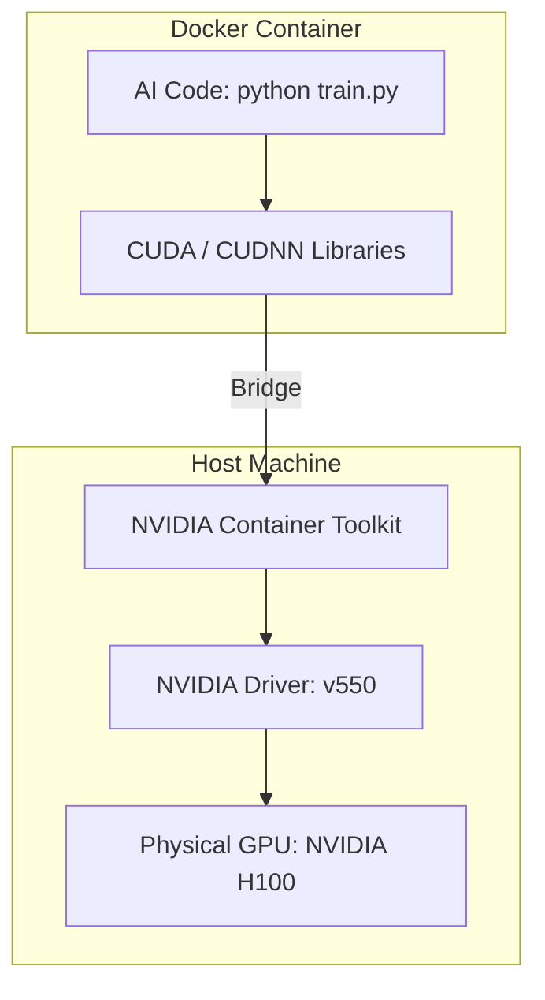

# 🐳 Docker & Containers for AI: Packaging Intelligence
> **Level:** Intermediate | **Language:** Hinglish | **Goal:** AI development ke liye Docker ke use ko master karein, NVIDIA Container Runtime, GPUs ke liye Dockerfile optimization, aur 2026 mein portable, repeatable AI environments build karne ki strategies ko explore karte hue.

---

## 🧭 1. Beginner-Friendly Hinglish Explanation
AI development mein sabse bada dard hai **"Dependency Hell."**

- **The Problem:** Ek engineer ke laptop par code chal raha hai, par server par nahi. Kyun?
  - Server par NVIDIA driver purana hai.
  - CUDA version alag hai.
  - Python ka `torch` library version match nahi kar raha.
- **Docker** iska solution hai. Ye ek "Box" (Container) ki tarah hai jiske andar aap apna Code, Libraries, aur yahan tak ki OS ka version bhi "Pack" kar dete hain.

Jab aap kisi ko apna Docker image dete hain, toh unhe sirf `docker run` karna hota hai. Unhe kuch bhi install karne ki zaroori nahi hai. 

In 2026, **"Containerization"** ke bina AI deploy karna unprofessional mana jata hai. 

---

## 🧠 2. Deep Technical Explanation
AI ke liye Docker specialized hota hai kyunki ise "Virtual" container ke andar se **Physical Hardware (GPU)** ko access karne ki zaroorat hoti hai.

### 1. NVIDIA Container Toolkit (nvidia-docker):
- Standard Docker GPU ko nahi dekh sakta. 
- Aapko `nvidia-container-toolkit` install karna hoga jo ek "Bridge" (pul) ki tarah kaam karta hai.
- Yeh container ko host machine par installed **GPU Drivers** use karne ki permission deta hai.

### 2. The Base Image Strategy:
- Kabhi bhi ek "Raw" (sade/khali) Ubuntu image se start na karein.
- **Hamesha use karein:** `nvidia/cuda:12.1.0-base-ubuntu22.04` ya `pytorch/pytorch:2.2.0-cuda12.1-cudnn8-runtime`.
- In images mein complex CUDA aur CUDNN libraries pehle se hi pre-installed hoti hain.

### 3. Layer Caching (The 'Fast Build' Trick):
- Docker images ko "Layers" mein build karta hai.
- **Pro-Tip:** Apne source code ko copy karne se PEHLE `requirements.txt` copy karein aur `pip install` run karein. 
- Is tarah, agar aap code ki 1 line bhi change karte hain, toh Docker saari libraries ko dobara install nahi karega (jisse aapke 10 minutes bachenge).

### 4. Multi-Stage Builds:
- Code build karne ke liye compilers ke sath ek "Heavy" image ka use karna, aur fir production ke liye final "Binary" ko ek "Lightweight" image mein copy karna. Yeh image size ko 10GB se reduce karke 2GB kar deta hai.

---

## 🏗️ 3. Container vs. Virtual Machine (VM) for AI
| Feature | Docker Container | Virtual Machine (VM) |
| :--- | :--- | :--- |
| **Speed** | **Instant Startup (Fauran)** | Slow Boot (Minutes) |
| **Size** | Small (MBs/GBs) | Large (10s of GBs) |
| **GPU Access** | **Direct (via Driver)** | Complex Passthrough (Mushkil) |
| **Isolation** | Process-level | Full OS-level |
| **Portability** | **Extreme (Bahut zyada)** | Moderate |

---

## 📐 4. Mathematical Intuition
- **Storage Footprint:** 
  Agar aapke paas same base image (`pytorch/pytorch`) use karne wale 10 AI containers hain, toh Docker us base image ko disk par sirf EK hi baar store karta hai. 
  $$\text{Total Storage} = \text{Base Image Size} + \sum (\text{Layer Changes}_i)$$
  Yahi wajah hai ki 2026 mein shared base images AI infrastructure ko scale karne ki key (chaabi) hain.

---

## 📊 5. Docker-GPU Architecture (Diagram)

```mermaid
graph TD
    subgraph "Host Machine"
    GPU[Physical GPU: NVIDIA H100]
    Driver[NVIDIA Driver: v550]
    Toolkit[NVIDIA Container Toolkit]
    end
    
    subgraph "Docker Container"
    App[AI Code: python train.py]
    CUDA[CUDA / CUDNN Libraries]
    end
    
    App --> CUDA
    CUDA -- "Bridge" --> Toolkit
    Toolkit --> Driver
    Driver --> GPU
```

---

## 💻 6. Production-Ready Examples (A High-Fidelity AI Dockerfile)
```dockerfile
# 2026 Pro-Tip: Production ke liye 'Runtime' images ka use karein, 'Devel' images ka nahi.

# 1. Official PyTorch base image ka use karein
FROM pytorch/pytorch:2.2.1-cuda12.1-cudnn8-runtime

# 2. 'Interaction' prompts se bachne ke liye environment variables set karein
ENV DEBIAN_FRONTEND=noninteractive

# 3. System dependencies install karein
RUN apt-get update && apt-get install -y \
    git \
    curl \
    && rm -rf /var/lib/apt/lists/*

# 4. Requirements copy karein aur install karein (Better Caching)
WORKDIR /app
COPY requirements.txt .
RUN pip install --no-cache-dir -r requirements.txt

# 5. Baaki ka code copy karein
COPY . .

# 6. API (vLLM / FastAPI) ke liye port expose karein
EXPOSE 8000

# 7. Server start karein
CMD ["python", "serve.py", "--host", "0.0.0.0"]
```

---

## ❌ 7. Failure Cases
- **Driver Version Mismatch:** Aapki Docker image CUDA 12 ke liye build ki gayi thi, par server par sirf NVIDIA Driver v450 hai (jo sirf CUDA 11 ko support karta hai). **Result: `CUDA error: no CUDA-capable device is detected`.**
- **Huge Images:** Galti se image ke andar pura "Dataset" include kar dene ki wajah se 30GB ki image banna. **Fix: Datasets ko exclude karne ke liye `.dockerignore` ka use karein.**
- **Permissions:** Aapka container `root` ke roop mein chalta hai, par mounted dataset folder ka owner koi dusra user hai. AI data ko read nahi kar sakta.

---

## 🛠️ 8. Debugging Guide
- **Symptom:** "Docker chal raha hai, par andar `nvidia-smi` kuch nahi dikha raha."
- **Check:** **Runtime Flag**. Kya aap `--gpus all` ke sath run kar rahe hain?
- **Symptom:** "Device par koi space nahi bacha (No space left on device)."
- **Check:** **Docker Prune**. AI images bahut badi hoti hain. Old images jaldi hi aapke disk ko bhar sakti hain. `docker system prune -a` run karein.

---

## ⚖️ 9. Tradeoffs
- **Base Image size vs. Features:** 
  - `nvidia/cuda:base`: Small (100MB) hota hai par isme kuch nahi hota. 
  - `nvidia/cuda:devel`: Large (3GB) hota hai par isme compiling ke liye zaroorat ki har cheez hoti hai.
- **Docker vs. Apptainer (Singularity):** High-Performance Computing (HPC) clusters ke liye, Apptainer Docker se zyada safe hai.

---

## 🛡️ 10. Security Concerns
- **Root Privileges:** `root` ke roop mein chalne wale containers potentially host machine ko hack kar sakte hain. **Hamesha apne Dockerfile mein ek non-root user create karein.**
- **Secret Leaks:** Dockerfile mein directly `OPENAI_API_KEY` daal dena. **'Docker Secrets' ya 'Environment Variables' ka use karein.**

---

## 📈 11. Scaling Challenges
- **The 'Registry' Bottleneck:** Jab 100 servers ek sath 10GB ki image download karne ki koshish karte hain, toh yeh aapke network ko crash kar deta hai. **Solution: 'P2P Image Pulling' ya 'Dragonfly' ka use karein.**

---

## 💸 12. Cost Considerations
- **Storage Costs:** AWS ECR par apni 10GB image ke 1000 versions store karne ki cost sirf storage fees mein hi **$\$500/month** ho sakti hai. **Old images ko delete karne ke liye 'Lifecycle Policy' set karein.**

---

## ✅ 13. Best Practices
- **`.dockerignore` ka use karein:** `.git`, `__pycache__`, aur apne giant `data/` folder ko exclude karein.
- **Specific version par stick (tike) rahein:** Kabhi bhi `FROM python:latest` use na karein. `FROM python:3.10.12-slim` ka use karein.
- **Scan for Vulnerabilities:** Yeh find karne ke liye ki kya aapki image mein known security bugs wali libraries hain, `docker scout` ka use karein.

---

## ⚠️ 14. Common Mistakes
- **CUDA ko manually install karna:** Dockerfile ke andar `apt-get install cuda` karne ki koshish karna. (Bas NVIDIA base image ka use karein!).
- **Paths ko hard-code karna:** Code mein `C:\Users\Name\...` ka use karna, jo ki zahir hai Linux Docker container ke andar kaam nahi karega.

---

## 📝 15. Interview Questions
1. **"NVIDIA Container Toolkit ka kya role hai?"**
2. **"AI models ke liye build time ko reduce karne ke liye aap Dockerfile ko kaise optimize karte hain?"**
3. **"Explain karein ki aapko Docker image ke andar data/weights daalne se kyun bachna chahiye."**

---

## 🚀 15. Latest 2026 Industry Patterns
- **Wasm-Edge:** "Instant" startup aur 100x smaller size ke liye WebAssembly containers mein AI models run karna.
- **Encrypted Containers:** Aise images jo encrypted hoti hain aur sirf CPU/GPU par "Secure Enclave" ke andar hi decrypt hoti hain.
- **Serverless Docker for GPUs:** Modal ya Beam jaise services jo aapko ek single command (`modal run script.py`) se remote GPU par container ke andar Python function run karne dete hain.
