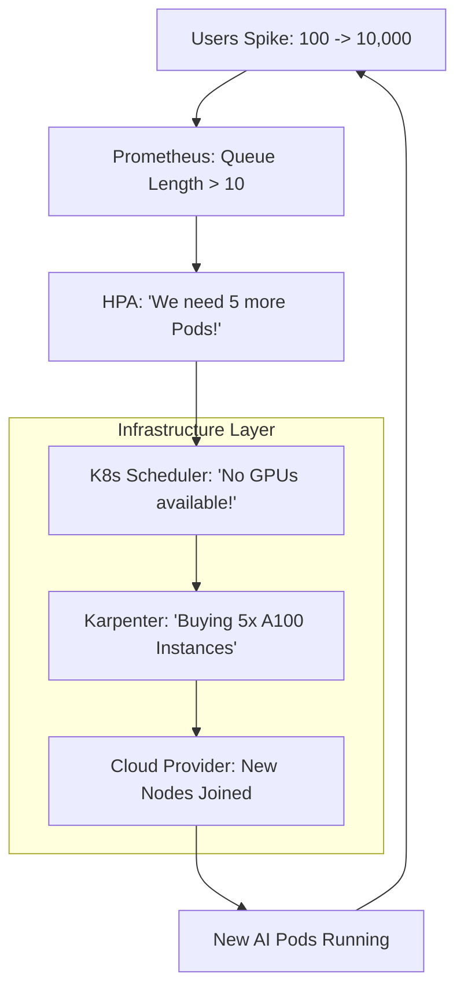

# 📈 Kubernetes Scaling Strategies: Handling the AI Surge
> **Level:** Advanced | **Language:** Hinglish | **Goal:** Master the art of scaling AI workloads automatically on K8s, exploring HPA, VPA, Cluster Autoscaler, and the 2026 strategies for building "Infinite" AI capacity.

---

## 🧭 1. Beginner-Friendly Hinglish Explanation
Maan lo aapne ek "AI Image Generator" app launch kiya. 

- **The Scenario:** Raat ko 10 baje achanak 1 Lakh log app par aa jate hain. 
- Aapke paas sirf 2 GPUs hain. Sabke liye app "Slow" ho jayegi.
- **Scaling** ka matlab hai ki jaise hi traffic badhe, aapka system apne aap naye "Servers" (GPUs) kharid le (Cloud se) aur kaam ko distribute kar de.
- Aur jaise hi log chale jayein, wo servers wapis kar de taaki paise bachein.

**Kubernetes (K8s)** mein ye sab "Auto" hota hai. 
1. **Horizontal Scaling:** Naye Pods (AI instances) banana.
2. **Vertical Scaling:** Ek hi Pod ko zyada power (RAM/CPU) dena.
3. **Cluster Scaling:** Pura naya "Loha" (Hardware server) cluster mein add karna.

2026 mein, scaling sirf "Load handle" karna nahi hai, balki **"Cost optimization"** ka khel hai.

---

## 🧠 2. Deep Technical Explanation
Scaling in K8s is managed by three primary controllers.

### 1. HPA (Horizontal Pod Autoscaler):
- It monitors a metric (e.g., CPU, Memory, or a Custom AI Metric like `queue_length`).
- When the metric exceeds a threshold, it creates new copies (Pods) of your AI app.
- **2026 Standard:** Scaling based on **Concurrency**. If one GPU can handle 4 users, and you have 40 users, HPA scales to 10 Pods.

### 2. VPA (Vertical Pod Autoscaler):
- It observes the actual usage of your app. 
- If your AI is constantly crashing because it needs more RAM, VPA will automatically restart the Pod with a higher "Memory Limit."
- **Caution:** VPA is usually NOT recommended for production AI because it requires a restart. Use HPA instead.

### 3. Cluster Autoscaler (CA) / Karpenter:
- When HPA tries to create a new Pod but there are NO free GPUs in the cluster, the Pod becomes "Pending."
- **Cluster Autoscaler** sees this "Pending" Pod and asks the Cloud (AWS/GCP) to spin up a new physical GPU node.
- **Karpenter (by AWS):** The modern, faster alternative that picks the most cost-effective GPU instance in seconds.

---

## 🏗️ 3. Scaling Strategies Comparison
| Strategy | What it Scales | Trigger | Speed |
| :--- | :--- | :--- | :--- |
| **HPA** | Number of Pods | Traffic / Queue | Fast (Seconds) |
| **VPA** | Size of 1 Pod | Resource usage | Slow (Requires restart) |
| **Cluster Autoscaler**| Number of Servers| Pending Pods | Slow (Minutes) |
| **Karpenter** | Number of Servers| Pending Pods | **Very Fast (Seconds)** |

---

## 📐 4. Mathematical Intuition
- **The 'Cool Down' Period:** 
  You don't want your cluster to "Flicker" (adding/deleting servers every 10 seconds). 
  $$\text{Scaling Decision} = \text{Threshold reached for } T \text{ consecutive minutes}$$
  Usually, we set **Scale-up** to be aggressive (1 minute) and **Scale-down** to be conservative (10 minutes) to avoid "Churn."

---

## 📊 5. K8s Auto-scaling Workflow (Diagram)


---

## 💻 6. Production-Ready Examples (HPA Config for AI Concurrency)
```yaml
# 2026 Pro-Tip: Use 'KEDA' to scale based on AI-specific queues.

apiVersion: keda.sh/v1alpha1
kind: ScaledObject
metadata:
  name: ai-image-gen-scaler
spec:
  scaleTargetRef:
    name: ai-image-gen-deployment
  minReplicaCount: 0  # Scale to Zero when no one is using it! 💸
  maxReplicaCount: 50
  triggers:
  - type: prometheus
    metadata:
      serverAddress: http://prometheus-server
      metricName: llm_request_queue_size
      threshold: '5' # Scale up if more than 5 requests are waiting per pod
      query: sum(llm_queue_length)
```

---

## ❌ 7. Failure Cases
- **Quota Exhaustion:** HPA wants more GPUs, but your AWS account has reached its limit of 100 GPUs. The cluster stops scaling. **Fix: Monitor your 'Service Quotas' and set alerts.**
- **Thrashing:** Your threshold is too tight. The system adds a node, realizes it's now "Under-utilized," deletes it, then traffic spikes again.
- **The 'Large Image' Pull:** A new node starts in 1 minute, but downloading the 20GB AI Docker image takes another 5 minutes. The user is still waiting! **Fix: Use 'Image Pre-pulling' on nodes.**

---

## 🛠️ 8. Debugging Guide
- **Symptom:** "Pods are 'Pending' even though we have GPUs."
- **Check:** **Node Selectors / Taints**. Ensure your Pod is allowed to run on the GPU nodes. 
- **Symptom:** "HPA is not scaling up even with high traffic."
- **Check:** **Prometheus Query**. Is your metric actually reaching HPA? Run `kubectl get hpa` and check the `TARGETS` column.

---

## ⚖️ 9. Tradeoffs
- **Reactive vs. Predictive Scaling:** 
  - Reactive (Standard HPA) reacts *after* the traffic arrives. 
  - Predictive (using AI to forecast traffic) scales *before* the traffic arrives. (Harder but better).
- **Scale-to-Zero:** Saves money but causes a "Cold Start" (30-60s delay) for the first user.

---

## 🛡️ 10. Security Concerns
- **Scaling Attack:** A hacker sending fake traffic to your AI to force your cluster to scale to 1000 nodes, costing you thousands of dollars in minutes. **Use 'Rate Limiting' at the Gateway level.**

---

## 📈 11. Scaling Challenges
- **Stateful Scaling:** Scaling an AI "Chat" where the user's history is in the server's RAM. If you scale to a new pod, the new pod won't have the history. **Solution: Use 'Sticky Sessions' or 'Distributed Cache' (Redis).**

---

## 💸 12. Cost Considerations
- **Spot Instances:** Tell Karpenter to ONLY buy "Spot" GPUs for scaling. This reduces your scaling cost by **$80\%$**.

---

## ✅ 13. Best Practices
- **Use 'KEDA' (Kubernetes Event-driven Autoscaling):** It's much better than standard HPA for AI workloads because it can scale to ZERO.
- **Set 'Pod Disruption Budgets':** Ensure K8s doesn't kill all your AI instances at once for a maintenance update.
- **Graceful Shutdown:** Give the AI Pod 30 seconds to "Finish its current generation" before letting K8s kill it.

---

## ⚠️ 14. Common Mistakes
- **Scaling based on CPU:** AI models use $100\%$ GPU but almost $0\%$ CPU. Scaling based on CPU is useless. Always scale based on **GPU Memory** or **Request Queue.**
- **No 'Max Limit':** Forgetting to set `maxReplicaCount`. One bug could cost you your entire bank balance.

---

## 📝 15. Interview Questions
1. **"Difference between HPA and Cluster Autoscaler?"**
2. **"Why is scaling to zero difficult for AI applications?"** (Cold starts + Image size).
3. **"Explain how Karpenter improves upon the traditional Cluster Autoscaler."**

---

## 🚀 15. Latest 2026 Industry Patterns
- **Multi-Cloud Bursting:** Scaling your app on AWS, and if AWS is full, "Bursting" the extra traffic to Google Cloud automatically.
- **Cross-Region Auto-failover:** If a hurricane hits the 'US-East' datacenter, K8s automatically scales your AI in the 'US-West' region.
- **Energy-aware Scaling:** Scaling only on datacenters that are currently powered by "Renewable Energy."
