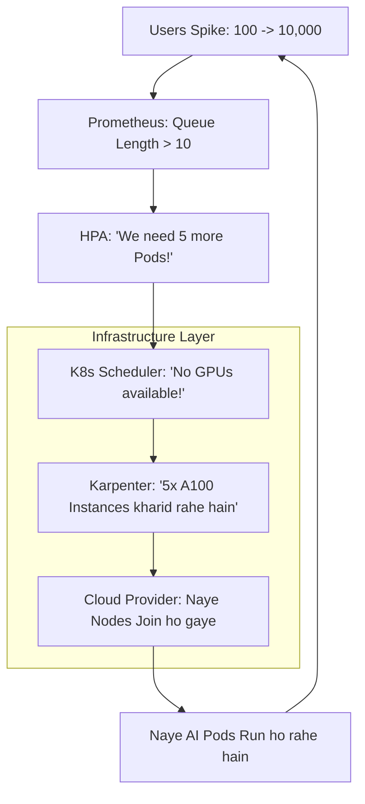

# 📈 Kubernetes Scaling Strategies: Handling the AI Surge
> **Level:** Advanced | **Language:** Hinglish | **Goal:** K8s par AI workloads ko automatically scale karne ki art ko master karein, HPA, VPA, Cluster Autoscaler, aur 2026 mein "Infinite" AI capacity build karne ki strategies ko explore karte hue.

---

## 🧭 1. Beginner-Friendly Hinglish Explanation
Maan lo aapne ek "AI Image Generator" app launch kiya. 

- **The Scenario:** Raat ko 10 baje achanak 1 Lakh log app par aa jate hain. 
  - Aapke paas sirf 2 GPUs hain. Sabke liye app "Slow" ho jayegi.
- **Scaling** ka matlab hai ki jaise hi traffic badhe, aapka system apne aap naye "Servers" (GPUs) kharid le (Cloud se) aur kaam ko distribute kar de.
- Aur jaise hi log chale jayein, wo servers wapis kar de taaki paise bachein.

**Kubernetes (K8s)** mein ye sab "Auto" hota hai. 
1. **Horizontal Scaling:** Naye Pods (AI instances) banana.
2. **Vertical Scaling:** Ek hi Pod ko zyada power (RAM/CPU) dena.
3. **Cluster Scaling:** Pura naya "Loha" (Hardware server) cluster mein add karna.

2026 mein, scaling sirf "Load handle" karna nahi hai, balki **"Cost optimization"** ka khel hai.

---

## 🧠 2. Deep Technical Explanation
K8s mein scaling ko teen primary controllers ke dwara manage kiya jata hai.

### 1. HPA (Horizontal Pod Autoscaler):
- Yeh ek metric (e.g., CPU, Memory, ya ek Custom AI Metric jaise `queue_length`) ko monitor karta hai.
- Jab metric threshold se exceed ho jati hai, toh yeh aapke AI app ki naye copies (Pods) create karta hai.
- **2026 Standard:** **Concurrency** ke basis par scaling karna. Agar ek GPU 4 users ko handle kar sakta hai, aur aapke paas 40 users hain, toh HPA scale karke 10 Pods kar deta hai.

### 2. VPA (Vertical Pod Autoscaler):
- Yeh aapke app ki actual usage ko observe (dekhta) karta hai. 
- Agar aapka AI isliye lagatar crash ho raha hai kyunki use zyada RAM chahiye, toh VPA automatically Pod ko ek higher "Memory Limit" ke sath restart kar dega.
- **Caution:** Production AI ke liye VPA aamtaur par NOT recommended hai kyunki isme restart ki zaroorat hoti hai. Iske bajaye HPA ka use karein.

### 3. Cluster Autoscaler (CA) / Karpenter:
- Jab HPA ek naya Pod create karne ki koshish karta hai par cluster mein koi free GPUs NAHI hote, toh Pod "Pending" state mein chala jata hai.
- **Cluster Autoscaler** is "Pending" Pod ko dekhta hai aur Cloud (AWS/GCP) ko ek naya physical GPU node launch karne ke liye bolta hai.
- **Karpenter (AWS dwara):** Ek modern aur faster alternative jo seconds mein sabse cost-effective GPU instance ko pick kar leta hai.

---

## 🏗️ 3. Scaling Strategies Comparison
| Strategy | What it Scales | Trigger | Speed |
| :--- | :--- | :--- | :--- |
| **HPA** | Pods ki sankhya | Traffic / Queue | Fast (Seconds) |
| **VPA** | 1 Pod ka Size | Resource usage | Slow (Restart chahiye) |
| **Cluster Autoscaler**| Servers ki sankhya | Pending Pods | Slow (Minutes) |
| **Karpenter** | Servers ki sankhya | Pending Pods | **Very Fast (Seconds)** |

---

## 📐 4. Mathematical Intuition
- **The 'Cool Down' Period:** 
  Aap nahi chahenge ki aapka cluster "Flicker" (har 10 seconds mein servers add/delete) kare. 
  $$\text{Scaling Decision} = \text{Threshold reached for } T \text{ consecutive minutes}$$
  Aamtaur par, hum "Churn" se bachne ke liye **Scale-up** ko aggressive (1 minute) aur **Scale-down** ko conservative (10 minutes) set karte hain.

---

## 📊 5. K8s Auto-scaling Workflow (Diagram)

```mermaid
graph TD
    User[Users Spike: 100 -> 10,000] --> Metric[Prometheus: Queue Length > 10]
    Metric --> HPA[HPA: 'We need 5 more Pods!']
    HPA --> Scheduler[K8s Scheduler: 'No GPUs available!']
    
    subgraph "Infrastructure Layer"
    Scheduler --> Karpenter[Karpenter: '5x A100 Instances kharid rahe hain']
    Karpenter --> AWS[Cloud Provider: Naye Nodes Join ho gaye]
    end
    
    AWS --> Pods[Naye AI Pods Run ho rahe hain]
    Pods --> User
```

---

## 💻 6. Production-Ready Examples (HPA Config for AI Concurrency)
```yaml
# 2026 Pro-Tip: AI-specific queues ke basis par scale karne ke liye 'KEDA' ka use karein.

apiVersion: keda.sh/v1alpha1
kind: ScaledObject
metadata:
  name: ai-image-gen-scaler
spec:
  scaleTargetRef:
    name: ai-image-gen-deployment
  minReplicaCount: 0  # Jab koi use na kar raha ho toh Zero tak scale karein! 💸
  maxReplicaCount: 50
  triggers:
  - type: prometheus
    metadata:
      serverAddress: http://prometheus-server
      metricName: llm_request_queue_size
      threshold: '5' # Agar per pod 5 se zyada requests wait kar rahi hon toh scale up karein
      query: sum(llm_queue_length)
```

---

## ❌ 7. Failure Cases
- **Quota Exhaustion:** HPA aur GPUs chahta hai, par aapke AWS account ne 100 GPUs ki apni limit ko reach kar liya hai. Cluster scale hona band ho jata hai. **Fix: Apne 'Service Quotas' ko monitor karein aur alerts set karein.**
- **Thrashing:** Aapka threshold bahut tight hai. System ek node add karta hai, fir realize karta hai ki yeh ab "Under-utilized" hai, use delete kar deta hai, aur fir traffic dobara spike ho jata hai.
- **The 'Large Image' Pull:** Ek naya node 1 minute mein start ho jata hai, par 20GB ki AI Docker image download karne mein 5 minutes aur lagte hain. User abhi bhi wait kar raha hai! **Fix: Nodes par 'Image Pre-pulling' ka use karein.**

---

## 🛠️ 8. Debugging Guide
- **Symptom:** "Pods 'Pending' hain, bhale hi hamare paas GPUs hon."
- **Check:** **Node Selectors / Taints**. Ensure karein ki aapke Pod ko GPU nodes par chalne ki permission ho. 
- **Symptom:** "High traffic hone par bhi HPA scale up nahi ho raha hai."
- **Check:** **Prometheus Query**. Kya aapka metric actually HPA tak pahunch raha hai? `kubectl get hpa` run karein aur `TARGETS` column check karein.

---

## ⚖️ 9. Tradeoffs
- **Reactive vs. Predictive Scaling:** 
  - Reactive (Standard HPA) traffic aane ke *baad* react karta hai. 
  - Predictive (traffic forecast karne ke liye AI ka use karna) traffic aane se *pehle* scale karta hai. (Mushkil par behtar hai).
- **Scale-to-Zero:** Paise toh bachata hai par pehle user ke liye ek "Cold Start" (30-60s delay) cause karta hai.

---

## 🛡️ 10. Security Concerns
- **Scaling Attack:** Ek hacker aapke AI ko fake traffic bhej raha hai taaki aapka cluster 1000 nodes tak scale ho sake, jisse minutes mein aapko hazaron dollars ka kharch aa jaye. **Gateway level par 'Rate Limiting' ka use karein.**

---

## 📈 11. Scaling Challenges
- **Stateful Scaling:** Ek AI "Chat" ko scale karna jahan user ki history server ke RAM mein hoti hai. Agar aap ek naye pod par scale karte hain, toh naye pod ke paas history nahi hogi. **Solution: 'Sticky Sessions' ya 'Distributed Cache' (Redis) ka use karein.**

---

## 💸 12. Cost Considerations
- **Spot Instances:** Karpenter ko bolin ki scaling ke liye SIRF "Spot" GPUs hi kharide. Yeh aapki scaling cost ko **$80\%$** tak reduce kar deta hai.

---

## ✅ 13. Best Practices
- **'KEDA' (Kubernetes Event-driven Autoscaling) ka use karein:** AI workloads ke liye yeh standard HPA se kafi behtar hai kyunki yeh ZERO tak scale kar sakta hai.
- **'Pod Disruption Budgets' set karein:** Ensure karein ki K8s maintenance update ke liye aapke saare AI instances ko ek sath kill na kare.
- **Graceful Shutdown:** AI Pod ko K8s dwara kill karne se pehle use "apni current generation finish karne" ke liye 30 seconds ka time dein.

---

## ⚠️ 14. Common Mistakes
- **CPU ke basis par scale karna:** AI models $100\%$ GPU use karte hain par lagbhag $0\%$ CPU. CPU ke basis par scale karna useless (bekar) hai. Hamesha **GPU Memory** ya **Request Queue** ke basis par hi scale karein.
- **No 'Max Limit':** `maxReplicaCount` set karna bhool jana. Ek chota bug bhi aapka pura bank balance uda sakta hai.

---

## 📝 15. Interview Questions
1. **"HPA aur Cluster Autoscaler ke beech kya difference hai?"**
2. **"AI applications ke liye zero tak scale karna mushkil kyun hai?"** (Cold starts + Image size).
3. **"Explain karein ki Karpenter traditional Cluster Autoscaler ke upar kaise improve karta hai."**

---

## 🚀 15. Latest 2026 Industry Patterns
- **Multi-Cloud Bursting:** Scaling your app on AWS, and if AWS is full, "Bursting" the extra traffic to Google Cloud automatically.
- **Cross-Region Auto-failover:** If a hurricane hits the 'US-East' datacenter, K8s automatically scales your AI in the 'US-West' region.
- **Energy-aware Scaling:** Scaling only on datacenters that are currently powered by "Renewable Energy."
