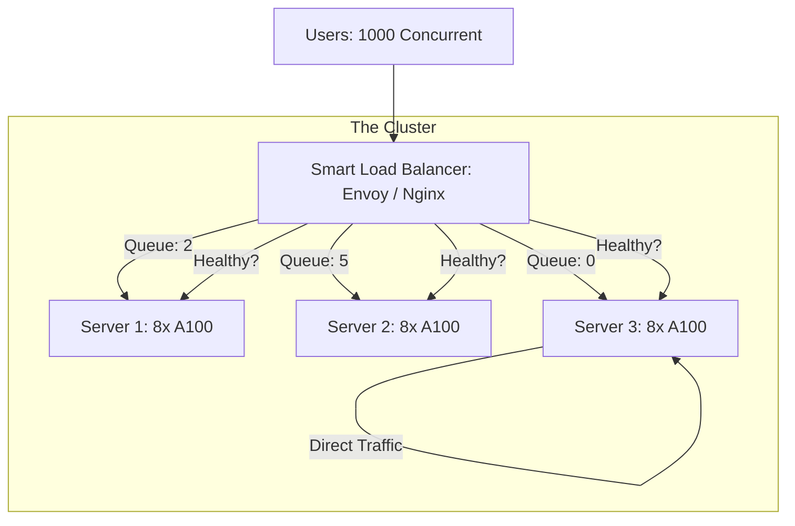

# ⚖️ Load Balancing for GPUs: Distributing the Intelligence
> **Level:** Advanced | **Language:** Hinglish | **Goal:** Master the techniques for spreading AI traffic across multiple GPUs and servers, exploring Least-Connections, Queue-aware routing, Session Stickiness, and the 2026 strategies for "Lossless" AI scaling.

---

## 🧭 1. Beginner-Friendly Hinglish Explanation
Maan lo aapke paas ek "Ameer" (Rich) customer support app hai jisme 10 AI servers hain.

- **The Problem:** Agar saare 1000 users "Server-1" par chale jayenge, toh Server-1 crash ho jayega aur baki 9 servers "Khali" (Idle) baithe rahenge. 
- **Load Balancer** ek "Traffic Cop" ki tarah hai jo gate par khada hota hai. 
  - Wo dekhta hai ki kis server ke paas kaam kam hai. 
  - Wo naye user ko us "Free" server ke paas bhej deta hai.

AI mein load balancing thoda "Complex" hota hai. 
- Normal software mein request fast hoti hai. 
- AI mein ek request 10 seconds le sakti hai. 
- Agar aapne ek "Galti" se 10 heavy users ko ek hi GPU par bhej diya, toh wo GPU "Frezze" ho jayega.

2026 mein, hum **"Smart Load Balancers"** use karte hain jo ye jaante hain ki kis GPU ki "VRAM" kitni bhari hui hai.

---

## 🧠 2. Deep Technical Explanation
Load balancing for AI must be **State-aware** and **Resource-aware.**

### 1. Traditional vs. AI-Aware Balancing:
- **Round Robin:** Sending requests 1, 2, 3 to Servers A, B, C. (Bad for AI because request complexity varies).
- **Least Connections:** Sending to the server with the fewest active users. (Better).
- **Queue-Length Aware:** Sending to the server with the shortest "Inference Queue." (Best for LLMs).

### 2. Session Stickiness (Affinity):
- In a long chat, the AI needs to remember previous messages. 
- If User A's history is in **Server-1's RAM (KV-Cache)**, we must ensure their next message also goes to **Server-1.**
- This is called **"Sticky Sessions."** Without it, you have to reload the whole history for every message (Slow and Expensive).

### 3. Health Checks (Liveness vs. Readiness):
- A GPU might be "Alive" but "Overheated" or "Memory Full."
- The Load Balancer must check for **GPU Health** before sending traffic.

---

## 🏗️ 3. Load Balancing Algorithms
| Algorithm | Logic | Best For |
| :--- | :--- | :--- |
| **Round Robin** | Simple rotation | Uniform tasks (e.g., Sentiment analysis) |
| **Least Connections**| Least busy server | Long-running tasks (e.g., Image gen) |
| **IP-Hash** | Same IP -> Same Server | Simple chat persistence |
| **Queue-Depth** | Shortest wait time | **LLM serving (vLLM/Triton)** |
| **Latency-Aware** | Fastest response time | Global deployments |

---

## 📐 4. Mathematical Intuition
- **The Utilization Balancing:** 
  We want to minimize the variance ($\sigma^2$) of GPU utilization across $N$ servers.
  $$\text{Minimize } \sigma^2 = \frac{1}{N} \sum_{i=1}^{N} (U_i - \bar{U})^2$$
  Where $U_i$ is the utilization of GPU $i$. A good load balancer ensures that no GPU is at $99\%$ while another is at $10\%$.

---

## 📊 5. AI Load Balancer Architecture (Diagram)


---

## 💻 6. Production-Ready Examples (Configuring Nginx for AI Least-Connections)
```nginx
# 2026 Pro-Tip: Use 'Least-Conn' for long-running AI requests.

upstream ai_servers {
    least_conn; # Send to the server with the fewest active connections
    server 10.0.0.1:8000;
    server 10.0.0.2:8000;
    server 10.0.0.3:8000;
}

server {
    listen 80;
    location /v1/chat {
        proxy_pass http://ai_servers;
        proxy_read_timeout 300s; # Allow long AI generations
        proxy_buffering off;    # Enable token-by-token streaming
    }
}
```

---

## ❌ 7. Failure Cases
- **The 'Hot Spot' Problem:** A "Power User" sends 100 huge PDFs to the same server (because of stickiness). That server dies while others are idle. **Fix: Use 'Adaptive Stickiness' that breaks the bond if the server is overloaded.**
- **Zombie Servers:** A server is "Up" but its GPU is "Unplugged" or "Driver failed." The LB keeps sending traffic there, and users get errors. **Fix: Implement 'Deep Health Checks' that run `nvidia-smi`.**
- **Connection Leak:** Not closing the connection after the AI finishes generation. The LB thinks the server is still "Busy" and stops sending new traffic.

---

## 🛠️ 8. Debugging Guide
- **Symptom:** "Server-1 is always $100\%$ busy, Server-2 is $0\%$."
- **Check:** **Load Balancing Policy**. You are probably using "Sticky Sessions" and everyone is being assigned to Server-1 because it was the first one up.
- **Symptom:** "Users are complaining their AI 'Forgot' the previous message."
- **Check:** **Sticky Sessions**. Your Load Balancer might be rotating users to different servers for every message.

---

## ⚖️ 9. Tradeoffs
- **Complexity vs. Efficiency:** 
  - Standard Load Balancing (L4) is fast but "Blind." 
  - Application-aware Balancing (L7) can read the "Model name" in the request but is slightly slower.
- **Global vs. Local:** Balancing between 8 GPUs in one room vs. balancing between New York and Mumbai.

---

## 🛡️ 10. Security Concerns
- **DDoS targeting a single GPU:** An attacker using multiple IPs to bypass "Least Connections" and flood a specific server. **Use 'Global Rate Limiting' (e.g., Cloudflare).**

---

## 📈 11. Scaling Challenges
- **Dynamic Cluster Growth:** When a new server joins the cluster, how do you "Warm it up" without flooding it with 1000 users instantly? **Use 'Slow Start' mode.**

---

## 💸 12. Cost Considerations
- **Load Balancer Fees:** Cloud providers (AWS) charge for every GB that passes through the LB. **Optimization: For large file uploads (PDFs/Images), use 'Direct-to-S3' uploads instead of passing through the LB.**

---

## ✅ 13. Best Practices
- **Use 'Health Check' Endpoints:** Create a `/health` route that checks `nvidia-smi` and returns `503` if the GPU temperature is $> 90^\circ C$.
- **Implement 'Retry' Logic:** If Server-A fails, the Load Balancer should automatically retry the request on Server-B before the user even notices.
- **Monitor 'Queue Depth':** The number of requests waiting for a GPU is the most important metric for AI scaling.

---

## ⚠️ 14. Common Mistakes
- **Using 'Default' Timeouts:** Nginx defaults to 60s. Many AI tasks (Video/Long text) need 300s.
- **No 'Buffering Off':** Forgetting to turn off proxy buffering, which "Breaks" token streaming (The user has to wait for the WHOLE answer).

---

## 📝 15. Interview Questions
1. **"Why is 'Least-Connections' better than 'Round-Robin' for LLMs?"**
2. **"What is 'Session Stickiness' and why is it crucial for chat applications?"**
3. **"How do you perform a health check on a GPU-based server?"**

---

## 🚀 15. Latest 2026 Industry Patterns
- **KV-Cache Aware Routing:** A super-smart Load Balancer that knows which server has which user's "Context" in its VRAM and sends them there automatically.
- **Serverless-aware Balancing:** Load Balancers that "Wake up" a serverless function if all existing dedicated servers are full.
- **Anycast for AI:** Using a single global IP that routes the user to the "Nearest" available GPU datacenter automatically.
