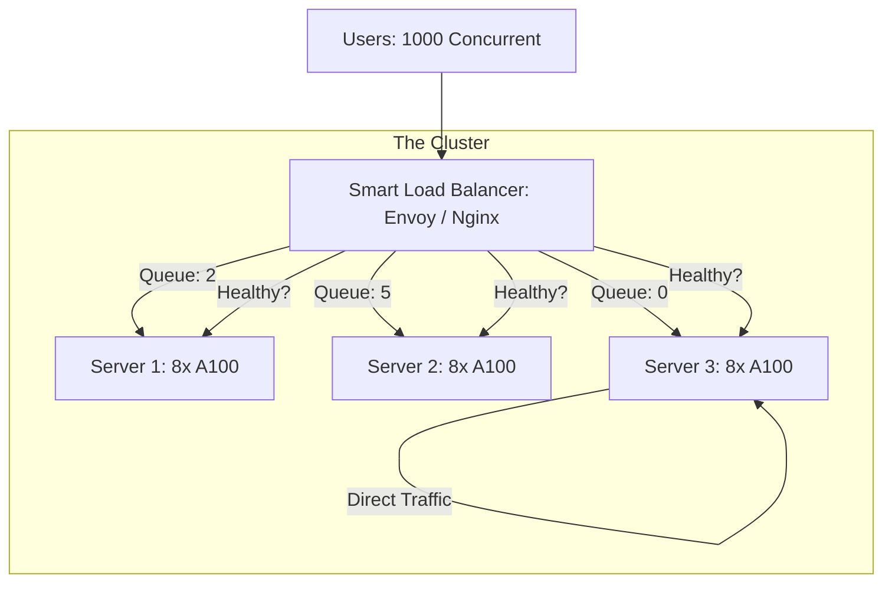

# ⚖️ Load Balancing for GPUs: Distributing the Intelligence
> **Level:** Advanced | **Language:** Hinglish | **Goal:** Multiple GPUs aur servers par AI traffic ko distribute karne ki techniques ko master karein, Least-Connections, Queue-aware routing, Session Stickiness, aur 2026 mein "Lossless" AI scaling ki strategies ko explore karte hue.

---

## 🧭 1. Beginner-Friendly Hinglish Explanation
Maan lo aapke paas ek "Ameer" (Rich) customer support app hai jisme 10 AI servers hain.

- **The Problem:** Agar saare 1000 users "Server-1" par chale jayenge, toh Server-1 crash ho jayega aur baki 9 servers "Khali" (Idle) baithe rahenge. 
- **Load Balancer** ek "Traffic Cop" ki tarah hai jo gate par khada hota. 
  - Wo dekhta hai ki kis server ke paas kaam kam hai. 
  - Wo naye user ko us "Free" server ke paas bhej deta hai.

AI mein load balancing thoda "Complex" hota hai. 
- Normal software mein request fast hoti hai. 
- AI mein ek request 10 seconds le sakti hai. 
- Agar aapne ek "Galti" se 10 heavy users ko ek hi GPU par bhej diya, toh wo GPU "Frezze" ho jayega.

2026 mein, hum **"Smart Load Balancers"** use karte hain jo ye jaante hain ki kis GPU ki "VRAM" kitni bhari hui hai.

---

## 🧠 2. Deep Technical Explanation
AI ke liye load balancing ka **State-aware** aur **Resource-aware** hona zaroori hai.

### 1. Traditional vs. AI-Aware Balancing:
- **Round Robin:** Requests 1, 2, 3 ko Servers A, B, C par bhejna. (AI ke liye bad hai kyunki request complexity vary karti hai).
- **Least Connections:** Sabse kam active users waale server par bhejna. (Behtar hai).
- **Queue-Length Aware:** Sabse choti "Inference Queue" waale server par bhejna. (LLMs ke liye best hai).

### 2. Session Stickiness (Affinity):
- Ek lambi chat mein, AI ko pichle messages ko yaad rakhne ki zaroorat hoti hai. 
- Agar User A ki history **Server-1 ke RAM (KV-Cache)** mein hai, toh humein ensure karna hoga ki unka agla message bhi **Server-1** par hi jaye.
- Isse hum **"Sticky Sessions"** kehte hain. Iske bina, aapko har message ke liye puri history ko dobara load karna padega (Slow aur Expensive).

### 3. Health Checks (Liveness vs. Readiness):
- Ek GPU "Alive" (chalu) ho sakta hai par "Overheated" (garam) ya "Memory Full" ho sakta hai.
- Traffic bhejne se pehle Load Balancer ko **GPU Health** check karni chahiye.

---

## 🏗️ 3. Load Balancing Algorithms
| Algorithm | Logic | Best For |
| :--- | :--- | :--- |
| **Round Robin** | Simple rotation | Uniform tasks (e.g., Sentiment analysis) ke liye |
| **Least Connections**| Least busy server | Long-running tasks (e.g., Image gen) ke liye |
| **IP-Hash** | Same IP -> Same Server | Simple chat persistence ke liye |
| **Queue-Depth** | Shortest wait time | **LLM serving (vLLM/Triton)** |
| **Latency-Aware** | Fastest response time | Global deployments ke liye |

---

## 📐 4. Mathematical Intuition
- **The Utilization Balancing:** 
  Hum $N$ servers ke beech GPU utilization ke variance ($\sigma^2$) ko minimize karna chahte hain.
  $$\text{Minimize } \sigma^2 = \frac{1}{N} \sum_{i=1}^{N} (U_i - \bar{U})^2$$
  Jahan $U_i$ GPU $i$ ki utilization hai. Ek acha load balancer yeh ensure karta hai ki koi bhi GPU $99\%$ par na ho jabki dusra $10\%$ par baitha ho.

---

## 📊 5. AI Load Balancer Architecture (Diagram)

```mermaid
graph TD
    User[Users: 1000 Concurrent] --> LB[Smart Load Balancer: Envoy / Nginx]
    
    subgraph "The Cluster"
    LB -- "Queue: 2" --> S1[Server 1: 8x A100]
    LB -- "Queue: 5" --> S2[Server 2: 8x A100]
    LB -- "Queue: 0" --> S3[Server 3: 8x A100]
    end
    
    LB -- "Healthy?" --> S1 & S2 & S3
    
    S3 -- "Direct Traffic" --> S3
```

---

## 💻 6. Production-Ready Examples (Configuring Nginx for AI Least-Connections)
```nginx
# 2026 Pro-Tip: Long-running AI requests ke liye 'Least-Conn' ka use karein.

upstream ai_servers {
    least_conn; # Sabse kam active connections wale server par bhein
    server 10.0.0.1:8000;
    server 10.0.0.2:8000;
    server 10.0.0.3:8000;
}

server {
    listen 80;
    location /v1/chat {
        proxy_pass http://ai_servers;
        proxy_read_timeout 300s; # Long AI generations ko allow karein
        proxy_buffering off;    # Token-by-token streaming ko enable karein
    }
}
```

---

## ❌ 7. Failure Cases
- **The 'Hot Spot' Problem:** Ek "Power User" same server par (stickiness ki wajah se) 100 huge PDFs send kar deta hai. Woh server die (crash) ho jata hai jabki baki idle rehte hain. **Fix: 'Adaptive Stickiness' ka use karein jo server ke overloaded hone par bond ko break kar deti hai.**
- **Zombie Servers:** Ek server "Up" hai par uska GPU "Unplugged" hai ya "Driver failed" ho gaya hai. LB wahan traffic bhejta rehta hai, aur users ko errors milte hain. **Fix: 'nvidia-smi' run karne wale 'Deep Health Checks' implement karein.**
- **Connection Leak:** AI generation finish hone ke baad connection ko close na karna. LB ko lagta hai ki server abhi bhi "Busy" hai aur woh naya traffic bhejna band kar deta hai.

---

## 🛠️ 8. Debugging Guide
- **Symptom:** "Server-1 hamesha $100\%$ busy hai, Server-2 $0\%$ hai."
- **Check:** **Load Balancing Policy**. Aap shayad "Sticky Sessions" use kar rahe hain aur har kisi ko Server-1 assign kiya ja raha hai kyunki woh sabse pehle up hua tha.
- **Symptom:** "Users complain kar rahe hain ki unka AI pichla message 'Forgot' (bhool) gaya."
- **Check:** **Sticky Sessions**. Aapka Load Balancer shayad har message ke liye users ko alag servers par rotate kar raha hai.

---

## ⚖️ 9. Tradeoffs
- **Complexity vs. Efficiency:** 
  - Standard Load Balancing (L4) fast hoti hai par "Blind" (andhi) hoti hai. 
  - Application-aware Balancing (L7) request mein "Model name" read kar sakti hai par thodi slower hoti hai.
- **Global vs. Local:** Ek room mein 8 GPUs ke beech balance karna vs New York aur Mumbai ke beech balance karna.

---

## 🛡️ 10. Security Concerns
- **DDoS targeting a single GPU:** Ek attacker "Least Connections" ko bypass karne aur ek specific server ko flood karne ke liye multiple IPs ka use kar raha hai. **'Global Rate Limiting' (e.g., Cloudflare) ka use karein.**

---

## 📈 11. Scaling Challenges
- **Dynamic Cluster Growth:** Jab koi naya server cluster join karta hai, toh aap use bina 1000 users se instantly flood kiye kaise "Warm it up" karenge? **'Slow Start' mode ka use karein.**

---

## 💸 12. Cost Considerations
- **Load Balancer Fees:** Cloud providers (AWS) LB se pass hone wale har GB ke liye charge karte hain. **Optimization: Large file uploads (PDFs/Images) ke liye, LB se pass karne ke bajaye 'Direct-to-S3' uploads ka use karein.**

---

## ✅ 13. Best Practices
- **'Health Check' Endpoints ka use karein:** Ek `/health` route create karein jo `nvidia-smi` ko check kare aur agar GPU temperature $> 90^\circ C$ ho toh `503` return kare.
- **'Retry' Logic implement karein:** Agar Server-A fail ho jata hai, toh Load Balancer ko user ke notice karne se pehle automatically Server-B par request retry karni chahiye.
- **'Queue Depth' ko monitor karein:** GPU ke liye waiting requests ki sankhya AI scaling ke liye sabse important metric hai.

---

## ⚠️ 14. Common Mistakes
- **'Default' Timeouts use karna:** Nginx default 60s par rehta hai. Kai AI tasks (Video/Long text) ko 300s ki zaroorat hoti hai.
- **No 'Buffering Off':** Proxy buffering ko turn off karna bhool jana, jo token streaming ko "Break" (rok) deta hai (User ko PURE answer ka wait karna padta hai).

---

## 📝 15. Interview Questions
1. **"LLMs ke liye 'Least-Connections' 'Round-Robin' se behtar kyun hai?"**
2. **"'Session Stickiness' kya hai aur chat applications ke liye yeh kyun crucial hai?"**
3. **"GPU-based server par aap health check kaise perform karte hain?"**

---

## 🚀 15. Latest 2026 Industry Patterns
- **KV-Cache Aware Routing:** Ek super-smart Load Balancer jo yeh jaanta hai ki kis server ke VRAM mein kis user ka "Context" hai aur unhe automatically wahan bhej deta hai.
- **Serverless-aware Balancing:** Aise Load Balancers jo tab serverless function ko "Wake up" (jaga dete/start) kar dete hain jab sabhi existing dedicated servers full ho jate hain.
- **Anycast for AI:** Ek single global IP ka use karna jo user ko automatically "Nearest" available GPU datacenter par route kar deta hai.
