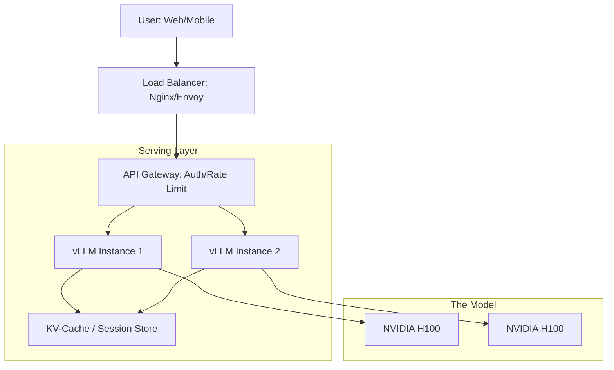

# 🚀 Model Serving Architectures: From Local to Global
> **Level:** Advanced | **Language:** Hinglish | **Goal:** Master the various ways to deploy AI models in production, exploring Synchronous vs. Asynchronous patterns, Streaming, Batching, and the 2026 strategies for building "High-Availability" AI services.

---

## 🧭 1. Beginner-Friendly Hinglish Explanation
Model train toh kar liya, ab ise "Duniya" ko kaise dikhayein? 

- **The Problem:** AI model ko "Run" karna normal software se alag hai. 
  - AI model 20GB ka hota hai, use memory mein load hone mein time lagta hai. 
  - AI ek answer dene mein 5-10 seconds le sakta hai.
- **Model Serving** ka matlab hai ek aisa "Rasta" banana jisse user apna sawaal bhej sake aur AI apna jawaab wapis de sake—tezi se aur bina ruke.

In 2026, hum sirf ek tareeka use nahi karte. 
1. **Synchronous:** User intezar karta hai jab tak pura answer na aa jaye. (Bad for LLMs).
2. **Streaming:** User ko ek-ek word dikhayi deta hai jaise-jaise wo banta hai. (Best for Chat).
3. **Asynchronous:** User sawaal bhej deta hai aur baad mein "Notification" milti hai jab kaam ho jata hai. (Best for Video generation).

---

## 🧠 2. Deep Technical Explanation
Model serving is the process of exposing a trained model as an endpoint (REST/gRPC).

### 1. Synchronous Serving (REST/gRPC):
- Simple request-response. 
- **Pros:** Easy to implement. 
- **Cons:** If the LLM takes 30s to generate, the HTTP connection might "Timeout."

### 2. Streaming (Server-Sent Events - SSE):
- The server keeps the connection open and sends tokens as they are generated. 
- **2026 Standard:** This is mandatory for "Human-like" AI experiences to reduce perceived latency.

### 3. Asynchronous Serving (Queue-based):
- User request $\to$ **Message Queue (RabbitMQ/Kafka)** $\to$ **Worker** processes the request $\to$ **Result Store** (Redis/S3) $\to$ **Callback/Webhook** to user.
- Crucial for long-running tasks (summarizing 1000 pages).

### 4. Distributed Serving:
- Serving a single model across multiple GPUs (Model Parallelism) or multiple servers (Pipeline Parallelism) to handle giant models (like 175B+).

---

## 🏗️ 3. Serving Architectures Comparison
| Pattern | Latency | Throughput | Best For |
| :--- | :--- | :--- | :--- |
| **Simple API** | Low | Low | Simple classification / sentiment |
| **Streaming** | **Instant (TTFT)**| Moderate | Chatbots / LLMs |
| **Async Queue** | High | **Very High** | Image/Video generation / Batching|
| **Serverless** | Moderate | Scalable | Low-traffic / Spiky usage |
| **Edge Serving** | **Ultra-Low** | Restricted | Face ID / Mobile OCR |

---

## 📐 4. Mathematical Intuition
- **The Throughput-Latency Tradeoff:** 
  If you increase the **Batch Size** (processing 10 users at once), your **Throughput** (Total tokens per second) goes up, but the **Latency** (time for each individual user) also goes up.
  $$\text{Optimal Batch Size} = \text{Batch where Latency} \leq \text{SLA Threshold}$$
  In 2026, we use **Continuous Batching** to break this tradeoff.

---

## 📊 5. Production AI Serving Stack (Diagram)


---

## 💻 6. Production-Ready Examples (Implementing a Streaming API with FastAPI)
```python
# 2026 Pro-Tip: Use 'StreamingResponse' to keep the user engaged.

from fastapi import FastAPI
from fastapi.responses import StreamingResponse
import asyncio

app = FastAPI()

async def ai_generator(prompt):
    # Simulate an LLM generating words one by one
    words = f"This is a response to: {prompt}".split()
    for word in words:
        yield f"data: {word}\n\n"
        await asyncio.sleep(0.1) # Simulate generation delay

@app.get("/chat")
async def chat(prompt: str):
    return StreamingResponse(ai_generator(prompt), media_type="text/event-stream")

# User's browser will see words appear live! 🚀
```

---

## ❌ 7. Failure Cases
- **The 'Hanging' Connection:** A streaming request starts but stops halfway because the GPU crashed. The user sees a "Half-sentence" forever. **Fix: Use 'Keep-alive' heartbeats.**
- **Cold Starts:** Deploying a 100GB model on a new server takes 10 minutes. If your traffic spikes, the new servers won't be ready in time. **Fix: Use 'Pre-warmed' pods.**
- **OOM during serving:** Multiple users ask for very long answers, and the **KV-Cache** fills up the GPU VRAM. **Fix: Use 'PagedAttention' (vLLM).**

---

## 🛠️ 8. Debugging Guide
- **Symptom:** "API is returning 504 Gateway Timeout."
- **Check:** **Inference Time**. If your LLM takes 40s but your Nginx timeout is 30s, the connection will die. Increase the timeout or switch to **Async/Streaming**.
- **Symptom:** "Memory usage is $99\%$ even with zero users."
- **Check:** **Model Loading**. Most serving frameworks (like vLLM) pre-allocate $90\%$ of VRAM for the KV-cache. This is "Normal" but scary.

---

## ⚖️ 9. Tradeoffs
- **Single Instance vs. Sharded:** 
  - Single (Llama-8B on 1 GPU) is simple. 
  - Sharded (Llama-70B on 8 GPUs) is complex and expensive but necessary for "High Intelligence."
- **Python vs. C++ (Triton):** 
  - Python is easy to write. 
  - C++ is $2x$ faster and handles $5x$ more users.

---

## 🛡️ 10. Security Concerns
- **Model Inversion via API:** An attacker asking 1 million questions to "Extract" the model's training data. **Implement 'Rate Limiting' and 'Anomalous Query Detection'.**

---

## 📈 11. Scaling Challenges
- **The 'Model Switching' Problem:** Having 100 different fine-tuned models for 100 different customers. You can't keep all in VRAM. **Solution: Use 'LoRA Adapters' (Multi-LoRA Serving) where you keep 1 base model and swap tiny adapters in milliseconds.**

---

## 💸 12. Cost Considerations
- **Idle GPU Cost:** Paying for an H100 at 3 AM when no one is using it. **Strategy: Use 'Serverless GPUs' (RunPod/Lambda) that scale to zero.**

---

## ✅ 13. Best Practices
- **Implement 'Health Checks':** The server should tell the Load Balancer "I am busy/sick" before it crashes.
- **Use 'Continuous Batching':** Never serve an LLM without it in 2026.
- **Version your Endpoints:** `/v1/chat`, `/v2/chat`. Never break a production API.

---

## ⚠️ 14. Common Mistakes
- **No 'Timeout' on user query:** Letting the AI try to answer a 1-million token query for 1 hour.
- **Logging the whole API response:** This will fill up your disk in 10 minutes and slow down the API.

---

## 📝 15. Interview Questions
1. **"What is the difference between Synchronous and Asynchronous model serving?"**
2. **"Why is 'Streaming' preferred for LLM applications?"**
3. **"Explain how 'Multi-LoRA' serving works and why it's cost-effective."**

---

## 🚀 15. Latest 2026 Industry Patterns
- **Speculative Serving:** Running the first 10 tokens on a tiny model while the big model "Warms up," giving the user an "Instant" feel.
- **Global Load Balancing:** Routing the user's query to the country where GPUs are currently "Cheapest" (due to night-time electricity rates).
- **In-Memory Model Repositories:** Loading 100GB models in $< 5$ seconds using ultra-fast NVMe-over-Fabrics networks.
