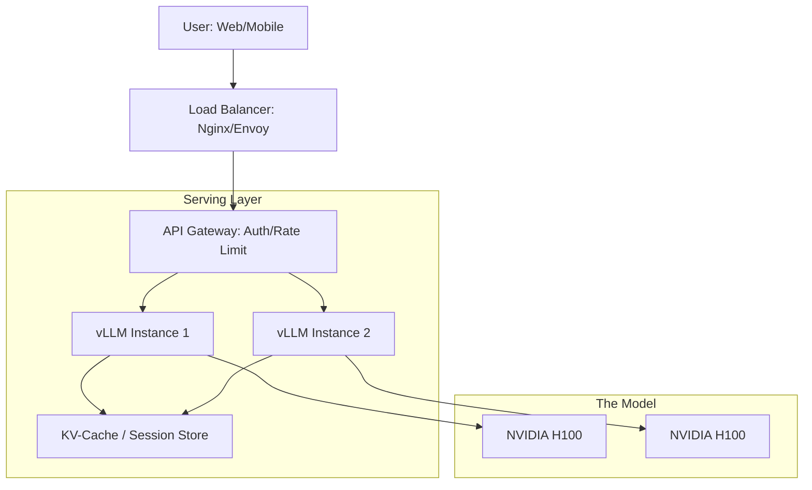

# 🚀 Model Serving Architectures: From Local to Global
> **Level:** Advanced | **Language:** Hinglish | **Goal:** AI models ko production mein deploy karne ke alag-alag ways ko master karein, Synchronous vs. Asynchronous patterns, Streaming, Batching, aur 2026 mein "High-Availability" AI services build karne ki strategies ko explore karte hue.

---

## 🧭 1. Beginner-Friendly Hinglish Explanation
Model train toh kar liya, ab ise "Duniya" ko kaise dikhayein? 

- **The Problem:** AI model ko "Run" karna normal software se alag hai. 
  - AI model 20GB ka hota hai, use memory mein load hone mein time lagta hai. 
  - AI ek answer dene mein 5-10 seconds le sakta hai.
- **Model Serving** ka matlab hai ek aisa "Rasta" banana jisse user apna sawaal bhej sake aur AI apna jawaab wapis de sake—tezi se aur bina ruke.

In 2026, hum sirf ek tareeka use nahi karte. 
1. **Synchronous:** User intezar karta hai jab tak pura answer na aa jaye. (Bad for LLMs).
2. **Streaming:** User ko ek-ek word dikhayi deta hai jaise-jaise wo banta hai. (Best for Chat).
3. **Asynchronous:** User sawaal bhej deta hai aur baad mein "Notification" milti hai jab kaam ho jata hai. (Best for Video generation).

---

## 🧠 2. Deep Technical Explanation
Model serving ek trained model ko endpoint (REST/gRPC) ke roop mein expose karne ki process hai.

### 1. Synchronous Serving (REST/gRPC):
- Simple request-response hai. 
- **Pros:** Implement karna aasan hai. 
- **Cons:** Agar LLM generate karne mein 30s le leta hai, toh HTTP connection ka "Timeout" ho sakta hai.

### 2. Streaming (Server-Sent Events - SSE):
- Server connection ko open rakhta hai aur tokens ko generate hote hi send karta rehta hai. 
- **2026 Standard:** Perceived latency ko reduce karne aur "Human-like" AI experience ke liye yeh mandatory hai.

### 3. Asynchronous Serving (Queue-based):
- User request $\to$ **Message Queue (RabbitMQ/Kafka)** $\to$ **Worker** request ko process karta hai $\to$ **Result Store** (Redis/S3) $\to$ user ko **Callback/Webhook**.
- Long-running tasks ke liye crucial hai (jaise 1000 pages ko summarize karna).

### 4. Distributed Serving:
- Giant models (jaise 175B+) ko handle karne ke liye ek single model ko multiple GPUs (Model Parallelism) ya multiple servers (Pipeline Parallelism) par serve karna.

---

## 🏗️ 3. Serving Architectures Comparison
| Pattern | Latency | Throughput | Best For |
| :--- | :--- | :--- | :--- |
| **Simple API** | Low | Low | Simple classification / sentiment ke liye |
| **Streaming** | **Instant (TTFT)**| Moderate | Chatbots / LLMs |
| **Async Queue** | High | **Very High** | Image/Video generation / Batching ke liye |
| **Serverless** | Moderate | Scalable | Low-traffic / Spiky usage ke liye |
| **Edge Serving** | **Ultra-Low** | Restricted | Face ID / Mobile OCR ke liye |

---

## 📐 4. Mathematical Intuition
- **The Throughput-Latency Tradeoff:** 
  Agar aap **Batch Size** badhate hain (ek sath 10 users ko process karna), toh aapka **Throughput** (Total tokens per second) badh jata hai, par **Latency** (har ek individual user ke liye time) bhi badh jati hai.
  $$\text{Optimal Batch Size} = \text{Batch where Latency} \leq \text{SLA Threshold}$$
  2026 mein, hum is tradeoff ko todne ke liye **Continuous Batching** ka use karte hain.

---

## 📊 5. Production AI Serving Stack (Diagram)

```mermaid
graph TD
    User[User: Web/Mobile] --> LB[Load Balancer: Nginx/Envoy]
    LB --> Gateway[API Gateway: Auth/Rate Limit]
    
    subgraph "Serving Layer"
    Gateway --> S1[vLLM Instance 1]
    Gateway --> S2[vLLM Instance 2]
    S1 & S2 --> Redis[KV-Cache / Session Store]
    end
    
    subgraph "The Model"
    S1 --> G1[NVIDIA H100]
    S2 --> G2[NVIDIA H100]
    end
```

---

## 💻 6. Production-Ready Examples (Implementing a Streaming API with FastAPI)
```python
# 2026 Pro-Tip: User ko engaged rakhne ke liye 'StreamingResponse' ka use karein.

from fastapi import FastAPI
from fastapi.responses import StreamingResponse
import asyncio

app = FastAPI()

async def ai_generator(prompt):
    # Ek LLM ko imitate (simulate) karein jo ek-ek karke words generate karta hai
    words = f"This is a response to: {prompt}".split()
    for word in words:
        yield f"data: {word}\n\n"
        await asyncio.sleep(0.1) # Generation delay simulate karein

@app.get("/chat")
async def chat(prompt: str):
    return StreamingResponse(ai_generator(prompt), media_type="text/event-stream")

# User ke browser par words live aate dikhenge! 🚀
```

---

## ❌ 7. Failure Cases
- **The 'Hanging' Connection:** Ek streaming request start hoti hai par GPU crash hone ki wajah se beech mein hi ruk jati hai. User ko forever ek "Half-sentence" (aadha vakya) dikhta rehta hai. **Fix: 'Keep-alive' heartbeats ka use karein.**
- **Cold Starts:** Ek naye server par 100GB ka model deploy karne mein 10 minutes lagte hain. Agar aapka traffic spike hota hai, toh naye servers time par ready nahi ho payenge. **Fix: 'Pre-warmed' pods ka use karein.**
- **OOM during serving:** Multiple users bahut lambe answers maangte hain, aur **KV-Cache** GPU VRAM ko full kar deta hai. **Fix: 'PagedAttention' (vLLM) ka use karein.**

---

## 🛠️ 8. Debugging Guide
- **Symptom:** "API 504 Gateway Timeout return kar raha hai."
- **Check:** **Inference Time**. Agar aapka LLM 40s leta hai par aapka Nginx timeout 30s hai, toh connection die ho jayega. Timeout badhayein ya **Async/Streaming** par switch karein.
- **Symptom:** "Zero users hone par bhi memory usage $99\%$ hai."
- **Check:** **Model Loading**. Zyada tar serving frameworks (jaise vLLM) KV-cache ke liye VRAM ka $90\%$ pehle se hi pre-allocate kar dete hain. Yeh "Normal" hai par thoda scary (darauna) lagta hai.

---

## ⚖️ 9. Tradeoffs
- **Single Instance vs. Sharded:** 
  - Single (1 GPU par Llama-8B) simple hai. 
  - Sharded (8 GPUs par Llama-70B) complex aur expensive hai par "High Intelligence" ke liye zaroori hai.
- **Python vs. C++ (Triton):** 
  - Python likhna aasan hai. 
  - C++ $2x$ faster hota hai aur $5x$ zyada users ko handle karta hai.

---

## 🛡️ 10. Security Concerns
- **Model Inversion via API:** Ek attacker model ke training data ko "Extract" (nikalne) karne ke liye 1 million questions pooch raha hai. **'Rate Limiting' aur 'Anomalous Query Detection' implement karein.**

---

## 📈 11. Scaling Challenges
- **The 'Model Switching' Problem:** 100 different customers ke liye 100 different fine-tuned models hona. Aap sabhi ko VRAM mein nahi rakh sakte. **Solution: 'LoRA Adapters' (Multi-LoRA Serving) ka use karein jahan aap 1 base model rakhte hain aur milliseconds mein tiny adapters ko swap (badalna) kar lete hain.**

---

## 💸 12. Cost Considerations
- **Idle GPU Cost:** Raat ke 3 baje jab koi use nahi kar raha ho, tab H100 ke liye pay karna. **Strategy: 'Serverless GPUs' (RunPod/Lambda) ka use karein jo zero tak scale ho sakte hain.**

---

## ✅ 13. Best Practices
- **'Health Checks' implement karein:** Server ko crash hone se pehle Load Balancer ko "I am busy/sick" (main busy hoon/kharab hoon) batana chahiye.
- **'Continuous Batching' ka use karein:** 2026 mein iske bina kabhi bhi LLM serve na karein.
- **Endpoints ko version karein:** `/v1/chat`, `/v2/chat`. Production API ko kabhi break na karein.

---

## ⚠️ 14. Common Mistakes
- **User query par koi 'Timeout' na hona:** AI ko 1 hour tak 1-million token ki query ka answer dene ki koshish karne dena.
- **Puri API response ko log karna:** Yeh 10 minutes mein aapki disk ko bhar dega aur API ko slow kar dega.

---

## 📝 15. Interview Questions
1. **"Synchronous aur Asynchronous model serving ke beech kya difference hai?"**
2. **"LLM applications ke liye 'Streaming' ko kyun prefer kiya jata hai?"**
3. **"Explain karein ki 'Multi-LoRA' serving kaise kaam karti hai aur yeh kyun cost-effective hai."**

---

## 🚀 15. Latest 2026 Industry Patterns
- **Speculative Serving:** Jab tak bada model "Warm up" hota hai, tab tak pehle 10 tokens ko ek tiny model par run karna, jisse user ko "Instant" (fauran) chalne ka feel milta hai.
- **Global Load Balancing:** User ki query ko us country mein route karna jahan GPUs currently "Cheapest" (saste) hain (raat ke samay ke electricity rates ki wajah se).
- **In-Memory Model Repositories:** Ultra-fast NVMe-over-Fabrics networks ka use karke $< 5$ seconds mein 100GB ke models ko load karna.
