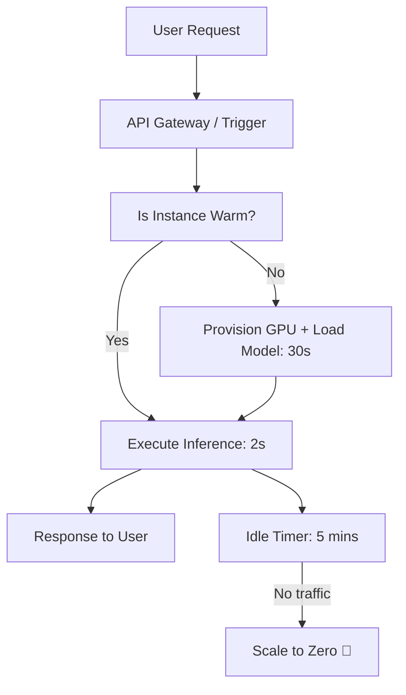

# ☁️ Serverless AI Inference: Zero Management, Pure Execution
> **Level:** Advanced | **Language:** Hinglish | **Goal:** Master the deployment of AI models without managing servers, exploring Modal, Beam, RunPod Serverless, AWS Lambda for AI, and the 2026 strategies for "Scaling-to-Zero" and minimizing "Cold Starts."

---

## 🧭 1. Beginner-Friendly Hinglish Explanation
Normal deployment mein aapko ek "GPU Server" rent karna padta hai jo hamesha "ON" rehta hai (Chaahe koi use kare ya na kare).

- **The Problem:** Maan lo aapka app sirf din mein 2 ghante chalta hai. Baaki 22 ghante aap GPU ka "Kiraya" (Rent) de rahe hain bina kisi use ke.
- **Serverless AI** ka matlab hai: "Server ka dhyan hum rakhenge, aap bas apna Code bhej do."
  - Jab koi user aayega, tabhi GPU "Wake up" hoga.
  - AI answer dega.
  - Phir GPU wapis "So" jayega (Turn off).
  - Aap sirf un **seconds** ka paisa dete hain jab AI kaam kar raha tha.

2026 mein, startup aur side-projects ke liye "Serverless" sabse best option hai kyunki isme "Zero Maintenance" aur "Pay-as-you-go" pricing hoti hai.

---

## 🧠 2. Deep Technical Explanation
Serverless AI involves dynamic provisioning of containers with GPU access.

### 1. The 'Cold Start' Problem (The #1 Enemy):
- When a serverless function is triggered after being idle, it has to:
  1. Pull the Docker image (5-10GB).
  2. Load the model into VRAM (20-40GB).
  3. Start the inference engine.
- This can take **$30-60$ seconds**, which is too slow for a chatbot.

### 2. Solutions for Cold Starts:
- **Warm Pools:** Keeping a few instances "Partially awake" to respond in $< 1s$.
- **Image Layer Caching:** Using specialized clouds (like Modal) that keep your AI libraries cached on every node.
- **NFS / Fast Model Loading:** Instead of putting the model inside the container, load it from a high-speed shared network disk.

### 3. Serverless Platforms (The 2026 Landscape):
- **Modal:** High-performance, Python-native serverless. Feels like writing local code.
- **Beam:** Fast deployment and built-in support for popular models.
- **RunPod Serverless:** Best for raw GPU power and custom models.
- **AWS Lambda (Container support):** Good for "Very tiny" models (like BERT) but lacks native high-end GPU support.

---

## 🏗️ 4. Serverless vs. Provisioned GPU
| Feature | Serverless (Modal/Beam) | Provisioned (EC2/K8s) |
| :--- | :--- | :--- |
| **Pricing** | **Per second (Usage only)** | Per hour (Fixed) |
| **Scaling** | **Instant (Zero to 100)** | Manual or HPA based |
| **Cold Starts** | **Significant (30s+)** | Zero (Always warm) |
| **Maintenance** | **None** | High (Drivers, Docker, OS) |
| **Best For** | Spiky traffic / Small teams | High, steady traffic |

---

## 📐 4. Mathematical Intuition
- **The Break-even Point:** 
  If a dedicated H100 server costs **$\$2000/month$** and a serverless call costs **$\$0.05$** per request.
  $$\text{Break-even} = \frac{2000}{0.05} = 40,000 \text{ requests/month}$$
  - If you have $< 40,000$ requests, **Serverless is cheaper.**
  - If you have $> 40,000$ requests, **Dedicated is cheaper.**

---

## 📊 5. Serverless AI Workflow (Diagram)


---

## 💻 6. Production-Ready Examples (Deploying with Modal in Python)
```python
# 2026 Pro-Tip: Use Modal for 'Pythonic' infrastructure.

import modal

# 1. Define the environment
stub = modal.Stub("llama-3-serve")
image = modal.Image.debian_slim().pip_install("torch", "transformers")

# 2. Define the 'Serverless' function
@stub.function(image=image, gpu="A100", timeout=600)
def generate_text(prompt: str):
    # This code only runs when called. GPU is allocated on-demand.
    model = load_model() # Imagine loading Llama-3 here
    return model.generate(prompt)

# 3. Call from your local terminal
# Modal will spin up a GPU in the cloud, run it, and return the result.
if __name__ == "__main__":
    with stub.run():
        print(generate_text.remote("What is serverless AI?"))
```

---

## ❌ 7. Failure Cases
- **The 'Infinite Scaling' Bill:** A bug causes your serverless function to scale to 1000 GPUs, costing you thousands in an hour. **Fix: Set a `max_containers` limit (e.g., 5).**
- **Dependency Bloat:** Adding too many libraries (`pandas`, `numpy`, `tensorflow`) increases your image size and makes your "Cold Starts" much worse.
- **Regional Scarcity:** You want a serverless A100, but the provider is "Full" and can't find one for you. **Fix: Use providers with 'Multi-region failover'.**

---

## 🛠️ 8. Debugging Guide
- **Symptom:** "The first request always fails with a Timeout."
- **Check:** **Client Timeout**. Your API Gateway (e.g., Nginx) has a 30s timeout, but your AI "Cold Start" takes 45s. Increase the timeout to 60s.
- **Symptom:** "High latency even when warm."
- **Check:** **Initialization Logic**. Are you reloading the model *inside* the function? Move model loading to a "Global" scope so it only happens once per container.

---

## ⚖️ 9. Tradeoffs
- **Simplicity vs. Control:** Serverless is easy but you can't tune the "Kernel" or the "NVIDIA Drivers."
- **GPU Sharing:** In some serverless setups, you might share the physical GPU with another user, which can lead to "Side-channel" performance issues.

---

## 🛡️ 10. Security Concerns
- **Orphan Processes:** A serverless function finishes but a "Ghost process" stays in memory, potentially leaking data to the next user. **Ensure your code 'Exits' cleanly.**

---

## 📈 11. Scaling Challenges
- **The 'Concurrency' limit:** Most serverless providers have a default limit of 10-20 concurrent GPUs. For a major launch, you must request a higher limit weeks in advance.

---

## 💸 12. Cost Considerations
- **Storage Cost:** Even if your function is "Off," you still pay a small fee to "Store" your 20GB Docker image on the provider's disk.

---

## ✅ 13. Best Practices
- **Use 'Warm Keep-alive':** Configure your platform to keep at least 1 instance "Warm" at all times (this costs more but removes cold starts for the most active users).
- **Optimize Image Size:** Use **Alpine Linux** or "Distroless" images to keep cold starts under 10 seconds.
- **Use 'Flash Model Loading':** Save your model weights in **Safetensors** format for $5x$ faster loading into VRAM.

---

## ⚠️ 14. Common Mistakes
- **Putting Large Datasets in the Image:** This makes the image massive. Use an **S3 bucket** or a **Volume mount** instead.
- **No Error Handling for Scarcity:** Not handling the case where the provider says "No GPUs available right now."

---

## 📝 15. Interview Questions
1. **"What is a 'Cold Start' in serverless AI and how do you minimize it?"**
2. **"When should a company switch from Serverless to a Dedicated GPU cluster?"**
3. **"How does 'Scale-to-Zero' affect the user experience?"**

---

## 🚀 15. Latest 2026 Industry Patterns
- **WebAssembly (Wasm) AI:** Running models in Wasm for $< 100ms$ "Cold Starts."
- **Predictive Warming:** Using AI to predict when a user will open the app and "Pre-warming" the GPU before they even hit 'Enter'.
- **Serverless Multi-GPU:** New platforms that let you run a serverless job across **8x H100s** for complex video generation tasks.
