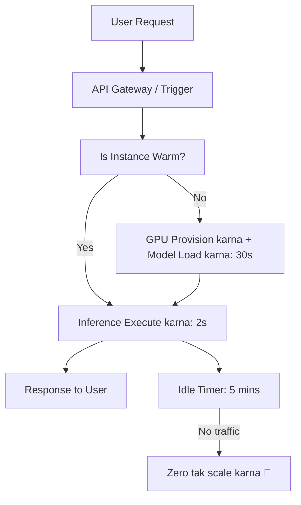

# ☁️ Serverless AI Inference: Zero Management, Pure Execution
> **Level:** Advanced | **Language:** Hinglish | **Goal:** Servers manage kiye bina AI models deploy karne ko master karein, Modal, Beam, RunPod Serverless, AWS Lambda for AI, aur 2026 mein "Scaling-to-Zero" aur "Cold Starts" ko minimize karne ki strategies ko explore karte hue.

---

## 🧭 1. Beginner-Friendly Hinglish Explanation
Normal deployment mein aapko ek "GPU Server" rent karna padta hai jo hamesha "ON" rehta hai (Chaahe koi use kare ya na kare).

- **The Problem:** Maan lo aapka app sirf din mein 2 ghante chalta hai. Baaki 22 ghante aap GPU ka "Kiraya" (Rent) de rahe hain bina kisi use ke.
- **Serverless AI** ka matlab hai: "Server ka dhyan hum rakhenge, aap bas apna Code bhej do."
  - Jab koi user aayega, tabhi GPU "Wake up" hoga.
  - AI answer dega.
  - Phir GPU wapis "So" jayega (Turn off).
  - Aap sirf un **seconds** ka paisa dete hain jab AI kaam kar raha tha.

2026 mein, startup aur side-projects ke liye "Serverless" sabse best option hai kyunki isme "Zero Maintenance" aur "Pay-as-you-go" pricing hoti hai.

---

## 🧠 2. Deep Technical Explanation
Serverless AI mein GPU access ke sath containers ki dynamic provisioning hoti hai.

### 1. The 'Cold Start' Problem (The #1 Enemy):
- Jab ek serverless function idle rehne ke baad trigger hota hai, toh use yeh sab karna padta hai:
  1. Docker image pull karna (5-10GB).
  2. Model ko VRAM mein load karna (20-40GB).
  3. Inference engine start karna.
- Isme **$30-60$ seconds** lag sakte hain, jo ki ek chatbot ke liye bahut slow hai.

### 2. Solutions for Cold Starts:
- **Warm Pools:** $< 1s$ mein respond karne ke liye kuch instances ko "Partially awake" (aadha jagah/chalu) rakhna.
- **Image Layer Caching:** Specialized clouds (jaise Modal) ka use karna jo aapki AI libraries ko har ek node par cached rakhte hain.
- **NFS / Fast Model Loading:** Model ko container ke andar rakhne ke bajaye, use ek high-speed shared network disk se load karna.

### 3. Serverless Platforms (The 2026 Landscape):
- **Modal:** High-performance, Python-native serverless. Yeh bilkul local code likhne jaisa feel hota hai.
- **Beam:** Fast deployment aur popular models ke liye built-in support.
- **RunPod Serverless:** Raw GPU power aur custom models ke liye best.
- **AWS Lambda (Container support):** "Very tiny" models (jaise BERT) ke liye acha hai par isme native high-end GPU support nahi hota.

---

## 🏗️ 4. Serverless vs. Provisioned GPU
| Feature | Serverless (Modal/Beam) | Provisioned (EC2/K8s) |
| :--- | :--- | :--- |
| **Pricing** | **Per second (Sirf usage ka)** | Per hour (Fixed) |
| **Scaling** | **Instant (Zero to 100)** | Manual or HPA based |
| **Cold Starts** | **Significant (30s+)** | Zero (Always warm) |
| **Maintenance** | **None (Kuch nahi)** | High (Drivers, Docker, OS) |
| **Best For** | Spiky traffic / Small teams ke liye | High, steady traffic ke liye |

---

## 📐 4. Mathematical Intuition
- **The Break-even Point:** 
  Agar ek dedicated H100 server ki cost **$\$2000/month$** hai aur ek serverless call ki cost **$\$0.05$** per request hai.
  $$\text{Break-even} = \frac{2000}{0.05} = 40,000 \text{ requests/month}$$
  - Agar aapke paas $< 40,000$ requests hain, toh **Serverless sasta (cheaper) hai.**
  - Agar aapke paas $> 40,000$ requests hain, toh **Dedicated sasta hai.**

---

## 📊 5. Serverless AI Workflow (Diagram)

```mermaid
graph TD
    User[User Request] --> Gateway[API Gateway / Trigger]
    Gateway --> Check[Is Instance Warm?]
    
    Check -- "No" --> Provision[GPU Provision karna + Model Load karna: 30s]
    Check -- "Yes" --> Exec[Inference Execute karna: 2s]
    
    Provision --> Exec
    Exec --> Result[Response to User]
    Exec --> Timer[Idle Timer: 5 mins]
    
    Timer -- "No traffic" --> Kill[Zero tak scale karna 💸]
```

---

## 💻 6. Production-Ready Examples (Deploying with Modal in Python)
```python
# 2026 Pro-Tip: 'Pythonic' infrastructure ke liye Modal ka use karein.

import modal

# 1. Environment define karein
stub = modal.Stub("llama-3-serve")
image = modal.Image.debian_slim().pip_install("torch", "transformers")

# 2. 'Serverless' function define karein
@stub.function(image=image, gpu="A100", timeout=600)
def generate_text(prompt: str):
    # This code only runs when called. GPU is allocated on-demand.
    model = load_model() # Socho ki yahan Llama-3 load ho raha hai
    return model.generate(prompt)

# 3. Apne local terminal se call karein
# Modal cloud mein ek GPU spin up karega, use run karega, aur result return karega.
if __name__ == "__main__":
    with stub.run():
        print(generate_text.remote("What is serverless AI?"))
```

---

## ❌ 7. Failure Cases
- **The 'Infinite Scaling' Bill:** Ek bug ki wajah se aapka serverless function 1000 GPUs tak scale ho jata hai, jisse ek hi ghante mein aapko hazaron ka bill aa jata hai. **Fix: Ek `max_containers` limit set karein (e.g., 5).**
- **Dependency Bloat:** Bahut saari libraries (`pandas`, `numpy`, `tensorflow`) add karne se aapka image size badh jata hai aur aapke "Cold Starts" aur kharab ho jate hain.
- **Regional Scarcity:** Aap ek serverless A100 chahte hain, par provider "Full" hai aur aapke liye koi GPU find nahi kar paa raha hai. **Fix: 'Multi-region failover' wale providers ka use karein.**

---

## 🛠️ 8. Debugging Guide
- **Symptom:** "Pehli request hamesha Timeout ke sath fail ho jati hai."
- **Check:** **Client Timeout**. Aapke API Gateway (e.g., Nginx) ka 30s timeout hai, par aapke AI ka "Cold Start" 45s leta hai. Timeout ko badhakar 60s karein.
- **Symptom:** "Warm hone par bhi high latency."
- **Check:** **Initialization Logic**. Kya aap function ke *inside* model reload kar rahe hain? Model loading ko ek "Global" scope mein move karein taaki yeh per container sirf ek hi baar ho.

---

## ⚖️ 9. Tradeoffs
- **Simplicity vs. Control:** Serverless aasan hai par aap "Kernel" ya "NVIDIA Drivers" ko tune nahi kar sakte.
- **GPU Sharing:** Kuch serverless setups mein, aap kisi dusre user ke sath physical GPU share kar sakte hain, jisse "Side-channel" performance issues ho sakte hain.

---

## 🛡️ 10. Security Concerns
- **Orphan Processes:** Ek serverless function finish ho jata hai par ek "Ghost process" memory mein reh jata hai, jo potentially agle user ko data leak kar sakta hai. **Ensure karein ki aapka code cleanly 'Exited' (band) ho.**

---

## 📈 11. Scaling Challenges
- **The 'Concurrency' limit:** Zyada tar serverless providers ki default limit 10-20 concurrent GPUs hoti hai. Ek bade launch ke liye, aapko weeks pehle hi ek higher limit ki request karni padegi.

---

## 💸 12. Cost Considerations
- **Storage Cost:** Bhale hi aapka function "Off" (band) ho, fir bhi aapko provider ke disk par apni 20GB Docker image ko "Store" karne ke liye ek chota fee pay karna padta hai.

---

## ✅ 13. Best Practices
- **'Warm Keep-alive' ka use karein:** Har waqt kam se kam 1 instance ko "Warm" rakhne ke liye apne platform ko configure karein (isme cost zyada aati hai par active users ke liye cold starts remove ho jate hain).
- **Image Size optimize karein:** Cold starts ko 10 seconds ke andar rakhne ke liye **Alpine Linux** ya "Distroless" images ka use karein.
- **'Flash Model Loading' ka use karein:** VRAM mein $5x$ faster loading ke liye apne model weights ko **Safetensors** format mein save karein.

---

## ⚠️ 14. Common Mistakes
- **Image ke andar bade Datasets daal dena:** Yeh image ko massive (bahut bada) bana deta hai. Iske bajaye ek **S3 bucket** ya **Volume mount** ka use karein.
- **Scarcity ke liye koi Error Handling na hona:** Us case ko handle na karna jab provider kehta hai ki "No GPUs available right now" (abhi koi GPU available nahi hai).

---

## 📝 15. Interview Questions
1. **"Serverless AI mein 'Cold Start' kya hai aur aap ise kaise minimize karte hain?"**
2. **"Kisi company ko Serverless se ek Dedicated GPU cluster par kab switch karna chahiye?"**
3. **"'Scale-to-Zero' user experience ko kaise affect karta hai?"**

---

## 🚀 15. Latest 2026 Industry Patterns
- **WebAssembly (Wasm) AI:** $< 100ms$ "Cold Starts" ke liye Wasm mein models run karna.
- **Predictive Warming:** AI ka use kargke predict karna ki user kab app open karega aur unke 'Enter' hit karne se pehle hi GPU ko "Pre-warm" kar dena.
- **Serverless Multi-GPU:** Naye platforms jo aapko complex video generation tasks ke liye **8x H100s** par serverless job run karne dete hain.
