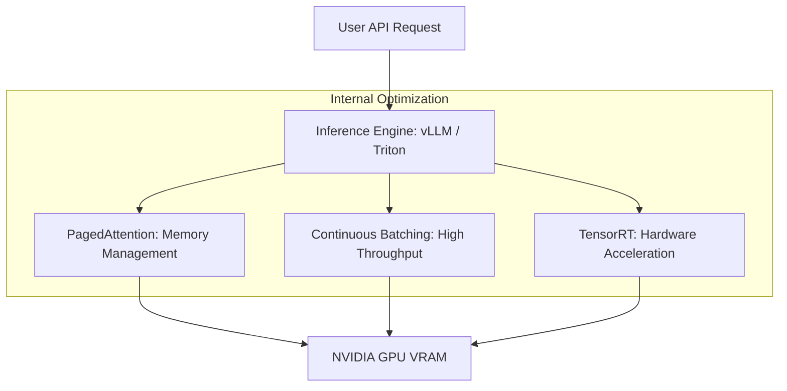

# 🏎️ Triton & vLLM: The Production-Grade Inference Servers
> **Level:** Advanced | **Language:** Hinglish | **Goal:** Master the two industry-standard tools for high-performance AI serving, exploring PagedAttention, Model Ensembles, Continuous Batching, and the 2026 strategies for building "Fast & Efficient" AI backends.

---

## 🧭 1. Beginner-Friendly Hinglish Explanation
Model deploy karne ke do tareeke hain:
1. **The Slow Way:** Python mein `Flask` ya `FastAPI` likhna aur model load karna. (Ok for testing, bad for production).
2. **The Fast Way:** Ek "Inference Server" use karna jo sirf AI chalaney ke liye bana ho.

**vLLM** aur **Triton** wahi "Fast Engines" hain.
- **vLLM:** Ye specially LLMs (Llama, GPT) ke liye bana hai. Iska secret weapon hai **PagedAttention**, jo memory ko itni achi tarah manage karta hai ki aap ek hi GPU par 10x zyada users handle kar sakte hain.
- **Triton (by NVIDIA):** Ye "Everything" server hai. Ye Image models, Audio models, aur LLMs sab ko ek saath chala sakta hai. Ye har NVIDIA GPU ki "Peak Power" nikal leta hai.

2026 mein, agar aapko "World-class" speed chahiye, toh aap vLLM use karenge. Agar aapko "Variety" (Image + Text) chahiye, toh aap Triton use karenge.

---

## 🧠 2. Deep Technical Explanation
Inference servers optimize the **Compute-to-Memory** bottleneck of neural networks.

### 1. vLLM (Virtual Large Language Model):
- **PagedAttention:** Inspired by OS Virtual Memory. It stores the **KV-Cache** (Key-Value memories of words) in non-contiguous memory blocks.
- **Result:** No more "VRAM Fragmentation." You can use $95\%$ of your VRAM, allowing for massive batch sizes.
- **Continuous Batching:** It doesn't wait for a batch to finish. It adds new requests into the GPU as soon as any previous request generates a token.

### 2. NVIDIA Triton Inference Server:
- **Model Ensemble:** Running a "Chain" of models (e.g., *Voice-to-Text $\to$ LLM $\to$ Text-to-Voice*) as a single atomic request.
- **Multi-Framework:** Runs PyTorch, TensorFlow, ONNX, and TensorRT models simultaneously.
- **Dynamic Batching:** It waits for a few milliseconds to "Collect" multiple requests and sends them to the GPU as one batch to maximize efficiency.

---

## 🏗️ 3. vLLM vs. Triton
| Feature | vLLM | NVIDIA Triton |
| :--- | :--- | :--- |
| **Best For** | **Pure LLMs (Text-only)** | **General AI (Vision, Audio, etc.)**|
| **Secret Weapon** | **PagedAttention** | Model Pipelines (Ensembles) |
| **Performance** | **Higher Throughput for LLMs** | Highest Hardware Utilization |
| **Setup Complexity**| Low | **High** |
| **Cloud Support** | Native in most AI Clouds | Standard in Enterprise |

---

## 📐 4. Mathematical Intuition
- **Memory Efficiency (PagedAttention):** 
  In standard serving, we must pre-allocate the "Maximum" memory for every user. 
  $$\text{Waste} = \text{Max Context Size} - \text{Actual Context Size}$$
  vLLM reduces this waste to near-zero by only allocating memory "Page by Page" as the conversation grows. This allows for **$2-4x$** more users on the same H100.

---

## 📊 5. Inference Server Architecture (Diagram)


---

## 💻 6. Production-Ready Examples (Launching vLLM Server)
```bash
# 2026 Pro-Tip: Use vLLM to get an OpenAI-compatible API instantly.

# Launch Llama-3-8B with PagedAttention and Tensor Parallelism (across 2 GPUs)
python -m vllm.entrypoints.openai.api_server \
    --model meta-llama/Meta-Llama-3-8B-Instruct \
    --tensor-parallel-size 2 \
    --gpu-memory-utilization 0.9 \
    --port 8000

# Now you can use the standard OpenAI Python client to talk to YOUR local model!
```

---

## ❌ 7. Failure Cases
- **VRAM Fragmentation (Non-vLLM):** In standard servers, you might have 5GB free, but it's in small "Gaps," so you can't load a 4GB model. **Fix: Use vLLM.**
- **High Latency for Small Batches:** Triton's "Dynamic Batching" waits $10ms$ for more users. If only 1 user is using the app, they wait $10ms$ for nothing. **Fix: Tune the `max_queue_delay_microseconds` parameter.**
- **Incompatible Kernels:** vLLM using an optimized "CUDA Kernel" that only works on H100, but you are trying to run it on an old T4.

---

## 🛠️ 8. Debugging Guide
- **Symptom:** "Server is crashing with 'CUDA Out of Memory' during long chats."
- **Check:** **Max Model Len**. Ensure `--max-model-len` is set correctly. If it's too high, the KV-cache will grow until the GPU explodes.
- **Symptom:** "TPS (Tokens Per Second) is very low."
- **Check:** **Tensor Parallelism**. Are you splitting a small model across too many GPUs? The "Communication overhead" between GPUs might be killing the speed.

---

## ⚖️ 9. Tradeoffs
- **vLLM (Fast & Focused) vs. Triton (Universal & Complex):** 
  - vLLM is the "Ferrari" for text. 
  - Triton is the "Swiss Army Knife" for everything else.
- **Quantization:** Both support **AWQ** and **FP8** for $2x$ speedup.

---

## 🛡️ 10. Security Concerns
- **Model Stealing:** Someone querying your Triton server with millions of specific prompts to "Reverse Engineer" your fine-tuned weights. **Use 'API Key' authentication and 'Request Logging'.**

---

## 📈 11. Scaling Challenges
- **Multi-Node Inference:** Running one model (like Llama-400B) across 4-8 different servers. This requires **Ray** or **MPI** integration with vLLM.

---

## 💸 12. Cost Considerations
- **Memory Utilization:** A server running at $10\%$ memory utilization is a waste of money. vLLM allows you to run at **$90\%+$** safely.

---

## ✅ 13. Best Practices
- **Use 'TensorRT-LLM' with Triton:** If you want the absolute fastest performance on NVIDIA hardware.
- **Enable 'Prefix Caching':** If your app uses the same "System Prompt" for everyone, vLLM can cache it once in memory to save tokens and speed up TTFT.
- **Health Checks:** Always monitor the `/health` or `/metrics` endpoints.

---

## ⚠️ 14. Common Mistakes
- **Running vLLM as root:** Use a non-privileged user in Docker for security.
- **Ignoring Logprobs:** Not requesting logprobs if you need to know how "Confident" the AI is in its answer.

---

## 📝 15. Interview Questions
1. **"What is PagedAttention and how did it change LLM serving?"**
2. **"Explain the concept of 'Continuous Batching'."**
3. **"When would you choose NVIDIA Triton over vLLM?"**

---

## 🚀 15. Latest 2026 Industry Patterns
- **Speculative Decoding in vLLM:** Using a small 1B model to "Guess" tokens and a 70B model to "Check" them, giving 70B intelligence at 1B speeds.
- **LoRA Adapter Swapping:** Triton/vLLM swapping "Custom Skills" (LoRA) for different users in real-time on the same base model.
- **Serverless vLLM:** Integrating vLLM with KEDA for instant scaling to zero in Kubernetes clusters.
