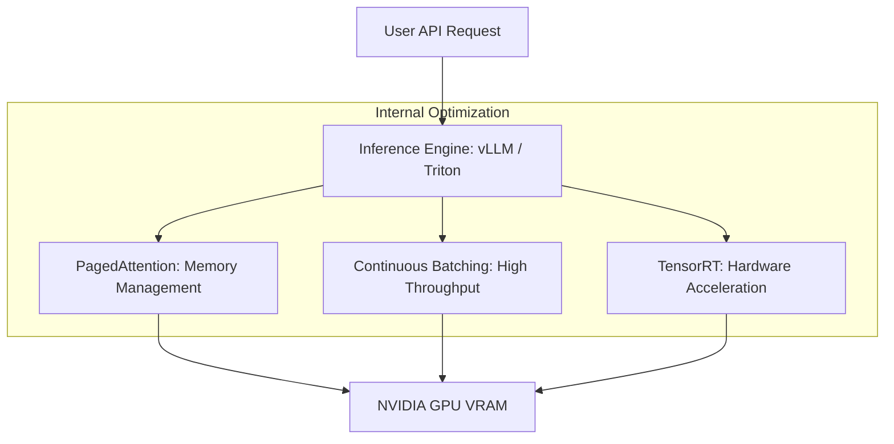

# 🏎️ Triton & vLLM: The Production-Grade Inference Servers
> **Level:** Advanced | **Language:** Hinglish | **Goal:** High-performance AI serving ke do industry-standard tools ko master karein, PagedAttention, Model Ensembles, Continuous Batching, aur 2026 mein "Fast & Efficient" AI backends build karne ki strategies ko explore karte hue.

---

## 🧭 1. Beginner-Friendly Hinglish Explanation
Model deploy karne ke do tareeke hain:
1. **The Slow Way:** Python mein `Flask` ya `FastAPI` likhna aur model load karna. (Ok for testing, bad for production).
2. **The Fast Way:** Ek "Inference Server" use karna jo sirf AI chalaney ke liye bana ho.

**vLLM** aur **Triton** wahi "Fast Engines" hain.
- **vLLM:** Ye specially LLMs (Llama, GPT) ke liye bana hai. Iska secret weapon hai **PagedAttention**, jo memory ko itni achi tarah manage karta hai ki aap ek hi GPU par 10x zyada users handle kar sakte hain.
- **Triton (by NVIDIA):** Ye "Everything" server hai. Ye Image models, Audio models, aur LLMs sab ko ek saath chala sakta hai. Ye har NVIDIA GPU ki "Peak Power" nikal leta hai.

2026 mein, agar aapko "World-class" speed chahiye, toh aap vLLM use karenge. Agar aapko "Variety" (Image + Text) chahiye, toh aap Triton use karenge.

---

## 🧠 2. Deep Technical Explanation
Inference servers neural networks ke **Compute-to-Memory** bottleneck ko optimize karte hain.

### 1. vLLM (Virtual Large Language Model):
- **PagedAttention:** OS Virtual Memory se inspired hai. Yeh **KV-Cache** (words ke Key-Value memories) ko non-contiguous memory blocks mein store karta hai.
- **Result:** Ab koi "VRAM Fragmentation" nahi hoga. Aap apne VRAM ka $95\%$ use kar sakte hain, jisse massive batch sizes compile ho sakte hain.
- **Continuous Batching:** Yeh batch ke finish hone ka wait nahi karta. Jaise hi koi purani request token generate karti hai, yeh naye requests ko GPU mein add kar deta hai.

### 2. NVIDIA Triton Inference Server:
- **Model Ensemble:** Models ki ek "Chain" ko (e.g., *Voice-to-Text $\to$ LLM $\to$ Text-to-Voice*) ek single atomic request ke roop mein run karna.
- **Multi-Framework:** PyTorch, TensorFlow, ONNX, aur TensorRT models ko ek sath run karta hai.
- **Dynamic Batching:** Yeh multiple requests ko "Collect" (इकट्ठा) karne ke liye kuch milliseconds wait karta hai aur efficiency ko maximize karne ke liye unhe ek single batch ke roop mein GPU par bhejta hai.

---

## 🏗️ 3. vLLM vs. Triton
| Feature | vLLM | NVIDIA Triton |
| :--- | :--- | :--- |
| **Best For** | **Pure LLMs (Text-only)** | **General AI (Vision, Audio, etc.)** |
| **Secret Weapon** | **PagedAttention** | Model Pipelines (Ensembles) |
| **Performance** | **Higher Throughput for LLMs** | Highest Hardware Utilization |
| **Setup Complexity**| Low (Aasan) | **High (Mushkil)** |
| **Cloud Support** | Native in most AI Clouds | Standard in Enterprise |

---

## 📐 4. Mathematical Intuition
- **Memory Efficiency (PagedAttention):** 
  Standard serving mein, humein har ek user ke liye "Maximum" memory pehle se hi allocate karni padti hai. 
  $$\text{Waste} = \text{Max Context Size} - \text{Actual Context Size}$$
  vLLM conversation badhne ke sath-sath sirf "Page by Page" memory allocate karke is waste ko lagbhag zero (near-zero) kar deta hai. Yeh same H100 par **$2-4x$** zyada users ko allow karta hai.

---

## 📊 5. Inference Server Architecture (Diagram)

```mermaid
graph TD
    User[User API Request] --> Engine[Inference Engine: vLLM / Triton]
    
    subgraph "Internal Optimization"
    Engine --> PB[PagedAttention: Memory Management]
    Engine --> CB[Continuous Batching: High Throughput]
    Engine --> TRT[TensorRT: Hardware Acceleration]
    end
    
    PB & CB & TRT --> GPU[NVIDIA GPU VRAM]
```

---

## 💻 6. Production-Ready Examples (Launching vLLM Server)
```bash
# 2026 Pro-Tip: OpenAI-compatible API instantly paane ke liye vLLM ka use karein.

# PagedAttention aur Tensor Parallelism ke sath (2 GPUs par) Llama-3-8B launch karein
python -m vllm.entrypoints.openai.api_server \
    --model meta-llama/Meta-Llama-3-8B-Instruct \
    --tensor-parallel-size 2 \
    --gpu-memory-utilization 0.9 \
    --port 8000

# Ab aap APNE local model se baat karne ke liye standard OpenAI Python client ka use kar sakte hain!
```

---

## ❌ 7. Failure Cases
- **VRAM Fragmentation (Non-vLLM):** Standard servers mein, aapke paas 5GB free ho sakti hai par woh chote "Gaps" (tukdon) mein hoti hai, isliye aap 4GB ka model load nahi kar sakte. **Fix: vLLM ka use karein.**
- **High Latency for Small Batches:** Triton ka "Dynamic Batching" zyada users ke liye $10ms$ wait karta hai. Agar sirf 1 user app use kar raha hai, toh woh bina kisi wajah ke $10ms$ wait karta hai. **Fix: `max_queue_delay_microseconds` parameter ko tune karein.**
- **Incompatible Kernels:** vLLM dwara ek optimized "CUDA Kernel" ka use karna jo sirf H100 par kaam karta hai, par aap use ek purane T4 par run karne ki koshish kar rahe hain.

---

## 🛠️ 8. Debugging Guide
- **Symptom:** "Lambi chats ke dauran server 'CUDA Out of Memory' ke sath crash ho raha hai."
- **Check:** **Max Model Len**. Ensure karein ki `--max-model-len` correctly set ho. Agar yeh bahut high hai, toh KV-cache tab tak badhega jab tak GPU explode (crash) na ho jaye.
- **Symptom:** "TPS (Tokens Per Second) bahut low hai."
- **Check:** **Tensor Parallelism**. Kya aap ek chote model ko bahut saare GPUs par split kar rahe hain? GPUs ke beech ka "Communication overhead" speed ko destroy kar raha ho sakta hai.

---

## ⚖️ 9. Tradeoffs
- **vLLM (Fast & Focused) vs. Triton (Universal & Complex):** 
  - text ke liye vLLM "Ferrari" hai. 
  - baaki sab ke liye Triton "Swiss Army Knife" (har kaam aane wala chaku) hai.
- **Quantization:** Dono hi $2x$ speedup ke liye **AWQ** aur **FP8** ko support karte hain.

---

## 🛡️ 10. Security Concerns
- **Model Stealing:** Koi aapke fine-tuned weights ko "Reverse Engineer" karne ke liye millions of specific prompts ke sath aapke Triton server ko query kar raha hai. **'API Key' authentication aur 'Request Logging' ka use karein.**

---

## 📈 11. Scaling Challenges
- **Multi-Node Inference:** Ek model (jaise Llama-400B) ko 4-8 different servers par run karna. Iske liye vLLM ke sath **Ray** ya **MPI** integration ki zaroorat hoti hai.

---

## 💸 12. Cost Considerations
- **Memory Utilization:** $10\%$ memory utilization par chalne wala server paise ki waste hai. vLLM aapko safely **$90\%+$** par run karne ki permission deta hai.

---

## ✅ 13. Best Practices
- **Triton ke sath 'TensorRT-LLM' ka use karein:** Agar aap NVIDIA hardware par absolute fastest performance chahte hain.
- **'Prefix Caching' enable karein:** Agar aapka app sabhi ke liye same "System Prompt" use karta hai, toh vLLM tokens save karne aur TTFT ko speed up karne ke liye use ek baar memory mein cache kar sakta hai.
- **Health Checks:** Hamesha `/health` ya `/metrics` endpoints ko monitor karein.

---

## ⚠️ 14. Common Mistakes
- **vLLM ko root ke roop mein chalana:** Security ke liye Docker mein ek non-privileged user ka use karein.
- **Logprobs ko ignore karna:** Agar aapko yeh jaanna hai ki AI apne answer mein kitna "Confident" hai, toh logprobs ki request na karna.

---

## 📝 15. Interview Questions
1. **"PagedAttention kya hai aur isne LLM serving ko kaise badla?"**
2. **"'Continuous Batching' ke concept ko explain karein."**
3. **"Aap vLLM ke bajaye NVIDIA Triton ko kab choose karenge?"**

---

## 🚀 15. Latest 2026 Industry Patterns
- **Speculative Decoding in vLLM:** Tokens ko "Guess" (anuman) karne ke liye ek chote 1B model ka aur unhe "Check" karne ke liye 70B model ka use karna, jisse 1B ki speed par 70B ki intelligence milti hai.
- **LoRA Adapter Swapping:** Triton/vLLM same base model par real-time mein different users ke liye "Custom Skills" (LoRA) ko swap (badalna) karta hai.
- **Serverless vLLM:** Kubernetes clusters mein zero tak instant scale karne ke liye vLLM ko KEDA ke sath integrate karna.
