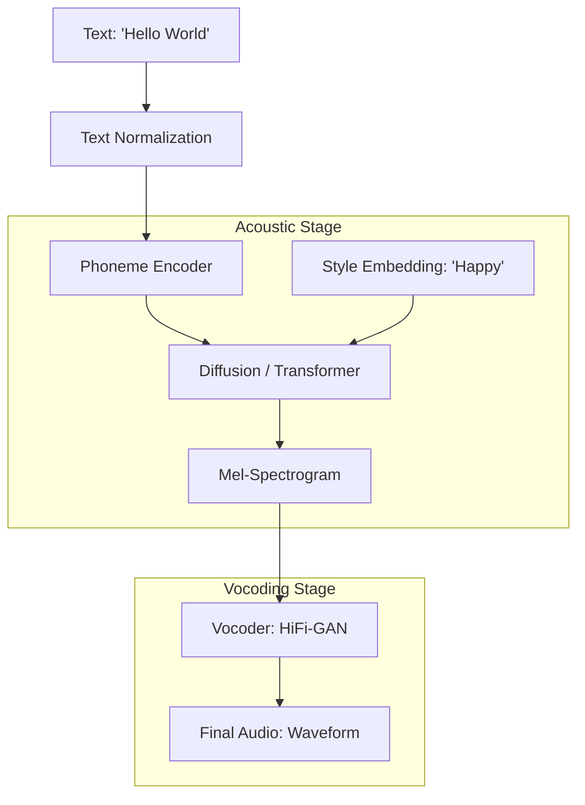

# 🎙️ Audio & Speech Models: The AI Voice
> **Level:** Advanced | **Language:** Hinglish | **Goal:** Master the technology behind AI speech, exploring TTS (Text-to-Speech), STT (Speech-to-Text), Audio Diffusion, Voice Cloning, and the 2026 strategies for building "Emotion-aware" voice assistants.

---

## 🧭 1. Beginner-Friendly Hinglish Explanation
AI sirf "Likh" nahi sakta, wo "Bol" (Speech) bhi sakta hai aur "Sun" (Hearing) bhi sakta hai.

- **The Problem:** Purane robots "Robot" ki tarah bolte the (Jaise Alexa 2015 mein). Unme koi "Ehsaas" (Emotion) nahi hota tha.
- **Modern Audio AI** do kaam karta hai:
  1. **STT (Whisper):** Insaan ki awaaz ko text mein badalna. (Bahut heavy noise mein bhi kaam karta hai).
  2. **TTS (ElevenLabs):** Text ko insaan jaisi awaaz mein badalna. (Saanp lena, rona, hasna—sab real lagta hai).

2026 mein, hum **"Voice Cloning"** bhi kar sakte hain—sirf 3 seconds ki recording se AI aapki awaaz ki "Copy" bana sakta hai.

---

## 🧠 2. Deep Technical Explanation
Audio AI is built on top of **Signal Processing** and **Transformers.**

### 1. STT (Speech-to-Text): OpenAI Whisper
- Uses a **Transformer Encoder-Decoder** architecture.
- Input is a **Log-Mel Spectrogram** (A visual representation of sound).
- It is trained on 680,000 hours of multilingual data, making it robust to accents and background noise.

### 2. TTS (Text-to-Speech): 
- **The Pipeline:** Text $\to$ **Phonemes** (Sound units) $\to$ **Acoustic Model** (Spectrogram generation) $\to$ **Vocoder** (Waveform generation).
- **Vocoders (HiFi-GAN / WaveGlow):** These turn a 2D picture of sound back into the 1D "Wiggle" (Waveform) that your speakers can play.

### 3. Audio Diffusion (MusicLM / AudioLDM):
- Just like Stable Diffusion creates images, these models create **Audio Spectrograms.**
- You can say *"90s Bollywood song with electronic beats"* and it will generate the actual MP3.

### 4. Zero-shot Voice Cloning:
- Using a small **Speaker Embedding** to "Condition" the TTS model. It doesn't need to retrain; it just "Mimics" the style of the input vector.

---

## 🏗️ 3. Audio AI Pipeline Comparison
| Task | Model Example | Input | Output |
| :--- | :--- | :--- | :--- |
| **STT / Transcription** | OpenAI Whisper | `.mp3 / .wav` | Text |
| **TTS / Synthesis** | ElevenLabs / Bark | Text | `.wav` (Human voice) |
| **Music Gen** | Suno / Udio | Text Prompt | Full Song (Vocal+Music) |
| **Voice Conversion** | RVC (Retrieval Voice) | Voice A | Voice B |
| **Sound Design** | AudioLDM | "Explosion" | Sound Effect |

---

## 📐 4. Mathematical Intuition
- **The Sampling Rate:** 
  Digital audio is a sequence of numbers. 
  - $16$ kHz: Standard for speech.
  - $44.1$ kHz: CD Quality.
  - $48$ kHz: Professional Video.
  To generate $1$ second of high-quality audio, the AI must predict **$48,000$ numbers.** This is why audio models are often "Autoregressive" and slow.

---

## 📊 5. Text-to-Speech Architecture (Diagram)


---

## 💻 6. Production-Ready Examples (Using Whisper for Transcription)
```python
# 2026 Pro-Tip: Use 'Faster-Whisper' to get 4x speedup on GPUs.

from faster_whisper import WhisperModel

# 1. Load the model (Large version for best accuracy)
model = WhisperModel("large-v3", device="cuda", compute_type="float16")

# 2. Transcribe an audio file
segments, info = model.transcribe("customer_call.mp3", beam_size=5)

print(f"Detected language: {info.language} with probability {info.language_probability}")

# 3. Print the text with timestamps
for segment in segments:
    print(f"[{segment.start:.2f}s -> {segment.end:.2f}s] {segment.text}")

# Now you have a perfect log of the conversation! 🎙️
```

---

## ❌ 7. Failure Cases
- **The 'Uncanny Valley' of Voice:** A voice that sounds $99\%$ human but has a "Metallic" or "Dead" tone that makes people uncomfortable.
- **Hallucinations in STT:** Whisper sometimes "Invent" text when there is silence or heavy music in the background. (e.g., repeating a word 100 times).
- **Phonetic Ambiguity:** Model doesn't know if "Record" is a noun (Record a song) or a verb (The world record). **Fix: Use 'Contextual Embeddings'.**
- **Emotion Mismatch:** Reading a "Sad" news story with a "Cheerful" commercial voice.

---

## 🛠️ 8. Debugging Guide
- **Symptom:** "Audio has 'Clicks' or 'Pops'."
- **Check:** **Sampling Rate Mismatch**. You generated at $22$kHz but played at $44$kHz. Always ensure consistent sampling rates.
- **Symptom:** "Voice Cloning doesn't sound like me."
- **Check:** **Background Noise in Sample**. If your 3-second sample has "Fan noise," the AI will try to "Clone the fan" too!

---

## ⚖️ 9. Tradeoffs
- **Real-time vs. Quality:** 
  - Streaming TTS (needed for phone calls) uses smaller models and sounds "Thinner." 
  - Studio TTS (for audiobooks) uses massive models and takes 5s to generate 1s of audio.
- **Latency:** TTFA (Time to First Audio).

---

## 🛡️ 10. Security Concerns
- **Voice Phishing (Vishing):** Scammers cloning a CEO's voice to authorize a bank transfer. **Solution: Use 'Voice Bio-metrics' and 'AI Detection' for audio.**
- **Deepfake Music:** Generating a new song using a famous singer's voice without their permission.

---

## 📈 11. Scaling Challenges
- **Parallel Generation:** Standard TTS is autoregressive (word-by-word). In 2026, we use **Non-Autoregressive Transformers** that can generate a whole paragraph in one "Blink."

---

## 💸 12. Cost Considerations
- **ElevenLabs Pricing:** High-quality voice is expensive (up to $\$0.30$ per minute). **Optimization: Use 'StyleTTS2' (Open Source) for high-volume tasks.**

---

## ✅ 13. Best Practices
- **Use 'SSML' (Speech Synthesis Markup Language):** Add tags like `<break time="500ms"/>` or `<emphasis>` to control the voice.
- **Normalize Text:** Convert "Dr." to "Doctor" and "$100" to "One hundred dollars" before sending to the TTS.
- **Implement 'Diarization':** Use a model (like Pyannote) to detect "Who is speaking" (Speaker 1, Speaker 2) before transcribing.

---

## ⚠️ 14. Common Mistakes
- **No 'Audio Preprocessing':** Sending raw, loud, uncompressed audio to Whisper. (Always trim silence and normalize volume).
- **Ignoring Accents:** Assuming a model trained on "US English" will work perfectly for "Indian English" or "Scottish English."

---

## 📝 15. Interview Questions
1. **"What is a Spectrogram and why is it used in Audio AI?"**
2. **"Explain the role of a 'Vocoder' in the TTS pipeline."**
3. **"How does OpenAI Whisper handle multiple languages in a single file?"**

---

## 🚀 15. Latest 2026 Industry Patterns
- **Full-Duplex AI:** AI that can "Listen" and "Talk" at the same time, allowing you to "Interrupt" it mid-sentence (Like GPT-4o Voice).
- **Spatial Audio AI:** AI that generates sound that feels like it's coming from a "Specific direction" in a 3D room.
- **Brain-to-Speech:** Experimental AI that can convert "Neural signals" directly into audio for people who cannot speak.
