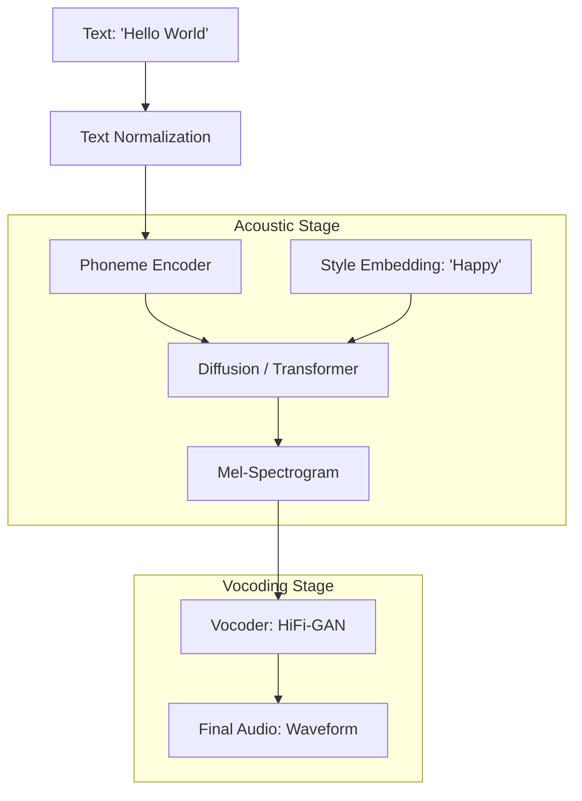

# 🎙️ Audio & Speech Models: The AI Voice
> **Level:** Advanced | **Language:** Hinglish | **Goal:** AI speech ke peeche ki technology ko master karein, TTS, STT, Audio Diffusion, Voice Cloning, aur 2026 mein "Emotion-aware" voice assistants build karne ki strategies ko explore karte hue.

---

## 🧭 1. Beginner-Friendly Hinglish Explanation
AI sirf "Likh" nahi sakta, wo "Bol" (Speech) bhi sakta hai aur "Sun" (Hearing) bhi sakta hai.

- **The Problem:** Purane robots "Robot" ki tarah bolte the (Jaise Alexa 2015 mein). Unme koi "Ehsaas" (Emotion) nahi hota tha.
- **Modern Audio AI** do kaam karta hai:
  1. **STT (Whisper):** Insaan ki awaaz ko text mein badalna. (Bahut heavy noise mein bhi kaam karta hai).
  2. **TTS (ElevenLabs):** Text ko insaan jaisi awaaz mein badalna. (Saanp lena, rona, hasna—sab real lagta hai).

2026 mein, hum **"Voice Cloning"** bhi kar sakte hain—sirf 3 seconds ki recording se AI aapki awaaz ki "Copy" bana sakta hai.

---

## 🧠 2. Deep Technical Explanation
Audio AI **Signal Processing** aur **Transformers** ke upar built hai.

### 1. STT (Speech-to-Text): OpenAI Whisper
- Yeh ek **Transformer Encoder-Decoder** architecture ka use karta hai.
- Input ek **Log-Mel Spectrogram** hota hai (sound ka ek visual representation).
- Ise 680,000 hours of multilingual data par train kiya gaya hai, jo ise accents aur background noise ke prati robust banata hai.

### 2. TTS (Text-to-Speech): 
- **Pipeline:** Text $\to$ **Phonemes** (Sound units) $\to$ **Acoustic Model** (Spectrogram generation) $\to$ **Vocoder** (Waveform generation).
- **Vocoders (HiFi-GAN / WaveGlow):** Yeh sound ki ek 2D picture ko wapas us 1D "Wiggle" (Waveform) mein convert kar dete hain jise aapke speakers play kar sakein.

### 3. Audio Diffusion (MusicLM / AudioLDM):
- Bilkul jaise Stable Diffusion images create karta hai, waise hi yeh models **Audio Spectrograms** create karte hain.
- Aap keh sakte hain *"90s Bollywood song with electronic beats"* aur yeh actual MP3 generate kar dega.

### 4. Zero-shot Voice Cloning:
- TTS model ko "Condition" (tayyar) karne ke liye ek chote **Speaker Embedding** ka use karna. Ise retrain karne ki zaroorat nahi hoti; yeh bas input vector ke style ko "Mimic" (nakal) karta hai.

---

## 🏗️ 3. Audio AI Pipeline Comparison
| Task | Model Example | Input | Output |
| :--- | :--- | :--- | :--- |
| **STT / Transcription** | OpenAI Whisper | `.mp3 / .wav` | Text |
| **TTS / Synthesis** | ElevenLabs / Bark | Text | `.wav` (Human voice) |
| **Music Gen** | Suno / Udio | Text Prompt | Full Song (Vocal+Music) |
| **Voice Conversion** | RVC (Retrieval Voice) | Voice A | Voice B |
| **Sound Design** | AudioLDM | "Explosion" | Sound Effect |

---

## 📐 4. Mathematical Intuition
- **The Sampling Rate:** 
  Digital audio numbers ki ek sequence hoti hai. 
  - $16$ kHz: Speech ke liye standard.
  - $44.1$ kHz: CD Quality.
  - $48$ kHz: Professional Video.
  High-quality audio ka $1$ second generate karne ke liye, AI ko **$48,000$ numbers** predict karne hote hain. Yahi wajah hai ki audio models aksar "Autoregressive" aur slow hote hain.

---

## 📊 5. Text-to-Speech Architecture (Diagram)

```mermaid
graph TD
    Text[Text: 'Hello World'] --> Norm[Text Normalization]
    Norm --> Enc[Phoneme Encoder]
    
    subgraph "Acoustic Stage"
    Enc --> Diff[Diffusion / Transformer]
    Style[Style Embedding: 'Happy'] --> Diff
    Diff --> Spec[Mel-Spectrogram]
    end
    
    subgraph "Vocoding Stage"
    Spec --> Voc[Vocoder: HiFi-GAN]
    Voc --> Wave[Final Audio: Waveform]
    end
```

---

## 💻 6. Production-Ready Examples (Using Whisper for Transcription)
```python
# 2026 Pro-Tip: GPUs par 4x speedup paane ke liye 'Faster-Whisper' ka use karein.

from faster_whisper import WhisperModel

# 1. Model load karein (best accuracy ke liye Large version)
model = WhisperModel("large-v3", device="cuda", compute_type="float16")

# 2. Transcribe an audio file
segments, info = model.transcribe("customer_call.mp3", beam_size=5)

print(f"Detected language: {info.language} with probability {info.language_probability}")

# 3. Timestamps ke sath text print karein
for segment in segments:
    print(f"[{segment.start:.2f}s -> {segment.end:.2f}s] {segment.text}")

# Ab aapke paas conversation ka ek perfect log hai! 🎙️
```

---

## ❌ 7. Failure Cases
- **The 'Uncanny Valley' of Voice:** Ek aisi aawaz jo $99\%$ human jaisi lagti hai par usme ek "Metallic" (dhaat jaisa) ya "Dead" tone hota hai jo logo ko uncomfortable karta hai.
- **Hallucinations in STT:** Whisper kabhi-kabhi background mein silence ya heavy music hone par text ko "Invent" (apne aap bana lena) kar deta hai. (e.g., kisi word ko 100 times repeat karna).
- **Phonetic Ambiguity:** Model ko nahi pata hota ki "Record" ek noun hai (Record a song) ya ek verb (The world record). **Fix: 'Contextual Embeddings' ka use karein.**
- **Emotion Mismatch:** Ek "Sad" (dukhad) news story ko "Cheerful" (khush-mizaj) commercial voice ke sath read karna.

---

## 🛠️ 8. Debugging Guide
- **Symptom:** "Audio mein 'Clicks' ya 'Pops' aate hain."
- **Check:** **Sampling Rate Mismatch**. Aapne $22$kHz par generate kiya par $44$kHz par play kiya. Hamesha consistent sampling rates ensure karein.
- **Symptom:** "Voice Cloning mere jaisi nahi lag rahi."
- **Check:** **Background Noise in Sample**. Agar aapke 3-second ke sample mein "Fan noise" hai, toh AI fan ko bhi "Clone" (nakal) karne ki koshish karega!

---

## ⚖️ 9. Tradeoffs
- **Real-time vs. Quality:** 
  - Streaming TTS (phone calls ke liye zaroorat) smaller models ka use karta hai aur "Thinner" (patla) sound karta hai. 
  - Studio TTS (audiobooks ke liye) massive models ka use karta hai aur 1s of audio generate karne ke liye 5s leta hai.

---

## 🛡️ 10. Security Concerns
- **Voice Phishing (Vishing):** Bank transfer authorize karne ke liye scammers dwara CEO ki aawaz ko clone karna. **Solution: Audio ke liye 'Voice Bio-metrics' aur 'AI Detection' ka use karein.**
- **Deepfake Music:** Kisi famous singer ki permission ke bina unki aawaz ka use karke naya song generate karna.

---

## 📈 11. Scaling Challenges
- **Parallel Generation:** Standard TTS autoregressive (word-by-word) hota hai. 2026 mein, hum **Non-Autoregressive Transformers** ka use karte hain jo ek single "Blink" (palak jhapakte) mein pura paragraph generate kar sakte hain.

---

## 💸 12. Cost Considerations
- **ElevenLabs Pricing:** High-quality voice expensive hoti hai (up to $\$0.30$ per minute). **Optimization: High-volume tasks ke liye 'StyleTTS2' (Open Source) ka use karein.**

---

## ✅ 13. Best Practices
- **'SSML' (Speech Synthesis Markup Language) ka use karein:** Voice ko control karne ke liye `<break time="500ms"/>` ya `<emphasis>` jaise tags add karein.
- **Text ko Normalize karein:** TTS ko bhejne se pehle "Dr." ko "Doctor" aur "$100" ko "One hundred dollars" mein convert karein.
- **'Diarization' implement karein:** Transcribe karne se pehle "Kaun bol raha hai" (Speaker 1, Speaker 2) yeh detect karne ke liye ek model (jaise Pyannote) ka use karein.

---

## ⚠️ 14. Common Mistakes
- **No 'Audio Preprocessing':** Whisper ko raw, loud, aur uncompressed audio send karna. (Hamesha silence ko trim karein aur volume normalize karein).
- **Accents ko ignore karna:** Yeh assume karna ki "US English" par trained model "Indian English" ya "Scottish English" ke liye perfectly kaam karega.

---

## 📝 15. Interview Questions
1. **"Spectrogram kya hai aur Audio AI mein iska use kyun hota hai?"**
2. **"TTS pipeline mein 'Vocoder' ke role ko explain karein."**
3. **"OpenAI Whisper ek single file mein multiple languages ko kaise handle karta hai?"**

---

## 🚀 15. Latest 2026 Industry Patterns
- **Full-Duplex AI:** AI jo ek hi time par "Sun" (Listen) aur "Bol" (Talk) dono sakta hai, jisse aap use mid-sentence (beech mein hi) "Interrupt" (tokna) kar sakein (Jaise GPT-4o Voice).
- **Spatial Audio AI:** Aisa AI jo sound generate karta hai jo aisa feel karata hai jaise 3D room mein kisi "Specific direction" se aa raha ho.
- **Brain-to-Speech:** Experimental AI jo un logo ke liye jo bol nahi sakte, "Neural signals" ko directly audio mein convert kar sakta hai.
