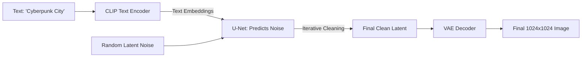

# 🎨 Image Generation: The Diffusion Revolution
> **Level:** Advanced | **Language:** Hinglish | **Goal:** Master the technology behind AI art, exploring Diffusion Models, Latent Space, UNet, Schedulers, and the 2026 strategies for building "Controllable" image generation systems.

---

## 🧭 1. Beginner-Friendly Hinglish Explanation
AI photo kaise banata hai? Ye "Canvas" par paint nahi karta, ye "Shor" (Noise) ko saaf karta hai.

- **The Problem:** Ek computer ko ye batana ki "Ek udta hua hathi" (A flying elephant) kaisa dikhta hai, bahut mushkil hai.
- **Diffusion** ka logic ye hai:
  1. Hum ek photo lete hain aur usme dher saara "Grains/Noise" add kar dete hain jab tak wo pura "Kala-Safed TV" jaisa na dikhne lage.
  2. Model ko ye sikhate hain ki is noise ko "Ulta" (Reverse) kaise karna hai.
  3. Jab aap likhte hain *"Flying Elephant"*, model ek random noise leta hai aur use "Saaf" karna shuru karta hai. 
  4. Har step par wo noise hatata hai aur "Hathi" ke pixels add karta jata hai jab tak beautiful photo na ban jaye.

2026 mein, **Stable Diffusion 3** aur **DALL-E 3** ne is process ko itna fast kar diya hai ki aap 1 second mein photo bana sakte hain.

---

## 🧠 2. Deep Technical Explanation
Stable Diffusion is a **Latent Diffusion Model (LDM)**.

### 1. The Three Components:
- **VAE (Variational Autoencoder):** Instead of working on 512x512 pixels (which is slow), VAE compresses the image into a $64 \times 64$ "Latent" space. Math is done here, making it $64x$ faster.
- **U-Net:** The "Brain." It predicts the noise in the image. It uses **Cross-Attention** to listen to your "Text Prompt."
- **Text Encoder (CLIP):** It converts your prompt into vectors that the U-Net can understand.

### 2. Forward Diffusion (Adding Noise):
- Adding Gaussian noise to an image until it becomes pure noise. (Mathematically modeled by a **Markov Chain**).

### 3. Reverse Diffusion (Removing Noise):
- The U-Net tries to predict: *"Given this noisy image and this text prompt, what part of this image is noise?"* 
- It subtracts the noise, and the "Clear" image emerges.

### 4. Schedulers (Samplers):
- Algorithms (like Euler, DPM++, PNDM) that decide *how much* noise to remove in each step. Some are fast (8 steps), some are high-quality (50 steps).

---

## 🏗️ 3. GANs vs. Diffusion Models
| Feature | GANs (Generative Adversarial) | Diffusion Models |
| :--- | :--- | :--- |
| **Stability** | Unstable (Mode Collapse) | **Extremely Stable** |
| **Diversity** | Low (Repetitive patterns) | **High (Creative)** |
| **Speed** | **Fast (1 step)** | Slower (Multiple steps) |
| **Quality** | Realistic but blurry | **Ultra-realistic (Detailed)** |
| **Controllability** | Low | **High (Text-guided)** |

---

## 📐 4. Mathematical Intuition
- **The Objective Function:** 
  The model learns to minimize the difference between the "Actual Noise" ($\epsilon$) and the "Predicted Noise" ($\epsilon_\theta$).
  $$\min_\theta \| \epsilon - \epsilon_\theta(x_t, t, c) \|^2$$
  - $x_t$: Noisy image at step $t$.
  - $c$: The conditioning (your text prompt).
  - $t$: The time step.
  This simple "Error" is what allows the AI to create masterpieces.

---

## 📊 5. Stable Diffusion Pipeline (Diagram)


---

## 💻 6. Production-Ready Examples (Generating an Image with Diffusers)
```python
# 2026 Pro-Tip: Use 'SDXL' or 'SD3' for high-resolution images.

import torch
from diffusers import StableDiffusionXLPipeline

# 1. Load the pipeline (Using SDXL for better quality)
pipe = StableDiffusionXLPipeline.from_pretrained(
    "stabilityai/stable-diffusion-xl-base-1.0", 
    torch_dtype=torch.float16
).to("cuda")

# 2. Define the prompt
prompt = "A futuristic laboratory with AI robots building a starship, cinematic lighting, 8k"

# 3. Generate the image
image = pipe(prompt=prompt, num_inference_steps=30).images[0]

# 4. Save
image.save("ai_future.png")
# Result: A high-fidelity, production-grade image! 🚀
```

---

## ❌ 7. Failure Cases
- **Bad Hands/Toes:** Diffusion models often struggle with the complex "Geometry" of human hands, creating 6 fingers. **Fix: Use 'Negative Prompts' or 'ControlNet'.**
- **Text in Images:** Models often write "Gibberish" instead of real words. **Fix: Use SD3 or DeepFloyd IF which have better text-encoding.**
- **Physics Failure:** A cup "Floating" in the air or a person with two heads.
- **Prompt Adherence:** Ignoring a part of the prompt (e.g., you asked for a "Red car" but got a "Blue" one).

---

## 🛠️ 8. Debugging Guide
- **Symptom:** "Image is just colorful noise."
- **Check:** **CFG Scale**. If your Classifier-Free Guidance (CFG) scale is too high ($> 20$), the image "Explodes" and becomes distorted. Keep it between $7-10$.
- **Symptom:** "Image is very blurry."
- **Check:** **Inference Steps**. You are probably using only 5 steps. Increase to 25-30.

---

## ⚖️ 9. Tradeoffs
- **Steps vs. Time:** More steps = Better quality but slower/more expensive.
- **Resolution:** Generating at 1024x1024 uses $4x$ more VRAM than 512x512.
- **Precision:** FP16 (Fast, less VRAM) vs. FP32 (Slightly better quality).

---

## 🛡️ 10. Security Concerns
- **Deepfakes:** Creating realistic images of real people for harassment or misinformation. **Implement 'Digital Watermarking' (Stegno) to mark images as AI-generated.**
- **NSFW Generation:** Users trying to bypass filters to generate inappropriate content.

---

## 📈 11. Scaling Challenges
- **The VRAM Wall:** Generating $4K$ images directly requires 80GB VRAM. **Solution: Generate at low-res and use an 'AI Upscaler' (Real-ESRGAN).**

---

## 💸 12. Cost Considerations
- **Generation Cost:** Generating 1 image on an A100 costs about **$\$0.01 - \$0.05$**. For a popular app, this can add up to thousands per day. **Strategy: Use 'LCM' (Latent Consistency Models) to generate in 4 steps.**

---

## ✅ 13. Best Practices
- **Use 'Negative Prompts':** Explicitly tell the AI what NOT to do (e.g., "blur, low quality, extra fingers").
- **ControlNet:** Use it to "Guide" the AI using an edge map or a human pose, so the generation isn't "Random."
- **LoRA (Low-Rank Adaptation):** Instead of training a whole model, train a small 50MB "Add-on" to teach the AI a specific style or character.

---

## ⚠️ 14. Common Mistakes
- **Writing too long prompts:** Diffusion models have a limit of 77 tokens. Anything after that is ignored.
- **Forgetting the 'Seed':** If you like an image, save the **Seed number**. Without it, you can NEVER recreate that exact same image again.

---

## 📝 15. Interview Questions
1. **"How does a Diffusion model differ from a GAN?"**
2. **"What is the role of the VAE in Stable Diffusion?"**
3. **"Explain 'Classifier-Free Guidance' (CFG) and its impact on generation."**

---

## 🚀 15. Latest 2026 Industry Patterns
- **Real-time Diffusion:** Generating images at 30 FPS, allowing you to "Draw" and see the AI finish your drawing in real-time.
- **Multi-modal Diffusion:** Giving the AI a photo AND a text prompt to "Edit" the photo (e.g., *"Change her dress to red"*).
- **Video-Diffusion Fusion:** Using Stable Video Diffusion (SVD) to turn static AI images into 5-second cinematic clips.
