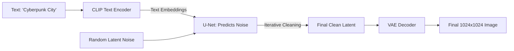

# 🎨 Image Generation: The Diffusion Revolution
> **Level:** Advanced | **Language:** Hinglish | **Goal:** AI art ke peeche ki technology ko master karein, Diffusion Models, Latent Space, UNet, Schedulers, aur 2026 mein "Controllable" image generation systems banane ki strategies ko explore karein.

---

## 🧭 1. Beginner-Friendly Hinglish Explanation
AI photo kaise banata hai? Ye "Canvas" par paint nahi karta, ye "Shor" (Noise) ko saaf karta hai.

- **The Problem:** Ek computer ko ye batana ki "Ek udta hua hathi" (A flying elephant) kaisa dikhta hai, bahut mushkil hai.
- **Diffusion** ka logic ye hai:
  1. Hum ek photo lete hain aur usme dher saara "Grains/Noise" add kar dete hain jab tak wo pura "Kala-Safed TV" jaisa na dikhne lage.
  2. Model ko ye sikhate hain ki is noise ko "Ulta" (Reverse) kaise karna hai.
  3. Jab aap likhte hain *"Flying Elephant"*, model ek random noise leta hai aur use "Saaf" karna shuru karta hai. 
  4. Har step par wo noise hatata hai aur "Hathi" ke pixels add karta jata hai jab tak beautiful photo na ban jaye.

2026 mein, **Stable Diffusion 3** aur **DALL-E 3** ne is process ko itna fast kar diya hai ki aap 1 second mein photo bana sakte hain.

---

## 🧠 2. Deep Technical Explanation
Stable Diffusion ek **Latent Diffusion Model (LDM)** hai.

### 1. The Three Components:
- **VAE (Variational Autoencoder):** 512x512 pixels par work karne ki jagah (jo ki slow hota hai), VAE image ko ek $64 \times 64$ "Latent" space mein compress kar deta hai. Saari math yahin par hoti hai, jisse ye process $64x$ fast ho jata hai.
- **U-Net:** Ye pure system ka "Brain" hai. Ye image ke andar ke noise ko predict karta hai. Ye aapke "Text Prompt" ko sunne ke liye **Cross-Attention** ka use karta hai.
- **Text Encoder (CLIP):** Ye aapke prompt ko vectors mein convert karta hai jise U-Net samajh sake.

### 2. Forward Diffusion (Adding Noise):
- Image mein Gaussian noise add karna jab tak wo pure noise na ban jaye (ise mathematically ek **Markov Chain** ke roop mein model kiya jata hai).

### 3. Reverse Diffusion (Removing Noise):
- U-Net ye predict karne ki koshish karta hai: *"Is noisy image aur is text prompt ko dekhte hue, is image ka kaunsa part noise hai?"* 
- Ye us noise ko subtract (minus) kar deta hai, aur ek "Clear" image samne aane lagti hai.

### 4. Schedulers (Samplers):
- Aise algorithms (jaise Euler, DPM++, PNDM) jo ye decide karte hain ki har ek step mein *kitna* noise remove karna hai. Kuch fast hote hain (8 steps), aur kuch high-quality hote hain (50 steps).

---

## 🏗️ 3. GANs vs. Diffusion Models
| Feature | GANs (Generative Adversarial) | Diffusion Models |
| :--- | :--- | :--- |
| **Stability** | Unstable (Mode Collapse) | **Extremely Stable** |
| **Diversity** | Low (Repetitive patterns) | **High (Creative)** |
| **Speed** | **Fast (1 step)** | Slower (Multiple steps) |
| **Quality** | Realistic but blurry | **Ultra-realistic (Detailed)** |
| **Controllability** | Low | **High (Text-guided)** |

---

## 📐 4. Mathematical Intuition
- **The Objective Function:** 
  Model "Actual Noise" ($\epsilon$) aur "Predicted Noise" ($\epsilon_\theta$) ke beech ke difference ko minimize karna seekhta hai.
  $$\min_\theta \| \epsilon - \epsilon_\theta(x_t, t, c) \|^2$$
  - $x_t$: Noisy image step $t$ par.
  - $c$: Conditioning (aapka text prompt).
  - $t$: Time step.
  Ye simple "Error" hi AI ko masterpieces create karne ki permission deta hai.

---

## 📊 5. Stable Diffusion Pipeline (Diagram)

```mermaid
graph LR
    Prompt[Text: 'Cyberpunk City'] --> CLIP[CLIP Text Encoder]
    CLIP -- "Text Embeddings" --> UNet[U-Net: Predicts Noise]
    
    Noise[Random Latent Noise] --> UNet
    UNet -- "Iterative Cleaning" --> Latent[Final Clean Latent]
    
    Latent --> VAE[VAE Decoder]
    VAE --> Image[Final 1024x1024 Image]
```

---

## 💻 6. Production-Ready Examples (Generating an Image with Diffusers)
```python
# 2026 Pro-Tip: Use 'SDXL' or 'SD3' for high-resolution images.

import torch
from diffusers import StableDiffusionXLPipeline

# 1. Load the pipeline (Using SDXL for better quality)
pipe = StableDiffusionXLPipeline.from_pretrained(
    "stabilityai/stable-diffusion-xl-base-1.0", 
    torch_dtype=torch.float16
).to("cuda")

# 2. Define the prompt
prompt = "A futuristic laboratory with AI robots building a starship, cinematic lighting, 8k"

# 3. Generate the image
image = pipe(prompt=prompt, num_inference_steps=30).images[0]

# 4. Save
image.save("ai_future.png")
# Result: A high-fidelity, production-grade image! 🚀
```

---

## ❌ 7. Failure Cases
- **Bad Hands/Toes:** Diffusion models aksar human hands ki complex "Geometry" ke sath struggle karte hain, jisse wo 6 fingers bana dete hain. **Fix: Use 'Negative Prompts' ya 'ControlNet' ka use karein.**
- **Text in Images:** Models aksar real words ki jagah "Gibberish" (kuch bhi ult-pult) likh dete hain. **Fix: SD3 ya DeepFloyd IF ka use karein, jinme behtar text-encoding hoti hai.**
- **Physics Failure:** Hawa mein "Floating" (udta hua) cup ya do sir wala insaan.
- **Prompt Adherence:** Prompt ke kisi part ko ignore kar dena (jaise aapne "Red car" manga par "Blue" car mil gayi).

---

## 🛠️ 8. Debugging Guide
- **Symptom:** "Image sirf colorful noise dikh rahi hai."
- **Check:** **CFG Scale**. Agar aapka Classifier-Free Guidance (CFG) scale bahut high ($> 20$) hai, toh image "Explode" ho jati hai aur distort ho jati hai. Ise hamesha $7-10$ ke beech rakhein.
- **Symptom:** "Image bahut blurry hai."
- **Check:** **Inference Steps**. Aap shayad sirf 5 steps use kar rahe hain. Ise badhakar 25-30 karein.

---

## ⚖️ 9. Tradeoffs
- **Steps vs. Time:** Zyada steps = Behtar quality par slow/expensive generation.
- **Resolution:** 1024x1024 par generate karna 512x512 ke mukable $4x$ zyada VRAM use karta hai.
- **Precision:** FP16 (Fast, kam VRAM) vs. FP32 (Slightly behtar quality).

---

## 🛡️ 10. Security Concerns
- **Deepfakes:** Real logo ki realistic images banana harassment ya misinformation failane ke liye. **Iske liye 'Digital Watermarking' (Stegno) implement karein taaki images ko AI-generated mark kiya ja sake.**
- **NSFW Generation:** Users ka filters ko bypass karke inappropriate content generate karne ki koshish karna.

---

## 📈 11. Scaling Challenges
- **The VRAM Wall:** Direct $4K$ images generate karne ke liye 80GB VRAM ki zaroorat hoti hai. **Solution: Low-resolution par generate karein aur 'AI Upscaler' (Real-ESRGAN) ka use karein.**

---

## 💸 12. Cost Considerations
- **Generation Cost:** Ek A100 GPU par 1 image generate karne ki cost lagbhag **$\$0.01 - \$0.05$** hoti hai. Ek popular app ke liye ye har din hazaron dollars ho sakti hai. **Strategy: 4 steps mein generate karne ke liye 'LCM' (Latent Consistency Models) ka use karein.**

---

## ✅ 13. Best Practices
- **Use 'Negative Prompts':** AI ko explicitly batayein ki kya generate NAHI karna hai (jaise "blur, low quality, extra fingers").
- **ControlNet:** Iska use AI ko edge map ya human pose ke zariye "Guide" karne ke liye karein, taaki generation random na ho.
- **LoRA (Low-Rank Adaptation):** Pure model ko train karne ki jagah, AI ko koi specific style ya character sikhane ke liye ek chota 50MB ka "Add-on" train karein.

---

## ⚠️ 14. Common Mistakes
- **Writing too long prompts:** Diffusion models ki limit 77 tokens hoti hai. Iske baad ka kuch bhi ignore kar diya jata hai.
- **Forgetting the 'Seed':** Agar aapko koi image pasand aati hai, toh uska **Seed number** save kar lein. Iske bina aap kabhi bhi wo exact same image dubara recreate nahi kar payenge.

---

## 📝 15. Interview Questions
1. **"Diffusion model ek GAN se kaise different hai?"**
2. **"Stable Diffusion mein VAE ka kya role hota hai?"**
3. **"Classifier-Free Guidance' (CFG) aur generation par iske impact ko explain karein."**

---

## 🚀 16. Latest 2026 Industry Patterns
- **Real-time Diffusion:** Images ko 30 FPS par generate karna, jisse aap "Draw" kar sakte hain aur AI real-time mein aapki drawing ko complete karega.
- **Multi-modal Diffusion:** AI ko ek photo aur text prompt dono dena taaki photo ko "Edit" kiya ja sake (jaise *"Change her dress to red"*).
- **Video-Diffusion Fusion:** Static AI images ko 5-second cinematic clips in convert karne ke liye Stable Video Diffusion (SVD) ka use karna.
