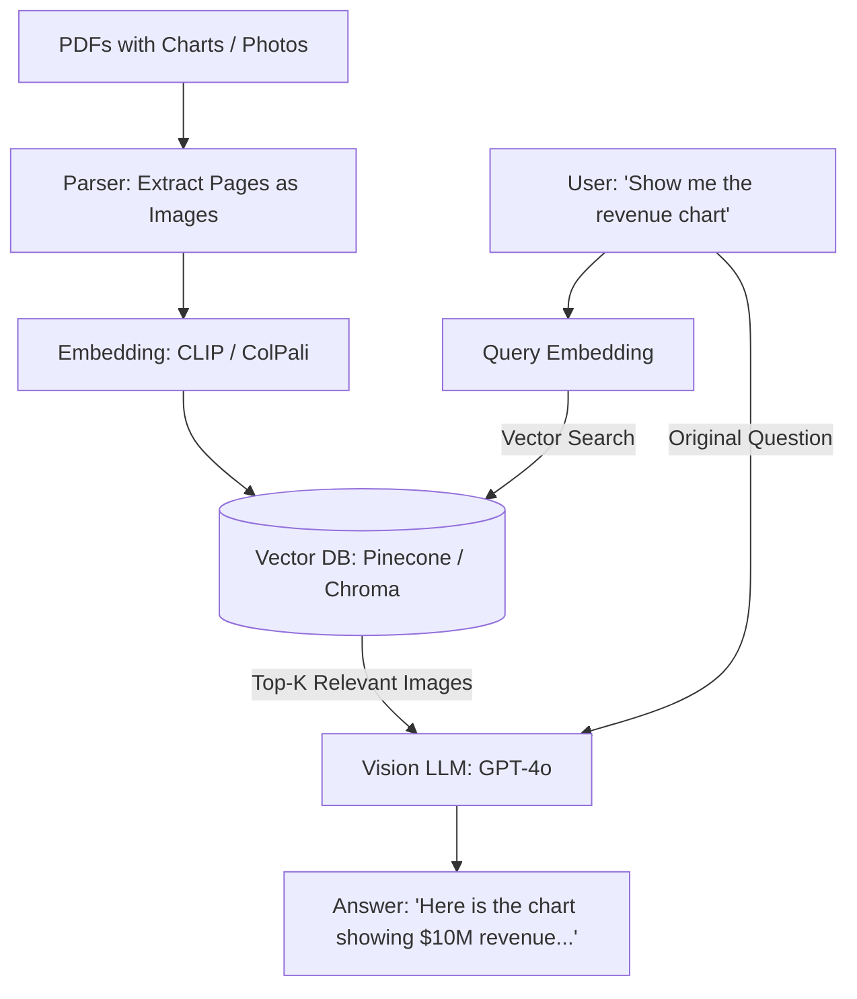

# 🔍 Multimodal RAG: Searching Beyond Text
> **Level:** Advanced | **Language:** Hinglish | **Goal:** Master the architecture of Retrieval-Augmented Generation that includes images, videos, and PDFs, exploring Multimodal Embeddings, Vector Search for Images, and the 2026 strategies for "Visual Knowledge Bases."

---

## 🧭 1. Beginner-Friendly Hinglish Explanation
RAG ka matlab hota hai: "Pehle search karo, phir answer do." 

- **The Problem:** Purana RAG sirf "Text" files (.txt, .docx) mein search karta tha. Par asli duniya mein, knowledge **Images** (Charts, Screenshots) aur **Videos** (Meeting recordings) mein hoti hai.
- **Multimodal RAG** ka matlab hai ek aisa system jo:
  1. Aapke sawaal ko samjhe.
  2. Aapki purani **Photos** aur **PDFs** mein se sahi "Screenshot" ya "Page" dhoond kar laye.
  3. Us image ko "Dekh" kar aapko jawaab de.

*Example:* Aap puchte hain: *"Mera pichle mahine ka light bill kitna tha?"* 
AI aapki "Gallery" mein se light bill ki photo dhoondta hai, use read karta hai, aur bolta hai: *"Aapka bill ₹2500 tha."*

---

## 🧠 2. Deep Technical Explanation
Multimodal RAG is implemented using **Multimodal Vector Databases.**

### 1. The Multi-Vector Approach:
- **Strategy A (Text Summaries):** You use an AI to "Describe" every image in your database into text. Then you just search the text. (Simple but loses visual detail).
- **Strategy B (Multimodal Embeddings):** You use **CLIP** or **ColPali** to convert images directly into vectors.
  - When a user asks a question, you convert the *Question* into a vector and find the *Image* that is closest to it in the shared space.

### 2. PDF Parsing (The 2026 Standard):
- Instead of just extracting text from a PDF, we treat every page as an **Image.**
- We use **ColPali** (a new model) that can index the "Visual Layout" of a page. It knows that a "Chart" at the top-right is important.

### 3. The Retrieval Flow:
1. **Indexing:** Convert Images/PDFs/Video-frames into vectors and store in **Pinecone/Milvus/Chroma.**
2. **Retrieval:** Search for the Top-K most relevant images/chunks.
3. **Reasoning (VLM):** Pass the original question + the retrieved images to a Multimodal LLM (like GPT-4o or LLaVA) to generate the final answer.

---

## 🏗️ 4. Text RAG vs. Multimodal RAG
| Feature | Text-Only RAG | Multimodal RAG |
| :--- | :--- | :--- |
| **Data Source** | .pdf (text), .txt | .png, .jpg, .mp4, Charts |
| **Embedding Model**| `text-embedding-3-small` | **CLIP / ColPali / ImageBind** |
| **Retrieval Output** | Text snippets | **Image crops / Page snapshots** |
| **LLM Requirement** | Standard LLM (GPT-4) | **Vision-LLM (GPT-4o / LLaVA)** |
| **Complexity** | Moderate | **High** |

---

## 📐 4. Mathematical Intuition
- **The Cross-Modal Similarity:** 
  $$\text{Score} = \text{CosineSimilarity}(\text{QueryVector}, \text{ImageVector})$$
  Since both vectors are in the same $D$-dimensional space (e.g., 768 dims for CLIP), the math is exactly the same as text-search. The hard part is the **Alignment** during model training.

---

## 📊 5. Multimodal RAG Pipeline (Diagram)


---

## 💻 6. Production-Ready Examples (Implementing Multimodal Search with CLIP)
```python
# 2026 Pro-Tip: Store images and their embeddings in a vector database.

import clip
import torch
from PIL import Image

# 1. Load CLIP
model, preprocess = clip.load("ViT-B/32", device="cuda")

# 2. Indexing: Convert image to vector
image = preprocess(Image.open("product_catalog.jpg")).unsqueeze(0).to("cuda")
with torch.no_grad():
    image_features = model.encode_image(image)

# 3. Retrieval: Convert text query to vector
text = clip.tokenize(["a photo of a blue shirt"]).to("cuda")
with torch.no_grad():
    text_features = model.encode_text(text)

# 4. Search
# In a real app, you would use 'Pinecone' or 'Milvus' to find the closest image_features
similarity = torch.cosine_similarity(text_features, image_features)
print(f"Match Score: {similarity.item():.4f}")
```

---

## ❌ 7. Failure Cases
- **Small Text in Images:** CLIP can't read the small numbers inside a complex Excel screenshot. **Fix: Use 'OCR-based RAG' alongside visual RAG.**
- **Over-reliance on Text:** If your database has 1 million images of "Sunset" and you search for "Peace," the model might give you a sunset even if you wanted a "Quiet Library."
- **Context Window Limit:** You can't send 20 high-res images to a VLM at once. It will crash or become very slow. **Fix: Use 'Image Summaries' to filter the best 3.**

---

## 🛠️ 8. Debugging Guide
- **Symptom:** "Search is returning irrelevant photos."
- **Check:** **Embedding Model**. CLIP is great for "General" photos but bad for "Technical Schematics." Consider fine-tuning CLIP on your specific domain (e.g., Medical images).
- **Symptom:** "VLM is hallucinating facts about the retrieved image."
- **Check:** **Prompting**. Are you asking "Describe this image" or "Answer based ONLY on the text visible in this image"? Be strict.

---

## ⚖️ 9. Tradeoffs
- **Full Image vs. Cropped Objects:** 
  - Indexing the whole image is cheaper. 
  - Indexing every object inside the image (using Segment-Anything) is more accurate but $100x$ more expensive.
- **Local vs. Cloud VDB:** Latency of moving images to the cloud.

---

## 🛡️ 10. Security Concerns
- **Visual Data Leak:** An employee searches for "Confidential Docs" and the RAG system retrieves a screenshot of a secret project. **Implement 'Access Control Lists' (ACLs) in your Vector DB.**

---

## 📈 11. Scaling Challenges
- **Video RAG:** Indexing 1000 hours of video. You have to "Sample" frames (e.g., 1 frame per second), which means you might miss a 0.5s event. **Solution: Use 'Event-based Sampling'.**

---

## 💸 12. Cost Considerations
- **Vision-Token Bill:** Sending retrieved images to GPT-4o costs tokens. **Strategy: Convert retrieved images to 'Markdown tables' (using a cheap local model) before sending to the expensive LLM.**

---

## ✅ 13. Best Practices
- **Hybrid Search:** Search using **Text Embeddings + Visual Embeddings + Metadata (Date/Location)**.
- **Multimodal Chunking:** Instead of fixed size text blocks, chunk by "Logical Sections" (e.g., Page 1, Page 2, Chart 1).
- **Use 'ColPali':** As of 2026, it's the state-of-the-art for PDF RAG because it understands layout.

---

## ⚠️ 14. Common Mistakes
- **Assuming 'Text Extraction' is enough:** Thinking that `PyPDF` can handle a PDF that is actually just a collection of scanned images (No selectable text). Always use an **OCR** fallback.
- **Ignoring Image Quality:** Indexing blurry or low-res thumbnails.

---

## 📝 15. Interview Questions
1. **"What is the 'Multi-Vector' approach in Multimodal RAG?"**
2. **"How does ColPali differ from standard CLIP-based retrieval?"**
3. **"Explain the pipeline for building a 'Video Search' engine."**

---

## 🚀 15. Latest 2026 Industry Patterns
- **Audio-native RAG:** Searching through "Podcasts" and "Voice Memos" using natural language.
- **AR RAG:** Wearing smart glasses that "Recognize" the objects in front of you and retrieve "Manuals" or "Prices" from your private knowledge base in real-time.
- **Unified Embedding Models (ImageBind):** One vector space for Text, Image, Audio, Depth, Thermal, and IMU data.
